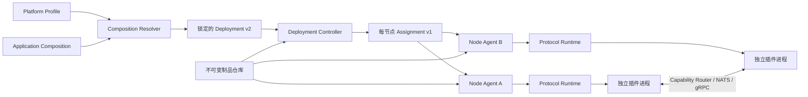

# VastPlan

VastPlan 是一个面向分布式插件系统的 Backend 微内核。它提供可验证的插件契约、跨节点服务编排、能力寻址、运行时隔离、供应链信任与可恢复的节点自治执行，而不绑定任何具体领域模型或上层应用。

系统采用**微内核 + 插件化基础服务**架构：内核只保留稳定、通用、不可自举且不可委托的能力；可替换的功能以第一方插件独立发布、部署和演进。当前 Go 模块标识为 `cdsoft.com.cn/VastPlan`。

> 全部设计、决策和开发指南从 **[docs/dev/00-index.md](docs/dev/00-index.md)** 进入；它是项目文档的唯一索引。

## 当前阶段

VastPlan 已经完成一套**可运行、可扩展、可部署、可验证的 Backend 微内核基础设施**，并用真实插件进程和多节点 NATS 链路验证了主要闭环。Portal 前端内核、框架无关 UI 契约和组合适配层也已进入代码阶段。

当前版本聚焦 Backend 内核，不承诺任何领域应用能力。版本仍为 `0.1.0`；正式 Backend 1.0 需要在代表性基础插件形成真实负载后，重新冻结候选并完成 24 小时稳定性测试。

| 领域 | 当前状态 | 说明 |
|---|---|---|
| Backend 微内核 | 目标代码路径已基本完成 | 插件宿主、协议、编排、寻址、安全、发布与工程门禁已落地 |
| 插件机制 | 已完成 | 已有 4 个示例插件验证工具、权限、审计和 Hook 机制 |
| 平台基础插件 | 首批已实现 | 全局设置、凭证、数据库连接、HTTPS 制品仓库和节点部署均已按插件边界提供；生产级签名种子 Bundle 仍待完成 |
| Backend 正式 1.0 | 待真实负载验证 | 版本仍为 `0.1.0`，Soak 已主动延期，不使用无代表性的空载结果 |
| Portal 前端内核 | 管理闭环可试用 | 已有动态组合、UI 契约、Arco 设计系统、服务端权威解析和四个平台管理页面；不包含上层业务页面 |
| 第三方插件 | 当前不开放 | 已预留三态全局策略和发布者级覆盖；真正隔离驱动仍是开放前置条件 |

面向管理层和非技术人员的阶段成果说明见[当前系统开发成果](docs/dev/guides/当前系统开发成果.md)。

## 核心架构



完整链路是：

1. 插件以不可变制品和 manifest 声明身份、能力、依赖及运行策略；
2. 平台管理员发布 Platform Profile，应用配置人员发布 Application Composition；
3. Resolver 校验插件固有分类、来源和组合边界，生成完整且锁定输入摘要的 Deployment v2；
4. Controller 校验全局依赖图、版本、作用域和放置约束，为每个节点发布确定性的 Assignment；
5. Node Agent 安装制品、启动候选进程、检查健康与依赖，并原子切换；
6. Router 根据 capability、逻辑服务、路由域和分片键完成本地或跨节点调用；
7. 实际态、组合状态、租约和 fencing token 共同约束故障恢复与所有权转移。

架构设计见[系统架构](docs/dev/architecture/系统架构.md)、[插件契约与协议](docs/dev/architecture/插件契约与协议.md)和[插件服务集群化设计](docs/dev/architecture/插件服务集群化设计.md)。

## Backend 已实现能力

| 能力域 | 当前实现 |
|---|---|
| 插件契约与运行 | Draft 2020-12 Schema、PluginHost 双向协议、独立进程、心跳探活、回调宿主、热装摘除、状态迁移与失败回滚 |
| 分级组合与全局依赖 | Platform Profile 与 Application Composition 分权输入，Resolver 锁定来源；Controller 再从不可变制品读取完整 manifest，校验分类、包依赖、runtime capability、SemVer 范围、作用域、策略和循环依赖 |
| 本地自治启动 | Node Agent 执行本地 DAG；支持 `strong`、`soft`、`lazy`、`data` 依赖语义，依赖丢失时停止数据面并重新对账 |
| 多节点调度 | 标签、资源容量、亲和/反亲和、指标自动伸缩、rendezvous hashing、持久 generation 和节点漂移恢复 |
| 集群运行策略 | `per-kernel`、`active-active`、`leader`、`partitioned`，覆盖本地直调、队列、单活动 owner 和分片 owner |
| 故障与升级 | 候选先启动、健康检查和迁移，再原子接管；leader epoch 严格递增，交接失败恢复旧 owner |
| 能力寻址 | 本地零序列化直调、NATS request-reply、queue group、gRPC 双向流、持久事件和取消传播 |
| 组合状态 | 汇总 Assignment 与 Node Actual，持久报告 Ready、Degraded、Blocked、DependencyLost、Failed 等状态 |
| 安全与供应链 | mTLS、NKey、角色 ACL、传输签名、防重放、capability/visibility 授权、SHA-256、Ed25519、HTTPS 双重校验和不可变版本 |
| 发布与运维 | 可复现构建、CycloneDX SBOM、来源证明、版本/配置预检、升级回滚和脱敏支持包 |

### 插件服务模式

| 模式 | 典型用途 | 路由与状态边界 |
|---|---|---|
| `per-kernel` | 本地设置、缓存、内核适配器 | `local + direct`，每个内核独立运行，不进入全局目录 |
| `active-active` | 无状态 API、查询、连接代理 | `service/cluster + queue`，多个健康实例共同接流 |
| `leader` | Schema 迁移、密钥轮换、唯一调度 | 单活动 owner，使用持久 epoch 与 fencing token |
| `partitioned` | 租户分片任务、分区数据服务 | 每个分片只有一个有效 owner，节点故障后自动再平衡 |

这些模式只提供实例所有权、路由和恢复边界，不自动为插件状态提供 Raft、复制或跨服务事务。

制品仓库采用 ADR-0049 的混合边界：仓库与存储适配可以作为预置基础插件演进，但来源只能返回未信任 Envelope；摘要、清单、发布者证明和安装授权始终由内核验证，自举使用签名种子仓库。

## 快速开始

### 环境要求

- Go `1.26.5` 或更高版本；
- 仅构建或测试 Portal 内核、TypeScript SDK 和插件前端时需要 Node.js 与 pnpm `10.11.0`；
- 多节点开发模式需要启用 JetStream 的 `nats-server`；
- 只有修改 `contracts/proto/` 时才需要 `protoc`、`protoc-gen-go` 和 `protoc-gen-go-grpc`。

### 构建与测试

```bash
./engineering/tools/build.sh

./engineering/tools/test.sh          # 单元测试 + 架构守护
./engineering/tools/test.sh --e2e    # 再运行真实插件进程与多节点 E2E
```

### 一键试用平台管理中心

以下命令会在本机回环地址构建并启动完整开发组合，无需单独安装 NATS 或 Vault：

```bash
./engineering/tools/platform-dev.sh up
```

就绪后打开 <http://127.0.0.1:18080/operations>。查看状态、日志和停止服务：

```bash
./engineering/tools/platform-dev.sh status
./engineering/tools/platform-dev.sh logs
./engineering/tools/platform-dev.sh down
```

该入口包含开发身份注入、嵌入式 NATS 和 Vault 兼容桩，不等同于生产部署。完整边界见[本地平台管理中心指南](docs/dev/guides/本地平台管理中心.md)。

### 单节点自动装配

先把构建好的插件封装并发布到本地不可变仓库：

```bash
go run ./engineering/tools/pluginpackage \
  -source extensions/plugins/com.vastplan.hello-world \
  -backend-bin bin/com.vastplan.hello-world \
  -repository .vastplan/repository

go run ./engineering/tools/pluginpackage \
  -source extensions/plugins/com.vastplan.demo-permission \
  -backend-bin bin/com.vastplan.demo-permission \
  -repository .vastplan/repository
```

启动 Node Agent；修改 `engineering/deploy/local.desired-state.json` 的 revision、插件版本或 enabled 后会自动对账：

```bash
./bin/backend-kernel reconcile \
  -desired engineering/deploy/local.desired-state.json \
  -repository .vastplan/repository \
  -labels environment=local
```

### 本地双节点集群

以下命令只用于本机开发。生产环境禁止使用 `-nats-allow-insecure`，必须按[NATS 生产安全指南](docs/dev/guides/NATS生产安全.md)配置 mTLS、NKey、ACL 和传输身份。

```bash
nats-server -js

# 终端 A：解析平台配置与应用组合，并持续运行 Controller
go run ./core/kernels/backend controlplane \
  -nats-url nats://127.0.0.1:4222 -nats-allow-insecure -bootstrap \
  -platform-profile engineering/deploy/platform-profile.json \
  -application-composition engineering/deploy/application-composition.json \
  -deployment-revision 1 -allow-development-plugins -controller \
  -repository .vastplan/repository

# 终端 B：node-a
./bin/backend-kernel reconcile \
  -nats-url nats://127.0.0.1:4222 -nats-allow-insecure \
  -deployment cluster-demo -tenant acme -node-id node-a -labels region=cn \
  -repository .vastplan/repository \
  -runtime-root .vastplan/nodes/node-a/plugins \
  -actual-state .vastplan/nodes/node-a/actual.json

# 终端 C：node-b
./bin/backend-kernel reconcile \
  -nats-url nats://127.0.0.1:4222 -nats-allow-insecure \
  -deployment cluster-demo -tenant acme -node-id node-b -labels region=cn \
  -repository .vastplan/repository \
  -runtime-root .vastplan/nodes/node-b/plugins \
  -actual-state .vastplan/nodes/node-b/actual.json
```

更完整的生产发布、升级和回滚流程见[Backend 发布与运维](docs/dev/guides/Backend发布与运维.md)。

生产 Linux 新节点使用一次性 SSH 引导安装内核和 systemd Node Agent；接管后所有服务组合、插件与副本变化都由控制面下发，不再依赖 SSH。严格的 `known_hosts`、节点身份文件和执行命令见[Linux 节点 SSH 首次引导](docs/dev/guides/Linux节点SSH引导.md)。

## 安全模型

VastPlan 默认采用 fail-closed：无法确认身份、清单、依赖、版本、权限或所有权时，不发布 Assignment、不激活候选、也不接受调用。

- 插件进程身份和运行时贡献必须与已验证 manifest 一致；
- 生产 NATS 使用 mTLS + 独立角色 NKey + 最小 Subject/KV ACL；
- 跨节点调用绑定 subject、payload、时间戳和 nonce，并重建可信调用身份；
- `local / service / cluster / global` visibility 与 capability allowlist 同时参与授权；
- 插件制品验证摘要、发布者签名、传输 TLS 和不可变版本；
- 当前只开放本方可信插件；生产默认要求未知发布者使用隔离驱动，部署方可按发布者选择 `require-isolation / allow-trusted / deny`，但不把可信进程模型宣传为第三方沙箱。

## 工程质量

主 CI 包含 7 个独立 job：

1. 格式、ShellCheck 与静态检查；
2. race 单元测试与架构守护；
3. 跨进程 E2E；
4. Schema fuzz smoke 与性能回归；
5. 可复现构建与发布自检；
6. Proto codegen 同步；
7. 可达漏洞与依赖许可证检查。

`engineering/arch/` 会直接阻止分层倒置、非法跨包依赖、稳定 DTO 重复定义、生产入口散落和文档死链。发布候选另有手工 Soak 工作流，但在代表性插件负载形成前不会把空载或单一合成负载作为 Backend 1.0 证据。

测试规则见[测试规范](docs/dev/guides/测试规范.md)，工程边界见[工程规范](docs/dev/guides/工程规范.md)，Backend 1.0 验收依据见[封板指南](docs/dev/guides/Backend内核1.0封板.md)。

## 示例插件

| 插件 | 验证目标 |
|---|---|
| `com.vastplan.hello-world` | 工具贡献、参数校验、插件回调宿主 |
| `com.vastplan.demo-permission` | select 权限语义、优先级和默认拒绝 |
| `com.vastplan.demo-audit` | fanout 事件分发与审计账本 |
| `com.vastplan.demo-quota` | before Hook 限流、after Hook 计量与有序分发 |

它们是内核机制样例，不是生产级基础服务实现。

## 仓库结构

```text
core/          四内核与共享运行时
extensions/    第一方全栈插件与 Go/Python/TypeScript SDK
contracts/     Protobuf 与 JSON Schema 契约真源
engineering/   架构守护、E2E、部署样例与构建发布工具
docs/          架构、ADR、插件文档和开发指南
```

根目录的 pnpm workspace 只服务前端开发。`node_modules/` 是 Git 忽略、可随时重建的本地依赖，不是 Backend 运行时，也不进入插件制品或发布包。

详细放置规则见[代码目录结构](docs/dev/guides/代码目录结构.md)。

## 文档导航

| 目标 | 入口 |
|---|---|
| 理解整体系统 | [系统架构](docs/dev/architecture/系统架构.md) |
| 开发插件 | [插件契约与协议](docs/dev/architecture/插件契约与协议.md) |
| 理解本地/集群插件边界 | [插件服务集群化设计](docs/dev/architecture/插件服务集群化设计.md) |
| 查看全部架构决策 | [ADR 索引](docs/dev/decisions/README.md) |
| 部署安全控制面 | [NATS 生产安全](docs/dev/guides/NATS生产安全.md) |
| 运行高可用 Controller | [控制面高可用](docs/dev/guides/控制面高可用.md) |
| 发布、升级与回滚 | [Backend 发布与运维](docs/dev/guides/Backend发布与运维.md) |
| 查看非技术成果说明 | [当前系统开发成果](docs/dev/guides/当前系统开发成果.md) |
| 查找全部文档 | [文档唯一索引](docs/dev/00-index.md) |

## 开源许可

VastPlan 采用 [Apache License 2.0](LICENSE) 开源。允许商业使用、修改和再分发，并包含明确的专利授权；再分发时须遵守许可证中的保留告示和 `NOTICE` 要求。

版权信息见 [NOTICE](NOTICE)。第三方依赖保留各自许可证，插件独立制品须携带清单中声明的许可证与归属告示文本。许可范围与选择理由见 [ADR-0046](docs/dev/decisions/ADR-0046-Apache开源许可与插件制品声明.md)。

## 下一阶段

推荐按以下路径推进：

1. 为制品仓库完成签名种子 Bundle、Edge API Route 与受控设置/凭证句柄接入；
2. 选择代表性插件组合，建立端到端装配与恢复验证；
3. 基于该组合建立混合负载、级联恢复和容量基线；
4. 冻结 Backend 候选，执行完整 24 小时 Soak 并发布正式 1.0；
5. 在内核契约稳定后，由独立项目按需构建上层应用与适配器。

新增能力应先判断它是否属于所有插件都不可缺少的稳定基础；可独立替换、独立演进的能力优先留在插件层，保持内核边界干净。
