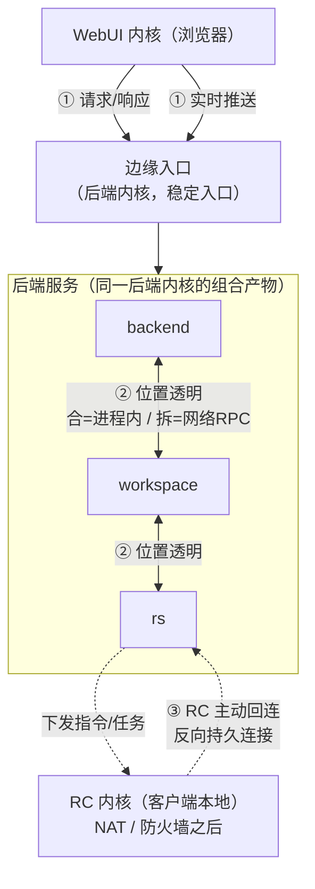

# 内核间与服务间通信

> 状态：设计草案 v0.1｜最后更新：2026-07-14
> 关联：[ADR-0006 内核三分区与后端组合](../decisions/ADR-0006-内核分区与后端组合.md)、[ADR-0007 内核间通信模型](../decisions/ADR-0007-内核间通信模型.md)、[系统骨架架构](01-系统骨架架构.md)
> 本文是**内核/服务之间通信**的单一真相源。注意与"内核内部宿主↔插件"的[协议总线](01-系统骨架架构.md#6-插件与宿主的连接独立进程--协议总线)区分：那是内核**内**通信，本文是内核/服务**间**通信。全文保持在架构/契约层，具体传输标注"待 ADR"。

## 1. 通信轴总览

系统里存在这些通信链路，本文逐一给出机制：

| 编号 | 链路 | 发起方 | 连接形态 | 传输特性 | 鉴权 |
|---|---|---|---|---|---|
| ① | WebUI ↔ 后端 | 浏览器 | 客户端→边缘入口 | 请求/响应 + 实时推送 | 用户会话令牌 |
| ② | 后端服务 ↔ 后端服务 | 对等 | 位置透明（进程内/网络RPC） | 请求/响应 + 跨服务事件 | 服务内网信任 + 调用上下文透传 |
| ③ | RS ↔ RC | **RC 回连** | 反向持久连接（RC 在 NAT 后） | 下发指令 + 上行结果/日志流 | 签名客户端 + 接入令牌 |

> 说明：backend/workspace/rs 是**后端内核的组合产物**（ADR-0006），②号链路是它们之间的通信；是否同机取决于组合部署，故必须位置透明。

## 2. 设计原则

1. **统一消息契约**：三条平面共用 `CallContext / CallResult / CallEvent`（骨架文档定义），语义一致；差异只在传输与拓扑，调用心智不变。
2. **位置透明**：后端服务间调用不硬编码"本地还是远程"；由内部服务寻址层在运行时解析。合/拆是部署决策，不改代码。
3. **拓扑按网络位置分类**：谁能主动连谁由网络现实决定（RC 在 NAT 后只能回连），不能一刀切。
4. **上下文透传**：身份/租户/链路追踪/场景（`(caller, scene, target)`）随调用在所有平面透传，保证权限、计量、可观测端到端一致。
5. **故障隔离与背压**：任一链路断开/过载不应雪崩；超时、重试、熔断、背压是通信层一等公民。

## 3. ② 后端服务 ↔ 后端服务（位置透明）

这是"灵活组合"的核心支撑。

- **内部服务寻址层**：后端内核提供统一的服务调用入口（对标 testa 的"跨服务调用统一层 AgentAppGateway"）。调用方按**服务角色 + 能力名**发起调用，不关心目标在本进程还是另一台机器。
  - **合并部署**（backend+workspace 同进程）→ 解析为**进程内直调**，零序列化开销。
  - **拆分部署**（rs 独立）→ 解析为**网络 RPC**，同一调用签名。
- **两种交互**：
  1. **请求/响应**：一次调用一次结果（如 backend 向 workspace 请求文件、向 rs 提交执行）。
  2. **跨服务事件（pub/sub）**：服务发布领域事件，其他服务/插件订阅（如任务状态变更）。事件平面让服务松耦合。
- **横切透传**：调用上下文（Principal、tenant、trace、scene）自动随调用传递，两条路径（进程内/网络）语义一致。
- **服务发现与路由**：拆分部署时需服务发现、负载均衡、超时/重试/熔断；合并部署时这些退化为空操作。具体机制待 ADR。

> 关键约束：**进程内路径与网络路径必须行为等价**（除性能外），否则"合/拆"会引入隐性差异。契约与错误语义要一次定义、两路径共用。

## 4. ① WebUI ↔ 后端（边缘入口 + 双子通道）

- **稳定边缘入口**：WebUI 只认一个稳定入口（后端内核的一个"边缘/网关"服务角色），由它路由到当前组合出的后端服务。**前端不感知后端拓扑**，后端合/拆对前端无感。
- **两个子通道**：
  1. **请求/响应**：常规业务 API（资源管理、编排、配置）。
  2. **实时推送**：日志流、任务进度、实时事件（长连接）。
- **流式直连的取舍**：高吞吐流式（如海量执行日志）可选择由前端**直连特定流式端点**（对标 testa 前端直连 RS 日志流，绕开中转以降延迟/减负载）；但这是**显式优化**，默认仍走边缘入口以保持拓扑无感。是否直连、哪些端点直连，逐个评估。
- **鉴权**：用户会话令牌；边缘入口校验后把 Principal 透传到内部调用。

## 5. ③ RS ↔ RC（反向持久连接）

RC 运行在客户端本地、常处 NAT/防火墙之后，**服务端无法主动连它**，故：

- **RC 主动回连 RS**：RC 启动后拨向 RS 建立**反向持久连接**（长连接），此后：
  - **下行**：RS 经该连接向 RC 推送指令/任务（执行脚本、下发工作流、配置更新）。
  - **上行**：RC 经该连接回流执行结果、日志流、心跳、状态。
- **接入信任链**：RC 以**签名客户端 + 接入令牌/API Key** 接入；RS 校验客户端来源与身份后才纳入调度（第一方场景下先做基础鉴权，能力证明等增强留待需要时）。
- **连接生命周期**：心跳保活、断线自动重连、重连后会话恢复；离线期间 RS 侧任务缓冲与超时策略。
- **多副本 RS**：RS 无状态可多副本，RC 连接需处理**连接亲和**（任务与持有连接的 RS 副本）或经共享路由把指令投递到持有该 RC 连接的副本。具体机制待 ADR。
- **统一契约**：下发/上行消息仍复用 `CallContext/CallResult/CallEvent`，只是承载在反向连接上。

## 6. 与"插件-宿主协议总线"的关系

| | 协议总线（骨架 §6） | 内核间/服务间通信（本文） |
|---|---|---|
| 范围 | 内核**内**：宿主 ↔ 本内核的插件 | 内核/服务**间**：跨内核、跨后端服务 |
| 对象 | 一个宿主与它管辖的插件进程 | backend/workspace/rs、WebUI、RC 之间 |
| 契约 | 共用 `CallContext/CallResult/CallEvent` | 同上（刻意统一） |

两者**契约相同、范围不同**：一次端到端调用可能先经内核间通信抵达某后端服务，再经该服务内的协议总线派发给某插件。契约统一使全链路上下文与可观测无缝衔接。

## 7. 跨面插件各部分的协作通道

一个横跨多面的插件（webui + backend + rc 部分），其各部分之间的通信**走本文定义的内核间平面**，而非宿主-插件协议总线：

- 前端部分 → 后端部分：走 ① WebUI↔后端。
- 后端部分 → RC 部分：走 ② 到 rs，再走 ③ RS↔RC。
- 即：插件不获得"私有跨面通道"，一律复用平台统一通信平面，保证鉴权、计量、可观测一致。

## 8. 待决问题

- [ ] 内部服务寻址层的接口形态与服务发现/路由/熔断机制（进程内、网络两路径的等价实现）
- [ ] 各平面的具体传输与序列化选型（请求/响应、pub/sub、反向长连接）——各自 ADR。**控制面主选方向 NATS**（事件 + 服务 RR + RC 反向连接），强类型/大流式 RPC 保留 gRPC，见 [ADR-0008](../decisions/ADR-0008-骨架技术选型对比.md)
- [ ] 跨服务事件平面的投递语义（至少一次/恰好一次、顺序、持久化）
- [ ] 边缘入口的路由/鉴权/限流职责边界，哪些流式端点允许前端直连
- [ ] 反向连接的多副本 RS 亲和与会话迁移
- [ ] 上下文透传的字段集与跨进程传播格式（对齐不可变契约）
- [ ] RC 接入信任链的分级（基础鉴权 → 能力证明）随第一方/未来第三方演进
