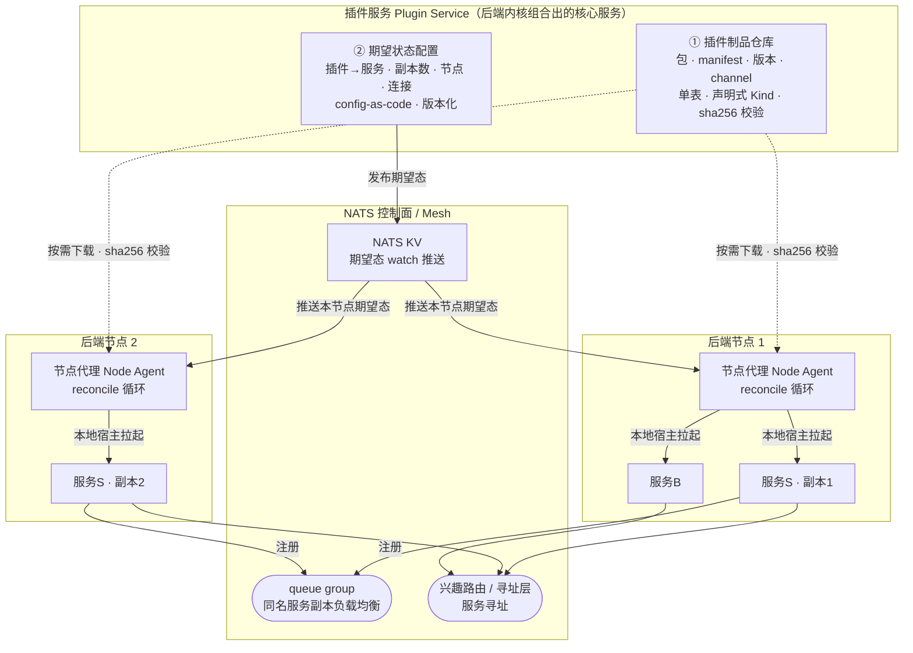
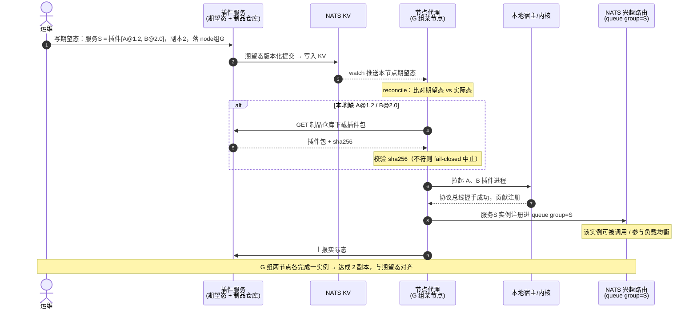

# 插件服务与部署编排

> 状态：设计草案 v0.1｜最后更新：2026-07-14
> 关联：[ADR-0010 插件服务与部署编排](../decisions/ADR-0010-插件服务与部署编排.md)、[ADR-0003 运行时热装](../decisions/ADR-0003-插件装载模型.md)、[ADR-0006 内核分区与后端组合](../decisions/ADR-0006-内核分区与后端组合.md)、[ADR-0008 选型对比](../decisions/ADR-0008-骨架技术选型对比.md)、[系统骨架架构](01-系统骨架架构.md)、[内核间与服务间通信](02-内核间与服务间通信.md)
> 本文是**插件服务、配置共享、集群化与自动装配**的单一真相源。回答四个诉求：插件服务、配置共享、集群化、"指定服务器放配置→自动下载插件→启动服务"。

## 1. 目标

- **插件服务**：集中管理插件制品与期望状态配置的一等组件。
- **配置共享**：服务插件的配置在多节点/多副本间一致。
- **集群化**：同一插件配置成服务后，跑多个相同副本组成集群。
- **自动装配**：在指定服务器放配置，节点**自动下载插件、启动服务**，并持续对齐期望态。

设计取向（ADR-0010）：**自建轻量"插件服务 + 节点代理 reconcile"，可裸机可 k8s**，不走纯 k8s 镜像重部署。

## 2. 三个核心角色

> 读图：运维只在**插件服务**写期望态 → 经 **NATS KV** 推送到相关节点 → **节点代理**按需从**制品仓库**下载插件（sha256 校验）并本地拉起 → 服务副本注册进 **queue group**（同名服务多副本负载均衡）与**寻址层**。节点无需预装，装配全自动。

### 2.1 插件服务 Plugin Service

后端内核组合出的核心服务，内部两职分层：

- **插件制品仓库**（借鉴 testa release-service）：
  - **单表 + 声明式可插拔 Kind 注册表**：新增制品类型只加一条 spec，不加表不加端点。正交维度：可见性（public/authed）、变体、channel（stable/beta/canary）、edition、版本序、是否多平台打包、是否 Manifest 型。
  - **下载 sha256 强校验、fail-closed**；发布/拉取用独立凭证。
  - 同时充当**插件市场后端**（浏览、版本、安装来源）。
- **期望状态配置（desired-state）**：
  - config-as-code、版本化、集中真源。声明"哪些插件组合成哪个服务、副本数、落在哪些节点/节点组、连接关系"。
  - 是"灵活组合"（ADR-0006）的落地载体——改配置即改组合，不改代码。

### 2.2 节点代理 Node Agent

每个后端节点一份（随内核内嵌），持续跑 **reconcile 循环**：

1. 从插件服务取**本节点的期望态**（经 NATS KV watch，变更即触发）。
2. 比对期望态 vs 本地实际态，算出差异（要起哪些、停哪些、升哪些）。
3. **下载**所需插件包（制品仓库，sha256 校验，已在本地则跳过）。
4. 在本地宿主/内核下**拉起插件进程**（独立进程 + 协议总线，ADR-0004）。
5. 服务**注册进 mesh**（NATS + 寻址层，ADR-0007/0008），加入对应服务身份/queue group。
6. 上报实际态，持续对齐；部分失败按策略重试/回滚。

> 借鉴 testa RC 自举与 upgrader：版本目录 + 符号链接原子切换 + 失败回滚 + 后台 checker。

### 2.3 集群化

- 同一插件-服务跑 **N 副本**，副本数由期望态配置声明。
- 多节点的代理各起一实例，加入**同一服务身份 / NATS queue group** → 天然负载均衡、无状态水平伸缩（ADR-0008 已定）。
- 伸缩 = 改期望态副本数 → KV 推送 → 相关节点代理 reconcile 增减实例。

## 3. 自动装配流程（"指定配置→自动下载→启动"）

要点：**运维只声明期望，装配由代理自动完成**；节点不需要预装插件，按需下载。

## 4. 配置共享与寻址

沿用 testa 的关键教训——**寻址与身份/配置分离**：

- **期望态配置**：集中存于插件服务、版本化，经 **NATS KV（watch 推送）** 下发。相比 testa 的 env profile，更强：在线、版本化、推送式、可回滚。这是"配置共享"的载体——所有节点看同一份版本化真源。
- **服务寻址**：走 **mesh**（NATS 兴趣路由 + 寻址层，ADR-0007/0008），**不让节点轮询集中存储要地址**。服务在哪台机由 mesh 解析，节点/调用方无需感知——避免引入寻址中心，也契合"合/拆"位置透明。

## 5. 插件自升级

借鉴 testa RC upgrader（服务端节点同理）：

- 版本目录布局 `plugins/<id>/versions/<ver>/`，`current → versions/<ver>` 符号链接。
- 升级 = 下载新版校验 → drain 在途 → 原子切换符号链接 → 起新版；连续失败**自动回滚**到上一版本目录。
- 双通道：期望态变更（声明新版本）触发；或后台 checker 感知制品仓库新 active 版本。

## 6. 与既有决策的衔接

| 诉求/机制 | 承接的既有决策 |
|---|---|
| 运行时下载启停不重部署 | ADR-0003 运行时热装 |
| 插件独立进程拉起 | ADR-0004 独立进程 + 协议总线 |
| 组合成不同后端服务 | ADR-0006 后端灵活组合（本文是其落地载体） |
| 集群化负载均衡、配置 KV、寻址 mesh | ADR-0008 NATS（queue group / KV / 兴趣路由） |
| 制品分发、Edition/Train/Bundle | 借鉴 testa release-service（本文档范式来源） |

## 7. 待决问题

- [ ] 期望态配置 schema（服务=插件集 + 副本 + 节点选择器 + 连接）与版本化/冲突解决
- [ ] 节点代理 reconcile 的失败语义（部分失败、回滚、在途 drain、幂等）
- [ ] 制品仓库 Kind 注册表在 VastPlan 的具体维度（插件包/bundle/可执行）与鉴权
- [ ] NATS KV 作配置面的容量、一致性边界与大配置切分
- [ ] 节点选择/放置策略（节点组、亲和、资源约束）
- [ ] 与"统一插件定义/清单"的衔接：manifest 的服务角色标注如何驱动装配
- [ ] Edition/Train/Bundle 在插件语境的具体展开（对公对私 + 气隙）
- [ ] 有状态依赖（DB/对象存储/消息）的纳管边界（本轮排除）
