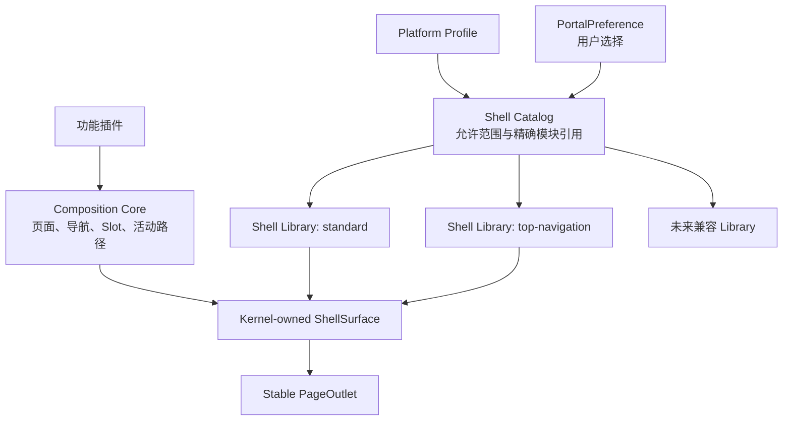

# Portal Shell Catalog 与按需 Library

> 状态：UI Contract 4.x 与服务端跨设备偏好均已实施｜最后更新：2026-07-23
>
> 本文是统一 Slot/Composition、Shell Catalog、按需 Shell Library、稳定 PageOutlet 和用户选择的单一真相源。历史单模块模板方案见 [ADR-0086](../decisions/ADR-0086-单Shell插件与可切换布局模板.md)，取代决策见 [ADR-0097](../decisions/ADR-0097-测试制品仓库与前端分级热升级.md)。

## 1. 目标

平台管理员决定允许哪些可信 Shell，用户可以在界面偏好中即时选择；浏览器只下载当前选择的实现。无论使用侧栏、顶部导航还是未来兼容 Shell，功能插件看到的页面、导航和 Slot 语义完全一致。

Shell 切换不能让功能插件控制布局，也不能因为 React 父组件类型改变而丢失页面、Workbench 或表单状态。无法消费统一 Shell Surface 的实现属于新的信息架构，只能通过 Platform Profile/Activation 发布，不能成为用户偏好。

## 2. 分层



### 2.1 Composition Core

唯一实现页面和导航归并、Slot 目录、排序、作用域、权限裁剪后模型、活动路径和空区域判断。它不读取当前 Shell Library，也不产生框架私有组件。

### 2.2 Shell Catalog

Catalog 是可信 foundation 模块，声明稳定 ID、UI Contract、默认 Library 和可发现 Library 目录。目录项包含稳定 ID、本地化标签、精确插件 ref、兼容 Renderer family、Shell Contract 和受限展示元数据。Catalog 不执行未选择 Library 的代码。

### 2.3 Shell Library

Library 是已签名、内容寻址、可延迟加载的纯前端模块。它消费统一 `ShellCompositionModel` 和宿主持有的 `ShellSurface`，提供 Chrome、导航呈现、响应式行为、溢出策略和布局计划。它不得注册页面/Slot、读取仓库、选择 Renderer 或持有 PageOutlet 子树。

`standard` 与 `top-navigation` 是首批两个 Library，现已作为独立签名制品进入 Catalog，并在 RuntimeSpec 中作为 deferred 模块锁定。它们是可按需下载的 Shell Library，不是两套拥有 Slot、页面归并和导航语义的完整 Shell 基础插件。

### 2.4 Stable PageOutlet

Portal Kernel 在稳定 React 位置持有当前页面、Workbench 和路由状态。Shell Library 只能通过布局计划安排命名区域，不能把页面组件包进随 Library ID 变化的 React 组件类型。切换允许重置 Library 私有的抽屉/Popover 状态，但必须保留 URL、页面实例、表单脏状态、查询、分页、列偏好和受宿主管理的滚动恢复状态。

## 3. Profile 与偏好

当前 Profile 结构如下。字段仍沿用 4.x 的 `Template` 命名，但其值选择的是 Catalog 中的按需 Shell Library；未来若只为改名升级契约，收益不足以覆盖迁移成本。

```json
{
  "shell": {
    "id": "cn.vastplan.foundation.frontend.structure.shell",
    "version": "1.3.0",
    "channel": "stable",
    "uiContract": "^4.0.0",
    "config": {
      "defaultTemplate": "standard",
      "allowedTemplates": ["standard", "top-navigation"],
      "userSelectable": true,
      "templateOptions": {
        "standard": {},
        "top-navigation": {}
      }
    }
  }
}
```

用户偏好以 `tenantId/subjectId/portalId/catalogId/contractMajor` 隔离。服务端 `PortalPreference` 是跨设备真源，localStorage 只作经过相同 scope 校验的启动缓存；选择顺序为有效服务端记录、有效本地缓存、Profile 默认、Catalog 默认，均无效则候选装配失败并保留上一 Generation。

当前 4.x 实现已经完成允许范围校验、服务端 CAS、验证缓存、按需加载和候选 Generation 切换。Node Portal Kernel 只从认证会话与活动 RuntimeSpec 投影身份和 scope，浏览器只能提交受限稳定 ID；这个边界不依赖把两个 Library 合回一个模块。

用户不能提交插件 URL、版本、channel、摘要、CSS、DOM 或组件名。管理员撤销 Library 或关闭用户选择时，下一 Generation 回退 Profile 默认并使旧偏好失效。

## 4. 选择事务

用户选择新的 Library 时：

1. 从活动 RuntimeSpec 查找 allowed 且已锁定的目录项；
2. 按需获取模块字节并复算摘要；
3. 校验第一方来源、Shell/UI Contract、Renderer family、Slot/region capability 和本地化资源；
4. 使用相同 RuntimeSpec、当前路径和状态胶囊准备候选 Portal Generation；
5. 候选渲染与状态恢复成功后原子提交；
6. 提交后保存 active 偏好并清理旧 Library 生命周期；
7. 任一步失败都不修改活动偏好或页面。

连续选择串行执行并合并尚未开始的中间值。切换期间显示非阻塞进度；不得先卸载活动 Shell 再下载候选。

## 5. Renderer 与 Host Epoch

同一 Renderer family、相同 UI Contract major 的 Shell Library 可以无刷新切换。Arco/MUI 等 Renderer family 切换必须进入新 Host Epoch：先校验候选目录与模块，保存 `pending` 偏好，刷新文档，成功启动后提交 `active`；失败清除 pending 并恢复 `lastKnownGood`，不得形成刷新循环。

## 6. 开发与制品升级

源码开发时只重建变化 Library 及受影响依赖，通过回环 SSE 触发候选 Generation。真实制品升级则由 Test Release Controller 创建新的 Portal Activation；相同 Host Epoch 走 Generation，宿主 ABI 变化走受控刷新。未选择 Library 可以进入新的 RuntimeSpec 锁，但在用户选择前不下载、不执行。

## 7. 实施状态

1. 已在当前 UI Contract 4.x 增加 Catalog/Library/LayoutPlan/PageOutlet 类型；没有为已经落地的兼容能力制造仅改版本号的 5.0 迁移。
2. 已完成服务端 Profile、Resolver、Catalog 和 RuntimeSpec 的 deferred Library 支持。
3. 已完成 Portal Kernel 稳定 ShellSurface/PageOutlet 与候选选择事务。
4. 已将 `standard`、`top-navigation` 转为独立签名、内容寻址、按需下载的 Library；唯一 Shell Catalog 继续拥有 Slot 与组合语义。生产物化和开发 HMR 构建清单都把两个 Library 标记为 deferred，且架构门禁禁止 Shell 重新通过 workspace 依赖另一个插件源码包。
5. 已完成受允许范围约束的跨设备 `PortalPreference`、候选提交后 CAS 保存、验证缓存和失败回退；Workbench 集合偏好通过窄端口复用同一真源。
6. 已完成增量 HMR、真实制品 Activation 和 Host Epoch 恢复闭环；生产实时模式仍按容量验收结果决定是否启用。

## 8. 验收

- 未选 Library 不产生网络请求；
- standard/top-navigation 切换不刷新文档；
- 切换后 URL、页面实例、受控表单内容和 Workbench 状态不变；
- 摘要、导出、契约、Renderer 兼容或渲染失败时活动 Shell 不变；
- 用户偏好只在候选提交后保存；
- 任意 Library 都不能删除、重命名或静默丢弃已填充标准 Slot；
- Arco/MUI 能消费相同 Catalog 与 Composition，不向 Shell 泄漏框架私有主题对象。
