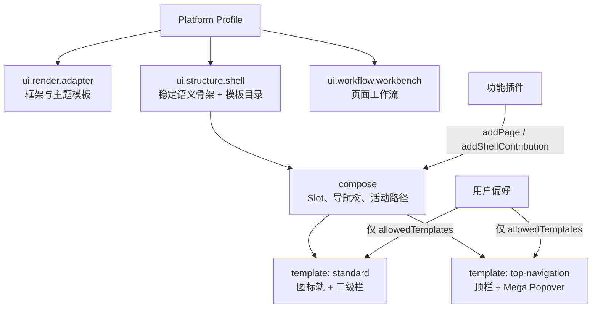

# Portal 单 Shell 多模板设计

> 状态：已采纳，核心路径已实施｜最后更新：2026-07-19
>
> 本文是 Portal 从“组合插件 + 布局插件”迁移到“单 Shell 插件 + 多模板”的实施设计单一真相源。架构取舍见 [ADR-0086](../decisions/ADR-0086-单Shell插件与可切换布局模板.md)。Profile、Catalog、Portal Runtime 和首方交付已切换到 v3；旧目录当前仅作为 Shell 的内部编译源码，不再贡献或装配旧扩展点。

## 1. 目标与非目标

目标是在不改变功能插件页面、导航语义、Slot ID、权限可见性与 Workbench 行为的前提下，将 `standard` 侧栏和 `top-navigation` 顶部导航收敛为同一首方 Shell 插件的模板。平台配置默认模板和可选范围；用户在允许范围内即时切换，刷新后恢复选择。

这不是主题系统、页面搭建器或任意样式配置：主题继续由 `ui.render.adapter` 的主题模板治理；业务页面继续由 Workbench/功能插件定义；功能插件不能上传 CSS 或改变 Shell 区域。

## 2. 目标模型



Shell 是一个基础插件，并非只是一份 CSS。它统一产生 `ShellCompositionModel`，所有模板在同一模型上渲染。模板间可以不同：导航承载位置、窄屏策略、溢出方式、区域栅格和滚动容器；模板间不能不同：Slot 名称、导航树含义、活动路径、页面路由、权限结果、功能插件 API。

## 3. 公开 TypeScript 契约

`@vastplan/ui-primitives` 以一个 `UIShellAdapter` 取代原 `StructureCompositionAdapter` 与 `StructureLayoutAdapter`。概念接口如下，最终字段名以实现时的 TypeScript 类型为准：

```ts
interface ShellTemplate {
  id: string;
  label: LocalizedText;
}

interface UIShellAdapter {
  id: "ui.structure.shell";
  uiContract: string;
  templates: readonly ShellTemplate[];
  defaultTemplate: string;
  compose(input: ShellCompositionInput): ShellCompositionModel;
  Shell: ComponentType<ShellProps>;
  localization?: PluginLocalization;
}

interface ShellProps {
  composition: ShellCompositionModel;
  template: { id: string; options: Readonly<Record<string, unknown>> };
  branding: ShellBranding;
  pathname: string;
  recoveryNotice?: ReactNode;
  onNavigate(pageID: string): void;
}
```

`ShellCompositionInput`、`ShellCompositionModel`、`ShellBranding`、标准 Slot 枚举、页面注册和 Shell 贡献的来源限制从现有契约迁移但不改语义。模板目录至少校验：ID 非空且唯一、默认模板存在、声明与 Profile 可选范围相交、每个 options 值为 JSON 对象。只有 Shell 插件能解释 `template.options`。

## 4. Profile 与用户偏好

Profile 目标字段：

```json
{
  "renderAdapter": { "id": "...", "version": "...", "uiContract": "^4.0.0" },
  "shell": {
    "id": "cn.vastplan.foundation.frontend.structure.shell",
    "version": "1.0.0",
    "uiContract": "^4.0.0",
    "config": {
      "defaultTemplate": "standard",
      "allowedTemplates": ["standard", "top-navigation"],
      "userSelectable": true,
      "templateOptions": { "standard": {}, "top-navigation": {} }
    }
  },
  "workbench": { "id": "...", "version": "...", "uiContract": "^4.0.0" }
}
```

Profile/Catalog/Runtime 必须以同一规则校验：`defaultTemplate` 在 Shell 目录且在 `allowedTemplates`；`allowedTemplates` 不为空、不重复，均在目录中；`templateOptions` 只能为 allowed ID 提供 JSON 对象。`userSelectable=false` 时，运行时忽略已存用户偏好。

浏览器使用以 `tenantId / portalId / shell.id` 为隔离维度的宿主偏好键。该记录只保存 `{ templateID }`，不保存样式、导航状态、页面数据或敏感身份信息。选择逻辑固定为：有效用户偏好 → Profile 默认模板 → Shell 默认模板；如果三者均无效，Portal 安全启动失败。配置中心可展示 Shell 声明的本地化模板标签，但只能写 Profile 允许的结构。

## 5. 运行时与热切换

Portal Runtime 在所有功能插件注册前加载并验证唯一的 `shell` 模块。它先调用 `shell.compose` 得到语义模型，再在 React 内解析当前模板。用户切换只改变 `templateID` 状态；不会请求新模块、调用插件 `register`、创建新 Generation 或更新 Activation。

为保证切换前后行为一致：

1. `compose` 结果必须与模板选择无关；
2. 路由、`onNavigate`、权限、消息目录和 Workbench 组件实例由 Portal Runtime 维持；
3. 传入模板的 Slot 内容有稳定 key；模板不应把页面正文作为模板 ID 的 key；
4. 模板本地交互状态允许重置，但切换不允许丢弃受 Workbench 管理的查询、分页、列偏好和已恢复的热替换状态；
5. Profile/Shell 制品本身发生变更仍走现有事务式 Portal Generation 替换，校验失败保留旧代。

## 6. 插件与文件组织

目标目录：

```text
extensions/plugins/cn.vastplan.foundation.frontend.structure.shell/
├── vastplan.plugin.json
├── README.md
└── frontend/src/
    ├── index.tsx                 # 仅组装 adapter
    ├── composition.ts            # Slot/导航归并，纯数据逻辑
    ├── shell.tsx                 # 选择模板并传递稳定内容
    ├── templates/
    │   ├── standard.tsx
    │   └── top-navigation.tsx
    └── shared/                   # Slot renderer、可访问性与区域可见性
```

每种模板各自包含样式与模板专属测试；导航归并、Slot 渲染和区域内容判断只能在共享代码中存在一份。`vastplan.plugin.json` 只声明 `shells: [{ id: "ui.structure.shell", ... }]`。当前迁移将以下旧目录降为不具备基础贡献的内部编译源码；下一轮目录收敛时再物理迁入 `structure.shell` 并删除目录：

- `cn.vastplan.foundation.frontend.structure.composition.standard`
- `cn.vastplan.foundation.frontend.structure.layout.standard`
- `cn.vastplan.foundation.frontend.structure.layout.top-navigation`

## 7. 分阶段实施

| 阶段 | 变更 | 完成条件 |
|---|---|---|
| 0. 决策与夹具 | ADR、本文、目标 Profile fixture | 已完成 |
| 1. 公共契约 | `UIShellAdapter`、Shell 模板/Profile 类型、Manifest Schema | 已完成，服务端与浏览器均拒绝无效模板 |
| 2. 解析与运行时 | Catalog、Composer、Portal API、Portal Runtime、开发态 loader 只解析 `shell` | 已完成，来源、单例、契约与模板目录 fail-closed |
| 3. 首方 Shell | 合并组合、标准侧栏、顶部导航为一个模块 | 已完成交付；旧源码暂作为无贡献内部模块复用 |
| 4. 管理体验 | 配置中心展示模板目录与允许范围；门户提供用户切换入口 | 管理中心已改为编辑默认模板；用户切换入口待补入账户/偏好插件 |
| 5. 删除与发布 | 删除旧三个插件与旧字段；构建/发布夹具全量替换 | 旧字段与贡献类型已删除；待物理目录收敛 |

每阶段应独立提交；第 2 至 5 阶段必须在同一兼容性切换窗口内完成，不发布保留旧字段的双运行时。

## 8. 验收

1. Profile 只能选择一个已签名首方 `ui.structure.shell`，且 `plugins` 精确包含 render adapter、shell、workbench 三个基础插件。
2. 任意未知、重复、未授权或无默认的模板配置都在服务端解析和浏览器装配两处拒绝。
3. `standard` 与 `top-navigation` 对相同页面/贡献输出相同活动路径、可见菜单、Slot 内容和路由结果。
4. 用户切换模板后 URL、已加载模块数、Portal Generation、Workbench 查询/分页/列偏好不变；刷新后仅恢复允许范围内的模板。
5. 管理员撤销模板或关闭用户选择后，浏览器回退 Profile 默认模板且不执行无效偏好。
6. 两模板都通过窄屏、RTL、键盘、读屏、200% 缩放、区域溢出、空区域折叠与恢复页面测试。
7. Arco 与 MUI 都能装配同一 Shell，Shell 不读取任何框架私有 API、主题对象或 CSS token。
