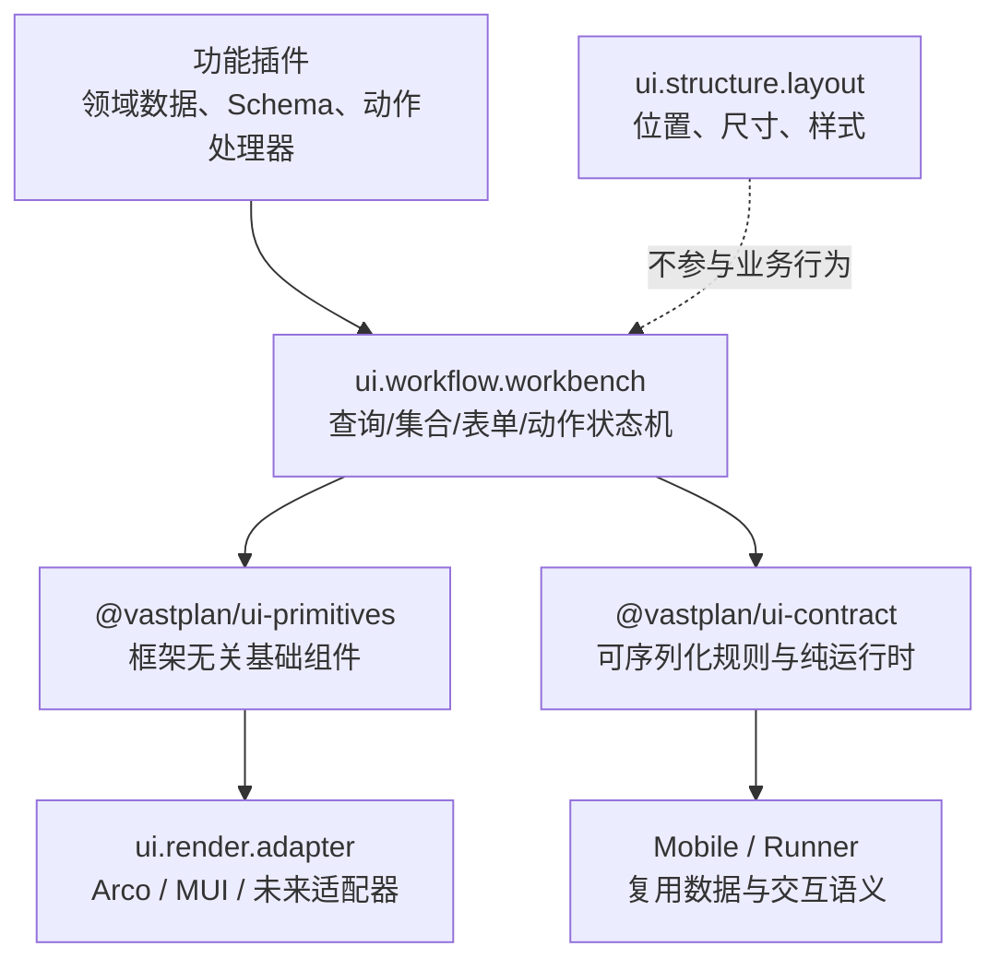

# UI 工作台组合框架

> 状态：Collection V1 已实施；Card 与表单工作流待实施｜最后更新：2026-07-19
>
> 本文是 Portal 列表、卡片、动作、表单与 Overlay 工作流组合规范的单一真相源。架构取舍见 [ADR-0082](../decisions/ADR-0082-前端工作台组合框架.md)；三层命名边界见 [ADR-0083](../decisions/ADR-0083-前端UI分层术语与插件命名空间.md)；Portal 装载与基础插件边界见《[前端门户内核](前端门户内核.md)》，视觉基线见《[Portal 设计系统](../design/DESIGN.md)》。

## 1. 定位与边界

Workbench 不是新的 Arco/MUI，也不是低代码页面生成器。它把企业管理界面反复出现的“组合规则”变成稳定产品能力：数据查询、集合呈现、记录动作、表单编辑、提交与反馈。功能插件仍编写领域数据加载器和动作处理器，但视觉页面只能由 Workbench Pattern 定义，不能重新组合底层 UI。



| 层 | 负责 | 禁止负责 |
|---|---|---|
| `ui.structure.composition` / `ui.structure.layout` | Slot 拓扑、导航、页面区域和视觉位置 | 列表查询、表单提交、业务动作 |
| `ui.render.adapter` | 主题、DOM、组件渲染、焦点、键盘、虚拟化、响应式 | 业务筛选含义、服务端请求、权限裁决 |
| `ui.workflow.workbench` | 通用工作流和状态机 | Arco/MUI 私有 API、全局布局、领域权限裁决 |
| 功能插件 | 领域数据、Schema、动作处理器、文案、Workbench Page 定义 | 全局 CSS、框架私有组件、`ui-primitives` 基础组件、裸 React 页面、直接 HTTP URL、Shell 控制 |

## 2. 运行与装配

`ui.workflow.workbench` 是 Platform Profile 中的第四个 Frontend 基础单例，与设计系统、Shell 组合和布局分别来自不同的可信首方制品。当前 Resolver 已验证前四项；第五项是完成首方页面迁移后启用的门禁：

1. 恰好一个 Workbench，且其 `uiContract` 主版本与设计系统、功能插件相容；
2. Workbench 只依赖 `@vastplan/ui-primitives` 和 `@vastplan/ui-contract` 的共享单例，不能带入第二套 UI 框架；
3. Application Composition 不能选择、替换或绕过 Workbench；
4. Workbench 故障和设计系统故障一样，进入 Portal Kernel 恢复路径，而不是让功能插件退回自行组合。
5. 待启用：功能插件制品只能声明 `@vastplan/workbench-sdk` 为 UI SDK；构建门禁与 Catalog 将检查其 import 图，出现 `@vastplan/ui-primitives`、Arco/MUI 或未授权共享 UI 包即拒绝装配。现有首方页面迁移完成前不得提前打开该门禁。

当前已是四个基础单例：设计系统、结构组合、结构布局和 Workbench。V1 已实现 `CollectionWorkbench` 的 table/page 查询模式：筛选、分页、列显示与顺序偏好、单/多选、行/批量动作、loading/empty/error/retry；平台管理中心的 Portal revision 浏览页是首个 fixture。Card cursor、表单工作流、导入图门禁和全量首方页面迁移仍待完成。

### 2.1 严格入口与受控 Pattern 演进

每个页面必须通过 `workbench.definePage()` 提供 `WorkbenchPageDefinition`。定义可以引用 Collection、Record、Form、Action、Status 和后续已批准的 Pattern；它不接受任意 React `Component`、DOM 节点或基础组件实例。运行时函数仅限 Loader、ActionHandler、SubmitHandler 等数据/命令端口，不能直接构造视觉树。

这不是允许“自由 custom block”的例外。某个业务需要图编辑器、代码编辑器、GIS、时间轴或拓扑图时，先提出新的 Workbench Pattern：说明数据模型、选择/动作、焦点、错误、i18n、窄屏、性能和安全边界；由 foundation Workbench 同步实现 Arco/MUI 语义。V1 不加载独立 Pattern 插件，避免未经治理的业务模块重新取得底层 UI 能力；未来独立 Pattern 的可信来源与 SDK 必须另立 ADR。

## 3. 契约模型

### 3.1 数据集合

每个集合有稳定 `collectionId`，是缓存、URL 状态与用户偏好的命名空间。插件声明能力上限，用户只可在上限内选择展示偏好。

```text
CollectionSpec
├── id / title / view: table | cards
├── query: page | cursor
├── filters[]: text | select | boolean | numberRange | dateRange
├── columns[]: key、标题、显示/排序/筛选能力、默认可见与宽度边界
├── selection: none | single | multiple
├── actions: toolbar | row | card | bulk
└── preferences: allowedColumns、density、pageSize 范围

CollectionLoader(query, signal) -> CollectionResult
├── items[]
├── total?                         # 仅 page 查询要求
├── nextCursor?                    # 仅 cursor 查询允许
└── facets? / permittedActions?    # 服务端事实，不是浏览器猜测
```

- Table 使用 `page` 或 `cursor` 二选一。需要总数、跳页和审计浏览的管理表使用 `page`；Card feed 和高数据量连续浏览使用 `cursor`。
- Filter 的值、排序、页码/cursor 都属于 URL 可恢复状态；敏感筛选值不得进入 URL。查询切换时取消上一请求，保留已成功数据并展示刷新状态。
- V1 保存列移动与显隐到浏览器本地偏好，命名空间为 `tenant / portal / collectionId`；浏览器用户隔离由其登录配置文件承担。宽度、密度与 page size 的跨会话偏好属于后续增强。偏好无法新增未声明列，服务端也绝不依据它扩大数据字段或权限。
- Workbench 统一渲染 loading、refreshing、empty、error、stale、selection 和 retry，不允许同一集合同时由插件再渲染另一套分页或工具栏。

### 3.2 操作区

`ActionSpec` 只声明语义：`id`、本地化标题、图标、tone、placement、排序、selection 前置条件、confirm 文案和可见/禁用解释。处理器由插件在运行时以同一 action ID 注册。

| Placement | 规则 |
|---|---|
| `page.primary` / `page.secondary` | 每区域最多一个主操作；次要操作可进入更多菜单 |
| `collection.toolbar` / `collection.bulk` | 批量操作必须声明选择数量与对象状态前置条件 |
| `record.row` / `card.footer` | 常用非破坏性操作可见，其余收纳 overflow |
| `form.submit` / `form.cancel` / `form.danger` | 提交只有一个主操作；危险操作必须确认且保留失败上下文 |

浏览器的可见/禁用状态只是体验提示。Action handler 每次执行仍经类型化 BFF 或 capability 调用，由服务端重新判定主体、租户、对象状态、并发版本和权限。

### 3.3 表单与 Overlay 工作流

`FormSchema` 保持 Draft 7 数据约束，不将分栏、步骤和条件可见性伪装成校验规则。3.x 新增：

```text
FormPresentation
├── layout: compact | horizontal | vertical
├── sections[]: title、description、columns、collapsible、step/tab
├── fields[]: JSON Pointer、span、widget、help、visibleWhen、readOnlyWhen
└── actions: 表单内 action ID 和顺序

FormWorkflow
├── surface: page | dialog | drawer
├── title / description / size
├── submitAction / cancelAction / confirmBeforeSubmit?
├── success: notify、refreshCollection、close、navigate
└── failure: 字段错误映射、保留输入、可重试性
```

`visibleWhen` / `readOnlyWhen` 使用有限 DSL：字段 JSON Pointer、`equals`、`in`、`exists`、`all`、`any`、`not`。它不能读取环境、调用网络、执行脚本或访问其他插件状态。需要复杂业务判断时，插件把已裁剪的只读 `context` 传给 Workbench，并由服务端在提交时再次验证。

`FormDialog` / `FormDrawer` 由 Workbench 统一处理标题、焦点、ESC、关闭确认、校验、提交中禁用、一次性提交、字段级错误、成功刷新、失败保留和本地化。插件只给出 Schema、Presentation、Workflow 与 `submit(values, signal)` 处理器；处理器是运行时代码，绝不写入 Portal 发布配置。

### 3.4 卡片列表

Card 不是任意仪表盘容器。它用于可扫描的实体集合，固定为：标题/识别信息、状态区、受限摘要区、内容槽、footer 操作区。卡片同样必须使用 Collection 的筛选、cursor、空态、骨架屏、选择与动作规则；不得为卡片视图另造一套搜索和加载协议。

密集管理场景默认优先 Table；只有摘要、状态和少量操作比多列对比更重要时使用 Card。详情仍进入详情页、Drawer 或 master-detail，不让卡片承载完整编辑器。

## 4. 安全、可访问性与国际化

- 可序列化契约只允许 JSON 数据；禁止函数、URL、HTML、组件引用、任意模板表达式和客户端权限结论。
- Workbench 不直连服务端；功能插件经受限、类型化 Client 调用已声明 capability/BFF 路径。提交载荷不得自行携带 Principal、tenant 或权限。
- 所有标题、筛选项、列、动作、状态、空态和错误均使用插件命名空间 i18n；日期、数字、列表和相对时间继续交给 Portal Intl。
- 表格/卡片需要键盘可达的行与动作、选择状态和 overflow；Dialog/Drawer 需焦点圈定与恢复。筛选区、长表、卡片区和 Overlay 各自管理溢出，符合 Portal 设计系统的区域自治原则。
- Adapter 必须对同一 fixture 保持等价的焦点、ESC、禁用、错误、分页/cursor 和 reduced-motion 语义；视觉可以不同，但行为不能漂移。

## 5. 实施顺序与验收

1. 已完成：`ui.workflow.workbench` descriptor、Platform Profile/Catalog 单例校验、`@vastplan/workbench-sdk` 与 `@vastplan/ui-contract` 3.x Collection 类型，以及 Arco/MUI 行选择语义。
2. 已完成：`CollectionWorkbench` 的表格、工具栏、筛选、分页、列偏好、行/批量操作；平台管理中心 Portal revision 浏览页为首个 fixture。
3. 实现 Card cursor 模式与共享查询状态；禁止额外的独立卡片查询协议。
4. 实现 `FormPresentation`、`FormWorkflow`、Dialog/Drawer 表单；以连接定义或凭证元数据编辑器作为 fixture，明确不处理凭证明文。
5. 把现有首方功能插件一次性迁移到 3.x，删除它们重复的筛选、提交和 Overlay 样板，并拒绝遗留的基础组件 import 或裸页面注册；通过 Arco/MUI fixture、键盘、窄屏、i18n、权限拒绝、Abort、脏数据和并发提交测试。

除 Collection V1 外，当前的 Card、表单工作流和全量页面门禁尚未实施；它们不能被误称为现有 Workbench 能力。
