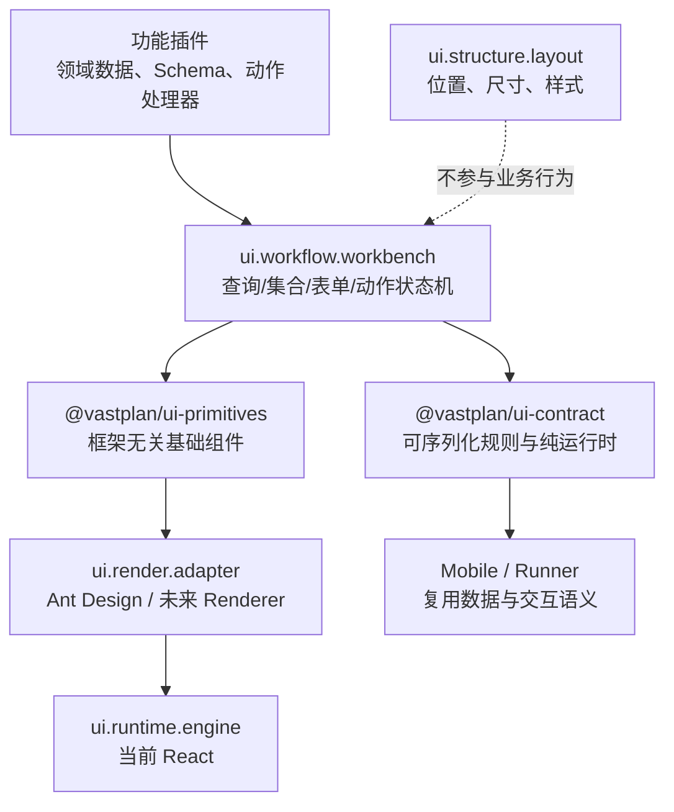

# UI 工作台组合框架

> 状态：FilterPanel、Collection、RecordDetail/MasterDetail/TreeDetail、WorkspacePage、表单、Overlay、Table 行虚拟化、统一拖拽与延迟 Dashboard Grid 基础均已实施｜最后更新：2026-08-04
>
> 本文是 Portal 列表、卡片、动作、表单与 Overlay 工作流组合规范的单一真相源。架构取舍见 [ADR-0082](../decisions/ADR-0082-前端工作台组合框架.md)；命名边界见 [ADR-0083](../decisions/ADR-0083-前端UI分层术语与插件命名空间.md) 与 [ADR-0104](../decisions/ADR-0104-Frontend-Runtime-Engine与React单实现.md)；Portal 装载与基础插件边界见《[前端门户内核](前端门户内核.md)》，视觉基线见《[Portal 设计系统](../design/DESIGN.md)》。

## 1. 定位与边界

Workbench 不是新的 UI 框架，也不是低代码页面生成器。它把企业管理界面反复出现的“组合规则”变成稳定产品能力：数据查询、集合呈现、记录动作、表单编辑、提交与反馈。功能插件仍编写领域数据加载器和动作处理器，但视觉页面只能由 Workbench Pattern 定义，不能重新组合底层 UI。


```mermaid
flowchart TB
  F["功能插件\n领域数据、Schema、动作处理器"] --> W["ui.workflow.workbench\n查询/集合/表单/动作状态机"]
  W --> P["@vastplan/ui-primitives\n框架无关基础组件"]
  W --> C["@vastplan/ui-contract\n可序列化规则与纯运行时"]
  P --> D["ui.render.adapter\nAnt Design / 未来 Renderer"]
  D --> E["ui.runtime.engine\n当前 React"]
  C --> X["Mobile / Runner\n复用数据与交互语义"]
  L["ui.structure.layout\n位置、尺寸、样式"] -. 不参与业务行为 .-> W
```

| 层 | 负责 | 禁止负责 |
|---|---|---|
| `ui.structure.composition` / `ui.structure.layout` | Slot 拓扑、导航、页面区域和视觉位置 | 列表查询、表单提交、业务动作 |
| `ui.runtime.engine` | 前端框架生命周期、挂载、Generation、可选 SSR 桥 | 业务页面、主题、领域动作 |
| `ui.render.adapter` | 主题、DOM、组件渲染、焦点、键盘、虚拟化、响应式 | 业务筛选含义、服务端请求、权限裁决 |
| `ui.workflow.workbench` | 通用工作流和状态机 | UI 框架私有 API、全局布局、领域权限裁决 |
| 功能插件 | 领域数据、Schema、动作处理器、文案、Workbench Page 定义 | 全局 CSS、框架私有组件、`ui-primitives` 基础组件、裸 React 页面、直接 HTTP URL、Shell 控制 |

## 2. 运行与装配

`ui.workflow.workbench` 是 Platform Profile 中四个语义 Frontend 基础单例之一；另外三个是 `ui.runtime.engine`、`ui.render.adapter` 与已经内聚组合拓扑、Catalog 和布局 Library 的 `ui.structure.shell`。它拥有 Pattern 展示档位而不拥有主题：首期 Collection 由 `workbench.config.collection.defaultDensity` / `allowedDensities` 治理 `compact`、`standard`、`comfortable`；颜色、字体、间距 token 与深浅主题仍只能由 `ui.render.adapter` 提供，详见 ADR-0084。当前 Resolver 和构建系统共同执行以下约束：

1. 恰好一个 Workbench，且其 `uiContract` 主版本与设计系统、功能插件相容；
2. Workbench 只依赖 `@vastplan/ui-primitives` 和 `@vastplan/ui-contract` 的共享单例，且 `engineFamily` 必须与 Runtime Engine、Adapter、Shell 一致，不能带入第二套前端框架；
3. Application Composition 不能选择、替换或绕过 Workbench；
4. Workbench 故障和设计系统故障一样，进入 Portal Kernel 恢复路径，而不是让功能插件退回自行组合。
5. 功能插件制品必须使用 `@vastplan/workbench-sdk`；构建门禁与 Go 架构适应度测试拒绝 React、具体 UI 框架、裸 `context.addPage` 和 `@vastplan/ui-primitives` 视觉导入。当前唯一例外是尚在该包中的非视觉 `PortalControlClient` 与 `Portal*` 数据契约。

`FilterPanel` 是与 Collection、MasterDetail 平级的一级组合组件，统一字段 Schema、紧凑表单、草稿/提交策略、响应式分列和操作位置，但不发起数据请求。`CollectionWorkbench` 组合 FilterPanel，并共享查询、选择、动作、取消和错误状态机，提供 table/page 与 card/cursor 两种受控呈现：Table 保留列显示与顺序偏好、页码和总数；Card 固定标题、状态、摘要、内容与 footer 动作区，支持手动/视口增量加载。Workbench Page 根使用统一零 margin/零 padding Flow，以受治理 `sectionGap` 排列一级区域；FilterPanel 的 `flush/compact` inset 由 Workbench 组合上下文决定，功能插件不能借此设置外部间距。Collection 顶部筛选固定 `flush`，避免 FilterBar 自身 padding 与 Shell 16px 起始节奏叠加。FilterPanel 默认 `xs=1 / md=2 / xl=4`，可通过 `filterPanel.layout.columns` 覆盖；列偏好由工具栏锚定 Popover 即时写入，不使用阻断式确认 Dialog。表单工作流已提供默认 FormDialog 和显式 page、打开时动态 Schema/枚举准备、分区/标签/步骤、1–4 列、有限条件 DSL、脏状态保护、同步/异步/服务端字段错误、一次性提交和成功刷新。Overlay 统一承载 JSON 预览和审计表，并可按信息形态选择 Dialog 或 Drawer。视觉数值的唯一真相源是《[Portal 设计系统](../design/DESIGN.md)》的 `portalPageRhythm`。

UI Contract 10.2 的 `SizeableProps` 为 Workbench 定义提供统一四档 `xs / sm / md / lg`，缺省为 `md`。Page、Workspace Section、Collection、FilterPanel、Card、Form、Overlay、Record、Descriptions 与 Dashboard 都通过同一 `ComponentSizeProvider` 继承，调用方只在组合根声明一次；Renderer 不得在每个组件重新复制默认分支。`Page.size` 管节奏而不管正文宽度，`Grid.size` 管默认 gap 而不管列数。Form/Overlay 的内容 `size` 与 `dialogWidth` / `width` 完全分离。

通用排序由 Workbench 内部 `patterns/interaction/SortableList` 统一承接，当前使用精确锁定的 dnd-kit；Pointer、Touch、自动滚动和碰撞反馈不再由各 Pattern 自行处理，键盘继续提供显式等价操作。第三方事件与 Sensor 不进入 UI Contract 或功能插件，dnd-kit 仅在 Sortable 表面实际挂载后加载。未来首页卡片使用 `DashboardGridSpec` 描述稳定卡片 ID 和响应式位置，可信宿主通过 `loadDashboardGrid()` 按需加载 `react-grid-layout` 并解析卡片内容；Grid 代码不进入普通 Workbench 页面入口。该基础不等于首页已经实现，卡片目录、偏好 CAS、权限裁剪和完整键盘缩放仍是正式启用前置项，详见 ADR-0162。

Record 工作流共享详情字段投影、状态、页面/详情动作、表单、Overlay、取消和错误状态机，并提供 `record-detail`、`master-detail` 与 `tree-detail` 三种 Pattern。MasterDetail 的左侧列表复用 Collection 查询、筛选、page/cursor 和取消语义，右侧可以展示详情或 page-surface 编辑器；TreeDetail 对节点数、深度、ID 唯一性和默认展开层级做有界校验。选择写入受限 URL 参数，窄屏在主区/详情间切换，页内编辑存在脏数据时切换记录必须确认。功能插件不能提供 React render function、HTML、任意树组件或自行实现分栏。

### 2.1 严格入口与受控 Pattern 演进

每个页面必须通过 `defineCollectionPage()`、`defineWorkspacePage()` 或 `defineFormPage()` 提供 Workbench 定义。`WorkspacePage` 把多个独立校验的 Collection 固定组合为一个路由页面：Section ID、页面动作、表单和 Overlay ID 均跨 Section 唯一，宿主按各 Section 权限裁剪，并共享同一个页面动作区和刷新信号。定义可以引用 Collection、Form、Overlay、Action、Status 和后续已批准的 Pattern；它不接受任意 React `Component`、DOM 节点或基础组件实例。运行时函数仅限 Loader、ActionHandler、SubmitHandler 等数据/命令端口，不能直接构造视觉树。

这不是允许“自由 custom block”的例外。某个业务需要图编辑器、代码编辑器、GIS、时间轴或拓扑图时，先提出新的 Workbench Pattern：说明数据模型、选择/动作、焦点、错误、i18n、窄屏、性能和安全边界；由 foundation Workbench 与当前 Ant Design Renderer 实现语义。V1 不加载独立 Pattern 插件，避免未经治理的业务模块重新取得底层 UI 能力；未来独立 Pattern 的可信来源与 SDK 必须另立 ADR。

## 3. 契约模型

### 3.1 FilterPanel 一级组合

`FilterPanelSpec` 是可序列化的筛选面板契约，可被 Collection、MasterDetail 以及后续受治理 Pattern 组合：

```text
FilterPanelSpec
├── fields[]: text | select | boolean | numberRange | dateRange
├── layout.columns: 固定或 xs…xl 响应式列数
└── apply
    ├── mode: auto-single-row | explicit
    └── actionsPlacement: last-cell
```

FilterPanel 只管理字段值、草稿、清除、提交和视觉编排，通过 `onApply(values)` 输出稳定值；分页、排序、请求取消、缓存与数据加载归组合它的上级工作流所有。功能插件不得提交 React 组件、自定义按钮或 UI 框架参数。开发阶段不保留旧 `filters` / `filterLayout` 字段，架构门禁拒绝其重新出现。

默认 `auto-single-row`：不足两行时文本 Enter 提交，选择/布尔/范围完成即提交且不显示操作；达到两行时保留草稿并显示查询与清除。`explicit` 始终要求显式提交。操作单元跨越当前行剩余列并右对齐，因此在每个响应式断点都落于末行末列。FilterPanel 通过 `FormPresentation.labelPlacement=inside-inline` 使用持久 Label；Label 与控件共享当前列宽，保持单行并在桌面 `clamp(48px, 18%, 112px)`、移动端 `clamp(56px, 32%, 128px)` 上限内省略，Tooltip 和可访问名称保留全文。Select 筛选项固定声明受治理的 `allowClear` 语义，由 Ant Design 原生清除入口实现。

### 3.2 数据集合

每个集合有稳定 `collectionId`，是缓存、URL 状态与用户偏好的命名空间。插件声明能力上限，用户只可在上限内选择展示偏好。

```text
CollectionSpec
├── id / title / view: table | cards
├── query: page | cursor
├── filterPanel?: FilterPanelSpec
├── table.virtualization?: auto | always | off
├── columns[]: key、标题、显示/排序/筛选能力、默认可见与宽度边界
├── selection: none | single | multiple
├── actions: toolbar | row | card | bulk
└── preferences: allowedColumns、density、pageSize 范围

CollectionLoader(query, signal) -> CollectionResult
├── items[]
├── total?                         # 仅 page 查询要求
├── nextCursor?                    # 仅 cursor 查询允许
└── facets? / permittedActions?    # 服务端事实，不是浏览器猜测
```

Collection 可选的状态摘要由 `CollectionSummary` 数据驱动定义。`appearance` 默认 `panel`：`columns` 使用与 Grid 相同的 `xs…xl` 响应式列数，单项 `span` 可在各断点跨列；功能插件不能传 CSS Grid、Ant Design `Descriptions.Item` 或 React 节点。信息已经拥有明确页面语境时可选择 `plain`，Workbench 将其投影为按内容宽度排列、可自动换行的无边框摘要条，标签使用次要文字、值使用中等字重，不再把少量指标拉伸为整行 Descriptions 单元格。CollectionPage 把摘要、FilterPanel 和工具栏统一纳入顶部区域并使用 `sm` 内部间距，与数据区之间继续使用页面级间距。

表格行操作由 Workbench 统一投影：功能插件只声明 `placement: record.row` 的语义动作，Workbench 自动追加不可隐藏的末列“操作”，在横向滚动时固定在右侧并保持内容居中；每行先按 `visibleWhen` 过滤，最多两个动作以图标 + Tooltip 直接显示，剩余动作进入每行一个“图标 + 标签”的紧凑“更多行操作”浮层。直接动作、更多触发器和更多菜单内图标均使用同一 `sm` 操作配方（12px 图标），不能由渲染适配器默认尺寸漂移。`ActionMenuPopover` 是 Workbench 内部通用组合，统一记录级和页面级溢出动作的数据投影、内容宽度、截断、危险/禁用态、初始焦点和选择后关闭；具体 Pattern 不再自行拼装 Popover + Menu。页面级操作使用独立 `PageActionSpec` 并只挂载至 `page.header.end`，不得与行操作混用来规避这一布局规则。

- Table 使用 `page` 或 `cursor` 二选一。需要总数、跳页和审计浏览的管理表使用 `page`；Card feed 和高数据量连续浏览使用 `cursor`。
- Filter 的值、排序、页码/cursor 都属于 URL 可恢复状态；敏感筛选值不得进入 URL。查询切换时取消上一请求，保留已成功数据并展示刷新状态。
- Workbench 通过 Portal Kernel 提供的窄 `WorkbenchPreferencePort` 保存列顺序、显隐、密度与 page size。服务端记录按 `tenant / subject / portal / catalog contract major / collectionId` 隔离并使用 revision CAS，localStorage 只作验证缓存；偏好无法新增未声明列，服务端也绝不依据它扩大数据字段或权限。
- Workbench 统一渲染 loading、refreshing、empty、error、stale、selection 和 retry，不允许同一集合同时由插件再渲染另一套分页或工具栏。行/卡片选择是 `collection.bulk` 的专用输入面：权限投影后不存在批量动作时，即使 Collection 留有 `selection` 配置也必须隐藏选择控件；存在批量动作时沿用 `single`，其他情况统一为 `multiple`。行操作、卡片操作和 Page Header 动作不得借选择列制造伪批量入口。
- Cursor 只来自上次成功结果的 `nextCursor`。加载更多会按稳定记录键去重并用新事实替换重复项；Loader 返回与请求相同的 cursor 时立即失败，避免无限请求。筛选或刷新会重新从首 cursor 装配，未提交请求由 `AbortSignal` 取消。
- Collection 的默认管理工作区组合一级 FilterPanel、主操作在左/次操作在右、浅色表头与行分隔、页脚右对齐分页。视觉语义通过 `FilterBar`、`Table`、`Pagination` 的 `collection` 呈现能力交由渲染适配器实现，Workbench 不注入框架 CSS。
- Table 行虚拟化默认使用 `auto`：当前页达到 80 行后启用，少量数据保持普通表格；功能插件只可选择 `auto / always / off`，不能传入像素、overscan 或框架私有属性。Workbench 按 density 统一解析固定行高、视口和 overscan，再通过 `ui.Table` 契约交给 Ant Design Renderer，仅渲染可视行。虚拟化不替代服务端筛选、排序或分页，也不允许用超大 page size 绕开数据面限额。
- Table 的横纵溢出必须分轴治理：普通表格只拥有横向滚动，明确禁止产生内部纵向滚动容器；只有启用虚拟化后，Renderer 才能按受治理视口打开纵向滚动。禁止只设置 `overflow-x: auto` 或使用无方向的 `overflow: auto`，因为 CSS 会把另一轴从 `visible` 提升为 `auto`，在系统固定显示滚动条时产生无数据也存在的纵向轨道。

### 3.3 操作区

`ActionSpec` 只声明集合与记录语义：稳定 `id`、本地化标题、必填语义图标、tone、placement、selection 前置条件、confirm 文案和可见条件。页面不得提交按钮、React 节点或逐动作回调；表单与 Overlay 动作只引用已登记 ID，其他动作统一交给 `runAction(context, signal)` 工作流端口，并以 `action.id` 分派。独立的 `PageActionSpec` 只表达页面命令，不包含 selection 或 `visibleWhen`，由 `runPageAction(context, signal)` 执行。

每个 Workbench 页面拥有唯一的动作执行生命周期：动作触发后立即显示可访问的非阻塞进度提示，并禁用同页其他动作以拒绝重复提交；持续超过 650ms 时自动显示等待 Dialog，直到请求完成、失败或被页面卸载取消。成功通知与刷新仍由 ActionHandler 的结果驱动，失败仍使用统一错误通知；功能插件不得自行添加第二套等待遮罩或用定时器猜测完成状态。FormDialog 与独立表单页复用同一反馈组件。

| Placement | 规则 |
|---|---|
| 顶层 `pageActions` | 由可信宿主挂入 `page.header.end` 并整体右对齐；默认纯图标 + Tooltip，可选 `icon-label` / `label`，最多直接显示 4 个，其余进入更多菜单 |
| `collection.toolbar` / `collection.bulk` | 集合局部工具保留在集合内；批量动作使用 Select 选择后再显式执行，且必须声明选择数量与对象状态前置条件 |
| `record.row` / `card.footer` | 图标 + Tooltip 居中呈现；`record.row` 固定使用《[Portal 设计系统](../design/DESIGN.md)》的 `xs` recipe，不随 Table density 改变。行操作最多两个直接可见，其余动作进入每行一个“图标 + 标签”的 action overflow 菜单。行操作不使用实心 primary 背景，危险操作保留危险色；页面头部动作固定使用 `lg` |
| `form.submit` / `form.cancel` / `form.danger` | 提交只有一个主操作；危险操作必须确认且保留失败上下文 |

浏览器的可见/禁用状态只是体验提示。Action handler 每次执行仍经类型化 BFF 或 capability 调用，由服务端重新判定主体、租户、对象状态、并发版本和权限。

所有动作的 `icon` 都必须来自 UI Contract 的稳定语义词表，不允许功能插件传入框架图标、任意 SVG、原始 `IconCatalogName` 或 React 节点，也不允许 Workbench 根据动作 ID 猜测图标。词表缺少准确语义时，先从完整 MIT 图标目录中提升语义名称，并同步 canonical 与 Ant Design 映射。`canonical` 图标主题由精确锁定的 Ant Design 语义入口提供基线；完整图标目录只供 Foundation 工具按分片延迟读取。Platform Profile 只配置 `iconTheme`，不能传组件或资源 URL。

新增、导入、发布属于页面功能动作，必须放在 Page Header；批量操作位于集合工具栏左侧，刷新、列设置属于当前集合的展示控制，必须归组并固定在集合工具栏右侧，使用图标与 Tooltip。列设置只有在 Collection 明确声明 `preferences` 时显示，不能把未声明的列暴露给用户；它以触发按钮附近的紧凑 Popover 呈现，无额外“确定”步骤。Popover 根据最长列名使用内容内在宽度并设置最大宽度，避免固定宽度浪费空间；列拖拽区最大高度为 256px，溢出时只滚动该区域，密度控制保持可见。显示密度使用 24px 高的按钮式单选组；列顺序通过拖拽句柄调整，并为键盘提供 ArrowUp/ArrowDown 等价入口；显隐只使用 `visibility/visibilityOff` 语义图标即时切换，隐藏列整行使用 muted 灰色但仍允许排序和恢复。所有变化即时应用并保存。

### 3.4 表单与 Overlay 工作流

`FormSchema` 保持 Draft 7 数据约束，不将分栏、步骤和条件可见性伪装成校验规则。当前 UI Contract 10.2 提供：

```text
FormPresentation
├── layout: compact | horizontal | vertical
├── controlAlignment: end（默认）| start
├── sections[]: title、description、columns、collapsible、step/tab
├── fields[]: JSON Pointer、span、widget、help、visibleWhen、readOnlyWhen
└── actions: 表单内 action ID 和顺序

FormWorkflow
├── surface?: dialog（默认）| page（仅显式页内表单）
├── title / description / size（内容尺寸）
├── dialogWidth?: sm | md | lg / dialogHeight?: 160..10000px
├── submitAction / cancelAction / confirmBeforeSubmit?
├── success: notify、refreshCollection、close、navigate
└── failure: 字段错误映射、保留输入、可重试性
```

时长字段使用 `widget: duration`，并声明唯一 `storageUnit`、可显示的 `units[]` 与可选 `defaultUnit`。它只能绑定 JSON Schema 的 `number` 或 `integer` 字段；切换显示单位不改变底层值，编辑后统一换算回存储单位，因此后端契约无需理解 UI 当前选择。统一词表为毫秒、秒、分、小时、天、周、月，月份固定按 30 天换算，不能用于日历日期或账期。调用方只开放业务上合理的单位子集，Renderer 不得自行扩大选项。

`visibleWhen` / `readOnlyWhen` 使用有限 DSL：字段 JSON Pointer、`equals`、`in`、`exists`、`all`、`any`、`not`。它不能读取环境、调用网络、执行脚本或访问其他插件状态。需要复杂业务判断时，插件把已裁剪的只读 `context` 传给 Workbench，并由服务端在提交时再次验证。

`FormDialog` 是非页面表单唯一的默认组合，由 Workbench 统一处理标题、焦点、ESC、关闭确认、校验、提交中禁用、一次性提交、字段级错误、成功刷新、失败保留和本地化。插件省略 `workflow.surface` 即使用 Dialog；只有独立表单页和记录页内编辑器可显式声明 `page`。FormDialog 内部表单控件统一比表单请求尺寸降低一档且最低为 `xs`，Dialog 框架和操作按钮仍保留原尺寸；该策略由 Workbench 组合一次，不要求功能插件重复声明。Drawer 只保留给只读详情、审计和辅助 Overlay，不再承载表单。`navigation: sections` 中直接拥有对象字段的分段是该对象唯一的可见标题；Workbench 只在渲染投影中移除该对象的 JSON Schema 标题，原始 Schema 与校验规则不变，因此功能插件不需要编写 Renderer 专用的 `ui:title` 补丁。Dialog 未指定 `dialogHeight` 时随内容自然撑开；指定后只接受 160–10000 的整数像素值，渲染适配器仍强制限制整体至视口 95%。FormDialog 的标题与提交区保持固定，超过可用空间时仅表单内容区内部滚动，页面背景不接管滚动。插件只给出 Schema、Presentation、Workflow 与 `submit(values, signal)` 处理器；处理器是运行时代码，绝不写入 Portal 发布配置。

同步 JSON Schema 校验、异步校验和提交返回的字段错误必须先归一化到所属字段路径；只有无法归属字段的真正表单级错误使用 `$form`。Renderer 在控件后显示紧凑错误图标，并在鼠标悬停或键盘聚焦时使用红色 Tooltip 展示本地化详情，不再把字段错误作为表单底部的游离文字。功能插件只返回字段路径与本地化错误数据，不得自行拼装错误图标、Tooltip 或框架组件。

所有 Workbench 业务表单默认采用单行字段布局，即 Label 与输入控件同行；控件在字段区域内默认使用 `controlAlignment: end`，需要左对齐时显式声明 `start`。该字段不改变列宽、控件尺寸或输入文本方向。`layout` 只管理表单区块和导航排列，`vertical` 不得再被解释为 Label 上下布局；功能插件确有长说明型表单需求时必须显式声明 `labelPlacement: stacked`。FilterPanel 不是普通业务表单，继续显式使用 `inside-inline` 紧凑语义。

配置与管理页面的 Body 一级区域统一由设计系统 `BodySections` 绘制。调用方只提供 Section ID、标题、说明和内容，Renderer 管理标题层级、间距和相邻分隔线；最后一个区域不画分隔线。Workbench 的独立 Page 表单默认使用该结构，不再套用 Panel 卡片。功能插件不得用私有 `div + border + margin` 复制该结构，数据驱动 Workbench 页面仍须先通过对应 Pattern 表达内容，不能借该组件恢复任意页面组合。

当前实现中，Collection Action 只能通过已登记的 `form` ID 打开表单，不能携带组件或任意回调；独立表单页通过 `defineFormPage()` 注册。Workbench 在打开时加载值、在切换/关闭时取消请求，并拒绝重复提交。异步校验和提交返回的字段错误保持为 `LocalizedText`，只由 Workbench 按当前 Portal locale 翻译，功能插件与 UI Adapter 均不能提前固化语言。

秘密输入分成两个互不混淆的语义：`credentialRef` 只接受同时声明 `format: vastplan-credential-ref + writeOnly` 的引用；`secretMaterial` 只接受 `type: string + format: vastplan-secret-material + writeOnly` 的一次性材料。后者禁止出现在 `initialValue`，若 loader 违规回填则 Workbench fail-closed 并丢弃该值；输入不会进入偏好或 dirty baseline，无论提交成功、字段拒绝还是网络异常，提交结束后都会立即从 Workbench 状态删除，取消/关闭同样删除。清理时按字段路径复制非敏感兄弟节点，跳过秘密节点，不会先把整个表单（连同明文）JSON 序列化。JavaScript 字符串无法原地覆写内存，因此这里保证的是最短引用生命周期，而不是虚假的“物理清零”。凭证 0.5 与数据库连接 0.5 已成为该边界的真实 fixture：数据库编辑从不回填秘密，留空保留托管凭证。

### 3.5 卡片列表

Card 不是任意仪表盘容器。它用于可扫描的实体集合，固定为：标题/识别信息、状态区、受限摘要区、内容槽、footer 操作区。卡片同样必须使用 Collection 的筛选、cursor、空态、骨架屏、选择与动作规则；不得为卡片视图另造一套搜索和加载协议。

`CollectionSpec.card` 只声明字段键、格式、响应式列数和 `manual | viewport` 增量加载策略，不接受 render function、HTML 或框架组件。`DataCard` 是 Render Adapter 的框架无关语义组件；当前由 Ant Design Card、Checkbox、主题和焦点能力实现，Workbench 负责字段投影、选择与动作状态。视口观察能力不可用时自动保留显式“加载更多”入口。

密集管理场景默认优先 Table；只有摘要、状态和少量操作比多列对比更重要时使用 Card。详情仍进入详情页、Drawer 或 master-detail，不让卡片承载完整编辑器。

### 3.6 记录详情与主从工作区

`RecordDetailSpec` 只声明标题、副标题、状态和分区字段；字段沿用 Workbench 的标准文本、数字、日期、布尔和状态格式，不接受 HTML 或组件。三种页面定义为：

| Pattern | 主区域 | 详情区域 | 适用场景 |
|---|---|---|---|
| `record-detail` | 无 | 单条记录详情或编辑器 | 当前平台、当前主体等固定对象 |
| `master-detail` | 可筛选的 page/cursor 列表 | 选中记录详情或编辑器 | 账号、服务、连接等扁平实体 |
| `tree-detail` | 有界层级树 | 选中节点对应记录详情或编辑器 | 组织、目录、资源层级 |

Master/Tree 只返回数据和稳定 ID。Workbench 拥有选择、URL 恢复、请求取消、窄屏模式、脏数据切换确认和详情动作；Render Adapter 只实现 `SplitView`、`RecordNavigationList`、`RecordTree` 的 DOM、焦点、键盘和主题。树最多 5,000 个节点、16 层，ID 全局唯一；超限或重复直接拒绝，不允许以虚拟 DOM 函数绕过。

Record Foundation 使用 TypeScript + React：代码直接运行在现有浏览器 Runtime Engine，能够复用 UI Contract、Workbench 状态与 Ant Design Renderer；Go、Python 或后端 Node 在浏览器 UI 层没有生态或运行优势。领域数据 Provider 仍由功能插件按数据库、协议和 SDK 生态独立选择语言，经类型化 BFF/capability 进入 Loader。

## 4. 安全、可访问性与国际化

- 可序列化契约只允许 JSON 数据；禁止函数、URL、HTML、组件引用、任意模板表达式和客户端权限结论。
- Workbench 不直连服务端；功能插件经受限、类型化 Client 调用已声明 capability/BFF 路径。提交载荷不得自行携带 Principal、tenant 或权限。
- 所有标题、筛选项、列、动作、状态、空态和错误均使用插件命名空间 i18n；日期、数字、列表和相对时间继续交给 Portal Intl。
- 表格/卡片需要键盘可达的行与动作、选择状态和 overflow；Dialog/Drawer 需焦点圈定与恢复。筛选区、长表、卡片区和 Overlay 各自管理溢出，符合 Portal 设计系统的区域自治原则。
- Adapter 必须对同一 fixture 保持等价的焦点、ESC、禁用、错误、分页/cursor 和 reduced-motion 语义；视觉可以不同，但行为不能漂移。

## 5. 实施顺序与验收

1. 已完成：`ui.workflow.workbench` descriptor、Platform Profile/Catalog 单例校验、`@vastplan/workbench-sdk` 与当前 `@vastplan/ui-contract` Collection 类型，以及 Ant Design 行选择语义。
2. 已完成：一级 `FilterPanel` 契约、独立目录、紧凑表单、响应式提交策略，以及 Collection/MasterDetail 组合；`CollectionWorkbench` 的表格、支持响应式多列/跨列及 plain/panel 呈现的数据概览、工具栏、分页、列偏好、行/批量操作均复用统一契约。
3. 已完成：Card cursor 模式、共享查询状态、稳定键去重、重复 cursor 防护、手动/视口增量加载，以及 Ant Design `DataCard` 语义组件。
4. 已完成：`FormPresentation`、`FormWorkflow`、默认 FormDialog 与显式 Page 表单，以及 Ant Design 的分区、标签、步骤、分栏和条件字段语义；全局设置是非敏感 fixture，凭证和数据库连接验证 `secretMaterial` 一次性秘密边界。
5. 已完成：首方功能插件已迁移到当前 4.x 契约；Portal 治理按 Profile/Application/Binding/Activation 分页，部署管理复用动态 Form 和预览/审计 Overlay。生产构建与 `engineering/arch` 同时拒绝遗留基础组件 import、UI 框架 import 和裸页面注册。
6. 已完成：`RecordDetail`、`MasterDetail`、`TreeDetail`，共享详情投影、列表查询、树边界、URL 选择、页内编辑脏状态、动作与 Overlay；Ant Design 实现 Split/List/Tree 语义，开发 Application 通过 `cn.vastplan.example.frontend.workbench-gallery` 展示三种模式。
7. 已完成基础：dnd-kit 统一 Sortable 内核、列偏好迁移、`DashboardGridSpec` 校验、`react-grid-layout` 延迟 Library 与生产 Chunk 预算门禁；首页卡片贡献与偏好事务尚未开始。
8. 已完成：`WorkspacePage` 将多个独立 Collection Section 组合为一个受治理路由，继续复用每个 Section 的查询、筛选、偏好、动作和刷新语义；功能插件不获得直接拼装布局或底层组件的权限。

当前首方功能页已全部强制使用 Workbench。后续新增业务呈现若不适合 Collection/Record/Form/Overlay，必须先扩展 Foundation Workbench Pattern，不能在功能插件中恢复任意组件逃生口。
