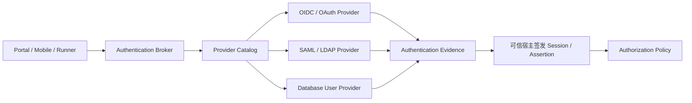

# 企业身份与种子访问

> 状态：企业 Provider、Broker 会话、授权绑定与 Seed 交接可信链已实施｜最后更新：2026-07-23
>
> 本文是 VastPlan 企业身份边界、Provider 目录、Seed Access 和交接恢复流程的单一真相源。认证交互 wire 见《[登录与认证协议](登录与认证协议.md)》，授权见《[在线角色与权限治理](在线角色与权限治理.md)》，决策见 [ADR-0109](../decisions/ADR-0109-种子访问与企业身份Provider分离.md)。

## 1. 产品边界

VastPlan 本身没有普通用户系统。企业人员、服务账号、组织、用户生命周期和认证因子由企业选定的身份 Provider 插件拥有。平台只把 Provider 证明的稳定主体转换为自己的短时 Session，再由独立 Authorization Policy 决定主体可以做什么。



内核拥有可信边界，不拥有用户领域：

- 验证短时 Assertion、签发/验证各端 Session 或执行租约；
- 保护 Credential Material Lease，限制插件获得秘密的目的和期限；
- 依据签名 Manifest、发布者策略和运行驱动隔离 Provider；
- 传递稳定 subject identity，但不解释企业 Group/Role 为平台权限。

Portal Host 不再内置 OIDC client 或 claim-to-role 映射。它只调用 `foundation.security.authentication.broker`，本地验证 Broker Ed25519 Assertion 后回到 leader-routed Broker 原子消费，再调用 `foundation.security.authorization-session` 把稳定主体映射到签名 Policy Snapshot 中的内部权限。OIDC、数据库、SAML/LDAP 等实现因此可以替换而不改变 Portal Session 边界。

## 2. Provider 三份对象

一个认证实现分为三份，避免“安装插件即获得登录权”或“改配置即在线生效”。

| 对象 | 内容 | 是否可变 |
|---|---|---|
| Manifest Contribution | 实现支持的协议、用途、Method、subject namespace、能力依赖 | 随签名制品固定 |
| Provider Profile | 被运维批准的实例、配置文档精确引用和公开能力投影 | revision 不可变 |
| Provider Lifecycle | 验证/测试/批准/发布状态及运行就绪 | 状态机更新 |

`Provider Catalog` 只收录 Published Profile 的安全投影，并按 `tenantId + portalId + methodId` 唯一解析 Provider。Catalog 不保存 endpoint、密码、client secret、token 或用户列表；Provider 的非敏感配置在插件配置文档，敏感输入在 Credential Custodian 中，运行时只通过 Material Lease 获取。

同一 Portal 可以允许多个 Provider，但同一 Method ID 只能由一个 Provider 接管。若两个企业 IdP 都需要显示，必须使用不同 Method ID，例如 `corporate-sso` 和 `partner-sso`。

同一 Provider 实现可以承载多个配置实例。Broker 先按 Catalog 选定不可变 Profile，再在内部 `begin` 请求中覆盖注入 `providerProfileId`；浏览器不能靠自报 Profile 改变选择。Provider 按 Profile 读取对应配置引用，后续 transaction 始终锁定该实例。

## 3. 生命周期与依赖

管理生命周期与运行就绪分离：

```text
Draft -> Validated -> Tested -> Approved -> Published -> Retired
                     ^            |            |
                     +------------+------------+

Readiness: Unknown | Blocked | Ready | Degraded | Failed
```

- Validate 只验证配置形状、Manifest/Provider 契约和秘密引用存在性；
- Connectivity Test 验证 DNS/TLS/issuer metadata/数据库连接等外部依赖；
- Authentication Test 必须完成一次真实但隔离的认证流程，不建立平台管理 Session；
- Approved 表示运维确认信任与隔离策略；Published 才能进入 Catalog；
- runtime 依赖不满足时进入 Blocked，恢复后重新 Ready，不倒退批准状态。

Provider Contribution 的 `requiredCapabilities` 是面向管理界面的安全投影，必须是签名 Manifest `runtime.requires` 的子集。数据库用户 Provider 至少依赖 `database.provider` 和自身 Schema readiness；OIDC Provider通常依赖受限的 `network.egress.identity` 与 Credential Lease，不要求业务数据库。

## 4. Seed Access Plane

Seed Access 只解决“平台还没有企业身份 Provider 时，谁来完成初始配置”和“企业 IdP 全面故障时，如何恢复”。它不是本地用户系统。

Seed Store 必须：

- 不依赖数据库，使用宿主专用目录和系统秘密/KMS 派生密钥；
- 文件使用 0600、拒绝符号链接、跨进程锁、CAS generation、临时文件写入与 fsync 后原子 rename；
- 只保存最小 Seed Operator verifier、恢复策略、已批准 Provider 引用和审计链摘要；
- 不保存普通用户、组织、角色目录或可供业务登录的长期账号；
- 首次凭据只允许单次领取/设置，不存在公开默认密码。

Seed 状态机：

```text
Uninitialized -> SeedActive -> ProviderConfigured -> ProviderVerified
              -> HandoffReady -> EnterpriseActive
EnterpriseActive -> RecoveryLease -> EnterpriseActive
```

从 `HandoffReady` 到 `EnterpriseActive` 必须在一个 CAS 事务中验证：外部 Provider 真实登录成功、`providerProfileId + issuer + subject` 稳定、内部授权绑定与 Policy Snapshot 已发布、普通 Session 已签发、恢复通道已配置。成功后临时管理员立即失效。

Recovery 只能由本机运维动作或等价硬件/平台证明开启，签发短时单用途租约并完整审计；不能由公网登录页自行打开。

## 5. 插件与语言边界

| 能力 | 推荐语言/运行形态 | 原因 |
|---|---|---|
| Broker、Catalog、Seed Authority、File Store | Go；第一方可信共享 Runtime | 小依赖、确定状态机、现有 CAS/Material Lease 复用 |
| OIDC/OAuth Provider | Node.js；网络受限共享 identity Runtime 或独立进程 | 协议与供应商 SDK 生态强、热升级友好 |
| SAML/LDAP Provider | 按成熟库在 Java/Node/Go 中选择 | 协议互操作优先于语言统一 |
| Database User Provider | 按目标驱动生态选择 Go/Java/Node | 连接池与驱动成熟度优先，数据库只是可选 Provider |
| 第三方 Provider | 任意受支持语言；默认独立隔离 | 不可信代码不得进入可信共享 Runtime |

同一语言的多个第一方 Provider 默认进入该服务的一个共享 Runtime 进程；只有隔离策略、资源配额或显式配置要求时才使用独立进程。进程数量策略不改变 Provider Catalog 和认证协议。

## 6. 管理面

平台管理中心使用统一 Provider Workbench，而不是每个 Provider 自带一套管理页面：

1. 从签名制品目录选择 Provider 类型；
2. 按插件 Configuration Schema 渲染非敏感字段和托管凭证输入；
3. 保存 Draft Profile，执行 Validate/Connectivity/Authentication Test；
4. 由具备精确权限的运维人员批准和发布；
5. 绑定到 tenant/Portal/Method，预览新 Access Generation；
6. 通过原子交接启用企业身份。

Provider 可以贡献协议逻辑和配置 Schema，不能贡献未认证任意 UI、直接写 Catalog、签发平台角色或绕过 Workbench 操作权限。系统管理权限继续来自 Manifest 权限目录；Seed Operator 只有安装/恢复所需的最小固定动作。

## 7. 实施清单

| 阶段 | 内容 | 状态 |
|---|---|---|
| E0 | ADR、Provider Profile/Catalog、生命周期、唯一路由与依赖契约 | 已实施 |
| E1 | Manifest `authenticationProviders` 与 `authentication.provider` 架构门禁 | 已实施 |
| E2 | Seed Authority、一次性初始化、CAS File Store、企业交接与恢复租约 | 已实施 |
| E3 | Provider Catalog Store、Broker 唯一路由与 leader-owned transaction 边界 | 已实施 |
| E4 | Provider 管理状态机/CAS Store、Workbench、Provider 与 Access Catalog 同代原子发布 | 已实施 |
| E5 | OIDC Provider（public PKCE 与 confidential Material Lease）、Broker Assertion 一次性消费、Node Session、Authorization Session 与 Seed 交接 | 已实施 |
| E6 | 通用关系数据库用户 Provider、无数据库隔离、Provider 故障、Assertion 重放与 Recovery 测试 | 已实施 |
| E7 | 邮箱/短信 OTP Provider、通用 Delivery Port、HTTPS Webhook Delivery 与 Material Lease | 已实施 |
