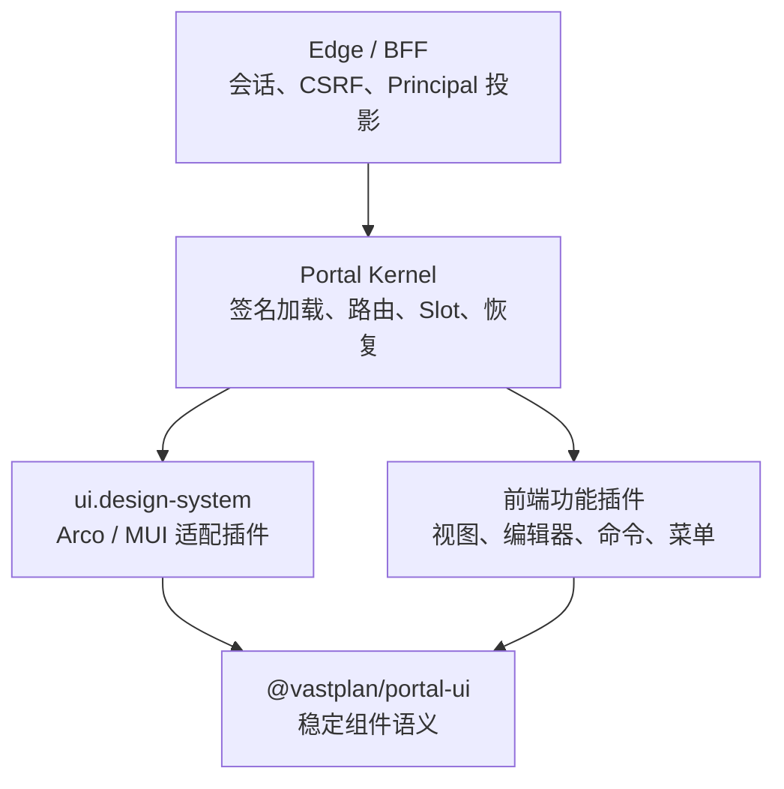

# 前端门户内核

> 状态：实施设计 v1｜最后更新：2026-07-18
>
> 本文是 Frontend Portal Kernel、设计系统插件、在线组合与浏览器安全边界的单一真相源。取舍见 [ADR-0052](../decisions/ADR-0052-前端门户内核与多UI设计系统插件.md)；统一插件清单与扩展点见《[插件契约与协议](插件契约与协议.md)》。

## 1. 目标与边界

门户是“内核 + 已选设计系统 + 已选前端插件 + 已发布配置”的浏览器组合单元。它不绑定任何领域页面，也不把 Arco/MUI 等 UI 实现带入内核。

内核负责：制品/远程模块可信加载、单例设计系统选择、Portal 路由、Slot 目录、权限可见性过滤、插件生命周期、错误隔离、最小恢复界面与 BFF 客户端。

设计系统插件负责：主题 token、全局布局、导航菜单、弹窗/抽屉/通知、动态表单、数据展示、空态/错误态和图标。

功能插件负责：以 UI 契约组合自己的视图、命令、编辑器和表单 Schema；不得控制顶级 HTML、全局样式、会话令牌或跨插件内部调用。

## 2. 设计系统与多框架

`ui.design-system` 是 Frontend 的 `single` 扩展点。Portal 发布配置中的 `designSystem` 精确指定插件 ID、制品版本和 `uiContract` 兼容范围；装配前必须验证该贡献存在、属于已签名第一方制品且满足范围。一个 Portal 同时只能有一个激活设计系统。

首个设计系统插件是 `com.vastplan.foundation.frontend.design-system.arco`，以 Arco Design 实现。后续设计系统（例如 MUI）实现相同 `@vastplan/portal-ui` 契约即可加入新的 Portal。框架切换是 Portal revision 升级：候选插件与功能插件先在独立 iframe/预加载上下文完成契约检查，成功后切换静态资产版本并刷新；失败则保持最后已发布版本。

所有远程模块共享单例 `react`、`react-dom` 和 `@vastplan/portal-ui`。设计系统 CSS 必须在 Portal 根容器内作用域化；功能插件不得携带全局 reset 或框架私有样式。UI 契约的 major version 不兼容即拒绝装配。

## 3. 稳定 UI 契约

`@vastplan/portal-ui` 是 TypeScript SDK，暴露框架无关的 React 组件、hooks 和 Schema。首期必须包含：

| 领域 | 契约能力 |
|---|---|
| 布局 | `PortalShell`、页头、侧栏、主区、检查器、状态栏、响应式断点、Page/Panel/Stack/Grid |
| 导航 | `Menu`、Breadcrumb、Tabs、CommandPalette，以及受权限过滤的 Slot 菜单模型 |
| Overlay | `DialogService`、Drawer、Confirm、Toast/Notification、Busy 状态；由宿主集中维护 z-index、焦点和 ESC 行为 |
| 表单 | `FormRenderer(schema, value, context)`、字段注册表、同步/异步校验、条件显示、只读/禁用、错误摘要与提交状态 |
| 数据与反馈 | Table、FilterBar、Pagination、Descriptions、Status、Empty、ErrorState、Skeleton/Spinner |
| 主题 | 语义 token、深浅色模式、图标注册和无障碍文本；插件不得读取框架私有 token |

动态表单采用语义化 `FormSchema`，字段类型至少有 `text`、`textarea`、`number`、`boolean`、`select`、`multiSelect`、`date`、`object`、`array`、`secretRef`。Schema 描述 `key`、标题、帮助、默认值、校验、依赖条件、可见性和只读规则，不出现 `ArcoInput`、`MuiTextField` 等框架名称。`secretRef` 只能提交凭证引用，不能回填或显示明文。

## 4. Portal 组合、身份与发布

Portal 期望态新增 `kind: portal`，包含 `route`、`domains`、`audience`、`branding`、`designSystem`、前端插件精确 refs 和非敏感 `config`。同一路径/域名在一个租户内唯一；至少包含一个设计系统插件；功能插件必须满足其声明的 `uiContract`。

浏览器只访问 Edge/BFF。BFF 使用 HttpOnly Secure SameSite 会话 Cookie、CSRF token 和短期请求关联 ID；向内部 capability 调用投影经过验证的 Principal、租户、角色和审计上下文。首期定义身份提供方接口，不实现用户目录或 OIDC；缺少有效身份一律拒绝。

Edge/BFF 的 Portal 控制面固定在 `/v1`：`GET /csrf` 签发短期 SameSite=Strict 双提交 CSRF token；`GET|POST /portal-drafts` 读取或创建草稿；`POST /portal-drafts/{revision}/submit|approve|publish|rollback` 执行状态流转；`GET /portal-drafts/{revision}/audit` 查询审计。除 `GET`/`HEAD` 外的请求必须同时携带 Cookie 与 `X-VastPlan-CSRF`，并以常量时间比较。请求 JSON 不含 tenant 或 Principal，二者只能由会话验证器投影。BFF 只依赖 `shared/go/portalapi` 契约，组合治理逻辑由 `com.vastplan.platform.configuration.portal-composer` 插件实现。

Portal Catalog 也是 Edge 的窄端口：组合根向它注入制品来源和内核验签适配器；每个候选都必须先经过内容、证明、发布者与清单绑定验证，才会读取 `frontend` engine 与 `ui.design-system` descriptor。Edge 不直接依赖 Node Agent 或仓库实现，防止浏览器入口反向耦合部署执行层；生产组合根必须注入签名验证器，本地开发可显式注入只做内容绑定校验的实现。

在线组合 API 的资源为版本化 Draft：创建或编辑产生 draft revision；提交后进行制品、依赖、路由冲突、UI 契约、权限和 Schema 校验；不同 Principal 审批后才可发布。发布记录旧版本，可显式回滚。`system` break-glass 发布必须携带原因、强制审计并产生高优先级事件。

## 5. 首个参考插件与验收

首个功能插件为“系统配置与插件组合管理”参考插件。它通过菜单和受限路由提供：Portal/服务组合列表、草稿编辑、差异预览、动态表单校验、提交审批、发布、回滚和组合状态查看；不显示凭证明文或内部服务凭据。

Portal v1 的验收至少覆盖：

1. 已签名 Arco 设计系统与参考插件能在 Portal 中加载并注册 Slot、菜单、弹窗和动态表单；
2. 换成不兼容 UI contract、未签名制品、第二个设计系统或全局 CSS 的插件均被拒绝；
3. 设计系统故障时进入内核恢复页并可回退到最后已发布版本；
4. 提交人不能审批自己的草稿；发布、回滚和 break-glass 均产生审计记录；
5. 无会话、CSRF 缺失、跨租户路由或前端传入伪造 Principal 均 fail-closed；
6. Arco 与第二个适配器在独立 Portal 上通过相同 UI SDK 契约测试。
