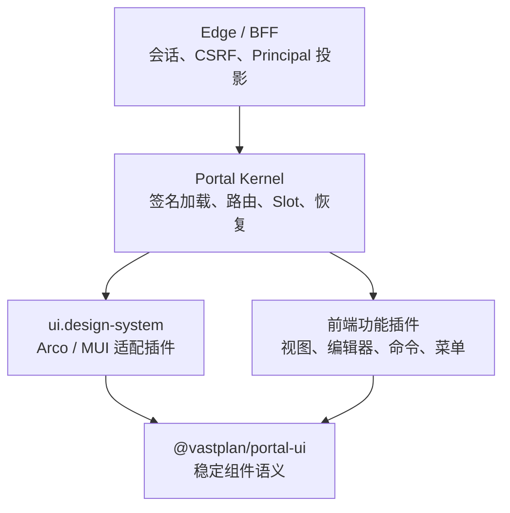

# 前端门户内核

> 状态：实施设计 v1｜最后更新：2026-07-18
>
> 本文是 Frontend Portal Kernel、设计系统插件、在线组合与浏览器安全边界的单一真相源。取舍见 [ADR-0052](../decisions/ADR-0052-前端门户内核与多UI设计系统插件.md)；插件分级与双输入组合见 [ADR-0057](../decisions/ADR-0057-插件分级管理与双输入组合解析.md) 和 [ADR-0059](../decisions/ADR-0059-Frontend双输入服务端权威解析.md)；Portal 与 Mobile/Runner 的跨端体验协作见《[跨端体验与交互契约](跨端体验与交互契约.md)》。

## 1. 目标与边界

门户是“Frontend Platform Profile + Application Composition”的浏览器解析产物。平台管理员固定 Portal Shell、单一设计系统与安全加载基线，应用配置人员只选择功能插件和业务页面。它不绑定任何领域页面，也不把 Arco/MUI 等 UI 实现带入内核。

内核负责：制品/远程模块可信加载、单例设计系统选择、Portal 路由、Slot 目录、权限可见性过滤、插件生命周期、错误隔离、最小恢复界面与 BFF 客户端。

设计系统插件负责：主题 token、全局布局、导航菜单、弹窗/抽屉/通知、动态表单、数据展示、空态/错误态和图标。

功能插件负责：以 UI 契约组合自己的视图、命令、编辑器和表单 Schema；不得控制顶级 HTML、全局样式、会话令牌或跨插件内部调用。

## 2. 设计系统与多框架

`ui.design-system` 是 Frontend 的 `single` 扩展点。Portal Platform Profile 精确固定插件 ID、制品版本和 `uiContract` 兼容范围；装配前必须验证该贡献存在、属于已签名第一方制品且满足范围。Application Composition 不包含 `designSystem`，一个 Portal 同时只能有一个激活设计系统。

首个设计系统插件是 `com.vastplan.foundation.frontend.design-system.arco`，以 Arco Design 实现。后续设计系统（例如 MUI）实现相同 `@vastplan/portal-ui` 契约即可加入新的 Portal。框架切换是 Portal revision 升级：候选插件与功能插件先在独立 iframe/预加载上下文完成契约检查，成功后切换静态资产版本并刷新；失败则保持最后已发布版本。

所有远程模块共享单例 `react`、`react-dom` 和 `@vastplan/portal-ui`。设计系统 CSS 必须在 Portal 根容器内作用域化；功能插件不得携带全局 reset 或框架私有样式。UI 契约的 major version 不兼容即拒绝装配。

## 3. 稳定 UI 契约

`@vastplan/portal-ui` 是 TypeScript SDK，暴露框架无关的 React 组件、hooks 和 Schema。首期必须包含：

| 领域 | 契约能力 |
|---|---|
| 布局 | `PortalShell`、页头、侧栏、主区、检查器、状态栏、响应式断点、Page/Panel/Stack/Grid |
| 导航 | `Menu`、Breadcrumb、Tabs、CommandPalette，以及受权限过滤的 Slot 菜单模型 |
| Overlay | `DialogService`、Drawer、Confirm、Toast/Notification、Busy 状态；由宿主集中维护 z-index、焦点和 ESC 行为 |
| 表单 | `FormRenderer(schema, value, context)`、字段注册表、同步/异步校验、条件显示、只读/禁用、错误摘要与提交状态 |
| 数据与反馈 | Table、FilterBar、Pagination、Descriptions、Status、Empty、ErrorState、Skeleton/Spinner |
| 主题 | 语义 token、深浅色模式、图标注册和无障碍文本；插件不得读取框架私有 token |

动态表单采用语义化 `FormSchema`，字段类型至少有 `text`、`textarea`、`number`、`boolean`、`select`、`multiSelect`、`date`、`object`、`array`、`secretRef`。Schema 描述 `key`、标题、帮助、默认值、校验、依赖条件、可见性和只读规则，不出现 `ArcoInput`、`MuiTextField` 等框架名称。`secretRef` 只能提交凭证引用，不能回填或显示明文。

## 4. Portal 组合、身份与发布

Portal Platform Profile 包含设计系统、安全加载与恢复基线；Portal Application Composition 包含 `route`、`domains`、`audience`、`branding`、功能插件精确 refs 和非敏感 `config`。Resolver 生成已发布 Portal revision。同一路径/域名在一个租户内唯一；平台基线必须恰有一个设计系统插件；功能插件必须满足其声明的 `uiContract`。

机器契约位于 `contracts/schemas/composition/frontend/v1`。普通 Draft API 只接收 Application Composition；Portal Edge 以 `-portal-platform-profile` 绑定平台输入，经可信 `kernel.config.get` 向 Composer 注入。Composer 合并后生成带两份输入摘要和逐插件来源锁的 `PortalSpec`，内核 Catalog 对精确制品和来源执行二次校验；浏览器 Portal Runtime 只消费该锁定结果，不接收或合并原始双输入。

浏览器只访问 Edge/BFF。BFF 使用 HttpOnly Secure SameSite 会话 Cookie、CSRF token 和短期请求关联 ID；向内部 capability 调用投影经过验证的 Principal、租户、角色和审计上下文。首期定义身份提供方接口，不实现用户目录或 OIDC；缺少有效身份一律拒绝。

Edge/BFF 的 Portal 控制面固定在 `/v1`：`GET /csrf` 签发短期 SameSite=Strict 双提交 CSRF token；`GET|POST /portal-drafts` 读取或创建草稿；`POST /portal-drafts/{revision}/submit|approve|publish|rollback` 执行状态流转；`GET /portal-drafts/{revision}/audit` 查询审计。除 `GET`/`HEAD` 外的请求必须同时携带 Cookie 与 `X-VastPlan-CSRF`，并以常量时间比较。请求 JSON 不含 tenant 或 Principal，二者只能由会话验证器投影。BFF 只依赖 `core/shared/go/portalapi` 契约，组合治理逻辑由 `com.vastplan.platform.configuration.portal-composer` 插件实现。

交互呈现 API 固定为 `GET /interactions`、`GET /interactions/{id}`、`POST /interactions/{id}/present` 与 `POST /interactions/{id}/respond`。Edge 固定把呈现面注入为 `frontend`，不接受浏览器传入 tenant、Principal、来源 capability、`surface` 或取消请求；非安全读取以外的操作同样经过 CSRF。`@vastplan/portal-ui` 的 `PortalInteractionClient` 只是该受控端点的 Web Adapter，Portal 的设计系统用它取得 `InteractionRecord` 后再以自己的 `FormRenderer`/确认组件渲染语义契约。Broker 与独立的交互访问策略负责 Backend 侧授权与终态裁决，详情见《[跨端体验与交互契约](跨端体验与交互契约.md)》和 ADR-0055。

Portal Catalog 也是 Edge 的窄端口：组合根向它注入制品来源和内核验签适配器；每个候选都必须先经过内容、证明、发布者与清单绑定验证，才会读取 `frontend` engine 与 `ui.design-system` descriptor。Edge 不直接依赖 Node Agent 或仓库实现，防止浏览器入口反向耦合部署执行层；生产组合根必须注入签名验证器，本地开发可显式注入只做内容绑定校验的实现。

Edge 调用 Composer 的能力名固定为 `tool.package/platform.portal-composer`，操作为 `createDraft`、`list`、`submit`、`approve`、`publish`、`rollback`、`audit`。Edge 使用 `CapabilityClient` 端口；组合根再把它适配到协议总线或集群寻址。Composer 只从宿主 `CallContext` 投影 Principal/tenant，拒绝请求 JSON 中的身份字段。

Composer 后端作为 `leader + leader-owned + cluster` 基础服务发布该 capability。其状态文件只经已声明的 `kernel.config.get` 取得，制品校验只经已声明的 `kernel.portal.catalog.validate` 回调可信内核目录；二者都不向插件暴露仓库凭据、验签密钥或未验证制品。这样 Edge、Composer 和制品信任层只通过稳定 capability 契约相连，且不会形成内核对具体插件的编译期依赖。

Edge 由 `IdentityProvider` 接入企业 OIDC/SSO；为受控部署提供可替换的文件会话实现：文件只保存 browser token 的 SHA-256 摘要、主体/租户/角色与过期时间，权限必须为仅属主可读写，并在每次请求重读以便即时撤销。它拒绝重复同名 Cookie 和过期 token。无论身份实现为何种协议，Edge 都将它投影为 `portalapi.Principal`，再通过 `ProtocolBusCapabilityClient` 构造协议 `CallContext`，由内核的权限与调用环保护执行 Composer capability。

生产入口为 `backend portal-edge`。它只接受仓库中的 Composer、Interaction Broker 及各自访问策略的 `id/version/channel` 引用：读取未信任 Envelope 后由内核验证器校验证明、内容和清单绑定，再经内容寻址安装器取得入口与冻结的 runtime contract，最后按该 contract 启动插件。入口必须配置 TLS 证书/私钥、session 文件、Composer/Broker 状态文件和发布者 trust store；无签名仅可由显式 `--allow-unsigned-local` 用于本地开发，且不能同时配置 trust store。启动期间注册 `kernel.portal.catalog.validate`，再把经验证 session、可信 Catalog 与协议总线组成 BFF；不接受裸二进制路径或裸 Manifest。

在线组合 API 的普通 Draft 只编辑 Application Composition；Platform Profile 使用独立的平台管理员权限和发布流程。应用 Draft 提交后进行制品分类、依赖、路由冲突、UI 契约、权限和 Schema 校验，再与环境绑定的 Platform Profile 解析；不同 Principal 审批后才可发布。发布保留旧版本；回滚只能选择同一 Portal 的非当前应用历史 revision，并针对当前平台基线重新解析，不能借回滚替换设计系统或安全策略。`system` break-glass 也不能把 foundation/platform 插件塞进应用列表。

当前实现已完成 Frontend v1 双输入 Schema、服务端 Resolver、输入 digest/origin 锁、Catalog 分类复核、发布/回滚重新解析，以及 Portal Runtime 的解析锁复核。Platform Profile 在单个 Composer 进程内不可热切换；平台升级通过候选实例预检和进程切换完成。

## 5. 首个参考插件与验收

首个功能插件为“系统配置与插件组合管理”参考插件。它通过菜单和受限路由提供：Portal/服务组合列表、草稿编辑、差异预览、动态表单校验、提交审批、发布、回滚和组合状态查看；不显示凭证明文或内部服务凭据。

Portal v1 的验收至少覆盖：

1. 已签名 Arco Platform Profile 与参考应用插件能在 Portal 中加载并注册 Slot、菜单、弹窗和动态表单；
2. 换成不兼容 UI contract、未签名制品、第二个设计系统或全局 CSS 的插件均被拒绝；
3. 设计系统故障时进入内核恢复页并可回退到最后已发布版本；
4. 提交人不能审批自己的草稿；发布、回滚和 break-glass 均产生审计记录；
5. 无会话、CSRF 缺失、跨租户路由或前端传入伪造 Principal 均 fail-closed；
6. Arco 与第二个适配器在独立 Portal 上通过相同 UI SDK 契约测试。
7. `backend portal-edge` 的真实进程 E2E 必须从制品仓库安装并启动策略与 Composer、可信获取并校验设计系统，经过 TLS、会话、CSRF、角色授权与受限宿主回调，验证草稿、职责分离审批、发布和历史版本回滚。
8. 普通 Portal Draft 引用 foundation/platform 插件、直接指定第二设计系统或覆盖平台基线时必须在服务端 fail-closed。
