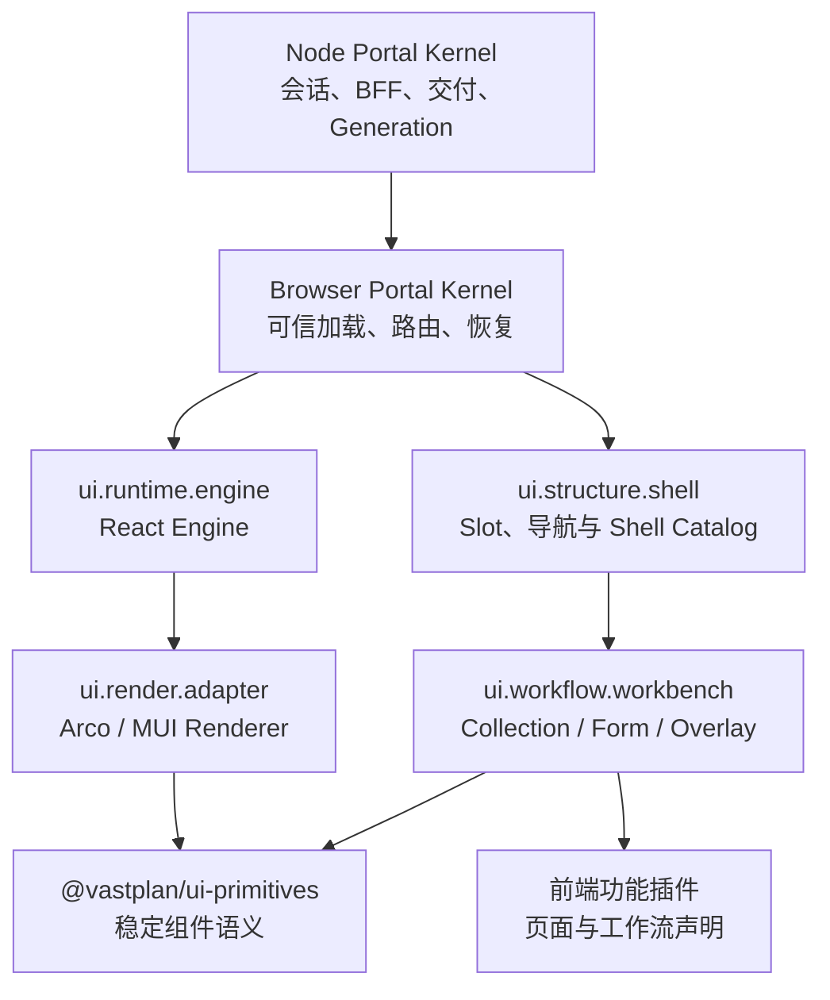

# 前端门户内核

> 状态：v6 Node Portal Kernel 已实现｜最后更新：2026-07-22
>
> 本文是 Frontend Portal Kernel、UI 四个基础能力、在线组合与浏览器安全边界的单一真相源。Node 宿主、Runtime Engine、可信模块图与多端权限决策分别见 [ADR-0103](../decisions/ADR-0103-Node-Portal-Kernel渐进替代Go-Edge.md)、[ADR-0104](../decisions/ADR-0104-Frontend-Runtime-Engine与React单实现.md)、[ADR-0105](../decisions/ADR-0105-可信多文件前端模块图与双端Generation.md) 与 [ADR-0106](../decisions/ADR-0106-多端统一身份授权与Runner执行租约.md)；视觉规范见《[Portal 设计系统](../design/DESIGN.md)》，组合模式见《[UI 工作台组合框架](UI工作台组合框架.md)》，跨端协作见《[跨端体验与交互契约](跨端体验与交互契约.md)》。

> v6 把前端引擎从渲染适配器中分离：Profile 必须精确固定 `ui.runtime.engine`、`ui.render.adapter`、`ui.structure.shell`、`ui.workflow.workbench` 四个语义单例。当前唯一 Runtime Engine family 是 React；Vue 仅保留未来契约空间，不发布空实现，也不向用户提供无意义的引擎切换。

## 1. 目标与边界

门户是“Frontend Platform Profile + Application Composition”的浏览器解析产物。平台管理员固定 Portal Shell、单一设计系统与安全加载基线，应用配置人员只选择功能插件和业务页面。它不绑定任何领域页面，也不把 Arco/MUI 等 UI 实现带入内核。



内核负责：可信 Runtime 装载、四个平台基础插件（Runtime Engine、渲染适配、Shell、Workbench）的单例选择、Portal 路由、权限可见性过滤、插件生命周期、错误隔离、最小恢复界面与 BFF 客户端。Node Portal Kernel 已接管 HTTP、OIDC 会话、BFF、静态宿主、模块交付与 Generation 协调；制品信任、权限裁决、集群寻址和插件治理仍由 Go Backend 通过窄端口提供。

渲染适配器插件负责：Renderer 目录、主题 token、主题模板目录、语义组件、导航控件、弹窗/抽屉/通知、动态表单、数据展示、空态/错误态和图标。Profile 以 `defaultRenderer/allowedRenderers/userSelectable/rendererOptions` 管理框架选择；每个 Renderer 的 `themeTemplate` 仍是 `light`/`dark`/`high-contrast` 等语义方案。Profile 不得传 CSS、颜色值、URL 或框架私有对象。Workbench 负责集合、表单与 Overlay 的展示档位；Shell Catalog 负责 Slot/导航语义和精确 Library 目录，具体 Library 只提供 Chrome 与布局计划。

功能插件负责：以 `@vastplan/workbench-sdk` 声明 Collection、Form、Overlay、动作和导航语义，不得从基础组件自行拼装页面，也不得控制 Page Shell、顶级 HTML、全局样式、会话令牌或跨插件内部调用。只有 Foundation Frontend 插件可以直接使用 React、Renderer 框架和 `@vastplan/ui-primitives` 视觉组件；构建器对此执行强制门禁。暂时仍位于 `ui-primitives` 的 `PortalControlClient` 及其纯数据类型是唯一非视觉例外。

## 2. 设计系统与多框架

`ui.runtime.engine`、`ui.render.adapter`、`ui.structure.shell` 与 `ui.workflow.workbench` 是 Frontend 的四个独立 `single` 扩展点。Profile 精确固定四个可信插件；Application Composition 不包含这些选择。Engine 提供框架生命周期、客户端挂载、Generation 与可选 SSR 能力；Adapter 提供同一 Engine family 下的 Arco/MUI Renderer。四者的 `engineFamily` 必须一致。功能插件不声明 React、Arco 或 MUI 依赖，只声明 Workbench 语义。

Renderer 与 Shell Library 的默认值、允许范围和用户权限属于 Profile。服务端 PortalPreference 是跨设备真源，localStorage 只作缓存。Shell Library 在同 Renderer family 与兼容 UI Contract 下通过候选 Portal Generation 无刷新切换；Renderer family 使用 `pending/active/lastKnownGood` Host Epoch 受控刷新，绝不在同一 React/DOM 树混用两个框架。签名子模块按需传输必须由 RuntimeSpec 锁定摘要和来源，未锁定模块不下载、不执行。

### 2.1 多语种与框架桥接

Portal Platform Profile 以 `localization.defaultLocale/supportedLocales` 治理可用语言，Resolver 对未声明的旧 Profile 物化 `zh-CN`、`en-US` 默认策略。浏览器内核按“tenant/portal 用户偏好 → 浏览器语言 → 平台默认”解析 BCP-47 locale，并同步 `html.lang/dir`；语言切换只更新 Locale Runtime，不触发插件重新装载或 Generation 切换。

插件在已验签的前端模块图中导出自己的 locale message map。页面与导航使用 `FrontendPluginContext.i18n.message` 产生宿主绑定命名空间的延迟文本，React 视图使用 `usePortalI18n/usePortalMessages`；日期、数字、列表和相对时间只能通过 Portal Intl formatter 输出。Arco 适配器把 locale 映射到 `ConfigProvider`，MUI 适配器把 locale 与 direction 合入 Theme，RJSF/AJV 在表单适配层处理 Schema 展示副本和错误文案。未来 Engine family 必须实现相同语义桥接，不能要求功能插件改用框架专用 i18n API。

Portal 运行集合中的每个 UI 插件必须自带语言资源；组装阶段拒绝缺失资源、缺失默认语言、非法或规范化后重复的 locale。第一方 UI 插件至少提供 `zh-CN` 与 `en-US`，内核不会代管功能插件文案。某个非默认语言消息暂缺时可以按统一规则回退，但插件不能完全省略语言资源。

动态表单的验证 Schema 保持 Draft 7 原文。`FormSchema.localization` 和 `uiLocalization` 分别以 JSON Pointer 覆盖渲染副本中的 Schema 标题和 `uiSchema` 帮助文案，不修改校验输入。语言包只允许纯文本模板与有界值插值，禁止 HTML、组件和脚本；宿主限制 locale 数量、消息大小和插件资源总量。

当前 React Engine 的远程模块共享单例 `react`、`react-dom`、`@vastplan/ui-primitives` 和 `@vastplan/ui-contract`，由 Portal Shell 的 import map 提供。Portal Kernel 挂载在独立 Shadow DOM；设计系统 CSS 作为模块图中的已验签资源交付，文档根选择器及 `body[theme]` 等主题宿主选择器映射到 `:host`，普通选择器由 Shadow DOM 隔离。Arco/MUI Adapter 必须按组件入口构建，禁止整包框架和完整主题 CSS。功能插件不得携带全局 reset 或框架私有样式。Runtime Engine、Renderer、Shell、Workbench 与 UI 契约的 major version 不兼容即拒绝装配。

标准组合插件 `cn.vastplan.foundation.frontend.structure.composition.standard` 固定 `shell.header.start|center|end`、`shell.navigation.start|center|end`、`page.header.*`、`page.body.*`、`page.aside` 和 `shell.footer`，并负责按作用域与 order 归并内容。全局 `shell.*` 与活动页面 `page.*` 是两份独立模型；只有 Platform Profile 插件能登记全局贡献。导航由组合层规范为 `zone → root group → child group? → page`：zone 不计入可见深度，页面必须为叶子，分组 ID 在 Profile 内全局唯一。组合层输出唯一 `activeNavigationPath`；Go Schema、Catalog、Composer 和浏览器共同拒绝循环、跨 zone、未知父级和超深结构。

标准布局插件 `cn.vastplan.foundation.frontend.structure.layout.standard` 使用 64px 图标主轨和右侧常驻 240px 导航栏；根直属页面优先显示，子组使用可多开的折叠章节。新布局插件 `cn.vastplan.foundation.frontend.structure.layout.top-navigation` 在 64px 顶栏显示根组，并用一个分组式 Mega Popover 承载二、三级页面；`primary/secondary` 位于中部，`settings` 位于右侧，溢出根组进入“更多”。两者只消费相同组合模型，不创建 Slot 或猜测业务结构。Page Header 位于 Page Body 滚动容器之外；`<768px` 两种布局都使用设计系统 Drawer。具体尺寸、token、键盘与无障碍规则以《[Portal 设计系统](../design/DESIGN.md)》为准。

## 3. 稳定 UI 契约

`@vastplan/ui-primitives` 是 TypeScript SDK，暴露框架无关的 React 组件、hooks 和 Schema。首期必须包含：

| 领域 | 契约能力 |
|---|---|
| 布局 | `PortalShell`、页头、侧栏、主区、检查器、状态栏、响应式断点、Page/Panel/Stack/Grid |
| 导航 | `Menu`、Breadcrumb、Tabs、CommandPalette，以及受权限过滤的 Slot 菜单模型 |
| Overlay | 受控 `Popover`、Dialog、Drawer、Confirm、Toast/Notification、Busy；适配器维护定位、碰撞、z-index、焦点和 ESC |
| 表单 | `FormRenderer(schema, value, context)`、JSON Schema Draft 7、对象/数组/组合/条件规则、同步/可取消异步校验、只读/禁用、错误摘要与提交状态 |
| 数据与反馈 | Table、FilterBar、Pagination、Descriptions、Status、Empty、ErrorState、Skeleton/Spinner |
| 主题 | 语义 token、深浅色模式、图标注册和无障碍文本；插件不得读取框架私有 token |

动态表单的 `FormSchema` 是 `id + schema + uiSchema?` 薄信封。`schema` 固定为 JSON Schema Draft 7，承载类型、标题、默认值、对象/数组、必填、数值/长度/格式、枚举/组合和 `if/then/else` 等数据规则；可选 `uiSchema` 只承载 widget、顺序、帮助与布局提示，不得降低数据约束。二者都只能包含 JSON 数据，不出现 `ArcoInput`、`MuiTextField`、函数或网络地址。

当前 `@vastplan/ui-primitives` 已实现上表的语义组件面。Arco 插件在内部集成 RJSF 6 与 CSP 安全的 Draft 7 解释式校验器，并提供完整 Arco widgets、字段/对象/数组模板、数组操作与错误展示；RJSF 类型不进入公共 SDK。同步校验和默认值遵循 JSON Schema，嵌套错误路径使用 `object.field` 与 `array[0].field`。异步校验通过 FormRenderer 参数注入，默认去抖并使用 AbortSignal 取消过期请求。凭证字段必须同时声明 `format: vastplan-credential-ref` 和 `writeOnly: true`，`ui:widget: secretRef` 只控制呈现，不能作为安全依据。

V1 禁止远程 `$ref` 并限制 Schema 大小、深度与节点数；后端在接受交互请求时编译内嵌 Schema，浏览器解释器不提供网络 loader，也不需要 `unsafe-eval`。Mobile 与其他 Renderer 消费同一数据 Schema，可忽略 Web `uiSchema` 并采用自己的布局；升级 JSON Schema 方言必须显式版本化。

## 4. Portal 组合、身份与发布

Portal Platform Profile 包含 Runtime Engine、Render Adapter、Shell Catalog/允许 Library、Workbench、安全加载与恢复基线；Portal Application Composition 包含 `route`、`domains`、`audience`、`branding`、功能插件精确 refs 和非敏感 `config`；PortalBinding 固定管理服务与 operation grants。三者分别形成可审批、可发布的不可变 revision，但 Published 只表示可被引用。只有 `PortalActivation` 精确锁定三份 `id + revision + digest` 与物化快照并成为线上事实。同一路径/域名在一个租户内唯一；平台基线必须恰有四个语义基础单例，Foundation 子模块只能由其可信 Catalog 引用；功能插件必须满足声明的 `uiContract`。

机器契约位于 `contracts/schemas/composition/frontend/v1`。Application、Profile、Binding 与 Activation 使用强类型分域 API；浏览器不能直接提交 tenant、逻辑服务、routing domain 或最终权限。Composer 在锁外验证并物化候选，随后以治理聚合 CAS 确认三份依赖 revision 与全局不变量未变化，再提交 Activation 与审计。内核 Catalog 对精确制品、来源、当前撤销状态与管理绑定执行二次校验，浏览器 Portal Runtime 只消费 Activation 锁定结果，不接收或合并原始输入。

### 4.1 浏览器可信装载链

Frontend 插件的生产入口由签名插件包内的 `entry.frontend` 指向。发布工具从入口构建封闭模块图，为每个 JavaScript、CSS 与静态资源节点记录相对路径、媒体类型、SHA-256 和依赖边；源码和开发服务器 URL 不能直接发布。完整插件包继续使用统一制品签名与 SHA-256，不建立前端专用信任体系。模块图交付完成前，旧单文件 ESM 只作为迁移兼容输入，不再是目标契约。

认证后的浏览器调用 `GET /v1/portal-runtime?path=<当前路径>`。Node Portal Kernel 选择当前租户、域名和最长匹配路由的已发布激活 revision，再返回唯一启动输入：

```text
RuntimeSpec
├── portal: 带双输入 digest 与逐插件 origin 的 PortalSpec
├── browserGeneration: 浏览器端原子装配代次
└── moduleGraphs[]
    ├── id / version / channel / entry
    ├── nodes[]: path / mediaType / sha256 / dependencies
    ├── urlTemplate: /v1/portal-modules/{revision}/{sha256}/{path}
    └── packageSha256: 已验证插件包摘要
```

Composer 在发布/回滚激活 revision 之前通过 `kernel.portal.catalog.materialize` 请求 Go Backend 的 `portaltrust` 窄能力完成一次制品验证、入口提取、SHA-256 内容寻址、gzip 预压缩和 Runtime 快照提交。快照绑定完整 `PortalSpec` 摘要。物化结果先进入可信中央 origin，各 Node Portal Kernel 从 origin 冷填充到私有 cache，但不得访问插件仓库、重新验签或解包。稳态 runtime 与模块请求只访问本机不可变快照/对象；解析锁不一致即拒绝。模块 URL 不允许浏览器选择版本、channel 或任意包内路径，且只有当前激活 revision 的模块可读。Runtime 响应以 `preload + as=fetch + use-credentials` 提示浏览器预取；Portal Loader 用一致的 `credentials=include` 并行获取全部已锁定模块，使用 immutable browser cache，并以 Web Crypto 复算 `sha256`，完全匹配后才创建 Blob URL 执行。预加载与实际请求的凭证模式不得分叉，否则同一模块会发生无效预取或重复下载。模块自行导出的签名、发布者或 integrity 声明一律不可信，provenance 只能由宿主赋值。

加载后的功能插件只得到宿主创建的窄 `FrontendPluginContext`。宿主绑定真实插件 ID；页面 ID/路径和导航 ID 必须唯一，每页必须填充 `page.body.main`，页面贡献只能指向标准 `page.*` Slot。`addShellContribution` 是单独的全局入口，仅 Platform Profile 来源插件可用；Application 来源调用必须 fail-closed。功能插件声明的页面 `path` 是以 `/` 开头的 Portal 内相对路径，不能硬编码部署路由根；可信 Portal Runtime 将它统一挂载到 `PortalSpec.route` 下，导航、深链接和刷新只使用挂载后的路径，因此同一插件可被不同路由根的 Portal 复用且不会逃出 Portal 归属边界。若当前路径恰好等于 Portal 根且没有根页面，Shell 按 `primary → settings → secondary → 无导航页面` 的稳定顺序选择首个落地页并使用 `replaceState` 规范化 URL；未知深层路径仍保持 not-found，不得被该规则吞掉。设计系统、Shell 组合和布局仍须通过单一贡献、来源与 UI contract 检查，普通模块不能注册第二份基础贡献。

### 4.2 Portal Shell 静态宿主

`pnpm build:frontend`（底层为 `engineering/tools/build-frontend.sh`）输出可部署静态目录，默认位于被 Git 忽略的 `bin/portal`：

```text
bin/portal/
├── index.html                 # import map + CSP nonce 占位符
└── assets/
    ├── portal-kernel.js
    ├── portal.css
    └── vendor/                # React、React DOM、Portal UI、UI contract 单例
```

Node Portal Kernel 必须用显式静态资产目录启动，并在接管流量前验证 index、nonce 占位符、文件类型、数量、总大小和符号链接边界。未知 `/v1/*` 始终返回 404，不能被 SPA fallback 掩盖；普通页面路径返回带每请求随机 nonce 的 shell。CSP 只允许同源脚本、nonce import map 和 Loader 所需的 `blob:` 模块，并禁止 frame ancestor、object、非受控 worker 与跨域连接。迁移封板必须通过 Go/Node 黑盒契约对照，Node 达到等价后删除 Go HTTP 入口；Go 中为 Composer 提供的可信 Catalog/物化窄能力不随 HTTP 入口删除。

浏览器只访问 Node Portal Kernel/BFF。生产 BFF 使用 OIDC Authorization Code + PKCE，通过 discovery/JWKS 校验 Provider、ID Token 签名、issuer、audience、state、nonce、S256 和有效期；tenant/roles 只能由已配置的 claim 映射取得。浏览器不持有 OIDC Access/Refresh Token，只持有 AES-256-GCM 密封的 HttpOnly Secure SameSite 短会话和 CSRF token。向内部 capability 调用固定投影经过验证的 Principal、租户、角色和审计上下文；缺少或篡改身份一律拒绝。文件会话只用于受控开发或可替换部署适配。

Node BFF 的 Portal 控制面固定在 `/v1`：`GET /csrf` 签发短期 SameSite=Strict 双提交 CSRF token；`GET|POST /portal-drafts` 与 `PUT /portal-drafts/{revision}` 管理 Application；`POST /portal-drafts/{revision}/submit|approve|publish` 只推进可引用状态；`GET /portal-governance` 返回 Profile、Application、Binding 与 Activation 聚合；`/portal-governance/profiles`、`/bindings` 分别管理其 revision；`POST /portal-governance/activations` 执行带 `expectedCurrentId` 的上线，`POST /portal-governance/activations/{id}/rollback` 以历史精确输入创建新 Activation。`@vastplan/ui-primitives` 的类型化 `PortalControlClient` 封装这些端点并为每次写操作重新取得 CSRF token。除 `GET`/`HEAD` 外的请求必须同时携带 Cookie 与 `X-VastPlan-CSRF`，并以常量时间比较。请求 JSON 不含 tenant 或 Principal，二者只能由会话验证器投影。BFF 只依赖中立 Portal 契约，组合治理逻辑由 `cn.vastplan.platform.configuration.portal-composer` 插件实现。

交互呈现 API 固定为 `GET /interactions`、`GET /interactions/{id}`、`POST /interactions/{id}/present` 与 `POST /interactions/{id}/respond`。Node BFF 固定把呈现面注入为 `frontend`，不接受浏览器传入 tenant、Principal、来源 capability、`surface` 或取消请求；非安全读取以外的操作同样经过 CSRF。`@vastplan/ui-primitives` 的 `PortalInteractionClient` 只是该受控端点的 Web Adapter，Portal 的设计系统用它取得 `InteractionRecord` 后再以自己的 `FormRenderer`/确认组件渲染语义契约。Broker 与独立的交互访问策略负责 Backend 侧授权与终态裁决，详情见《[跨端体验与交互契约](跨端体验与交互契约.md)》和 ADR-0055。

Portal Catalog 是 Go Backend `portaltrust` 的窄能力：组合根向它注入制品来源和内核验签适配器；每个候选都必须先经过内容、证明、发布者与清单绑定验证，才会读取 `frontend` engine 与 `ui.render.adapter` descriptor。Node BFF 不直接依赖 Node Agent 或仓库实现，防止浏览器入口反向耦合部署执行层；生产组合根必须注入签名验证器，本地开发可显式注入只做内容绑定校验的实现。

Node BFF 调用 Composer 的能力名固定为 `tool.package/platform.portal-composer`。Application 操作为 `createDraft`、`updateDraft`、`list`、`submit`、`approve`、`publish`、`audit`；治理操作为 `governance`、Profile/Binding 的 create/update/submit/approve/publish，以及 `activate`、`rollbackActivation`、`listActivations`。BFF 使用窄 `PortalComposerPort`，再由 Addressing 适配器执行集群寻址。Composer 只从宿主 `CallContext` 投影 Principal/tenant，拒绝请求 JSON 中的身份字段。

Composer 后端作为 `leader + leader-owned + cluster` 基础服务发布该 capability。其状态文件只经已声明的 `kernel.config.get` 取得；草稿校验经 `kernel.portal.catalog.validate`，发布前交付提交经 `kernel.portal.catalog.materialize` 回调可信内核目录。物化响应只返回已验签包的精确 ref 与 SHA-256；Composer 再通过 `kernel.portal.artifact-references.publish` 的窄桥把密封引用快照路由到集群仓库。该桥固定认证 Composer 插件、tenant、owner kind 和 `portal/*` owner ID，不暴露通用集群路由。这些窄能力都不向插件暴露仓库凭据、验签密钥、未验证制品或交付目录。这样 Node BFF、Composer 和 `portaltrust` 只通过稳定 capability 契约相连，且不会形成内核对具体插件的编译期依赖。

Node Portal Kernel 由 `IdentityProvider` 接入企业 OIDC/SSO；为受控部署提供可替换的文件会话实现：文件只保存 browser token 的 SHA-256 摘要、主体/租户/角色与过期时间，权限必须为仅属主可读写，并在每次请求重读以便即时撤销。两种实现都拒绝重复同名 Cookie 和过期状态，并投影为同一个 `Principal`，再通过 Addressing 构造统一 Wire `CallContext`，由 Backend 权限与调用环保护执行 Composer capability。

生产入口为 Node Portal Kernel。Composer、Interaction Broker 与访问策略由 Backend Deployment/Node Agent 调度，不在 Portal 主进程内重复启动；Go `portaltrust` 注册 Catalog validate/materialize、testing 校验和 artifact-reference publish 四个窄能力。Node 入口必须配置 TLS、OIDC、静态资产、可信交付 origin/cache、NATS mTLS/NKey 与精确服务名。Portal 组合可以使用本地 Seed 与可选托管 HTTPS 后备源；仅在 Seed 精确 ref 不存在时回退，任何读取、证明或内容验证异常均 fail-closed。普通 Backend 服务不运行 Portal 预取器，也不向 Node 暴露仓库凭据、验签密钥或插件包字节。旧 `backend portal-edge` 命令及其 Go HTTP/BFF 实现已经删除。

Node 入口以 `--frontend-delivery-cache` 配置本机私有缓存，以可选 `--frontend-delivery-origin` 配置可信中央快照目录；origin 不能脱离 cache 单独启用。Node 与 Go 可信宿主共享 `snapshots/{tenant+portal digest}/{revision}.json` 和 `objects/{digest prefix}/{digest}.blob[.gz]` 格式，但 Node 不盲信文件：先以当前 Activation 的 Go 序列化兼容摘要绑定 snapshot，再校验每个 URL 的 revision/digest/media type 和对象实际 SHA-256，gzip 还需解压后复核。冷填充写完并验证全部对象后才原子提交 snapshot。Catalog 所有权仍属于 Go Backend 的可信窄能力；这不要求保留 Go Portal HTTP 服务。

在线治理把 Application、Platform Profile 与 PortalBinding 分成三个强类型 revision 领域，各自使用独立权限、职责分离审批与发布流程。发布只使 revision 可被选择；管理员必须另行创建 PortalActivation，预览三份精确输入的语义差异并经当前信任校验、物化和 CAS 后才改变线上 Portal。Activation 在 CAS 前先用奇数 generation 保护旧活动与新候选并集，成功后先写回滚历史、再用偶数 generation 收敛活动精确引用；`referencePending` outbox 让仓库瞬时失败与 Composer 重启只造成多保留、不产生漏保护。回滚只能选择同一 Portal 的历史 Activation，并创建新的 Activation revision；`system` break-glass 也不能把 foundation/platform 插件塞进 Application 或恢复已撤销制品。

当前实现已完成 UI Contract 4.0、三级导航、统一 Shell Catalog、Arco/MUI 同契约适配、Workbench、插件内多语种资源、分域治理、Activation、服务端 Resolver、Catalog 复核、CSP/Shadow DOM、Generation 热替换与 Host Epoch 回退。Node Portal Kernel 已按配置、身份、静态资产、HTTP 安全、领域 BFF、交付存储、SSR 协调和 Worker 生命周期拆分，未形成单一路由大文件。Browser/Server Module Graph 已从签名 Manifest 贯通构建、打包、Go Artifact Trust、`portaltrust` 与同 revision 交付快照；公开 RuntimeSpec 只包含 browser 图，密封 server 图由 Node 私有端口读取并与浏览器下载 API 隔离。服务端候选在受限 Worker 中健康渲染后原子提交，旧代 drain/dispose；首屏以声明式 Shadow DOM 输出并由 React hydration。企业 OIDC BFF、权限投影和 Node↔Go NATS mTLS 已通过自动化验证；真实插件 E2E 覆盖草稿、异人审批、发布、Activation、内容寻址交付、第二次激活与历史回滚。开发与生产入口统一为 Node Portal Kernel，旧 Go Portal HTTP 入口已删除。

Portal v1 代码闭环已经形成；正式对外宣称浏览器端交付前，仍需在目标部署环境用真实企业身份提供方、签名制品和受信 TLS 完成浏览器验收。该环境验收不改变上述内核与插件边界。

### 4.3 插件生命周期与开发态热替换

Portal Kernel 把一次完整装配结果视为不可变 `Portal Generation`。每个 Generation 独占生命周期 `AbortSignal`、已加载模块集合和注册结果；页面、Slot 或基础 UI 插件不能在活动 Generation 上原地增删。更新时内核在后台创建候选 Generation，复用冷启动的摘要、来源、单例、契约、路由和 Slot 校验，完成可选状态恢复后才以同一个 React Root 原子提交。候选失败时活动页面不变；成功后旧 Generation 收到 abort 并按逆序执行有界 `dispose`。

插件注册上下文只增加宿主创建的只读生命周期信号。插件可选实现 `capture`、`restore`、`dispose`：状态只允许在相同插件 ID 间传递，必须是有大小和深度限制的 JSON；凭证、会话、DOM 和函数均不能进入状态胶囊。未实现这些钩子的插件仍可更新，但不保证其私有状态。宿主维护的当前路径不会因 Generation 切换而丢失。

本地开发采用独立传输面：`platformdev` 监听首方前端源码，构建新的模块图，以内容摘要标识每个节点并通过本机 SSE 发布“候选已就绪”事件；浏览器取得开发 Runtime 覆盖后仍复算实际字节摘要，再交给同一事务管理器。前端构建和本地制品打包从每个插件 `vastplan.plugin.json#entry.frontend` 自动发现输入，因此新增合规 UI 插件无需修改开发宿主白名单。生产构建不连接该事件源，生产 RuntimeSpec 也不接受开发 URL。开发态不能覆盖不可变仓库中的同版本制品，也不能把开发模块写入正式交付快照。

热升级按依赖边界分为三级：主题/密度等选择态不改变模块；功能插件、Workbench、兼容 Shell Library 和同 Renderer family 兼容升级使用事务式 Portal Generation；Portal Kernel、静态宿主、Renderer family、`ui-primitives`/`ui-contract` major、vendor 或依赖锁变化使用 Host Epoch。`platformdev` 必须先完整构建并验证宿主候选，再切换内存静态资源并发布 `reload`。生产默认只在用户刷新时读取新 Activation；测试环境可通过回环事件自动触发，不允许普通生产页面轮询仓库。

## 5. 首个参考插件与验收

首个功能插件为“系统配置与插件组合管理”参考插件。它通过菜单和受限路由提供：Portal/服务组合列表、草稿编辑、差异预览、动态表单校验、提交审批、发布、回滚和组合状态查看；不显示凭证明文或内部服务凭据。

Portal v1 的验收至少覆盖：

1. 已签名 Arco Platform Profile 与参考应用插件能在 Portal 中加载并注册 Slot、菜单、弹窗和动态表单；
2. 换成不兼容 UI contract、未签名制品、第二个设计系统或全局 CSS 的插件均被拒绝；
3. 设计系统故障时进入内核恢复页并可回退到最后已发布版本；
4. 提交人不能审批自己的草稿；发布、回滚和 break-glass 均产生审计记录；
5. 无会话、CSRF 缺失、跨租户路由或前端传入伪造 Principal 均 fail-closed；
6. Arco 与第二个适配器在独立 Portal 上通过相同 UI SDK 契约测试。
7. Node Portal Kernel 的真实进程 E2E 必须从制品仓库安装并启动策略与 Composer、可信获取并校验设计系统，经过 TLS、OIDC/BFF 会话、CSRF、角色授权、NATS mTLS/NKey 与受限宿主回调，验证草稿、职责分离审批、发布和历史版本回滚；Go Portal HTTP 入口不得作为通过条件。
8. 普通 Portal Draft 引用 foundation/platform 插件、直接指定第二设计系统或覆盖平台基线时必须在服务端 fail-closed。
9. 浏览器加载前必须复算入口 JavaScript 摘要；响应被替换、模块未锁定、非激活 revision 或模块自行伪造 provenance 时必须 fail-closed。
10. Node Portal Kernel 必须能从中央交付快照冷填充，且整个预取与运行请求链不得重新读取插件制品包。
11. 非根路由 Portal 的功能页面必须挂载在 `PortalSpec.route` 下；菜单导航、直接深链接及浏览器刷新后仍解析到同一 Portal，不能因页面路径逃出路由根而进入安全模式。
12. 开发态修改布局、组合、设计系统或功能插件时必须在不 reload 文档的情况下完成整代切换；构建、摘要、装配或状态恢复失败时旧页面继续可用，连续更新不得留下重复 Slot 或旧订阅。
