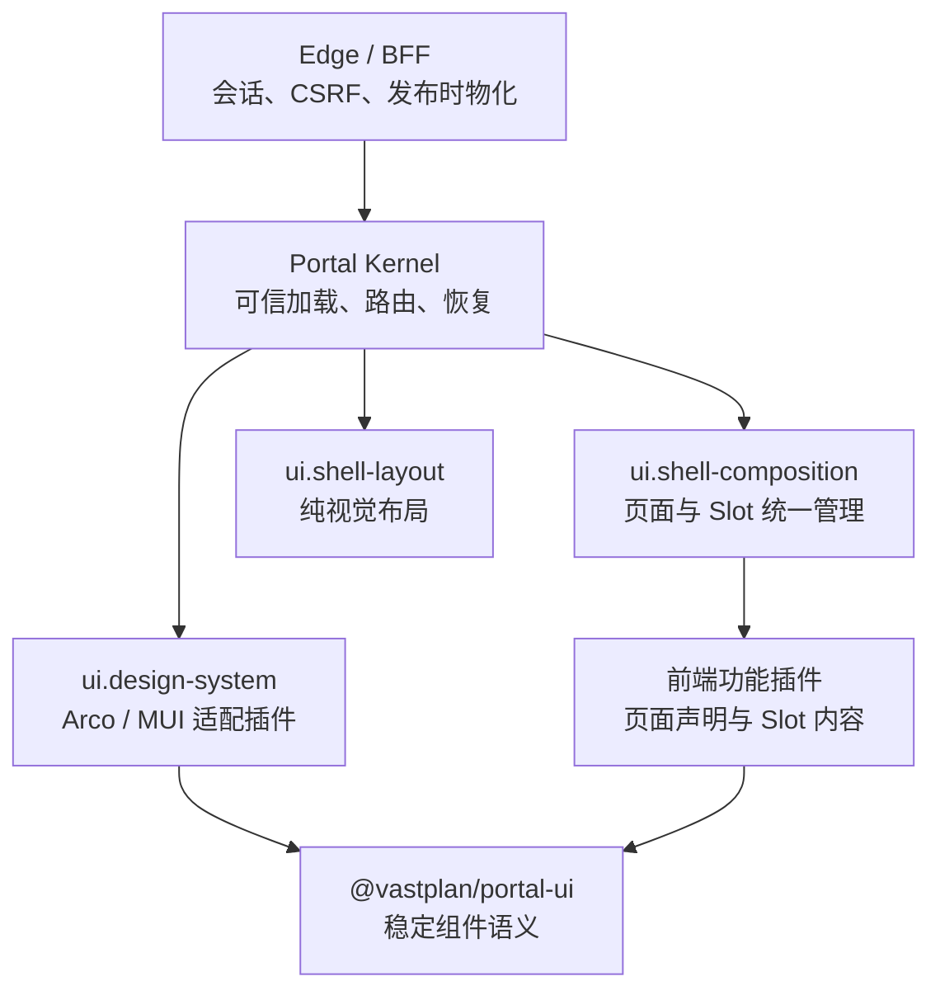

# 前端门户内核

> 状态：实施设计 v1｜最后更新：2026-07-19
>
> 本文是 Frontend Portal Kernel、设计系统插件、在线组合与浏览器安全边界的单一真相源。取舍见 [ADR-0052](../decisions/ADR-0052-前端门户内核与多UI设计系统插件.md)、[ADR-0062](../decisions/ADR-0062-Frontend可信ESM制品与运行描述.md)、[ADR-0063](../decisions/ADR-0063-Portal静态宿主与样式隔离.md)、[ADR-0064](../decisions/ADR-0064-Portal语义组件契约与动态表单运行时.md)、[ADR-0065](../decisions/ADR-0065-通用JSON-Schema表单与Arco主题适配.md)、[ADR-0066](../decisions/ADR-0066-Arco按需构建与单文件制品边界.md)、[ADR-0067](../decisions/ADR-0067-Portal控制面闭环安全恢复与第二适配器验收.md)、[ADR-0073](../decisions/ADR-0073-Portal内容寻址交付快照.md)、[ADR-0074](../decisions/ADR-0074-Portal组合Slot与纯布局插件分层.md)、[ADR-0075](../decisions/ADR-0075-Portal管理绑定与多平台基线.md) 和 [ADR-0076](../decisions/ADR-0076-Portal-Edge分布式快照交付.md)；插件分级与双输入组合见 [ADR-0057](../decisions/ADR-0057-插件分级管理与双输入组合解析.md) 和 [ADR-0059](../decisions/ADR-0059-Frontend双输入服务端权威解析.md)；Portal 与 Mobile/Runner 的跨端体验协作见《[跨端体验与交互契约](跨端体验与交互契约.md)》。

## 1. 目标与边界

门户是“Frontend Platform Profile + Application Composition”的浏览器解析产物。平台管理员固定 Portal Shell、单一设计系统与安全加载基线，应用配置人员只选择功能插件和业务页面。它不绑定任何领域页面，也不把 Arco/MUI 等 UI 实现带入内核。



内核负责：可信 Runtime 装载、三个平台基础插件的单例选择、Portal 路由、权限可见性过滤、插件生命周期、错误隔离、最小恢复界面与 BFF 客户端。

设计系统插件负责：主题 token、语义组件、导航控件、弹窗/抽屉/通知、动态表单、数据展示、空态/错误态和图标。Shell 组合插件负责 Slot 拓扑与内容归并；布局插件只负责 LOGO、菜单、页头、正文和侧栏的视觉位置与样式。

功能插件负责：以 UI 契约组合自己的视图、命令、编辑器和表单 Schema，通过 `addPage` 声明导航语义区并填充标准 Slot；不得控制 Page Shell、顶级 HTML、全局样式、会话令牌或跨插件内部调用。

## 2. 设计系统与多框架

`ui.design-system`、`ui.shell-composition` 与 `ui.shell-layout` 是 Frontend 的三个独立 `single` 扩展点。Portal Platform Profile 分别精确固定插件 ID、制品版本和 `uiContract` 兼容范围；装配前必须验证贡献存在、来自三个不同的已签名第一方制品且满足范围。Application Composition 不包含这三种选择，一个 Portal 同时只能激活各一个实现。

当前有两个第一方设计系统插件：`com.vastplan.foundation.frontend.design-system.arco` 以 Arco Design 提供完整主题和高级 JSON Schema widgets，`com.vastplan.foundation.frontend.design-system.mui` 以 Material UI 提供同一 1.x 语义组件面与标准 RJSF 表单基线。二者分别用于不同 Portal，功能插件不声明对其中任一框架的依赖。框架切换是 Portal Platform Profile 升级，不是普通 Application Composition 编辑；候选插件必须先通过契约、来源和制品校验。

所有远程模块共享单例 `react`、`react-dom`、`@vastplan/portal-ui` 和 `@vastplan/ui-contract`。V1 由 Portal Shell 的 import map 提供共享依赖。Portal Kernel 挂载在独立 Shadow DOM；设计系统 CSS 作为已验签模块字节的一部分交付，文档根选择器及 `body[theme]` 等主题宿主选择器映射到 `:host`，普通选择器由 Shadow DOM 隔离。该映射必须对开发态格式化 CSS 和生产态压缩 CSS 使用同一结果，并由生产压缩输入门禁验证。Arco 插件通过组件 ESM 直接入口和传递样式闭包执行编译期按需构建，禁止完整主题 CSS，并以 1,700,000 字节门禁约束压缩后制品；在可信加载协议支持多文件模块图前仍保持单文件。功能插件不得携带全局 reset 或框架私有样式。UI 契约的 major version 不兼容即拒绝装配。

标准组合插件 `com.vastplan.foundation.frontend.composition.standard` 固定 `shell.header.start|center|end`、`shell.navigation.start|center|end`、`page.header.*`、`page.body.*`、`page.aside` 和 `shell.footer`，并负责按作用域与 order 归并内容。全局 `shell.*` 与活动页面 `page.*` 是两份独立模型；只有 Platform Profile 插件能登记全局贡献。导航由组合层规范为 `zone → group → page`：功能页面只引用 `groupID`，Platform Profile 的 `composition.config.navigationGroups` 治理分组名称、语义图标、zone 和顺序。

标准布局插件 `com.vastplan.foundation.frontend.layout.standard` 只把该组合模型映射为视觉结构。桌面默认使用 64px 图标主轨和右侧常驻 240px 二级导航栏，不使用二级弹出菜单；主轨和二级栏分别管理溢出滚动。Page Header 位于 Page Body 主滚动容器之外，正文滚动时保持可见。手机隐藏桌面双栏并使用设计系统 Drawer。`layout.config` 只保存正文宽度等视觉策略，不能新增 Slot、分组或注入 CSS。

## 3. 稳定 UI 契约

`@vastplan/portal-ui` 是 TypeScript SDK，暴露框架无关的 React 组件、hooks 和 Schema。首期必须包含：

| 领域 | 契约能力 |
|---|---|
| 布局 | `PortalShell`、页头、侧栏、主区、检查器、状态栏、响应式断点、Page/Panel/Stack/Grid |
| 导航 | `Menu`、Breadcrumb、Tabs、CommandPalette，以及受权限过滤的 Slot 菜单模型 |
| Overlay | `DialogService`、Drawer、Confirm、Toast/Notification、Busy 状态；由宿主集中维护 z-index、焦点和 ESC 行为 |
| 表单 | `FormRenderer(schema, value, context)`、JSON Schema Draft 7、对象/数组/组合/条件规则、同步/可取消异步校验、只读/禁用、错误摘要与提交状态 |
| 数据与反馈 | Table、FilterBar、Pagination、Descriptions、Status、Empty、ErrorState、Skeleton/Spinner |
| 主题 | 语义 token、深浅色模式、图标注册和无障碍文本；插件不得读取框架私有 token |

动态表单的 `FormSchema` 是 `id + schema + uiSchema?` 薄信封。`schema` 固定为 JSON Schema Draft 7，承载类型、标题、默认值、对象/数组、必填、数值/长度/格式、枚举/组合和 `if/then/else` 等数据规则；可选 `uiSchema` 只承载 widget、顺序、帮助与布局提示，不得降低数据约束。二者都只能包含 JSON 数据，不出现 `ArcoInput`、`MuiTextField`、函数或网络地址。

当前 `@vastplan/portal-ui` 已实现上表的语义组件面。Arco 插件在内部集成 RJSF 6 与 CSP 安全的 Draft 7 解释式校验器，并提供完整 Arco widgets、字段/对象/数组模板、数组操作与错误展示；RJSF 类型不进入公共 SDK。同步校验和默认值遵循 JSON Schema，嵌套错误路径使用 `object.field` 与 `array[0].field`。异步校验通过 FormRenderer 参数注入，默认去抖并使用 AbortSignal 取消过期请求。凭证字段必须同时声明 `format: vastplan-credential-ref` 和 `writeOnly: true`，`ui:widget: secretRef` 只控制呈现，不能作为安全依据。

V1 禁止远程 `$ref` 并限制 Schema 大小、深度与节点数；后端在接受交互请求时编译内嵌 Schema，浏览器解释器不提供网络 loader，也不需要 `unsafe-eval`。Mobile 与其他 Renderer 消费同一数据 Schema，可忽略 Web `uiSchema` 并采用自己的布局；升级 JSON Schema 方言必须显式版本化。

## 4. Portal 组合、身份与发布

Portal Platform Profile 包含设计系统、Shell 组合、Shell 布局、安全加载与恢复基线；Portal Application Composition 包含 `route`、`domains`、`audience`、`branding`、功能插件精确 refs 和非敏感 `config`。Resolver 生成已发布 Portal revision。同一路径/域名在一个租户内唯一；平台基线必须恰有三个相互独立的 UI 基础插件；功能插件必须满足其声明的 `uiContract`。

机器契约位于 `contracts/schemas/composition/frontend/v1`。普通 Draft API 只接收 Application Composition；Portal Edge 以 `-portal-platform-catalog` 绑定不可变平台 Catalog。Catalog 可包含多份 Platform Profile，并以 `(tenantId, portalId)` 管理绑定精确选择 Profile、logical service、routing domain 和 capability operation grants，经可信 `kernel.config.get` 向 Composer 注入。Composer 合并后生成带 Catalog/Profile/Application 三份输入摘要、管理绑定摘要和逐插件来源锁的 `PortalSpec`；内核 Catalog 对精确制品、来源与管理绑定执行二次校验，浏览器 Portal Runtime 只消费锁定结果，不接收或合并原始输入。

### 4.1 浏览器可信装载链

Frontend 插件的生产入口是签名插件包内由 `entry.frontend` 指向的单文件 ESM `.js/.mjs`。打包工具只接受显式构建产物并写入该路径，源码和开发服务器 URL 不能直接发布。完整插件包继续使用统一制品签名与 SHA-256，不建立前端专用信任体系。

认证后的浏览器调用 `GET /v1/portal-runtime?path=<当前路径>`。Edge 选择当前租户、域名和最长匹配路由的已发布激活 revision，再返回唯一启动输入：

```text
RuntimeSpec
├── portal: 带双输入 digest 与逐插件 origin 的 PortalSpec
└── modules[]
    ├── id / version / channel
    ├── entry
    ├── url: /v1/portal-modules/{revision}/{sha256}.js
    ├── sha256: 入口 JavaScript 实际字节摘要
    └── packageSha256: 已验证插件包摘要
```

Composer 在发布/回滚激活 revision 之前通过 `kernel.portal.catalog.materialize` 请求 Edge 完成一次制品验证、入口提取、SHA-256 内容寻址、gzip 预压缩和 Runtime 快照提交。快照绑定完整 `PortalSpec` 摘要。物化结果先进入可信中央 origin，各 Portal Edge 后台预取到私有 cache；新 Edge 可在首个 runtime 请求从 origin 冷填充，但不得访问插件仓库、重新验签或解包。稳态 runtime 与模块请求只访问本机不可变快照/对象；解析锁不一致即拒绝。模块 URL 不允许浏览器选择版本、channel 或任意包内路径，且只有当前激活 revision 的模块可读。Runtime 响应以 `preload + as=fetch + use-credentials` 提示浏览器预取；Portal Loader 用一致的 `credentials=include` 并行获取全部已锁定模块，使用 immutable browser cache，并以 Web Crypto 复算 `sha256`，完全匹配后才创建 Blob URL 执行。预加载与实际请求的凭证模式不得分叉，否则同一模块会发生无效预取或重复下载。模块自行导出的签名、发布者或 integrity 声明一律不可信，provenance 只能由宿主赋值。

加载后的功能插件只得到宿主创建的窄 `FrontendPluginContext`。宿主绑定真实插件 ID；页面 ID/路径和导航 ID 必须唯一，每页必须填充 `page.body.main`，页面贡献只能指向标准 `page.*` Slot。`addShellContribution` 是单独的全局入口，仅 Platform Profile 来源插件可用；Application 来源调用必须 fail-closed。功能插件声明的页面 `path` 是以 `/` 开头的 Portal 内相对路径，不能硬编码部署路由根；可信 Portal Runtime 将它统一挂载到 `PortalSpec.route` 下，导航、深链接和刷新只使用挂载后的路径，因此同一插件可被不同路由根的 Portal 复用且不会逃出 Edge 的 Portal 归属边界。若当前路径恰好等于 Portal 根且没有根页面，Shell 按 `primary → settings → secondary → 无导航页面` 的稳定顺序选择首个落地页并使用 `replaceState` 规范化 URL；未知深层路径仍保持 not-found，不得被该规则吞掉。设计系统、Shell 组合和布局仍须通过单一贡献、来源与 UI contract 检查，普通模块不能注册第二份基础贡献。

### 4.2 Portal Shell 静态宿主

`pnpm build:frontend`（底层为 `engineering/tools/build-frontend.sh`）输出可部署静态目录，默认位于被 Git 忽略的 `bin/portal`：

```text
bin/portal/
├── index.html                 # import map + CSP nonce 占位符
└── assets/
    ├── portal-kernel.js
    ├── portal.css
    └── vendor/                # React、React DOM、Portal UI、UI contract 单例
```

Portal Edge 必须用 `-portal-assets <目录>` 显式绑定。它在启动时把 index 与有界静态文件读入内存，只接受普通文件；缺目录、缺 nonce 占位符、符号链接、目录列表或资源越界均启动失败。未知 `/v1/*` 始终返回 404，不能被 SPA fallback 掩盖；普通页面路径返回带每请求随机 nonce 的 shell。CSP 只允许同源脚本、nonce import map 和 Loader 所需的 `blob:` 模块，并禁止 frame ancestor、object、worker 与跨域连接。因 Arco/React 仍使用 style 属性和运行时 style 元素，`style-src` 暂保留 `'unsafe-inline'`，但 `script-src` 不允许该例外。

浏览器只访问 Edge/BFF。BFF 使用 HttpOnly Secure SameSite 会话 Cookie、CSRF token 和短期请求关联 ID；向内部 capability 调用投影经过验证的 Principal、租户、角色和审计上下文。首期定义身份提供方接口，不实现用户目录或 OIDC；缺少有效身份一律拒绝。

Edge/BFF 的 Portal 控制面固定在 `/v1`：`GET /csrf` 签发短期 SameSite=Strict 双提交 CSRF token；`GET|POST /portal-drafts` 读取或创建草稿；`PUT /portal-drafts/{revision}` 只更新仍处于 draft 的 Application Composition；`POST /portal-drafts/{revision}/submit|approve|publish|rollback` 执行状态流转；`GET /portal-drafts/{revision}/audit` 查询审计。`@vastplan/portal-ui` 的类型化 `PortalControlClient` 封装这些端点并为每次写操作重新取得 CSRF token。除 `GET`/`HEAD` 外的请求必须同时携带 Cookie 与 `X-VastPlan-CSRF`，并以常量时间比较。请求 JSON 不含 tenant 或 Principal，二者只能由会话验证器投影。BFF 只依赖 `core/shared/go/portalapi` 契约，组合治理逻辑由 `com.vastplan.platform.configuration.portal-composer` 插件实现。

交互呈现 API 固定为 `GET /interactions`、`GET /interactions/{id}`、`POST /interactions/{id}/present` 与 `POST /interactions/{id}/respond`。Edge 固定把呈现面注入为 `frontend`，不接受浏览器传入 tenant、Principal、来源 capability、`surface` 或取消请求；非安全读取以外的操作同样经过 CSRF。`@vastplan/portal-ui` 的 `PortalInteractionClient` 只是该受控端点的 Web Adapter，Portal 的设计系统用它取得 `InteractionRecord` 后再以自己的 `FormRenderer`/确认组件渲染语义契约。Broker 与独立的交互访问策略负责 Backend 侧授权与终态裁决，详情见《[跨端体验与交互契约](跨端体验与交互契约.md)》和 ADR-0055。

Portal Catalog 也是 Edge 的窄端口：组合根向它注入制品来源和内核验签适配器；每个候选都必须先经过内容、证明、发布者与清单绑定验证，才会读取 `frontend` engine 与 `ui.design-system` descriptor。Edge 不直接依赖 Node Agent 或仓库实现，防止浏览器入口反向耦合部署执行层；生产组合根必须注入签名验证器，本地开发可显式注入只做内容绑定校验的实现。

Edge 调用 Composer 的能力名固定为 `tool.package/platform.portal-composer`，操作为 `createDraft`、`updateDraft`、`list`、`submit`、`approve`、`publish`、`rollback`、`audit`。Edge 使用 `CapabilityClient` 端口；组合根再把它适配到协议总线或集群寻址。Composer 只从宿主 `CallContext` 投影 Principal/tenant，拒绝请求 JSON 中的身份字段。

Composer 后端作为 `leader + leader-owned + cluster` 基础服务发布该 capability。其状态文件只经已声明的 `kernel.config.get` 取得；草稿校验经 `kernel.portal.catalog.validate`，发布前交付提交经 `kernel.portal.catalog.materialize` 回调可信内核目录。这些窄能力都不向插件暴露仓库凭据、验签密钥、未验证制品或交付目录。这样 Edge、Composer 和制品信任层只通过稳定 capability 契约相连，且不会形成内核对具体插件的编译期依赖。

Edge 由 `IdentityProvider` 接入企业 OIDC/SSO；为受控部署提供可替换的文件会话实现：文件只保存 browser token 的 SHA-256 摘要、主体/租户/角色与过期时间，权限必须为仅属主可读写，并在每次请求重读以便即时撤销。它拒绝重复同名 Cookie 和过期 token。无论身份实现为何种协议，Edge 都将它投影为 `portalapi.Principal`，再通过 `ProtocolBusCapabilityClient` 构造协议 `CallContext`，由内核的权限与调用环保护执行 Composer capability。

生产入口为 `backend portal-edge`。它只接受仓库中的 Composer、Interaction Broker 及各自访问策略的 `id/version/channel` 引用：读取未信任 Envelope 后由内核验证器校验证明、内容和清单绑定，再经内容寻址安装器取得入口与冻结的 runtime contract，最后按该 contract 启动插件。入口必须配置 TLS 证书/私钥、session 文件、Composer/Broker 状态文件、`-portal-platform-catalog`、可信 `-frontend-delivery-origin`、本机 `-frontend-delivery-cache` 和发布者 trust store；无签名仅可由显式 `--allow-unsigned-local` 用于本地开发，且不能同时配置 trust store。只有 Portal Edge 启动活动 revision 预取器，普通 Backend 服务不拉取前端快照。启动期间注册 Catalog validate/materialize 两个窄能力，再把经验证 session、可信 Catalog 与协议总线组成 BFF；不接受裸二进制路径或裸 Manifest。

在线组合 API 的普通 Draft 只编辑 Application Composition；Platform Profile 使用独立的平台管理员权限和发布流程。应用 Draft 提交后进行制品分类、依赖、路由冲突、UI 契约、权限和 Schema 校验，再与环境绑定的 Platform Profile 解析；不同 Principal 审批后才可发布。发布保留旧版本；回滚只能选择同一 Portal 的非当前应用历史 revision，并针对当前平台基线重新解析，不能借回滚替换设计系统或安全策略。`system` break-glass 也不能把 foundation/platform 插件塞进应用列表。

当前实现已完成 Frontend v1 双输入 Schema、多 Profile 平台 Catalog、Portal 管理绑定、服务端 Resolver、输入 digest/origin 锁、Catalog 分类复核、草稿编辑与发布/回滚重新解析、类型化控制面客户端、组合管理全流程页面、ESM 制品注入、中央快照与 Edge 本机预取/冷填充、`RuntimeSpec`/模块端点、浏览器字节摘要校验、宿主 provenance 赋值、可部署 Portal Shell、共享依赖 import map、CSP nonce、Shadow DOM/CSS 隔离、内核原生恢复页、服务端权威历史版本选择、完整 Portal UI 语义组件面、RJSF 通用表单、CSP 安全 Draft 7 校验、Arco 完整主题与按需构建，以及第二套 MUI 适配器。Platform Profile 可固定管理页面插件，PortalBinding 再限定它们可管理的服务；其 BFF、远端能力与授权边界以《[平台管理中心](平台管理中心.md)》为单一真相源。平台 Catalog 在单个 Composer 进程内不可热切换；平台升级通过候选实例预检和进程切换完成。

Portal v1 代码闭环已经形成；正式对外宣称浏览器端交付前，仍需在目标部署环境用真实企业身份提供方、签名制品和受信 TLS 完成浏览器验收。该环境验收不改变上述内核与插件边界。

## 5. 首个参考插件与验收

首个功能插件为“系统配置与插件组合管理”参考插件。它通过菜单和受限路由提供：Portal/服务组合列表、草稿编辑、差异预览、动态表单校验、提交审批、发布、回滚和组合状态查看；不显示凭证明文或内部服务凭据。

Portal v1 的验收至少覆盖：

1. 已签名 Arco Platform Profile 与参考应用插件能在 Portal 中加载并注册 Slot、菜单、弹窗和动态表单；
2. 换成不兼容 UI contract、未签名制品、第二个设计系统或全局 CSS 的插件均被拒绝；
3. 设计系统故障时进入内核恢复页并可回退到最后已发布版本；
4. 提交人不能审批自己的草稿；发布、回滚和 break-glass 均产生审计记录；
5. 无会话、CSRF 缺失、跨租户路由或前端传入伪造 Principal 均 fail-closed；
6. Arco 与第二个适配器在独立 Portal 上通过相同 UI SDK 契约测试。
7. `backend portal-edge` 的真实进程 E2E 必须从制品仓库安装并启动策略与 Composer、可信获取并校验设计系统，经过 TLS、会话、CSRF、角色授权与受限宿主回调，验证草稿、职责分离审批、发布和历史版本回滚。
8. 普通 Portal Draft 引用 foundation/platform 插件、直接指定第二设计系统或覆盖平台基线时必须在服务端 fail-closed。
9. 浏览器加载前必须复算入口 JavaScript 摘要；响应被替换、模块未锁定、非激活 revision 或模块自行伪造 provenance 时必须 fail-closed。
10. 新 Portal Edge 必须能从中央交付快照冷填充，且整个预取与运行请求链不得重新读取插件制品包。
11. 非根路由 Portal 的功能页面必须挂载在 `PortalSpec.route` 下；菜单导航、直接深链接及浏览器刷新后仍解析到同一 Portal，不能因页面路径逃出路由根而进入安全模式。
