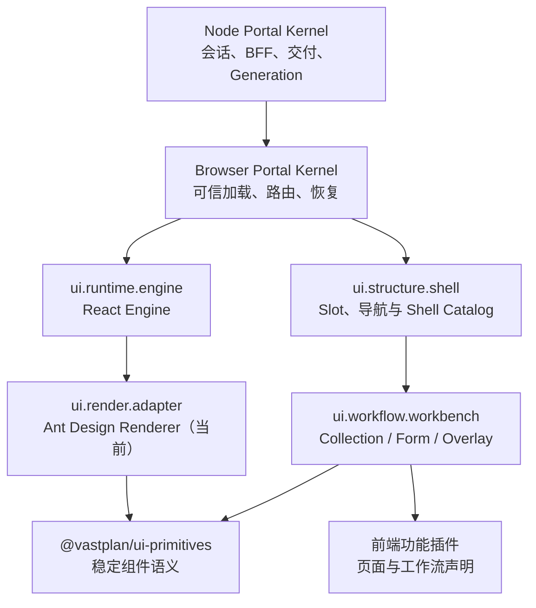

# 前端门户内核

> 状态：v9 Node Portal Kernel、合同驱动管理 API、Ant Design 单实现与双端 Generation 已实现｜最后更新：2026-07-31
>
> 本文是 Frontend Portal Kernel、UI 四个基础能力、在线组合与浏览器安全边界的单一真相源。Node 宿主、Runtime Engine、可信模块图与多端权限决策分别见 [ADR-0103](../decisions/ADR-0103-Node-Portal-Kernel渐进替代Go-Edge.md)、[ADR-0104](../decisions/ADR-0104-Frontend-Runtime-Engine与React单实现.md)、[ADR-0105](../decisions/ADR-0105-可信多文件前端模块图与双端Generation.md) 与 [ADR-0106](../decisions/ADR-0106-多端统一身份授权与Runner执行租约.md)；会话前页面和认证方法见《[登录与认证协议](登录与认证协议.md)》，视觉规范见《[Portal 设计系统](../design/DESIGN.md)》，组合模式见《[UI 工作台组合框架](UI工作台组合框架.md)》，跨端协作见《[跨端体验与交互契约](跨端体验与交互契约.md)》。

> v6 把前端引擎从渲染适配器中分离：Profile 必须精确固定 `ui.runtime.engine`、`ui.render.adapter`、`ui.structure.shell`、`ui.workflow.workbench` 四个语义单例。当前唯一 Runtime Engine family 是 React；Vue 仅保留未来契约空间，不发布空实现，也不向用户提供无意义的引擎切换。

## 1. 目标与边界

门户是“Frontend Platform Profile + Application Composition”的浏览器解析产物。平台管理员固定 Portal Shell、单一设计系统与安全加载基线，应用配置人员只选择功能插件和业务页面。它不绑定任何领域页面，也不把具体 UI 框架实现带入内核。


```mermaid
flowchart TB
  BFF["Node Portal Kernel\n会话、BFF、交付、Generation"] --> PK["Browser Portal Kernel\n可信加载、路由、恢复"]
  PK --> RE["ui.runtime.engine\nReact Engine"]
  RE --> DS["ui.render.adapter\nAnt Design Renderer（当前）"]
  PK --> SC["ui.structure.shell\nSlot、导航与 Shell Catalog"]
  SC --> WB["ui.workflow.workbench\nCollection / Form / Overlay"]
  WB --> FP["前端功能插件\n页面与工作流声明"]
  DS --> UI["@vastplan/ui-primitives\n稳定组件语义"]
  WB --> UI
```

内核负责：可信 Runtime 装载、四个平台基础插件（Runtime Engine、渲染适配、Shell、Workbench）的单例选择、Portal 路由、权限可见性过滤、插件生命周期、错误隔离、最小恢复界面与 BFF 客户端。Node Portal Kernel 已接管 HTTP、OIDC 会话、BFF、静态宿主、模块交付与 Generation 协调；制品信任、权限裁决、集群寻址和插件治理仍由 Go Backend 通过窄端口提供。

最小恢复界面不依赖上述四个平台基础插件。Portal Host 通过显式 `--kernel-recovery-url` 只连接 loopback Backend Recovery 端点，公共 `/v1/kernel-recovery` 仅返回阶段、范围、可信节点数和 quorum 计数；固定 `/recovery` 由 Host 直接生成无脚本 HTML，不加载 React Runtime、设计系统、Shell、Workbench 或任何远端插件模块。正常 Portal 启动失败页也显示该裁剪状态，但不能执行发布或修复动作；完整边界见 [ADR-0169](../decisions/ADR-0169-Seed-Recovery-Capsule与分阶段可用性.md)。首次平台控制数据库尚未配置时，Host 另提供 `/bootstrap/platform-control` 恢复安全页面：它仍不依赖 Portal Generation，但必须经过 Seed 会话、角色授权和 CSRF，只能调用组合根固定的 `platform.database` Bootstrap 操作，不能选择任意 capability 或充当通用管理 BFF。控制数据库 Ready 后，该页面退出，日常数据库管理回到同一 Connection Manager 全栈插件的 Workbench 页面。

渲染适配器插件负责：Renderer 选择语义、本地化、主题 token、主题模板目录、语义组件、`BodySections` 正文分区、导航控件、弹窗/抽屉/通知、动态表单、数据展示、空态/错误态和图标；精确 Renderer 目录由可信宿主从 Manifest Contribution Index 派生。Profile 以 `defaultRenderer/allowedRenderers/userSelectable/rendererOptions` 管理框架选择；每个 Renderer 的 `themeTemplate` 是 `light`/`dark`/`high-contrast` 等语义方案，`iconTheme` 在跨框架一致的 `canonical` 基线和当前 `renderer-native` 图标间选择。canonical 由 `@vastplan/icon-catalog/semantic` 提供精确锁定的 MIT Ant Design 语义词表；原生目录缺项必须回退基线，功能插件优先引用语义图标名。Profile 不得传 CSS、颜色值、URL、SVG 或框架私有对象。Workbench 负责集合、表单与 Overlay 的展示档位；Form Pattern 独立拥有 Schema 状态、校验和提交生命周期，表单控件默认在字段区域内右对齐，非页面表单统一组合为默认 `FormDialog`，只有独立页面和记录页内编辑器显式组合为 Page。Drawer 仅作为非表单 Overlay 能力保留。Shell 负责 Slot/导航语义，精确 Library 目录同样由 Contribution Index 派生；具体 Library 只提供 Chrome 与布局计划。

功能插件负责：以 `@vastplan/workbench-sdk` 声明 Collection、Form、Overlay、动作和导航语义，不得从基础组件自行拼装页面，也不得控制 Page Shell、顶级 HTML、全局样式、会话令牌或跨插件内部调用。只有 Foundation Frontend 插件可以直接使用 React、Renderer 框架和 `@vastplan/ui-primitives` 视觉组件；构建器对此执行强制门禁。暂时仍位于 `ui-primitives` 的 `PortalControlClient` 及其纯数据类型是唯一非视觉例外。

## 2. Renderer 插件协议与当前单实现

`ui.runtime.engine`、`ui.render.adapter`、`ui.structure.shell` 与 `ui.workflow.workbench` 是 Frontend 的四个独立 `single` 扩展点。Profile 精确固定四个可信制品；Application Composition 不包含这些选择。当前 React 制品的 Browser Entry 是 family/contract 兼容描述，Browser Root、Hydration 和 React 树仍由 React Portal Kernel 持有；它的 Server Entry 则真正拥有 SSR、Server Module Graph 与 Worker Generation 生命周期。Adapter 继续提供通用、可扩展的 Renderer Catalog 和按需模块选择协议，但当前产品 Catalog 只发布 Ant Design，Profile 也只允许 `antd`。未来新增 Renderer 必须作为独立签名插件实现相同 UI Contract，并通过完整一致性测试后再加入 Catalog；功能插件始终只声明 Workbench 语义。

Renderer 与 Shell Library 的默认值、允许范围和用户权限属于 Profile；用户实际选择、明暗模式、主题、图标和自定义语义色全部由 `PortalAppearanceSession` 仅保存在按 tenant/subject/Portal 隔离的浏览器 `localStorage`，不进入 BFF、Capability、数据库或服务端缓存。服务端 PortalPreference 只保存 Workbench Collection 展示偏好，其 scope 只绑定 Portal 与 Workbench catalog。Shell Library 在兼容 UI Contract 下通过候选 Portal Generation 无刷新切换；Renderer family 通过 Host Epoch 受控刷新，绝不在同一 React/DOM 树混用两个框架。签名子模块按需传输必须由 RuntimeSpec 锁定摘要和来源，未锁定模块不下载、不执行。

### 2.1 多语种与框架桥接

Portal Platform Profile 以 `localization.defaultLocale/supportedLocales` 治理可用语言，Resolver 对未声明的旧 Profile 物化 `zh-CN`、`en-US` 默认策略。浏览器内核按“tenant/portal 用户偏好 → 浏览器语言 → 平台默认”解析 BCP-47 locale，并同步 `html.lang/dir`；语言切换只更新 Locale Runtime，不触发插件重新装载或 Generation 切换。

插件在已验签的前端模块图中导出自己的 locale message map。页面与导航使用 `FrontendPluginContext.i18n.message` 产生宿主绑定命名空间的延迟文本，React 视图使用 `usePortalI18n/usePortalMessages`；日期、数字、列表和相对时间只能通过 Portal Intl formatter 输出。当前 Ant Design Renderer 把 locale 与 direction 映射到 `ConfigProvider`，RJSF 与共享 CSP 安全解释式校验器在表单适配层处理 Schema 展示副本和错误文案。未来 Renderer 仍必须实现相同语义桥接，不能要求功能插件改用框架专用 i18n API。

Portal 运行集合中的每个 UI 插件必须自带语言资源；组装阶段拒绝缺失资源、缺失默认语言、非法或规范化后重复的 locale。第一方 UI 插件至少提供 `zh-CN` 与 `en-US`，内核不会代管功能插件文案。某个非默认语言消息暂缺时可以按统一规则回退，但插件不能完全省略语言资源。中文环境中的用户可见功能名称、说明和状态必须使用中文，不能直接暴露英文 fallback；PostgreSQL、MySQL、TCP、Unix 等产品、协议或用户自定义标识仍保留其行业原名。

动态表单的验证 Schema 保持 Draft 7 原文。`FormSchema.localization` 和 `uiLocalization` 分别以 JSON Pointer 覆盖渲染副本中的 Schema 标题和 `uiSchema` 帮助文案，不修改校验输入。语言包只允许纯文本模板与有界值插值，禁止 HTML、组件和脚本；宿主限制 locale 数量、消息大小和插件资源总量。

当前 React Engine 的远程模块共享单例 `react`、`react-dom`、`@vastplan/ui-primitives`、`@vastplan/ui-contract` 和两级 `@vastplan/icon-catalog` 入口，由 Portal Shell 的 import map 提供。语义入口只包含有界的同步领域图标；完整图标目录按稳定摘要延迟分片。Portal Kernel 挂载在独立 Shadow DOM；设计系统 CSS 作为模块图中的已验签资源交付。Ant Design 必须按组件或子路径入口构建，禁止整包组件和完整主题 CSS；未来 CSS-in-JS Renderer 也必须将样式容器绑定到 Shadow Root。功能插件不得导入原始图标目录、携带全局 reset 或框架私有样式。Runtime Engine、Renderer、Shell、Workbench 与 UI 契约的 major version 不兼容即拒绝装配。

唯一 `cn.vastplan.foundation.frontend.structure.shell` Catalog 内部的 Composition Core 固定 `shell.header.start|center|end`、`shell.navigation.start|center|end`、`page.header.*`、`page.body.*`、`page.aside` 和 `shell.footer`，并负责按作用域与 order 归并内容。全局 `shell.*` 与活动页面 `page.*` 是两份独立模型；只有 Platform Profile 插件能登记全局 Slot 贡献。导航由签名 Manifest 的唯一 `frontend.navigations/main@1.0.0` 自治声明，节点全局身份固定为 `pluginId/nodeId`，Workbench 页面只通过 owner-bound `parentMenuRef` 挂到菜单节点。Shell 不再提供 `primary`、`secondary`、`settings` 等业务根节点，它们仅是 Manifest 节点可选择的布局区域；唯一 Shell 导航锚点是不可覆盖的账户头像 `vastplan.host/account`。任何已启用且签名可信的插件都可在 Manifest 中以 required 父级引用该锚点，声明自己的账户二级菜单；个人中心只是默认贡献者。页面始终是最终叶子。组合层规范为 `zone → root menu → child menu? → page`，并从同代 Contribution Index 绑定插件语言目录和安全图标 AST。Profile 不再保存菜单树，只能通过 `navigationOverrides` 隐藏、排序、改父级或覆盖已支持 locale 的名称，且不能修改账户锚点或把节点重新挂入账户。Composition Core 输出唯一 `activeNavigationPath`；Go Schema、Portal 候选、浏览器和两种 Layout 共同拒绝重复、未知父级、循环、跨 zone、超深和越权覆盖。完整决策见 [ADR-0190](../decisions/ADR-0190-Portal语义导航策略与服务复用.md)。Composition Core 已收回 Shell 源码内部，不再保留 `structure.composition.standard` 可安装插件或跨插件 workspace 依赖；架构门禁拒绝前端插件直接依赖另一个插件源码包。

标准布局插件 `cn.vastplan.foundation.frontend.structure.layout.standard` 使用 64px 图标主轨和右侧常驻 240px 导航栏；根直属页面优先显示，子组使用可多开的折叠章节。主轨入口和账户头像的 Tooltip 使用框架无关的 `right` 方位，避免遮挡图标轨与二级栏；顶部布局及其他页面操作仍保持各自默认方位。新布局插件 `cn.vastplan.foundation.frontend.structure.layout.top-navigation` 在 64px 顶栏显示根组，并用一个分组式 Mega Popover 承载二、三级页面；`primary/secondary` 位于中部，`settings` 位于右侧，溢出根组进入“更多”。两者只消费相同组合模型，不创建 Slot 或猜测业务结构。Page Header 位于 Page Body 滚动容器之外，已承担主要视觉分隔；页面可通过受治理的 `fluid / large / medium / small` 语义选择正文尺寸，未声明时默认 `large`，两种 Shell 使用同一 Recipe 统一居中且拒绝任意像素。两种布局都消费同一个 `portalPageRhythm.contentStart`，不再各自硬编码首组件位置。Workbench 根与组件 inset 分别管理组件间距和内部 padding，不能以 margin 反向覆盖 Shell；`<768px` 两种布局都使用设计系统 Drawer。具体数值、token、键盘与无障碍规则以《[Portal 设计系统](../design/DESIGN.md)》为准。

## 3. 稳定 UI 契约

`@vastplan/ui-primitives` 是 TypeScript SDK，暴露框架无关的 React 组件、hooks 和 Schema。首期必须包含：

| 领域 | 契约能力 |
|---|---|
| 布局 | `PortalShell`、页头、侧栏、主区、检查器、状态栏、响应式断点、Page/Panel/Stack/Grid |
| 导航 | `Menu`、Breadcrumb、Tabs、CommandPalette，以及受权限过滤的 Slot 菜单模型 |
| Overlay | `Tooltip`、受控 `Popover`、Dialog、Drawer、Confirm、Toast/Notification、Busy；Tooltip 只解释单个稳定触发器，其他浮层由适配器维护定位、碰撞、z-index、焦点和 ESC |
| 表单 | `FormRenderer(schema, value, context)`、JSON Schema Draft 7、对象/数组/组合/条件规则、同步/可取消异步校验、只读/禁用、错误摘要与提交状态 |
| 数据与反馈 | Table、FilterBar、Pagination、Descriptions、Status、Empty、ErrorState、Skeleton/Spinner |
| 主题 | 语义 token、深浅色模式、图标注册和无障碍文本；插件不得读取框架私有 token |

动态表单的 `FormSchema` 是 `id + schema + uiSchema?` 薄信封。`schema` 固定为 JSON Schema Draft 7，承载类型、标题、默认值、对象/数组、必填、数值/长度/格式、枚举/组合和 `if/then/else` 等数据规则；可选 `uiSchema` 只承载 widget、顺序、帮助与布局提示，不得降低数据约束。二者都只能包含 JSON 数据，不出现框架组件、函数或网络地址。

当前 `@vastplan/ui-primitives` 已实现上表的语义组件面。Ant Design 插件集成 RJSF 6，并共享 `@vastplan/rjsf-csp-validator` 的 Draft 7 解释式校验器；该校验器不使用 `Function/eval`，可在 Portal CSP 下工作。Renderer 只实现自己的 widgets、字段/对象/数组模板、数组操作与错误展示，RJSF 类型不进入公共 UI SDK。同步校验和默认值遵循 JSON Schema，嵌套错误路径使用 `object.field` 与 `array[0].field`；校验器原始英文消息只用于诊断，Renderer 必须根据规范化错误码和参数在适配器边界生成友好的本地化字段消息，不能把 JSON Pointer 或底层库文案直接暴露给用户。异步校验通过 FormRenderer 参数注入，默认去抖并使用 AbortSignal 取消过期请求。凭证字段必须同时声明 `format: vastplan-credential-ref` 和 `writeOnly: true`，`ui:widget: secretRef` 只控制呈现，不能作为安全依据。

V1 禁止远程 `$ref` 并限制 Schema 大小、深度与节点数；后端在接受交互请求时编译内嵌 Schema，浏览器解释器不提供网络 loader，也不需要 `unsafe-eval`。Mobile 与其他 Renderer 消费同一数据 Schema，可忽略 Web `uiSchema` 并采用自己的布局；升级 JSON Schema 方言必须显式版本化。

## 4. Portal 组合、身份与发布

> P2.3 模型已按 [ADR-0174](../decisions/ADR-0174-Portal可选版本控制与发布快照分离.md) 完成收口，实施设计见 [Portal 可选版本控制接入](Portal可选版本控制接入.md)。旧 `/versions`、PortalVersion 用户操作和浏览器兼容投影已经删除。

`Portal` 是唯一在线治理聚合。可变 `WorkingCopy` 保存 Runtime Engine、Render Adapter、Shell、Workbench、安全策略、`route`、`domains`、`audience`、`branding`、功能插件、非敏感 `config` 和管理服务 grants；提交后形成不可变 `Publication` 并进入异人审批。只有 `PortalRelease` 精确引用一个 Published Publication 并完成物化后才成为线上事实。同一路径/域名在一个租户内唯一；Foundation 子模块只能由可信种子 Catalog 初始化，功能插件必须满足声明的 `uiContract`。

种子 Catalog 只提供首个 WorkingCopy 的默认平台配置和服务绑定，Composer 将它作为可信 `creationTemplate` 投影给管理界面，因此空租户不依赖既有 Portal 也能创建第一条记录。基础插件引用变化必须提升 Catalog 配置、重新计算 digest，并由 `plugin-release prepare` 同步插件运行身份、Portal Binding 与 Access Profile 精确引用。UI Contract major 变化属于破坏性 Host Epoch：开发 Seed 必须再执行 `bootstrap --rebuild-seed`，让宿主共享 SDK、基础模块、Catalog/Profile 和 Portal Activation 同代切换；旧 Activation 不得与新共享 `@vastplan/ui-contract` 混装。种子 Profile 不拥有在线草稿、审批或发布流程；创建后完整配置进入 Portal 聚合。

机器契约位于 `contracts/schemas/composition/frontend/v1` 与中立 `portalapi`。浏览器只提交完整 WorkingCopy 配置、working revision CAS 和 Publication/Release 路径身份，不能提交 tenant、Principal 或可信解析结果。Composer 冻结候选并以聚合 CAS 确认 Publication、当前 Release 和全局不变量未变化；内核 Catalog 对精确制品、来源、当前撤销状态与管理绑定执行二次校验，浏览器 Portal Runtime 只消费 Release 锁定结果。

### 4.1 浏览器可信装载链

Frontend 插件的生产入口由签名插件包内的 `entry.frontend` 指向。发布工具从入口构建封闭模块图，为每个 JavaScript、CSS 与静态资源节点记录相对路径、媒体类型、SHA-256 和依赖边；源码和开发服务器 URL 不能直接发布。完整插件包继续使用统一制品签名与 SHA-256，不建立前端专用信任体系。模块图交付完成前，旧单文件 ESM 只作为迁移兼容输入，不再是目标契约。

认证后的浏览器调用 `GET /v1/portal-runtime?path=<当前路径>`。Node Portal Kernel 选择当前租户、域名和最长匹配路由的已发布激活 revision，再返回唯一启动输入：

```text
RuntimeSpec
├── portal: 带双输入 digest 与逐插件 origin 的 PortalSpec
├── browserGeneration: 浏览器端原子装配代次
├── extensions: 从已验签 Manifest 编译的插件专属扩展图
└── moduleGraphs[]
    ├── id / version / channel / entry
    ├── nodes[]: path / mediaType / sha256 / dependencies
    ├── urlTemplate: /v1/portal-modules/{revision}/{sha256}/{path}
    └── packageSha256: 已验证插件包摘要
```

Composer 在发布/回滚激活 revision 之前通过 `kernel.portal.catalog.materialize` 请求 Go Backend 的 `portaltrust` 窄能力完成一次制品验证、入口提取、SHA-256 内容寻址、gzip 预压缩和 Runtime 快照提交。快照绑定完整 `PortalSpec` 摘要。物化结果先进入可信中央 origin，各 Node Portal Kernel 从 origin 冷填充到私有 cache，但不得访问插件仓库、重新验签或解包。稳态 runtime 与模块请求只访问本机不可变快照/对象；解析锁不一致即拒绝。模块 URL 不允许浏览器选择版本、channel 或任意包内路径，且只有当前激活 revision 的模块可读。Runtime 响应以 `preload + as=fetch + use-credentials` 提示浏览器预取；Portal Loader 用一致的 `credentials=include` 并行获取全部已锁定模块，使用 immutable browser cache，并以 Web Crypto 复算 `sha256`，完全匹配后才创建 Blob URL 执行。预加载与实际请求的凭证模式不得分叉，否则同一模块会发生无效预取或重复下载。模块自行导出的签名、发布者或 integrity 声明一律不可信，provenance 只能由宿主赋值。

加载后的功能插件只得到宿主创建的窄 `FrontendPluginContext`。宿主绑定真实插件 ID；页面 ID/路径和导航 ID 必须唯一，每页必须填充 `page.body.main`，页面贡献只能指向标准 `page.*` Slot。`addShellContribution` 是单独的全局入口，仅 Platform Profile 来源插件可用；Application 来源调用必须 fail-closed。功能插件声明的页面 `path` 是以 `/` 开头的 Portal 内相对路径，不能硬编码部署路由根；可信 Portal Runtime 将它统一挂载到 `PortalSpec.route` 下，导航、深链接和刷新只使用挂载后的路径，因此同一插件可被不同路由根的 Portal 复用且不会逃出 Portal 归属边界。若当前路径恰好等于 Portal 根且没有根页面，Shell 按 `primary → settings → secondary → 无导航页面` 的稳定顺序选择首个落地页并使用 `replaceState` 规范化 URL；未知深层路径仍保持 not-found，不得被该规则吞掉。设计系统、Shell 组合和布局仍须通过单一贡献、来源与 UI contract 检查，普通模块不能注册第二份基础贡献。

### 4.2 Portal Shell 静态宿主

`pnpm build:frontend`（底层为 `engineering/tools/build-frontend.sh`）输出可部署静态目录，默认位于被 Git 忽略的 `bin/portal`：

```text
bin/portal/
├── index.html                 # import map + CSP nonce 占位符
└── assets/
    ├── portal-kernel.js
    ├── portal.css
    └── vendor/                # React、React DOM、Portal UI、UI contract 单例
```

Node Portal Kernel 必须用显式静态资产目录启动，并在接管流量前验证 index、nonce 占位符、文件类型、数量、总大小和符号链接边界。未知 `/v1/*` 始终返回 404，不能被 SPA fallback 掩盖；普通页面路径返回带每请求随机 nonce 的 shell。CSP 只允许同源脚本、nonce import map 和 Loader 所需的 `blob:` 模块，并禁止 frame ancestor、object、非受控 worker 与跨域连接。迁移封板必须通过 Go/Node 黑盒契约对照，Node 达到等价后删除 Go HTTP 入口；Go 中为 Composer 提供的可信 Catalog/物化窄能力不随 HTTP 入口删除。

浏览器只访问 Node Portal Kernel/BFF。生产身份不再由 Portal 直连 OIDC：Node 通过 Authentication Broker 调用企业选择的密码、OIDC/OAuth、SAML、LDAP、Passkey 或其他 Provider 插件。Provider 只产生 Evidence，Broker 校验后签发短时一次性 Assertion；Node 本地验签、通过 leader-routed Broker 原子消费，再由 Authorization Session 将稳定主体映射为平台权限。外部 claim、Group 和 Role 不能直接成为 permission。浏览器不持有企业 IdP Access/Refresh Token，只持有 AES-256-GCM 密封的 HttpOnly Secure SameSite 短会话和 CSRF token。向内部 capability 调用只投影已验证 Principal、租户和权限上下文；缺少或篡改身份一律拒绝。文件会话只用于受控开发或可替换部署适配。

Node BFF 的 Portal 控制面固定在 `/v1/portals`：集合读取返回一行一个 Portal 的聚合；创建、版本增改删、`submit|approve|publish`、Release 和历史回滚均位于 `{portalId}` 子资源下。`@vastplan/ui-primitives` 的类型化 `PortalControlClient` 封装这些端点并为每次写操作重新取得 CSRF token。请求 JSON 不含 tenant 或 Principal，二者只能由会话验证器投影。Profile、Application、Binding 和 Activation 的独立浏览器路由已删除。

普通插件管理 API 采用精确合同分发：PortalBinding 只向浏览器投影不透明 `serviceId/apiId`，并在可信侧锁定 API Contract 的 ID、SemVer 与 SHA-256；Node 从可信宿主生成的私有 Contract Catalog 取得真实 route target、请求/响应 Schema 与错误映射。浏览器 SDK 不暴露 capability、operation、插件 ID 或逻辑服务，功能插件还需在通用 `ManagementAPIClient` 外包装自己的窄类型 Port。该机制不能用于会话、CSRF、认证回调或流式大对象等宿主协议。详见 [ADR-0154](../decisions/ADR-0154-Portal管理API合同驱动分发.md)。

交互呈现 API 固定为 `GET /interactions`、`GET /interactions/{id}`、`POST /interactions/{id}/present` 与 `POST /interactions/{id}/respond`。Node BFF 固定把呈现面注入为 `frontend`，不接受浏览器传入 tenant、Principal、来源 capability、`surface` 或取消请求；非安全读取以外的操作同样经过 CSRF。`@vastplan/ui-primitives` 的 `PortalInteractionClient` 只是该受控端点的 Web Adapter，Portal 的设计系统用它取得 `InteractionRecord` 后再以自己的 `FormRenderer`/确认组件渲染语义契约。Broker 与独立的交互访问策略负责 Backend 侧授权与终态裁决，详情见《[跨端体验与交互契约](跨端体验与交互契约.md)》和 ADR-0055。

Portal Catalog 是 Go Backend `portaltrust` 的窄能力：组合根向它注入制品来源和内核验签适配器；每个候选都必须先经过内容、证明、发布者与清单绑定验证，才会读取 `frontend` engine 与 `ui.render.adapter` descriptor。Node BFF 不直接依赖 Node Agent 或仓库实现，防止浏览器入口反向耦合部署执行层；生产组合根必须注入签名验证器，本地开发可显式注入只做内容绑定校验的实现。

Node BFF 调用 Composer 的能力名固定为 `tool.package/platform.portal-composer`。管理操作收敛为 `portalGovernance`、Portal/WorkingCopy 创建、WorkingCopy CAS 保存、Publication 提交/审批/发布、Release/rollback、可选 history/read/compare/restore 与 `audit`；运行时只读取 `listPortalReleases`。BFF 不再提供 `/versions`。它使用窄 `PortalComposerPort`，再由 Addressing 适配器执行集群寻址；Composer 只从宿主 `CallContext` 投影 Principal/tenant。

Composer 后端作为 `active-active + external-shared + queue` 基础服务发布该 capability。组合治理按 tenant 聚合，PortalPreference 按 tenant + subject 摘要分文档；只有签名 Platform Catalog 继续经 `kernel.config.get` 注入。草稿校验经 `kernel.portal.catalog.validate`，发布前交付提交经 `kernel.portal.catalog.materialize` 回调可信内核目录。物化响应只返回已验签包的精确 ref 与 SHA-256；Composer 再通过 `kernel.portal.artifact-references.publish` 的窄桥把密封引用快照路由到集群仓库。该桥固定认证 Composer 插件、tenant、owner kind 和 `portal/*` owner ID，不暴露通用集群路由。这些窄能力都不向插件暴露仓库凭据、验签密钥、未验证制品或交付目录。这样 Node BFF、Composer 和 `portaltrust` 只通过稳定 capability 契约相连，且不会形成内核对具体插件的编译期依赖。

Node Portal Kernel 的 `IdentityProvider` 只负责校验密封会话并投影统一 `Principal`，不实现任何企业用户目录。正常会话只能由 Broker Assertion 经一次性消费和 Authorization Session 绑定后签发；受控开发环境仍可注入文件会话适配器。所有实现都拒绝重复同名 Cookie 和过期状态，再通过 Addressing 构造统一 Wire `CallContext`，由 Backend 权限与调用环保护执行 Composer capability。

方案 C 增加会话前 Access Profile，但不复制 Frontend Platform Profile。Node 按 hostname/route 选择精确引用既有基础层的 Access Profile，生成不可变 Access Generation，并通过裁剪后的 `/auth/v1/bootstrap` 公开品牌、语言和方法策略；tenant 与 Platform Profile 锁只留在可信宿主。`/auth/access` 已以 Portal Foundation 固定样式运行统一语义 `AuthenticationFlow`，Method Provider 只实现 `authentication.method.v1` 固定步骤。Broker、OIDC Provider、通用关系数据库密码 Provider、OTP/Delivery Provider、Assertion 消费与 Session 授权绑定均已实施，且都保持企业插件式认证边界。

生产入口为 Node Portal Kernel。Composer、Interaction Broker 与访问策略由 Backend Deployment/Node Agent 调度，不在 Portal 主进程内重复启动；Go `portaltrust` 注册 Catalog validate/materialize、testing 校验和 artifact-reference publish 四个窄能力。Node 入口必须配置 TLS、OIDC、静态资产、可信交付 origin/cache、NATS mTLS/NKey 与精确服务名。Portal 组合可以使用本地 Seed 与可选托管 HTTPS 后备源；仅在 Seed 精确 ref 不存在时回退，任何读取、证明或内容验证异常均 fail-closed。普通 Backend 服务不运行 Portal 预取器，也不向 Node 暴露仓库凭据、验签密钥或插件包字节。旧 `backend portal-edge` 命令及其 Go HTTP/BFF 实现已经删除。

Node 入口以 `--frontend-delivery-cache` 配置本机私有缓存，以可选 `--frontend-delivery-origin` 配置可信中央快照目录；origin 不能脱离 cache 单独启用。Node 与 Go 可信宿主共享 `snapshots/{tenant+portal digest}/{revision}.json` 和 `objects/{digest prefix}/{digest}.blob[.gz]` 格式，但 Node 不盲信文件：先以当前 Activation 的 Go 序列化兼容摘要绑定 snapshot，再校验每个 URL 的 revision/digest/media type 和对象实际 SHA-256，gzip 还需解压后复核。冷填充写完并验证全部对象后才原子提交 snapshot。Catalog 所有权仍属于 Go Backend 的可信窄能力；这不要求保留 Go Portal HTTP 服务。

在线治理以完整 Publication 为唯一审批单位。管理员必须另行创建 PortalRelease，经当前信任校验、物化和 CAS 后才改变线上 Portal。普通 Release 只接受最新且从未上线的 Published Publication；运行回滚从 ReleaseHistory 创建新 Release，配置历史恢复只覆盖 WorkingCopy 并重新进入提交审批，两者不能互相替代。Release 在 CAS 前先保护旧活动与新候选引用并集，成功后先写回滚历史、再收敛活动精确引用；`referencePending` outbox 让仓库瞬时失败与 Composer 重启只造成多保留、不产生漏保护。

当前实现已完成 UI Contract、三级导航、统一 Shell Catalog、Ant Design Renderer、Workbench、插件内多语种资源、Portal 单聚合治理、服务端 Resolver、Catalog 复核、CSP/Shadow DOM、Generation 热替换与 Host Epoch 回退。Arco/MUI 实现和依赖已移除；通用 Renderer 多插件协议、按需加载和安全换代能力保留。管理中心只展示 Portal；完整配置、版本历史和上线历史均为 Portal 子视图。

个人中心不属于 Portal 内核业务实现。Frontend Platform Profile 必须通过 `accountCenter` 选择一个个人中心基础插件，并在平台 `plugins` 中精确包含同一制品；默认实现 `cn.vastplan.foundation.frontend.identity.account-center` 在账户头像根锚点下声明“用户信息”和“偏好设置”两个二级菜单，再以标准 `addPage` 注册相应页面。它因使用可信 Host 本地个性化窄端口而归入 `foundation.frontend`，不作为普通应用插件暴露，也不能由 Application 删除或覆盖。Shell 只把受治理 `account` 根分组渲染为专用头像入口；个人中心与任何其他已启用、签名可信的插件都可声明该根菜单的子项。其他插件若需增加个人中心已有功能，可经个人中心的页面扩展点挂入其已拥有的二级菜单，也可声明自己独立的账户二级菜单。页面、二级菜单、活动路径、深链接和 Generation 换代均继续通过同一 `PortalRegisteredPage → ShellCompositionModel` 数据链，布局插件不得维护自己的账户功能清单。可信 Host 仅用 `PortalPersonalizationProvider` 向插件暴露账户摘要和本地外观窄端口，不暴露会话密封材料或服务端偏好写入能力。

个人中心 `0.7.0` 提供 `cn.vastplan.foundation.frontend.identity.account-center.page@1.0.0` 扩展点，只治理它拥有的 `profile` 与 `preferences` 二级菜单。扩展插件必须在签名 Manifest 中声明所有者依赖和相同的 `pageId/groupId` descriptor，再由自身 Workbench 入口注册同一页面。Portal Catalog 把扩展关系编译进 RuntimeSpec，Browser Kernel 在同一 Generation 内反向核对实际页面；未声明关系的插件不能直接挂载个人中心页面。该机制是通用插件专属扩展协议的首个 kind，不是内核针对个人中心的插件 ID 特例。

Portal v1 代码闭环已经形成；正式对外宣称浏览器端交付前，仍需在目标部署环境用真实企业身份提供方、签名制品和受信 TLS 完成浏览器验收。该环境验收不改变上述内核与插件边界。

### 4.3 插件生命周期与开发态热替换

Portal Kernel 把一次完整装配结果视为不可变 `Portal Generation`。每个 Generation 独占生命周期 `AbortSignal`、已加载模块集合和注册结果；页面、Slot 或基础 UI 插件不能在活动 Generation 上原地增删。更新时内核在后台创建候选 Generation，复用冷启动的摘要、来源、单例、契约、路由和 Slot 校验，完成可选状态恢复后才以同一个 React Root 原子提交。候选失败时活动页面不变；成功后旧 Generation 收到 abort 并按逆序执行有界 `dispose`。

插件注册上下文只增加宿主创建的只读生命周期信号。插件可选实现 `capture`、`restore`、`dispose`：状态只允许在相同插件 ID 间传递，必须是有大小和深度限制的 JSON；凭证、会话、DOM 和函数均不能进入状态胶囊。未实现这些钩子的插件仍可更新，但不保证其私有状态。宿主维护的当前路径不会因 Generation 切换而丢失。

本地开发采用独立传输面：`platformdev` 监听首方前端源码，将增删改构建为 Local Plugin Library 的 workspace Catalog 事务，以内容摘要标识每个模块图节点并通过本机 SSE 发布“候选已就绪”事件；浏览器取得开发 Runtime 覆盖后仍复算实际字节摘要，再交给同一事务管理器。源码目录不是运行事实源；新增、更新和撤销必须先投影为受信 Catalog Snapshot，再由与生产共用的 Contribution Index 和组合链生成候选。生产构建不连接开发事件源，生产 RuntimeSpec 也不接受开发 URL。开发态不能覆盖不可变仓库中的同版本制品，也不能把开发模块写入正式交付快照。

Renderer、Shell Library 和其他 Frontend Foundation Library 均从已验证 Manifest Contribution Index 自发现。通用 Render Adapter 按 `renderer module kind + adapter + engine family + UI contract` 选择候选，不嵌入 Renderer 插件 ID 或精确版本表。未来新增 Renderer 在下载进入本地库、通过准入并加入 Profile 后即可按需加载；撤销后退出候选并通过 Portal Generation/Host Epoch 安全换代，不能要求修改 Portal Kernel。

热升级按依赖边界分为三级：明暗模式、主题、颜色、图标和密度等选择态不改变模块，其中外观只更新本地状态；功能插件、Workbench、兼容 Shell Library 和同 Renderer family 兼容升级使用事务式 Portal Generation；Portal Kernel、静态宿主、Renderer family、`ui-primitives`/`ui-contract` major、vendor 或依赖锁变化使用 Host Epoch。`platformdev` 必须先完整构建并验证宿主候选，再切换内存静态资源并发布 `reload`。生产默认只在用户刷新时读取新 Activation；测试环境可通过回环事件自动触发，不允许普通生产页面轮询仓库。

UI Contract major 若同时删除持久 Portal 配置字段，Portal Composer 状态格式必须同步升级。迁移在一次 Shared State CAS 中清理已废弃字段、重算受影响 Publication 的冻结配置摘要并写入数据格式标记；普通运行期摘要不一致仍须 fail closed，不能借兼容读取绕过冻结完整性。

Portal 页面经管理 BFF 调用 Backend 时，BFF 必须从当前已验证 Activation 派生 Generation，并写入宿主保留的 CallContext metadata `vastplan.portal.activation-id` 与 `vastplan.portal.generation`。浏览器请求体、查询参数和插件前端都不能提供这两个值。兼容升级期间 Backend 可以据此保留新旧 API 路由并等待旧 Generation 租约排空；破坏性边界仍必须进入 Host Epoch 和刷新流程，不能靠 metadata 静默兼容。

## 5. 首个参考插件与验收

首个功能插件为“系统配置与插件组合管理”参考插件。它通过菜单和受限路由提供：Portal/服务组合列表、草稿编辑、差异预览、动态表单校验、提交审批、发布、回滚和组合状态查看；不显示凭证明文或内部服务凭据。

Portal v1 的验收至少覆盖：

1. 已签名、默认选择 Ant Design 的 Platform Profile 与参考应用插件能在 Portal 中加载并注册 Slot、菜单、弹窗和动态表单；
2. 换成不兼容 UI contract、未签名制品、第二个设计系统或全局 CSS 的插件均被拒绝；
3. 设计系统故障时进入内核恢复页并可回退到最后已发布版本；
4. 提交人不能审批自己的草稿；发布、回滚和 break-glass 均产生审计记录；
5. 无会话、CSRF 缺失、跨租户路由或前端传入伪造 Principal 均 fail-closed；
6. 产品 Catalog 只包含 Ant Design，构建产物不包含已移除 Renderer 依赖；通用测试仍以抽象主/备 Renderer 证明多插件选择和未选模块不加载。
7. Node Portal Kernel 的真实进程 E2E 必须从制品仓库安装并启动策略与 Composer、可信获取并校验设计系统，经过 TLS、OIDC/BFF 会话、CSRF、角色授权、NATS mTLS/NKey 与受限宿主回调，验证草稿、职责分离审批、发布和历史版本回滚；Go Portal HTTP 入口不得作为通过条件。
8. 普通 Portal Draft 引用 foundation/platform 插件、直接指定第二设计系统或覆盖平台基线时必须在服务端 fail-closed。
9. 浏览器加载前必须复算入口 JavaScript 摘要；响应被替换、模块未锁定、非激活 revision 或模块自行伪造 provenance 时必须 fail-closed。
10. Node Portal Kernel 必须能从中央交付快照冷填充，且整个预取与运行请求链不得重新读取插件制品包。
11. 非根路由 Portal 的功能页面必须挂载在 `PortalSpec.route` 下；菜单导航、直接深链接及浏览器刷新后仍解析到同一 Portal，不能因页面路径逃出路由根而进入安全模式。
12. 开发态修改布局、组合、设计系统或功能插件时必须在不 reload 文档的情况下完成整代切换；构建、摘要、装配或状态恢复失败时旧页面继续可用，连续更新不得留下重复 Slot 或旧订阅。
