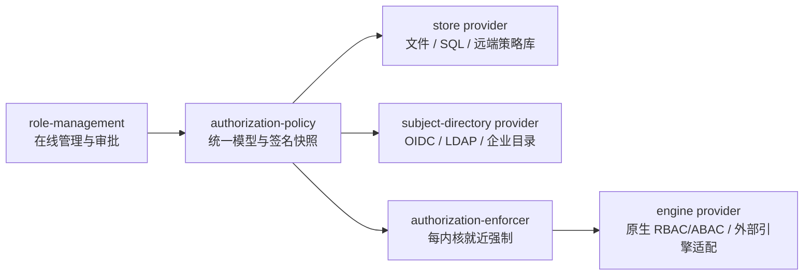

# 在线角色与权限治理

> 状态：B1—B6 已实施，B7 随 Mobile/Runner 推进｜最后更新：2026-07-22
>
> 本文是插件权限声明、在线角色、策略快照、就近强制和系统管理服务授权的单一真相源。架构决策见 [ADR-0107](../decisions/ADR-0107-插件权限目录与系统管理授权治理.md)，多端身份载体见 [ADR-0106](../decisions/ADR-0106-多端统一身份授权与Runner执行租约.md)。

## 1. 结论与边界

VastPlan 采用“插件声明权限、策略服务组合角色、内核附近执行判定、领域服务复核对象状态”的模型。角色管理插件不能发明权限代码，功能插件不能给用户授权，Portal 隐藏菜单不能代替 Backend 判定。

一次系统管理请求必须同时通过四道独立边界：

1. **Portal Management Binding**：批准该 Portal 可以寻址哪些逻辑服务及 read/write operation；它限制门户能力暴露面，不代表用户获权。
2. **Portal/BFF 体验门**：依据可信授权投影决定菜单、按钮和固定 BFF Route 是否可用；它用于减少无效请求，不能形成最终授权。
3. **Backend PEP**：目标内核附近的 `authorization-enforcer` 根据签名 Policy Snapshot 对真实 `CallContext + capability + operation + scope` 作最终判定。
4. **领域状态规则**：目标服务再次检查资源归属、revision、状态机、提交人与审批人分离、fencing token 等对象级条件。RBAC 不能绕过这些规则。

因此，门户能访问服务但用户无权限时必须拒绝；用户有权限但 Portal 未绑定服务时也必须拒绝；两者都满足但审批人与提交人相同时仍必须拒绝。

## 2. 方案比较

### 2.1 直接把 IdP Group 当权限

实现最少，但权限代码会散落在 OIDC、Portal、Backend 和每个企业 IdP 中，无法在线版本化、即时撤权或稳定审计。IdP Group 只映射为平台主体/外部组，最终角色绑定由策略服务管理。

### 2.2 中央角色插件手工维护全部权限代码

页面容易实现，但插件升级后中央表会漂移，也允许角色插件授权不存在的代码。角色插件只能消费经 Artifact Trust 验证的 Permission Catalog，不能创建或改写权限定义。

### 2.3 签名 Manifest 权限目录（已选择）

每个插件在自己的签名 Manifest `authorization` 中声明权限和 operation guard。目录构建器绑定插件 ID、版本、发布者和制品 SHA-256，拒绝命名空间越界、重复所有者、未知操作及未使用权限。安装插件不自动授权；权限只有进入已发布角色 revision 和主体绑定后才生效。

## 3. 权限目录契约

插件声明包含：

- `namespace`：该插件拥有的权限命名空间；外部发布者不能占用 `platform.*`；
- `permissions[]`：稳定 code、标题、作用域、风险、是否可分配和是否允许离线；
- `operationGuards[]`：精确绑定 `extensionPoint/capability/operation`，列出全部必需权限、访问类型和审批语义。

作用域固定为：

| scope | 含义 | 权威来源 |
|---|---|---|
| `platform` | 当前企业平台/控制面的系统资源 | Enforcer 部署 audience，不接受客户端自报 platform ID |
| `tenant` | 当前租户资源 | 经验证 `CallContext.scope.tenant` |
| `project` | 当前项目资源 | 经验证 `CallContext.scope.project` |
| `resource` | 指定类型和选择器的对象 | Policy Snapshot 中的资源授权与领域服务真实对象 |

风险固定为 `low/medium/high/critical`。平台级、高风险和 critical 权限禁止离线；`offlineAllowed` 只是插件允许的上限，平台策略仍可继续收紧。

`approval` 只声明 `none/different-subject/two-person` 语义，帮助策略和 UI 预检。最终职责分离和审批状态必须由领域服务以真实主体与持久状态强制执行。

## 4. 系统管理服务如何授权

系统管理权限不使用一个万能管理员开关，而按职责拆分：

| 管理域 | 典型权限 | 关键限制 |
|---|---|---|
| 插件与制品 | `platform.artifacts.read/lifecycle/gc/migrate` | 查看、下架、永久清扫和存储迁移分离；GC/migrate 为 critical |
| 服务与节点 | `platform.deployment.read/write/bootstrap/compose/approve/publish/test-target` | 编辑、审批、发布和测试目标授权分离；审批要求不同主体 |
| 全局设置 | `platform.settings.read/write` | 写权限不能由通用管理员隐式获得；Bootstrap Policy 继续保护自举键 |
| 凭证 | `platform.credentials.read/write/rotate/revoke` | 元数据读取、写入、轮换、撤销分离；永不授予明文读取 |
| 数据库连接 | `platform.database.read/write/probe` | 连接定义管理不等于 SQL 数据面授权 |
| Portal 治理 | 后续迁移为 `platform.portal.*` | Profile、Binding、Application、审批、Activation 和回滚分离 |
| 权限治理自身 | `platform.authorization.catalog/role/binding/approve/publish/revoke/audit` | 不能自批、不能超过委托上限、不能删除最后一个安全管理员 |

插件管理不只等于上传包：发布者信任、stable 晋级、yank/revoke、测试发布、服务装配和节点激活属于不同领域状态，必须使用不同权限和审批流程。服务管理同样把“编辑组合”“批准组合”“发布/回滚”分开。

## 5. 在线角色与策略模型

`authorization-policy` 保存以下版本化对象：

- `PermissionCatalogRevision`：绑定已验证插件及制品摘要；
- `RoleRevision`：角色 ID、作用域、权限 code、可选资源选择器和委托上限；
- `SubjectBindingRevision`：用户、外部组、服务主体或设备到精确角色 revision 的绑定及有效期；
- `RevocationRevision`：即时撤权单调序列；
- `PolicySnapshot`：以上 revision、Catalog digest、平台 audience、有效期和签名。

角色采用 Draft → PendingApproval → Approved → Published。高风险角色修改和安全管理员绑定要求不同主体审批。角色发布不能包含 Catalog 中未知、不可分配、已失效或作用域不相容的权限；插件卸载后 code 保留为 retired/orphaned，禁止被其他插件重新解释。

`platform.owner` 可以作为首次安装时的一次性内置角色模板，但它必须被物化为同样可审计的角色 revision，不是 `is_admin` 或 `platform.admin` 旁路。Break-glass 使用短期租约、明确原因、强审计和自动到期。

## 6. 插件分层与可插拔协议

权限管理应独立成插件，但按职责拆分，不按 platform/tenant/project/resource 复制四套产品：

- `cn.vastplan.platform.security.authorization-policy`：唯一授权真相源，拥有角色/绑定状态机、撤权和签名快照；
- `cn.vastplan.foundation.security.authorization-enforcer`：每个内核服务本地运行，拥有 fail-closed PEP 和快照切换；
- `cn.vastplan.platform.configuration.role-management`：Workbench 管理面，只调用 Policy 的管理协议；
- Provider 插件：实现存储、判定引擎、主体目录或受控导入导出，不取得上面三个职责。

层级通过 `PolicyDomain` 表达。Root Platform Domain 固定系统管理基线并给 Tenant Domain 签发 delegation ceiling；Tenant 可再委托 Project/Resource，但任何子域都不能扩大父域权限、降低风险或覆盖撤权。不同域可以选择不同 Provider Profile，却必须产出同一规范 Policy Snapshot 和 Decision/Proof，组合规则固定为撤权/显式拒绝优先、全部必需权限满足才允许。

为了支持多种实现，定义以下稳定 Provider Protocol，均使用版本化、语言无关 DTO：

| Protocol | 核心操作 | 不可拥有的权力 |
|---|---|---|
| `authorization.store.v1` | `probe/load/compareAndSwap/watch/appendAudit/backup` | 不能解释权限、签名快照或判定 allow |
| `authorization.engine.v1` | `prepare/evaluate/explain/health` | 不能创建角色、修改 Catalog 或信任调用方自报身份 |
| `authorization.directory.v1` | `resolveSubject/resolveGroups/watchRevision` | 不能直接授权；目录组只能成为 Subject Binding 输入 |
| `authorization.exchange.v1` | `planImport/validate/import/export` | 不能绕过 Role revision、审批、CAS 和审计直接写存储 |

VastPlan 原生 RBAC/ABAC 是默认 Engine；其他策略语言通过 Adapter 编译到或读取同一 Authorization IR。Provider 可以用 Go、Rust、Java、Node.js 等最合适的语言并进入共享 Runtime 或独立进程，但 Enforcer 只相信协议版本、签名 bundle、受众和有界 Decision/Proof，不直接依赖某个产品 SDK。第三方 Engine/Store 是否允许及隔离强度仍由内核使用者按发布者策略决定；critical 系统管理域默认只接受明确批准的 Provider。

管理协议本身不允许任意替换语义。外部系统可以通过 exchange/directory Provider 接入，但 Draft → Approval → Published、权限目录所有权、职责分离和撤权顺序始终由 `authorization-policy` 强制，避免每种协议形成一套不兼容的角色系统。

### 6.1 B2 公共契约与固定语义

B2 单一代码真相源位于 `contracts/schemas/authorization/v1`，同时提供 Go DTO、拆分的 JSON Schema、严格未知字段拒绝、语义校验和规范摘要。它是跨语言 wire contract，不包含数据库客户端、目录 SDK、策略引擎 SDK 或插件 Runtime 对象。

Authorization IR v1 固定包含 Provider Profile、Policy Domain、已编译 Role、精确 Subject Binding 和单调 Revocation。Statement 只支持显式 allow/deny、有限资源选择器，以及 `eq/in/prefix` 属性约束；同一 Statement 内为 AND，OR 通过多个 Statement 表达。Provider 不得把 Rego、Cedar、Casbin model 或其他私有表达式塞入 IR 未知字段。IR 在签名/摘要前按稳定 ID、revision 和集合字段规范排序，时间统一 UTC。

Policy Domain 实施以下 fail-closed 规则：

- 只能形成 `platform → tenant → project/resource` 或 `tenant → resource` 层级，resource 不能继续派生；
- 子域权限必须是父域 delegation ceiling 的子集，风险、TTL、离线能力均只能收紧；
- Role 的每个权限必须落在本 Domain ceiling 内；Subject Binding 必须引用同 Domain 的精确 Role revision；
- Revocation revision 必须严格单调，显式 deny 和撤权由后续 Enforcer 以优先规则执行。

Provider Protocol 的固定边界为：

- Store 使用内容摘要绑定的 opaque document 和 `expectedRevision + 1` CAS，不读取策略含义；审计详情拒绝疑似 secret/token/material 字段；
- Engine 只准备签名快照并求值，Decision 与 Proof 必须一致，Provider 给出的 Proof TTL 不得超过 5 分钟；B4 Enforcer 仍负责验签、受众、LKG 和最终缓存上限；
- Directory 返回带 issuer 和 revision 的 Subject/Group，Group 只能成为 Subject Binding 输入；
- Exchange 的 import 只返回同 Domain Role/Binding Proposal，不能发布、审批或直接写 Store；
- Provider Descriptor 只能声明协议已登记的完整 operation 集；协议按完整 ID 精确协商，禁止从未来 major version 静默降级。非敏感配置 Schema 必须本地闭合，不得加载外部 `$ref` 或声明 password/token/private-key 等秘密字段。

公共解析器在 JSON Schema 之前先执行消息大小上限：IR/签名快照 64 MiB、Store document 16 MiB、Exchange document 与普通 Provider 消息 4 MiB、Audit details 64 KiB；协议实现可以继续收紧，不能放宽。

B2 定义 `PolicySnapshot` 与 Ed25519 签名信封的 wire shape；B3 已实现 leader Policy、文件 CAS Store 与 Ed25519 签发，B4 已实现每内核 Enforcer 和独立的默认 Native `authorization.engine.v1` Provider 插件。其他 Store/Engine/Directory/Exchange Provider 仍需显式进入受信 Provider Profile，不会被自动信任或装载。

## 7. 集群、故障和多门户

`authorization-policy` 是平台真相源；每个内核服务运行本地 `authorization-enforcer`，消费签名快照并原子切换。策略服务故障时：

- low/medium 风险可在未过期 LKG 快照内继续；
- high/critical 的本地决定缓存最多五秒；全部风险都不能越过 Snapshot 到期时间，Snapshot 过期后 fail-closed；
- 撤权 revision 超过本地快照、签名错误、平台 audience 不符或快照过期均拒绝。

一个 Portal 可以管理多个服务，多个 Portal 也可以分别管理同一服务。每个 Portal 的 Management Binding 独立限制服务暴露面；用户角色绑定属于平台/租户/项目作用域，不复制进 Portal 配置。相同用户从不同 Portal 调用同一 operation 时，Backend 判定结果一致，但未绑定该服务的 Portal 无法构造合法路由。

系统调用、插件调用和 Node Agent 工作负载不继承人的角色。它们继续使用签名传输身份、capability allowlist、精确 caller 和 workload grant；在线 RBAC 只管理人或显式服务主体。

## 8. Portal 与多端投影

OIDC Session 只保存经验证主体、租户和短期授权投影，不把目录原始 Group claim 当作权限。Authorization Session 使用稳定主体 ID，并从可信 `authorization.directory.v1` 宿主投影解析外部组，再匹配 Published Group Binding。Node Portal Kernel 把会话内的 permission code 注入仅用于体验的 RuntimeSpec `portal.experience.permissions`，Workbench 据此裁剪页面和动作；该响应按用户 `private, no-store`，每次 Backend 调用仍由 Enforcer 重新判定。

Mobile 使用自己的 OAuth/设备载体，Runner 使用设备身份和 Execution Lease，但三端消费同一 permission code、Role revision 和 Policy revision。高风险系统管理权限永远不能进入 Runner 离线租约。

## 9. 实施阶段与语言选择

| 阶段 | 内容 | 状态 |
|---|---|---|
| B1 | Manifest 权限声明、命名空间/操作校验、确定性 Catalog；先覆盖制品与部署管理 | 已实施 |
| B2 | Authorization IR、Policy Domain 与 store/engine/directory/exchange Provider Protocol | 已实施 |
| B3 | `authorization-policy`：Catalog、角色、绑定、审批、撤权、Provider Profile 与签名快照 | 已实施 |
| B4 | `authorization-enforcer`：每内核本地快照、Native Engine Provider、Decision/Proof、缓存和 fail-closed | 已实施 |
| B5 | `role-management` Workbench：权限汇总、角色 revision、主体绑定和审计 | 已实施 |
| B6 | 外部组可信目录投影、Portal 体验投影；移除硬编码用户角色表和通用管理员旁路 | 已实施 |
| B7 | Mobile/Runner 载体与 Execution Lease 集成 | 随对应内核实施 |

语言选择：Policy 和 Enforcer 使用 Go，适合确定性快照、签名、CAS、低延迟缓存和现有契约复用；在线管理前端使用 TypeScript + Workbench。Provider 单独选型：例如本地高性能 Engine 可用 Go/Rust，企业目录或既有策略平台 Adapter 可按其 SDK 生态使用 Java/Node.js/Python。Provider 语言不改变最终 PEP 和签名策略真相源的边界。

## 10. B3—B6 实施边界

- `authorization-policy` 只允许可信用户管理，Role/Binding 均为精确 revision；Draft 可编辑，审批人与创建人强制分离。撤权在同一服务端流程内写入单调 revision 并签发新 Snapshot，前端不需要拼接第二次发布调用。
- `authorization-enforcer` 以优先级 2000 部署在平台服务内。它只治理 Catalog 已声明的用户操作；系统、插件、Agent 和 Runner 的 workload grant 继续由窄策略处理，人的角色不会传播给它们。
- 旧 `platform-admin-access-policy` 已删除用户 operation-role 表与 `platform.admin` 放行，只保留精确系统/插件回调和未知平台 workload 的 fail-closed 防线。Settings、Credentials、Database、Artifacts、Deployment 与 API Exposure 均由各自 Manifest 拥有权限声明。
- `platform.owner` 在开发 Seed 中物化为真实 Role/Binding。开发编排器可随 Catalog 更新并续期该开发绑定；生产的 owner、break-glass 和目录投影必须走受审配置，不得复用开发自动续期。
- 当前文件 Directory 投影是受控测试/本地 Provider Adapter，不等于信任 OIDC Token 里的 group。生产 OIDC/LDAP Provider 应通过 `authorization.directory.v1` 生成同一投影或稳定 RPC 结果，并维护单调 directory revision。
