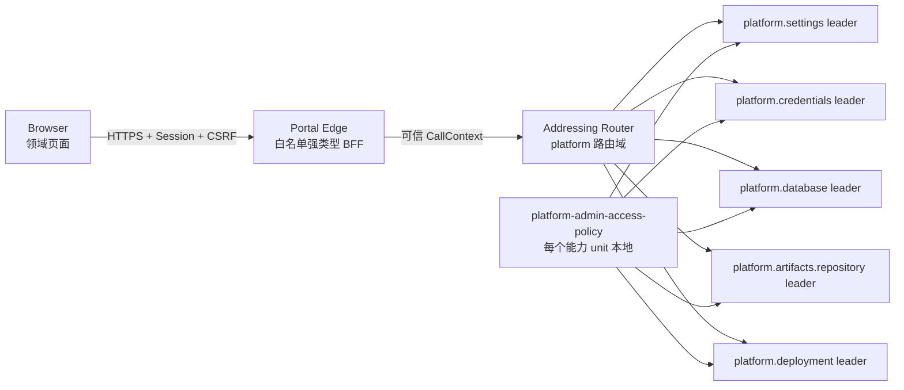

# 平台管理中心

> 状态：v1 已实施｜最后更新：2026-07-18
>
> 本文是 Portal 平台管理页面、BFF、远端调用和权限边界的单一真相源。架构取舍见 [ADR-0068](../decisions/ADR-0068-分布式平台管理中心与强类型BFF.md)。

## 1. 边界

平台管理中心不是一个持有全部业务逻辑的插件。设置、凭证、数据库连接、制品仓库和节点部署仍分别拥有后端 capability、版本与生命周期；Portal 内核只装配签名模块，Portal Edge 只承担认证、CSRF、强类型 HTTP 映射和远端寻址。

## 2. 浏览器 API

| 资源 | 路径 | 操作 |
|---|---|---|
| 全局设置 | `/v1/platform/settings`、`/settings/{key}` | list、带版本写入、带版本删除 |
| 凭证引用 | `/v1/platform/credentials`、`/credentials/{name}` | 元数据列表、只写保存、rotate、revoke |
| 数据库连接 | `/v1/platform/database-connections` | 列表、定义、删除、可信宿主 probe |
| 制品仓库 | `/v1/platform/artifacts/status` | 只读就绪状态 |
| 节点部署 | `/v1/platform/deployment/nodes`、`/bootstrap-jobs` | 节点 CAS、申请、审批、状态 |

不存在 `/v1/platform/capabilities/{target}/{operation}`。URL 名称禁止斜杠和反斜杠；JSON 拒绝未知字段；写操作必须通过 SameSite Secure CSRF 双提交校验。所有响应 `Cache-Control: no-store`。

## 3. 权限矩阵

| 领域 | 读取 | 写入/动作 |
|---|---|---|
| settings | `platform.settings.read` | 仅 `platform.admin` |
| credentials | `platform.credentials.read` | `platform.credentials.write/rotate/revoke` |
| database | `platform.database.read` | `platform.database.write/probe` |
| artifacts | `platform.artifacts.read` | v1 无浏览器写操作 |
| deployment | `platform.deployment.read` | `platform.deployment.write/bootstrap/approve` |

`platform.admin` 包含上述全部。Edge 先按路径检查角色，远端宿主再由 `platform-admin-access-policy` 对真实 capability/operation 判定。插件调用不能继承用户角色；仅精确首方平台插件可读取非敏感元数据或调用已声明的 `kernel.config.get` / `kernel.database.probe` / `kernel.node.bootstrap` / `kernel.node.readiness`。首次引导还在 Deployment Manager 内强制申请人与审批人不同。

## 4. 敏感数据

- 凭证页面的 value 使用 password widget，只存于组件当前编辑状态；请求完成立即清空。
- Edge 只向 `platform.credentials/put` 转发一次明文，不记录请求体，响应类型没有 value/ciphertext 字段。
- 数据库连接保存 `credential` 名称，不保存密码；probe 由数据库插件调用可信宿主，宿主按 tenant 和插件身份解析句柄。
- 制品状态不返回 token、信任根或仓库路径；制品验签与安装授权继续由内核独占。

## 5. 部署与故障

Frontend Platform Profile 固定四个管理插件；页面模块可与后端能力部署在不同节点。Portal Edge 使用 `-nats-url` 接入现有能力目录，生产必须同时配置 mTLS/NKey（按环境）和 `-transport-seed/-transport-trust`；只有显式 `-nats-allow-insecure` 可用于本地测试。

每个设置、凭证、数据库、制品和部署能力 unit 都必须本地附加 `com.vastplan.foundation.security.platform-admin-access-policy`。设置 unit 还必须保留 bootstrap-policy。策略缺失、远端 leader 不可用、租约过期或 transport 验证失败时，Edge 返回稳定的服务不可用错误，不回退为本地无授权调用。

## 6. 当前实现与后续

v1 已实现四个既有领域页面、TypeScript 客户端、Edge BFF、角色/CSRF 防护、NATS addressing 适配和权限插件；节点部署后端、SDK 与签名 Node Lease Ready 判定已接入，页面仍待实现。制品领域当前只显示服务状态；目录检索、发布审批和供应链证明浏览需要先定义独立的制品管理契约，不复用仓库上传 API。真实多服务 E2E 还应在部署夹具可启动 Vault、CredentialBroker 与数据库 Broker 后扩展；这不影响当前边界和单元/Portal 制品闭环。

节点纳管、Backend 服务插件组合和副本管理进入《[服务部署控制台](服务部署控制台.md)》。管理中心只编辑声明式服务与引导请求；SSH 首次安装、Deployment v2 解析、Controller 调度和 Node Agent 收敛仍由各自可信边界执行。
