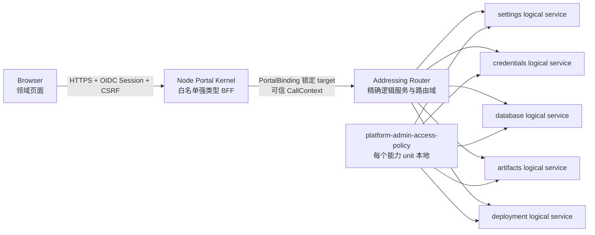

# 平台管理中心

> 状态：v2 已实现｜最后更新：2026-07-22
>
> 本文是 Portal 平台管理页面、BFF、远端调用和权限边界的单一真相源。在线角色、权限目录和未来 Enforcer 边界见《[在线角色与权限治理](在线角色与权限治理.md)》；架构取舍见 [ADR-0068](../decisions/ADR-0068-分布式平台管理中心与强类型BFF.md)、[ADR-0075](../decisions/ADR-0075-Portal管理绑定与多平台基线.md) 与 [ADR-0081](../decisions/ADR-0081-Portal治理与不可变Activation.md)；视觉规范见《[Portal 设计系统](../design/DESIGN.md)》。

## 1. 边界

平台管理中心不是一个持有全部业务逻辑的插件。设置、凭证、数据库连接、制品仓库和节点部署仍分别拥有后端 capability、版本与生命周期；Browser Portal Kernel 只装配签名模块，Node Portal Kernel 承担 OIDC/BFF、CSRF、强类型 HTTP 映射和远端寻址。

## 2. 浏览器 API

| 资源 | 路径 | 操作 |
|---|---|---|
| 全局设置 | `{base}/settings`、`/settings/{key}` | list、带版本写入、带版本删除 |
| 凭证引用 | `{base}/credentials`、`/credentials/{name}` | 元数据列表、只写保存、rotate、revoke |
| 数据库连接 | `{base}/database-connections` | 列表、定义、删除、可信宿主 probe |
| 制品仓库 | `{base}/artifacts/*` | 状态、目录、容量、引用、生命周期、GC 与迁移 |
| API 暴露 | `{base}/api-exposures/*`、`{base}/data-plane-exposures/*` | Contract 绑定、职责分离审批、稳定 Route Key 与数据面发布 |
| 节点部署 | `{base}/deployment/nodes`、`/bootstrap-jobs` | 节点 CAS、申请、审批、Ready 状态 |
| 服务组合 | `{base}/deployment/targets`、`/service-revisions` | 目标、草稿、提交、审批、发布、审计、回滚 |
| 测试发布 | `{base}/deployment/test-target-bindings`、`/test-releases` | 目标绑定、精确测试发布与回滚 |

其中 `{base}` 固定为 `/v1/portals/{portalId}/platform/services/{serviceId}`。`portalId` 必须是当前活动 Portal，`serviceId` 只是平台 Catalog 分配的不透明标识；Node BFF 从已发布 revision 的管理绑定取得真实 logical service、routing domain 和 operation grant。旧 `/v1/platform/*` 与通用 `/capabilities/{target}/{operation}` 均不存在。URL 名称禁止斜杠和反斜杠；JSON 拒绝未知字段；写操作必须通过 SameSite Secure CSRF 双提交校验。所有响应 `Cache-Control: no-store`。

## 3. 门户与服务拓扑

治理聚合可同时保存多份已发布 Frontend Platform Profile、Application Composition、PortalBinding，以及按 `(tenantId, portalId)` 唯一的当前 PortalActivation：

- 单门户运营：一个 Portal 绑定设置、凭证、数据库、制品和部署等多个服务，也可绑定两个提供同一 capability 的不同环境服务；页面按 `serviceId` 分开生成。
- 多门户分治：运营、研发、审计等 Portal 分别引用不同 Profile、受众和服务 grant。
- 显式共享：两个或三个 Portal 可以绑定同一个 logical service，但必须各自在绑定中声明，权限不会自动继承。
- 服务集群：多个 Backend 副本由同一个 logical service 的寻址层选择，对 Portal 仍表现为一个绑定；独立区域或环境使用不同绑定。

## 4. 权限矩阵

| 领域 | 读取 | 写入/动作 |
|---|---|---|
| settings | `platform.settings.read` | 当前迁移基线仍为 `platform.admin`；目标为 Manifest 声明的 `platform.settings.write` |
| credentials | `platform.credentials.read` | `platform.credentials.write/rotate/revoke` |
| database | `platform.database.read` | `platform.database.write/probe` |
| artifacts | `platform.artifacts.read` | `platform.artifacts.lifecycle/migrate/gc` 分权；GC plan/status 为读，隔离与清扫必须具有独立 GC 角色 |
| deployment | `platform.deployment.read` | `platform.deployment.write/bootstrap/compose/approve/publish/test-target` |
| portal application | `platform.portal.application.read` | `write/approve/publish` |
| platform profile | `platform.portal.profile.read` | `write/approve/publish` |
| portal binding | `platform.portal.binding.read` | `write/approve/publish` |
| portal activation | `platform.portal.activation.read` | `activate/rollback` |

`platform.admin` 当前只作为 B1→B6 的受测迁移兼容，不能再作为长期权限模型或新功能的授权依据。目标模型由插件签名 Manifest 声明精确权限，`platform.owner` 也只是可审计 Role revision，不形成旁路。一次请求必须同时满足：活动 Portal 的 `audience`、PortalBinding 的精确 read/write operation grant、Node BFF 固定路由与体验预检，以及远端 PEP 对真实 capability/operation/scope 的最终判定。浏览器不能覆盖其中任何目标字段。插件调用不能继承用户角色；仅精确首方平台插件可读取非敏感元数据或调用已声明的窄内核服务。首次引导和服务组合都在 Deployment Manager 领域层强制提交人与审批人不同；服务发布再独立要求 `platform.deployment.publish`。

## 5. 敏感数据

- 凭证页面的 value 使用 password widget，只存于组件当前编辑状态；请求完成立即清空。
- Node BFF 只向 `platform.credentials/put` 转发一次明文，不记录请求体，响应类型没有 value/ciphertext 字段。
- 数据库连接保存 `credential` 名称，不保存密码；probe 由数据库插件调用可信宿主，宿主按 tenant 和插件身份解析句柄。
- 制品状态不返回 token、信任根或仓库路径；制品验签与安装授权继续由内核独占。

## 6. 部署与故障

Frontend Platform Profile 固定管理页面插件；PortalBinding 把每个 Portal 绑定到允许管理的服务；PortalActivation 再精确锁定当前 Profile、Application、Binding 和物化快照。页面模块可与后端能力部署在不同节点。Node Portal Kernel 使用 `--nats-servers` 接入能力目录，生产必须同时配置 `--nats-tls-ca/cert/key`、`--transport-seed` 与 `--transport-trust`；只有显式 `--allow-insecure-nats` 可用于本地测试。

每个设置、凭证、数据库、制品和部署能力 unit 都必须本地附加 `cn.vastplan.foundation.security.platform-admin-access-policy`。设置 unit 还必须保留 bootstrap-policy。策略缺失、远端 leader 不可用、租约过期或 transport 验证失败时，Node BFF 返回稳定的服务不可用错误，不回退为本地无授权调用。

组合解析器只对一种重复装配开放窄例外：同一个平台插件的全部 Backend contribution 都是 `permission.checker + per-kernel + local-ephemeral + local/direct + 无 routingDomain` 时，可作为本地权限辅助插件附加到多个服务 unit。共享或集群 contribution、普通工具插件和带路由域的策略均不得借此跨 unit 重复；服务 unit 自身的 leader/active-active/partitioned 调度语义不受影响。

## 7. 当前实现与后续

当前已实现五个服务领域页面、按 Portal/服务寻址的 TypeScript 客户端、管理绑定，以及 Node Portal Kernel 的强类型 BFF。所有请求都要求活动受众、operation grant、角色、CSRF、NATS mTLS/NKey 和远端权限插件共同通过。Settings、Credentials、Database、Artifacts 和 Deployment 管理 HTTP 工作流均已迁移；制品管理覆盖目录、容量、引用、生命周期、GC 与在线迁移，部署管理覆盖节点引导、Backend 服务 revision 和测试发布。Portal 治理拆成 `Platform Profiles` 与 `Portals` 两个工作区，包含 Application/Profile/Binding 分域发布、不可变 Activation、阶段结果、当前值 CAS、布局在线切换与历史 Activation 精确输入回滚；Published 输入不会直接上线。节点引导与 Backend 服务组合仍由 Deployment Manager 执行业务状态机，BFF 不复制这些规则，见 [ADR-0077](../decisions/ADR-0077-Backend在线组合与可信发布边界.md)。

本地多服务开发夹具现可同时启动五个 Backend 平台服务 unit、独立 managed-services Node Agent、双目标 Controller fleet、Node Portal Kernel、嵌入式 NATS 和开发用 Vault Transit 兼容桩，并自动走完一条服务草稿/异人审批/发布/调度/Node Agent 收敛链。它用于验证装配闭环，不替代真实 Vault、生产 NATS 身份、多节点故障和 SSH 引导验收；操作见《[本地平台管理中心](../guides/本地平台管理中心.md)》。

节点纳管、Backend 服务插件组合和副本管理进入《[服务部署控制台](服务部署控制台.md)》。管理中心只编辑声明式服务与引导请求；SSH 首次安装、Deployment v2 解析、Controller 调度和 Node Agent 收敛仍由各自可信边界执行。
