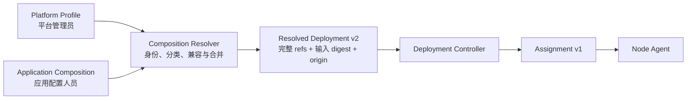

# 插件分级与组合解析

> 状态：Backend/Frontend v1 已实施｜最后更新：2026-07-18
>
> 本文是插件分级、平台基线、应用组合和解析锁的单一真相源。决策依据见 [ADR-0057](../decisions/ADR-0057-插件分级管理与双输入组合解析.md) 与 [ADR-0058](../decisions/ADR-0058-跨内核组合公共契约与适配器.md)；插件身份见《[插件契约与协议](插件契约与协议.md)》，解析后的副本与放置见《[插件服务集群化设计](插件服务集群化设计.md)》。

## 1. 三个相互独立的问题

插件管理必须区分：

1. **固有分类**：插件属于 foundation、platform、product、integration、example 还是外部发布者；
2. **组合来源**：本次运行由 Platform Profile 注入，还是由 Application Composition 选择；
3. **运行拓扑**：插件本地附着、独立共享服务、实例策略、放置和启动依赖。

固有分类不直接决定启动顺序，组合来源不改变 Manifest 的运行策略。三者混在一个 `tier` 字段中会让插件自我提权，也无法表达第三方平台适配器或同一基础服务的本地/远端部署差异。

## 2. 固有分类与默认管理面

首方生产 ID 使用 `com.vastplan.<layer>.<category...>.<component>`。分类只在 Manifest、publisher、制品内容和发布者证明全部验证后使用。

| 固有分类 | 默认管理面 | 应用是否可选择 | 生产规则 |
|---|---|---:|---|
| `foundation` | platform | 否 | 只允许 Platform Profile 注入 |
| `platform` | platform | 否 | 只允许 Platform Profile 注入 |
| `product` | application | 是 | 必须经过 Catalog 准入 |
| `integration` | application | 是 | 必须经过 Catalog 与凭证/网络策略准入 |
| `example` 或历史未分类首方样例 | development | 仅显式开发模式 | 生产拒绝 |
| 外部发布者 | application | 是 | 受发布者隔离策略约束 |

Platform Profile 可以固定 product、integration 或外部发布者插件，表示平台管理员对精确制品的环境级提升；插件自身分类不会改变。Application Composition 永远不能直接选择 foundation/platform。

## 3. 两类输入与一个输出

四内核共用 `schemas/composition/common/v1` 中的 `version/revision/id`、`target.kernel`、来源枚举、解析引用与摘要语义；各自的载荷位于 `schemas/composition/<kernel>/vN`。公共层不包含 service unit、Portal 模块、Runner 构建单元或 Mobile bundle。

### 3.1 Platform Profile

Platform Profile 是不可变、版本化的平台拓扑输入：

- `target.kernel` 限定适用内核，Backend v1 先实现 `backend`；
- `serviceClasses` 是环境允许的稳定服务类别，不等同于粗粒度 `service_role`；
- `attachments` 把本地基础插件附着到匹配 service class；
- `services` 描述 settings、credentials、artifact repository、interaction broker 等独立共享平台 unit；
- Profile 由平台权限域发布，应用 API 不允许提交或覆盖。

### 3.2 Application Composition

Application Composition 只包含：

- tenant/name/revision；
- 目标 kernel；
- 每个应用 unit 的 `serviceClass`、副本/放置/资源和应用插件 refs；
- 应用插件清单中的 package dependency 与 runtime capability requirement。

Backend 契约沿用 Deployment v2 `ServiceUnit` 结构以避免重复一套调度 DTO，但其中 `plugins` 在此资源中语义固定为“应用候选”。其他内核不得复用该 Backend 载荷。Resolver 必须逐个读取已验证 Manifest 并执行分类，不能只靠字段名或 UI 筛选。

### 3.3 Resolved Deployment

Resolver 输出完整 Deployment，记录：

- Platform Profile `id/revision/digest`；
- Application Composition `id/revision/digest`；
- 是否启用了仅限开发环境的插件策略；
- 每个插件 ID 的 `platform-profile` 或 `application` 来源；
- 注入后的完整 unit、插件精确 ref、共享平台 unit、依赖和调度字段。

Deployment revision 是控制面分配的独立单调 generation；不能直接复用任一输入 revision。相同 revision、不同解析内容继续由现有 CAS/digest 规则拒绝。

## 4. Backend 解析规则

Resolver 按以下顺序 fail-closed：

1. 校验两份输入 Schema、ID 唯一性、service class 和目标 kernel；
2. 读取所有精确 artifact ref，校验 artifact/Manifest 的 ID、version、publisher 绑定；
3. 拒绝 Application Composition 中的 foundation/platform、未允许 example、重复 ID 和多版本覆盖；
4. 校验 Platform Profile 引用，建立平台来源集合；
5. 向应用 unit 注入匹配 service class 的 attachments，重复 ID 不允许应用覆盖；
6. 追加独立平台 service unit，拒绝 unit ID 冲突；
7. 写入输入 digest 和插件 origin，再交给 Deployment v2 结构/策略校验；
8. Controller 继续读取完整 Manifest，验证 package dependency、capability requirement、策略、版本和依赖 DAG。

应用依赖平台能力时优先声明 `runtime.requires.capability + version`，不依赖具体平台插件 ID。Resolver/Controller 选择环境已固定的 provider；应用无权通过依赖声明替换或降级 provider。

## 5. 生命周期、升级与故障

- 分类不引入 `foundation → platform → application` 固定阶段；真实顺序仍由 strong/data dependency 和 readiness 决定。
- foundation 本地附件失败时，相关 unit 保持 Blocked/NotReady，不能绕过安全基线启动应用数据面。
- 共享 platform 服务失败时，应用按清单的 `fail/degrade/retry` 策略处理；应用失败不停止不相关的平台服务。
- Platform Profile 和 Application Composition 独立修订。应用回滚只改变应用输入；平台升级必须先对受影响应用执行兼容预检，再按现有候选、Drain、回滚和 fencing 规则发布。
- 解析锁保留两个输入 digest；任何一侧变化都生成新的 Deployment revision 和审计事件。

## 6. 四内核映射

| 内核 | 平台管理内容 | 应用管理内容 | 解析产物 |
|---|---|---|---|
| Backend | 本地策略、共享平台服务、运行驱动约束 | 业务工具、Agent、Workflow、集成 | Deployment v2 → Assignment v1 |
| Frontend | Portal Shell、单一设计系统、安全加载策略 | 页面、菜单、编辑器、业务视图 | 已发布 Portal revision |
| Runner | Launcher、身份、自更新、执行运行时 | 编译型业务能力、脚本和工作流 | 签名 App Profile/二进制 |
| Mobile | 原生外壳、认证、Native UI Adapter | 监控、审批、触发、业务视图 | 商店/MDM App Profile |

Portal 的 Arco/MUI 选择属于平台 Profile，不属于普通功能插件选择。Runner `schemas/app/v1` 当前表示 Resolver/构建器生成的完整锁定 Profile；它不是允许普通用户删除基础运行时的输入格式。

共享实现边界如下：Go 内核复用 `shared/go/compositioncore` 的精确制品、Manifest 身份、固有分类、开发策略和来源授权；每个内核 Resolver 自己处理拓扑、冲突和产物生成。Frontend 与未来原生 Mobile 适配器共享 JSON Schema 和 `schemas/composition/common/v1/testdata/conformance.json` 一致性向量，不直接加载 Go Resolver。

## 7. 强制点与审计

| 层 | 强制内容 |
|---|---|
| Repository/Catalog | 保留命名空间、publisher、签名、隔离策略和环境准入 |
| Application API | 只接收 Application Composition；平台资源需要独立管理员权限 |
| Resolver | 逐制品分类、来源锁、禁止覆盖、目标与 capability 兼容 |
| Controller | 解析锁完整性、完整 Manifest、依赖/策略/版本/放置 |
| Node Agent | 只执行 Assignment，复核制品身份与冻结执行契约，不自行选择基线 |
| Portal UI | 分离“平台组件”和“应用插件”目录；隐藏不是授权依据 |

审计至少记录：两个输入 ref/digest、解析器版本、插件 origin、平台提升记录、拒绝原因和输出 Deployment digest。

## 8. 实施边界

1. 新增组合 Schema、分类器和 Resolver，现有 Deployment v2 调度器只消费解析结果；
2. `controlplane` 只通过 Platform Profile + Application Composition 发布服务，不提供 raw v2 发布参数；
3. 直接修改部署样例和 Portal Composer，使普通草稿只编辑应用插件；不迁移前期开发数据；
4. Node Agent 继续只读取 Resolver 生成的 Assignment，不增加旧格式兼容分支；
5. Frontend/Runner/Mobile 按相同双输入原则各自增加构建 Resolver，不让 Backend Resolver承担其他内核装配。

### 当前实现状态

- 已具备可信首方多级命名空间、发布者绑定、Deployment v2/Assignment v1 和完整 Manifest 依赖校验。
- 已实现 `schemas/composition/common/v1`、`schemas/composition/backend/v1`、跨 Go 内核 `shared/go/compositioncore`、Backend Composition Resolver、解析锁、Controller 二次来源校验和单调 Deployment revision；生产 `controlplane` 已移除 raw v2 发布入口。
- `deploy/platform-profile.json` 与 `deploy/application-composition.json` 是可编辑输入，`deploy/cluster.deployment.json` 由测试保证与 Resolver 输出完全一致。
- Frontend 已实现专用双输入 Schema、服务端 Portal Resolver、Catalog 来源复核和浏览器解析锁校验；Runner 构建 Resolver 与 Mobile Profile 仍是后续实现项。
