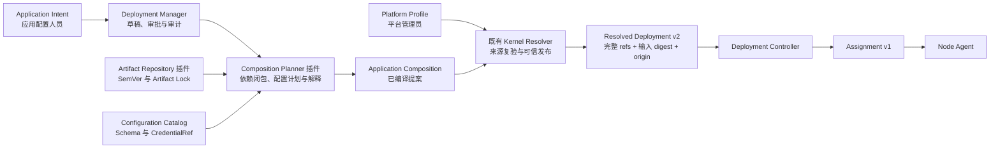

# 插件分级与组合解析

> 状态：Backend/Frontend v1 与 Application Intent/Planner P1—P5 已实施，统一 Catalog 自发现正在实施｜最后更新：2026-08-01
>
> 本文是插件分级、平台基线、Application Intent、插件化组合规划、Application Composition 和解析锁的单一真相源。决策依据见 [ADR-0057](../decisions/ADR-0057-插件分级管理与双输入组合解析.md)、[ADR-0058](../decisions/ADR-0058-跨内核组合公共契约与适配器.md)、[ADR-0143](../decisions/ADR-0143-插件化应用意图规划与派生依赖.md) 与 [ADR-0158](../decisions/ADR-0158-应用插件兼容范围与精确运行锁.md)；插件身份见《[插件契约与协议](插件契约与协议.md)》，解析后的副本与放置见《[插件服务集群化设计](插件服务集群化设计.md)》。

## 1. 三个相互独立的问题

插件管理必须区分：

1. **库存事实**：插件是否已经进入 Local Plugin Library 并出现在受信 Catalog；
2. **固有分类**：插件属于 foundation、platform、product、integration、example 还是外部发布者；
3. **组合来源**：本次运行由 Platform Profile 注入，还是由 Application Intent 选择并经 Planner 编译为 Application Composition；
4. **运行拓扑**：插件本地附着、独立共享服务、实例策略、放置和启动依赖。

固有分类不直接决定启动顺序，组合来源不改变 Manifest 的运行策略。四者混在一个 `tier` 字段中会让插件自我提权，也无法表达第三方平台适配器或同一基础服务的本地/远端部署差异。

库存中的 `Discovered` 也不等于 `Activated`。Catalog 变化只更新候选与贡献索引；生产服务由注入的 `ExplicitActivationPolicy` 消费 Platform Profile/Application Intent 精确根，开发环境则由独立的 `DevelopmentActivationPolicy` 只选择无歧义 workspace 候选。两种实现都先生成摘要锁定的 `ActivationSelection`，后续统一 Planner 不再读取环境标记，只把当前/目标差异交给 Backend、Frontend、Runner 或 Mobile Adapter 生成对应运行产物。统一边界见 [ADR-0180](../decisions/ADR-0180-Catalog驱动的统一插件自发现与本地插件库.md)。

## 2. 固有分类与默认管理面

首方生产 ID 使用 `cn.vastplan.<layer>.<category...>.<component>`。分类只在 Manifest、publisher、制品内容和发布者证明全部验证后使用。

| 固有分类 | 默认管理面 | 应用是否可选择 | 生产规则 |
|---|---|---:|---|
| `foundation` | platform | 否 | 只允许 Platform Profile 注入 |
| `platform` | platform | 否 | 只允许 Platform Profile 注入 |
| `product` | application | 是 | 必须经过 Catalog 准入 |
| `integration` | application | 是 | 必须经过 Catalog 与凭证/网络策略准入 |
| `example` 或历史未分类首方样例 | development | 仅显式开发模式 | 生产拒绝 |
| 外部发布者 | application | 是 | 受发布者隔离策略约束 |

Platform Profile 可以固定 product、integration 或外部发布者插件，表示平台管理员对精确制品的环境级提升；插件自身分类不会改变。Application Intent 永远不能选择 foundation/platform，Planner 生成的 Application Composition 也不得夹带这些来源。

## 3. 管理输入、规划提案与内核输出

四内核共用 `contracts/schemas/composition/common/v1` 中的 `version/revision/id`、`target.kernel`、来源枚举、解析引用与摘要语义；各自的载荷位于 `contracts/schemas/composition/<kernel>/vN`。公共层不包含 service unit、Portal 模块、Runner 构建单元或 Mobile bundle。

```mermaid
flowchart LR
  PP["Platform Profile\n平台管理员"] --> KR["既有 Kernel Resolver\n来源复验与可信发布"]
  AI["Application Intent\n应用配置人员"] --> DM["Deployment Manager\n草稿、审批与审计"]
  DM --> CP["Composition Planner 插件\n依赖闭包、配置计划与解释"]
  AR["Artifact Repository 插件\nSemVer 与 Artifact Lock"] --> CP
  CC["Configuration Catalog\nSchema 与 CredentialRef"] --> CP
  CP --> AC["Application Composition\n已编译提案"]
  AC --> KR
  KR --> RD["Resolved Deployment v2\n完整 refs + 输入 digest + origin"]
  RD --> DC["Deployment Controller"]
  DC --> AS["Assignment v1"]
  AS --> NA["Node Agent"]
```

### 3.1 Platform Profile

Platform Profile 是不可变、版本化的平台拓扑输入：

- `target.kernel` 限定适用内核，Backend v1 先实现 `backend`；
- `serviceClasses` 是环境允许的稳定服务类别，不等同于粗粒度 `service_role`；
- `serviceBaselines` 以稳定 ID 把平台所有的公共插件和受保护配置注入匹配 service class 的在线应用服务；
- `services` 只描述必须本地自举和恢复的 Seed Service unit，其必要配置不进入在线配置目录；
- Profile 由平台权限域发布，应用 API 不允许提交或覆盖。

公共基线配置和具体服务配置在平台管理中心分开管理。前者通过 Platform Profile Candidate 激活，后者通过 Application Deployment 或签名 Service Hot 控制器激活；两者仍编译进同一 Deployment v2。详细所有权见 [ADR-0148](../decisions/ADR-0148-公共服务基线与种子配置分域.md)。

### 3.2 Application Intent

Application Intent 是 Deployment Manager 与 Composition Planner 之间的插件层协议，是在线用户唯一可写的服务组合输入。它只包含：

- tenant/name/revision 与目标 kernel/service class；
- 每个内核服务启用的根应用插件要求：固定版本 `=x.y.z` 或兼容升级 `^x.y.z`、可选精确 channel 与 Feature；
- Manifest 预先声明、由用户启用的 Feature；
- 根插件和自动包依赖插件的非敏感配置；CredentialRef 只能由可信配置 Provider 通过独立 Configuration Snapshot 注入，不能由用户写入 Intent；
- 经独立运维授权、且不突破 Platform Profile 限制的副本、资源和放置参数。

Intent 不包含 `depends_on`、`logical_service`、`instance_policy`、`state_model`、`visibility`、`routing`、`routing_domain`、平台 Provider 实现、Foundation/Platform 插件或明文秘密。不同内核可以定义不同 Intent 载荷，但必须遵守相同的“用户意图不等于执行锁”原则。

### 3.3 Application Composition

Application Composition 仍是既有 Kernel Resolver 的版本化输入，但从“用户编辑资源”收窄为 Composition Planner 生成的已编译提案。Backend 可以继续沿用 Deployment v2 `ServiceUnit` DTO，从而避免修改已封板的 Controller、Scheduler 和 Node Agent 执行链；Portal SDK、普通 CLI 和应用用户不再直接构造该 DTO。离线配置同样提交 Intent 并通过 Planner 编译，只有签名 Seed/发布 Bundle 中的预编译平台提案可以直接用于恢复。

提案包含：

- 自动展开后的完整应用插件精确 refs；
- Planner 从签名 Manifest 派生的运行策略和 capability 关系；
- 已规范化的逐插件配置；
- 空的或仅含派生值的内部 `depends_on`，最终有效 DAG 仍由 Controller 从 Manifest 二次计算；
- 现有 Kernel Resolver 所需的 Application Composition 身份、revision 与字段。

Intent、Artifact Lock、Configuration Plan、依赖解释和 `planDigest` 作为与 Application Composition 摘要绑定的 `ResolutionReport` 由 Deployment Manager 保存，不硬塞进既有内核 DTO。Planner 输出不是信任结论；Kernel Resolver、Controller 和 Node Agent 继续逐层复验来源、制品、Manifest、运行策略和依赖。

### 3.4 Resolved Deployment

Resolver 输出完整 Deployment，记录：

- Platform Profile `id/revision/digest`；
- Application Composition `id/revision/digest`；
- 是否启用了仅限开发环境的插件策略；
- 每个插件 ID 的 `platform-profile` 或 `application` 来源；
- 平台来源插件所属的公共 `service baseline`（Seed Service 插件不带此标记）；
- 注入后的完整 unit、携带 `version/channel/sha256` 的插件精确运行锁、共享平台 unit、依赖和调度字段。

Deployment revision 是控制面分配的独立单调 generation；不能直接复用任一输入 revision。相同 revision、不同解析内容继续由现有 CAS/digest 规则拒绝。

## 4. 插件化组合规划层

### 4.1 层级与职责

| 层 | 组件 | 负责 | 禁止 |
|---|---|---|---|
| Kernel Enforcement | 既有 Resolver、Controller、Node Agent | Profile 选择、来源/制品复验、Deployment CAS、DAG 二次校验和执行 | Feature UI、市场选择、动态表单、用户工作流 |
| Composition Protocol | Application Intent、Resolution Report、Configuration Plan | 语言中立 DTO、摘要和错误分类 | NATS KV、进程管理、Credential material |
| Composition Planner | `cn.vastplan.platform.infrastructure.composition-planner` | 依赖闭包、Feature 展开、策略推导、Provider 绑定和解释 | 发布 Deployment、修改 Assignment、执行 SSH |
| Provider | Artifact Repository、Configuration Catalog、Platform Profile | 精确版本锁、已验证描述、配置 Schema 和平台绑定 | 替用户提交或审批服务 |
| Workflow | Deployment Manager | 草稿、stale 判定、异人审批、发布、回滚和审计 | 自行实现依赖求解、读取仓库私有存储 |
| Presentation | Portal Workbench | 根插件/Feature/配置编辑与只读依赖图 | 直接调用内核发布或提交内部执行字段 |

Planner 采用 `active-active + external-shared + cluster + queue`。它是低频、确定性、无外部副作用的平台基础插件；第一方签名、构建指纹匹配且部署方允许时可进入既有 generation-scoped dynamic-go Runtime Host，否则使用 native trusted-process 路径，不新增内核驱动。Planner 由平台管理 Profile 部署，可以进入 Seed 全集供管理面恢复，但不进入不可插件化的 Seed Core，也不扩大仅用于仓库栈自救的 Bootstrap LKG 子集，因此其故障不会阻止内核启动或已发布服务恢复。

### 4.2 依赖来源

依赖只能来自签名开发期契约：

1. Manifest `dependencies` 表示与消费者共置的包依赖；Artifact Repository 负责确定性传递求解和 Artifact Lock，Planner 只编排该 capability；Intent 根插件允许 `=x.y.z`/`^x.y.z`，Profile 基线保持精确 ref，显式 channel 同时进入锁，传递依赖才按平台允许的 channel 优先级选择；
2. Manifest `runtime.requires` 表示 capability 依赖；Planner 用同一组合中的 provider 和 Platform Profile 的共享服务绑定生成只读服务图；
3. Manifest 可选组合 Feature 可以增加预先声明的包依赖、runtime requirement 和配置条件；用户只能开关已声明 Feature，不能自行添加依赖边。

同一 Application Composition 中同一插件只能得到一个最终版本和 channel：多个 service 的约束求交集、Feature 求并集，channel 冲突直接失败。Feature 的依赖随候选签名 Manifest 参与回溯；最终生成 service 闭包时仍按选择它的 service 隔离，不能泄漏到使用同一根插件的其他 service。

若一个能力存在多个合法 Provider，Planner 必须要求 Platform Profile 给出明确绑定，不能按返回顺序选择。远端平台 Provider 不会因为应用声明依赖而被自动安装；平台管理员先在 Profile 中批准并部署它。

### 4.3 配置计划

Planner 复用插件现有 Configuration Schema 和 Plugin Settings 工作流，不建立第二套配置真相源：

- 根应用插件和自动包依赖插件由应用配置人员填写；
- 公共 Service Baseline 插件由平台配置人员在独立入口管理，应用配置人员只看到绑定与 readiness，不能覆盖；
- Seed Service 的必要配置只由受信本地 Seed 文件管理，不进入在线配置目录；
- 敏感值只保存 CredentialRef，Planner 不读取 material；
- Runtime 派生值由可信宿主注入。

`ConfigurationPlan` 必须说明插件来源、依赖路径、Schema digest、可编辑性和缺失项。未进入当前依赖闭包的配置拒绝发布；Feature 关闭后，其依赖和配置不进入已编译提案。

### 4.4 可解释与可复现

Planner 返回已编译 Application Composition、Artifact Lock、依赖路径、Feature、Provider 绑定、派生 DAG、Configuration Plan、警告/冲突和确定性 `planDigest`。相同 Intent、Profile、Catalog revision 和配置摘要必须得到相同输出。

提交审批时同时锁定 Intent、Plan、Profile、Artifact Lock 和配置摘要。任一输入变化都会把草稿标为 stale，要求重新解析与审批。Planner 不获得 Deployment CAS、仓库签名私钥、NATS KV、SSH 或 Credential material；现有 `kernel.deployment.preview/publish` 仍是最终发布强制点。

## 5. Backend 最终解析规则

Resolver 按以下顺序 fail-closed：

1. 校验两份输入 Schema、ID 唯一性、service class 和目标 kernel；
2. 读取所有精确 artifact ref，校验 artifact/Manifest 的 ID、version、publisher 绑定；
3. 拒绝 Application Composition 中的 foundation/platform、未允许 example、重复 ID 和多版本覆盖；
4. 校验 Platform Profile 引用，建立平台来源集合；
5. 向应用 unit 注入匹配 service class 的公共基线插件与配置，拒绝服务覆盖基线字段；
6. 追加不继承公共基线的独立 Seed Service unit，拒绝 unit ID 冲突；
7. 写入输入 digest、插件 origin 和公共基线归属，再交给 Deployment v2 结构/策略校验；
8. Controller 继续读取完整 Manifest，验证 package dependency、capability requirement、策略、版本和依赖 DAG；浏览器或 Planner 提交的布尔结论不能替代该复验。

应用依赖平台能力时优先声明 `runtime.requires.capability + version`，不依赖具体平台插件 ID。Resolver/Controller 选择环境已固定的 provider；应用无权通过依赖声明替换或降级 provider。

## 6. 生命周期、升级与故障

- 分类不引入 `foundation → platform → application` 固定阶段；真实顺序仍由 strong/data dependency 和 readiness 决定。
- 公共基线插件失败时，相关 unit 保持 Blocked/NotReady，不能绕过安全基线启动应用数据面。
- 共享 platform 服务失败时，应用按清单的 `fail/degrade/retry` 策略处理；应用失败不停止不相关的平台服务。
- Platform Profile 和 Application Intent/已编译 Application Composition 独立修订。Catalog 新候选不会改变已发布精确锁；只有用户显式刷新计划才重新求解，之后重新审批发布。应用回滚复制历史 Intent 并重新生成更高修订的提案；平台升级必须先对受影响应用执行兼容预检，再按现有候选、Drain、回滚和 fencing 规则发布。
- 解析锁保留两个输入 digest；任何一侧变化都生成新的 Deployment revision 和审计事件。
- Composition Planner、Deployment Manager 或 Portal 故障只阻止新变更；已提交 Deployment 与数据面不依赖它们存活。
- 普通 `up/restart` 不执行 Intent 解析或业务发布；只有显式草稿预览、提交或发布工作流可以调用 Planner。
- 一个内核服务中的非辅助插件运行策略不兼容时必须拒绝，并要求拆分服务；Planner 不自动改变故障域。
- 本地库新增或更新插件时，Planner 只更新可解析候选；已提交精确锁不漂移。源码删除或仓库撤销先标记 `withdrawn`，重新解析、Drain、解绑和停止成功后才允许 GC 删除对象，不能把目录消失直接传播为运行中字节删除。

## 7. 四内核映射

| 内核 | 平台管理内容 | 应用管理内容 | 解析产物 |
|---|---|---|---|
| Backend | 本地策略、共享平台服务、运行驱动约束 | 根业务插件、Feature、插件配置和受限运维参数 | Intent → Application Composition → Deployment v2 → Assignment v1 |
| Frontend | Portal Shell、单一设计系统、安全加载策略 | 页面、菜单、编辑器、业务视图 | Intent → 已发布 Portal revision |
| Runner | Launcher、身份、自更新、执行运行时 | 编译型业务能力、脚本和工作流 | Intent → 签名 App Profile/二进制 |
| Mobile | 原生外壳、认证、Native UI Adapter | 监控、审批、触发、业务视图 | Intent → 商店/MDM App Profile |

Portal 的 Renderer 选择属于平台 Profile，不属于普通功能插件选择；当前产品 Profile 只允许 Ant Design。Runner `contracts/schemas/app/v1` 当前表示 Resolver/构建器生成的完整锁定 Profile；它不是允许普通用户删除基础运行时的输入格式。

共享实现边界如下：Go 内核复用 `core/shared/go/compositioncore` 的精确制品、Manifest 身份、固有分类、开发策略和来源授权；每个内核 Resolver 自己处理拓扑、冲突和产物生成。Frontend 与未来原生 Mobile 适配器共享 JSON Schema 和 `contracts/schemas/composition/common/v1/testdata/conformance.json` 一致性向量，不直接加载 Go Resolver。

## 8. 强制点与审计

| 层 | 强制内容 |
|---|---|
| Repository/Catalog | 保留命名空间、publisher、签名、隔离策略和环境准入 |
| Application API | 只接收 Application Intent；平台资源需要独立管理员权限 |
| Composition Planner | 自动依赖闭包、Feature、配置计划、策略推导和可解释冲突 |
| Kernel Resolver | 逐制品分类、来源锁、禁止覆盖、目标与 capability 兼容 |
| Controller | 每个新 Deployment digest 验证一次解析锁、完整 Manifest、依赖/策略/版本/放置；节点与实际态事件复用缓存 |
| Node Agent | 只执行携带精确 SHA-256 的 Assignment，复核签名制品与冻结执行契约，不自行选择版本或基线 |
| Portal UI | 分离“平台组件”和“应用插件”目录；隐藏不是授权依据 |

审计至少记录：Intent/Profile/Plan/Artifact Lock/配置摘要、Planner 与 Kernel Resolver 版本、插件 origin、依赖路径、平台提升记录、拒绝原因和输出 Deployment digest。

## 9. 实施边界

1. P0 只更新 ADR、本文、控制台边界和索引，不修改代码；
2. P1 在插件协议/SDK 层定义 Application Intent、Resolution Report、Configuration Plan 与 Feature 契约；
3. P2 使用 Go 实现 Composition Planner 插件，复用 Artifact Repository 的求解和配置目录，不把算法复制进 Deployment Manager；
4. P3 Deployment Manager 保存 Intent、解析快照、stale 状态和审批摘要，继续通过既有窄内核服务发布；
5. P4 Portal 删除 `depends_on`、实例策略、路由等内部字段，增加根插件、Feature、依赖配置与只读解析图；
6. P5 用真实插件覆盖传递依赖、版本冲突、Feature、Provider 歧义、配置缺失、撤销和 Node Agent 收敛 E2E；
7. Node Agent 继续只读取 Resolver 生成的 Assignment，不增加旧格式兼容分支；
8. Frontend/Runner/Mobile 可复用插件层规划协议，但各自生成本内核产物，不让 Backend Planner 承担其他内核拓扑。

### 当前实现状态

- 已具备可信首方多级命名空间、发布者绑定、Deployment v2/Assignment v1 和完整 Manifest 依赖校验。
- 已实现 `contracts/schemas/composition/common/v1`、`contracts/schemas/composition/backend/v1`、跨 Go 内核 `core/shared/go/compositioncore`、Backend Composition Resolver、解析锁、Controller 二次来源校验和单调 Deployment revision；生产 `controlplane` 已移除 raw v2 发布入口。
- `examples/deploy/backend-platform-profile.json` 与 `examples/deploy/backend-application-composition.json` 当前仍是旧开发期样例，`examples/deploy/backend-cluster-deployment.json` 由测试保证与 Resolver 输出完全一致；在线 Portal 已只编辑 Intent，预编译 Application Composition 仅存在于 Planner 输出、内部测试发布和签名恢复 Bundle。普通离线入口的 Intent 化仍随 config-as-code 工具推进。
- 已实现 `BackendPlatformCatalog`、Deployment Manager 草稿/异人审批/摘要锁发布，以及面向多个预授权目标的 Controller fleet；离线 config-as-code 与在线入口复用同一 Resolver 和 Deployment v2。
- Frontend 已实现专用双输入 Schema、服务端 Portal Resolver、Catalog 来源复核和浏览器解析锁校验；Runner 构建 Resolver 与 Mobile Profile 仍是后续实现项。
- Backend P1 已实现 `contracts/schemas/composition/backend/v1` 中封闭的 Application Intent 与 Resolution Report Schema/Go 校验器，以及独立 TypeScript `@vastplan/composition-planning` SDK。Intent 的规范摘要跨 Go/TypeScript 一致；Report 绑定精确 Planner、Artifact Lock、Configuration Plan、Provider Binding、Service DAG、diagnostic 和 `planDigest`。签名 Manifest 同时支持只能增加预声明依赖/配置条件的 `composition.features`。
- Backend P2 已实现独立 Go Composition Planner、仓库 `describePlanning` 窄投影、按 service 隔离的 Feature/传递依赖闭包、签名策略兼容检查、Provider Binding、Service DAG、Configuration Plan 和只含 CredentialRef 的可信 Configuration Snapshot；Planner 已进入平台管理 Profile，但不进入 Seed LKG。
- Backend P3 已让 Deployment Manager 保存 Intent、完整 Resolution Report、可信配置快照和提交/审批 planDigest，并在提交、审批、发布前重新规划；输入漂移会撤销审批并标记 stale。内核只向认证 Deployment Manager 提供内部 Planning Profile，公开目标 API 仍只返回摘要，最终发布继续走 preview/publish 强制点。
- Backend P4 已把 Portal 切换为 Application Intent 工作台：用户只能编辑根插件、Feature、非敏感配置和受限容量/放置输入；依赖、Provider Binding、运行策略、状态模型、路由、Artifact Lock 与配置缺口均作为 Planner 只读结果展示。旧 Composition 创建/更新 operation 已从在线 BFF、SDK、插件描述符和管理绑定删除，历史 revision 仅只读展示。
- Backend P5 已使用真实签名测试制品验证完整闭环：Feature 自动引入 audit，audit 再传递引入 quota/common；不兼容 common 主版本形成稳定版本冲突；多个共享 Provider 形成可解释歧义；缺失托管凭证停在 `NeedsConfiguration`，可信 CredentialRef 绑定后收敛。仓库新增兼容版本会撤销旧计划审批，显式刷新后才能经 Kernel Resolver 发布，并由真实 NATS Scheduler/Node Agent 对签名插件完成进程级 Ready 收敛。
