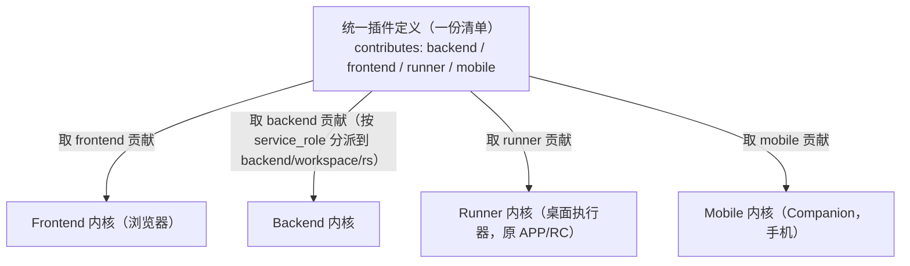
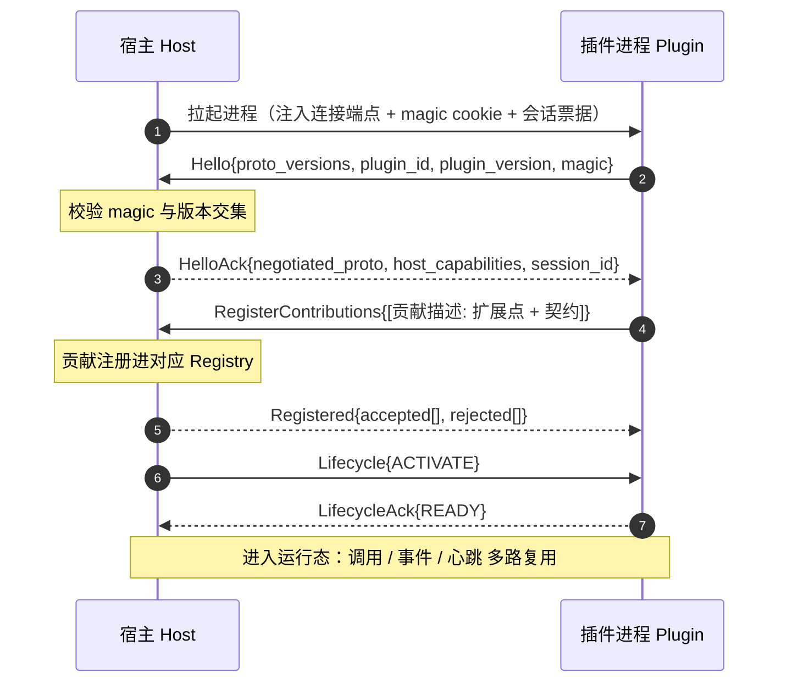
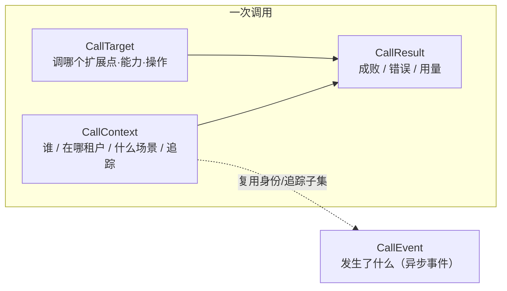

# 插件契约与协议

> 状态：设计草案 v0.2｜最后更新：2026-07-14
> 本文是**插件如何被定义、如何通信、携带什么数据、各扩展点收什么贡献**的单一真相源，整合了统一插件定义（清单）、插件-宿主协议、不可变契约字段、扩展点契约。系统整体架构见《[系统架构](系统架构.md)》；决策依据见《[ADR](../decisions/README.md)》。字段/消息为语义定义，栈无关（[0005](../decisions/ADR-0005-骨架与技术栈解耦.md)）；候选传输 gRPC/Protobuf（[0008](../decisions/ADR-0008-骨架技术选型对比.md)/[0009](../decisions/ADR-0009-内核技术栈选型.md)）。

**三者如何咬合**：清单**声明**贡献 → 协议在握手时把贡献**注册**进扩展点 → 契约是调用/事件流转时携带的**数据**。四处同名闭环：清单贡献 `id` = 协议注册名 = 契约 `CallTarget.capability` = 跨内核寻址逻辑名。

---

## 第一章 统一插件定义（Manifest & 贡献点）

清单是插件的**唯一声明入口**：四套内核只读清单就能知道"这个插件是谁、需要哪些内核能力/资源、在前端/后端/Runner/移动各面各贡献什么、何时激活、依赖谁"。声明与实现分离；一份清单贯通各面（[0006](../decisions/ADR-0006-内核分区与后端组合.md)/[0014](../decisions/ADR-0014-四内核结构.md)）。



### 1.1 设计原则

1. **声明式单一真相源**：能力静态声明，宿主不启动插件代码即可掌握全貌。
2. **一份清单贯通三面**：未声明的面即不占用。
3. **贡献点对齐扩展点**：每类贡献对应骨架一个 Registry，经协议 `RegisterContributions` 注册（第二章）。
4. **capabilities 是装配元数据，不是安全边界**：声明需要什么内核能力/资源，供装配与排依赖；第一方可信无运行时安全强制。
5. **后端贡献带服务角色**：供期望态组合决定装进 backend/workspace/rs 哪个服务。

### 1.2 清单文件与顶层字段

文件名 `vastplan.plugin.json`（插件包根目录），配套 JSON Schema。

| 字段 | 必填 | 说明 |
|---|---|---|
| `id` | ✓ | 全局唯一，反向域名式：`com.acme.sales-copilot` |
| `name` / `description` | ✓ | 展示名 / 一句话描述 |
| `version` | ✓ | 语义化版本 |
| `publisher` | ✓ | 发布者标识 |
| `engines` | ✓ | 各内核兼容版本范围，如 `{ backend: "^1.0", frontend: "^1.0", runner: "^1.0", mobile: "^1.0" }` |
| `capabilities` | | 装配元数据（内核能力/资源/凭证句柄），见 §1.5 |
| `activation` | ✓ | 惰性激活事件，见 §1.6 |
| `dependencies` | | 依赖的其他插件 `{id: versionRange}` |
| `entry` | ✓ | 各面运行时入口 `{ backend, frontend, runner, mobile }` |
| `contributes` | ✓ | 三面贡献集合，见 §1.3 |

### 1.3 三面贡献 `contributes`

四个可选键 `backend / frontend / runner / mobile`，任意组合（对应四内核，规范 ID 见 [0015](../decisions/ADR-0015-内核与贡献面命名规范.md)）。每条贡献有稳定逻辑 `id`（对应契约 `CallTarget.capability`）。

**后端 `contributes.backend`**（可带 `service_role`：backend/workspace/rs）

| 贡献点 | 扩展点(Registry) | 说明 |
|---|---|---|
| `tools` | `tool.package` | Agent 工具包（package + 子命令） |
| `agents` | `agent` | 预置 Agent 定义 |
| `apiRoutes` | `api.route` | 经边缘入口代理的 HTTP 端点 |
| `permissionCheckers` | `permission.checker` | 基于 `(caller,scene,target)` 的权限校验器 |
| `eventSinks` | `event.sink` | 事件汇（审计/可观测消费 CallEvent） |
| `hooks` | `hook` | 关键节点前后钩子 |
| `runnerCapabilities` | `runner.capability` | RS 侧调度能力/执行模式（service_role=rs） |

**前端 `contributes.frontend`**

| 贡献点 | 扩展点 | 说明 |
|---|---|---|
| `views` | `view.slot` | 向侧边栏/面板挂载视图 |
| `editors` | `editor.provider` | 自定义编辑器（含打开/保存/dirty 生命周期） |
| `commands` | `command` | 命令面板/菜单/快捷键命令 |
| `menus` | `menu` | 把命令挂到菜单位 |
| `settings` | `settings` | 插件配置项 |

**Runner `contributes.runner`**（Runner 内核面，规范 ID 统一 `rc`→`runner`，见 [ADR-0015](../decisions/ADR-0015-内核与贡献面命名规范.md)。编译型客户端插件预编译进二进制、进程内运行，`scripts/workflows` 为运行时下载的内容，见 [ADR-0012](../decisions/ADR-0012-APP内核运行模型.md)）

| 贡献点 | 扩展点 | 说明 |
|---|---|---|
| `scripts` | `runner.script` | 可下发执行的脚本 |
| `workflows` | `runner.workflow` | 多步骤工作流 |
| `runtimeRequirements` | — | 客户端需具备的运行时（如 `python>=3.10`） |

**移动 `contributes.mobile`**（Mobile 内核 Companion，手机；无后台常驻/本地执行，见 [ADR-0014](../decisions/ADR-0014-四内核结构.md)/[0013](../decisions/ADR-0013-APP多档能力与手机Companion.md)）

| 贡献点 | 扩展点 | 说明 |
|---|---|---|
| `views` | `mobile.view` | 移动端呈现视图（监控/查看） |
| `approvals` | `mobile.approval` | 人在环审批项 |
| `triggers` | `mobile.trigger` | 触发工作流/动作 |

### 1.4 贡献点如何接入系统（三者对齐）

1. **清单声明**：`contributes.<面>.<贡献点>` 一条 `{ id, ...descriptor }`。
2. **协议注册**：激活握手后经 `RegisterContributions` 注册进对应扩展点 Registry（§2.5）。
3. **契约寻址**：调用时 `CallTarget{ extension_point, capability=id, operation }` 定位（§3.2）；跨服务也用同一 `capability` 逻辑名。

> 清单 `id` = 协议注册名 = 契约 `CallTarget.capability` = 跨内核寻址逻辑名，**四处同名**，是"组合→装配→调用"闭环的锚点。

### 1.5 装配元数据 `capabilities`

声明插件**需要什么**，供装配注入与排依赖——不是安全强制。

| 键 | 语义 |
|---|---|
| `kernelServices` | 需要的内核服务（`llm.orchestration` / `event.bus` / `storage`） |
| `credentials` | 需申领的凭证名（值由宿主按**句柄**注入，明文不过插件——见 §3.9） |
| `resources` | 资源约束（GPU、特定运行时），供节点选择/放置 |

### 1.6 激活事件 `activation`

插件默认**惰性**，仅在声明事件发生时被唤醒；各面可独立激活。事件如 `onStartup` / `onView:<id>` / `onCommand:<id>` / `onAgentTool:<package>` / `onRunnerScript:<id>`。

### 1.7 依赖 `dependencies`

`{ "com.acme.crm-core": "^2.0.0" }`。生命周期管理器解析依赖树、定序激活、检测环状依赖。

### 1.8 与插件服务/期望态的衔接

制品随插件包发布到插件服务制品仓库（sha256/版本/channel）；期望态配置引用插件的 backend 贡献 + `service_role` 声明组合；`service_role` 标注驱动"某贡献装进哪个后端服务"（见《[系统架构 · 第三章](系统架构.md)》）。

### 1.9 完整示例

```jsonc
{
  "id": "com.acme.sales-copilot",
  "name": "销售助手",
  "version": "1.0.0",
  "publisher": "acme",
  "description": "为销售流程提供 Agent 工具、工作台面板与客户端采集脚本",
  "engines": { "backend": "^1.0", "frontend": "^1.0", "runner": "^1.0" },
  "capabilities": {
    "kernelServices": ["llm.orchestration", "event.bus"],
    "credentials": ["acme-crm"],
    "resources": []
  },
  "activation": ["onAgentTool:acme.crm", "onView:acme.salesPanel"],
  "dependencies": { "com.acme.crm-core": "^2.0.0" },
  "entry": { "backend": "dist/backend/main", "frontend": "dist/frontend.js", "runner": "runner/" },
  "contributes": {
    "backend": {
      "tools": [
        { "id": "acme.crm", "service_role": "backend", "title": "CRM 操作",
          "subcommands": [
            { "name": "query",  "description": "查询客户", "paramsSchema": { } },
            { "name": "update", "description": "更新客户", "paramsSchema": { } }
          ] }
      ],
      "eventSinks": [ { "id": "acme.audit", "service_role": "workspace" } ]
    },
    "frontend": {
      "views": [ { "id": "acme.salesPanel", "title": "销售看板", "slot": "sidebar" } ],
      "commands": [ { "id": "acme.syncCrm", "title": "同步 CRM" } ]
    },
    "runner": {
      "scripts": [ { "id": "acme.collectLogs", "runtime": "python", "entry": "runner/collect_logs.py", "paramsSchema": { } } ],
      "runtimeRequirements": ["python>=3.10"]
    }
  }
}
```

---

## 第二章 插件-宿主协议（Plugin-Host Protocol）

**范围是内核内**：一套内核宿主与它在本节点管辖的独立进程插件（[0004](../decisions/ADR-0004-插件运行形态.md)）。跨服务/跨机器不归本协议（走《[系统架构 · 第二章](系统架构.md)》的 mesh）。承载物是第三章的不可变契约。

### 2.1 设计原则

1. **双向对等**：宿主调插件（扩展点被触发），插件也回调宿主（取内核服务、发事件、经寻址层调别的能力）。
2. **声明式握手**：插件连上先上报清单、声明贡献；宿主据此接入扩展点。
3. **多路复用单连接**：宿主与单个插件一条主连接，其上多路复用调用/事件/生命周期/心跳。
4. **版本协商 + 兼容**：握手协商协议版本，不兼容即拒绝（fail-closed）。
5. **故障可感知**：心跳 + 断连检测；插件崩溃即摘除其贡献。
6. **流式一等**：结果/日志等大流量用流式。

### 2.2 连接模型与握手



- **magic cookie**：防止误把普通进程当插件。
- **会话票据**：宿主给该插件实例的身份，用于审计与回调鉴权。
- **协议版本协商**：`Hello` 带插件支持的版本集，宿主取交集回 `HelloAck`；无交集拒绝并终止。

### 2.3 运行态消息总览

| 类别 | 方向 | 用途 |
|---|---|---|
| **调用 Invoke** | 宿主→插件 / 插件→宿主 | 扩展点被触发时宿主调插件；插件回调宿主内核服务或经寻址层调别的能力 |
| **事件 Event** | 双向 | 内核事件下发给订阅插件；插件发布事件 |
| **生命周期 Lifecycle** | 宿主→插件 | activate / deactivate / drain / shutdown |
| **心跳 Health** | 双向 | 保活与探活，断连即故障处置 |

### 2.4 调用协议（Invoke）

- **一元**：`InvokeRequest{ target: CallTarget, context: CallContext, payload }` → `InvokeResponse{ result: CallResult, payload }`。
- **流式**：服务端流（日志/进度/大结果回流）、客户端流/双向流（大输入或交互）。
- **插件回调宿主**（`HostCall`）：用同样的 `target + context` 回调宿主；本地命中即内核服务，否则转交寻址层到别的服务。凭证类回调由宿主注入、明文不过插件。
- **超时/取消**：`context` 带 deadline；取消经流控制信号传播。

### 2.5 贡献注册协议

- `RegisterContributions{ contributions:[{ extension_point, id, descriptor }] }`：`extension_point`=目标 Registry 名；`id`=贡献稳定逻辑名（跨内核寻址也用它）；`descriptor`=该扩展点要求的贡献契约。
- 宿主校验后注册进 Registry，返回 `Registered{ accepted, rejected(带原因) }`。
- **动态性**：运行时可追加 `Register/Unregister` 支撑热装（解绑需收敛在途调用）。

### 2.6 事件、生命周期、心跳

- **事件**：`EventPublish{ event: CallEvent }` 双向；宿主按订阅下发（扇出），插件发布转内核事件总线（可再经内核间平面跨服务分发）。投递语义随事件平面（NATS/JetStream）定。
- **生命周期**：`Lifecycle{ op }`，op ∈ `{ACTIVATE, DEACTIVATE, DRAIN, SHUTDOWN}`。DRAIN=停收新调用、完成在途（升级/缩容前）。对齐《系统架构》生命周期状态机与 [0010](../decisions/ADR-0010-插件服务与部署编排.md) 升级。
- **心跳/崩溃**：双向心跳；失联即从所有 Registry 摘除贡献 → 退避重启 → 恢复后重新握手（[0004](../decisions/ADR-0004-插件运行形态.md) 故障隔离）。

### 2.7 版本、错误、传输

- **版本**：协议版本整数递增，握手取交集 fail-closed；贡献 `id` 可带版本（`acme.crm@1`）支持灰度并存。
- **错误**：传输层错误（连接断/超时）视作失联；应用层错误走 `CallResult.error`（错误码 + 是否可重试），二者严格区分。
- **传输**：候选 gRPC over HTTP/2 + Protobuf（契合 Go 宿主 + go-plugin 范式）；契约不绑定于此，wire 版本另行 ADR。

### 2.8 proto 草案（示意，非定稿）

```proto
service PluginHost {
  rpc Handshake(Hello) returns (HelloAck);
  rpc Register(RegisterContributions) returns (Registered);
  rpc Channel(stream FromPlugin) returns (stream FromHost); // 运行态多路复用
}
message FromHost {  // 宿主→插件
  oneof msg {
    InvokeRequest invoke = 1;
    EventEnvelope event = 2;
    Lifecycle lifecycle = 3;
    Ping ping = 4;
    InvokeResponse host_call_result = 5; // 回应插件 HostCall
  }
}
message FromPlugin { // 插件→宿主
  oneof msg {
    InvokeResponse invoke_result = 1;
    InvokeRequest host_call = 2;      // 回调宿主/寻址层
    EventEnvelope event = 3;
    LifecycleAck lifecycle_ack = 4;
    Pong pong = 5;
  }
}
// InvokeRequest{ CallTarget target; CallContext context; bytes payload; }
// InvokeResponse{ CallResult result; bytes payload; }  详见第三章
```

---

## 第三章 契约字段（Immutable Contracts）

四个**不可变契约** `CallContext / CallTarget / CallResult / CallEvent`——**一次定义、所有方共用**，既走插件-宿主协议（内核内），也走内核间通信（跨服务），是全链路上下文、权限、计量、可观测一致的基础。



### 3.1 设计原则

单一定义处处共用；跨平面同构（内核内/内核间不转译）；上下文全程透传；场景化三元组 `(caller,scene,target)`；凭证不入契约明文（只带句柄）；可扩展但不破坏（预留 `metadata`，新增字段可选）。

### 3.2 CallContext —— 调用上下文

| 字段 | 类型 | 说明 |
|---|---|---|
| `principal` | Principal | 发起者身份，见 §3.6 |
| `caller` | Caller | 调用方种类 + id（三元组之 caller） |
| `scene` | string | 场景名（三元组之 scene），如 `agent.tool_call` / `frontend.api` / `runner.exec` |
| `tenant_id` | string | 企业租户（多租户隔离锚点） |
| `project_id` | string? | 当前项目/工作区 |
| `trace` | Trace | `{ trace_id, span_id, parent_span_id }` |
| `deadline` | timestamp? | 调用截止；超时即取消 |
| `credentials` | CredentialRef[] | 凭证**句柄**列表（非明文），见 §3.7 |
| `idempotency_key` | string? | 幂等键，供重试去重 |
| `metadata` | map<string,string> | 可扩展透传位（不含敏感值） |

### 3.3 CallTarget —— 调用目标

| 字段 | 类型 | 说明 |
|---|---|---|
| `extension_point` | string | 目标 Registry/扩展点名 |
| `capability` | string | 贡献稳定逻辑名（=清单 id）；跨内核寻址也用它 |
| `version` | string? | 能力版本，支持灰度并存 |
| `operation` | string? | 具体操作/子命令 |
| `payload_schema` | string? | 入参 schema 引用（值在 payload） |

### 3.4 CallResult —— 调用结果

| 字段 | 类型 | 说明 |
|---|---|---|
| `status` | enum | `OK / ERROR / PARTIAL` |
| `error` | Error? | `{ code, message, retryable, details }`；`code` 稳定命名空间化（`permission.denied` 等）。**应用层错误与传输层错误严格区分** |
| `usage` | Usage? | 计量：`{ duration_ms, tokens?, cost?, custom{} }` |
| `warnings` | string[] | 非致命提示 |
| `metadata` | map<string,string> | 可扩展结果元数据 |

> 业务数据在协议信封 `payload`；`CallResult` 是成败与元信息。

### 3.5 Caller 与三元组

**Caller** `{ kind, id }`，`kind` ∈ `{ user, agent, plugin, system, runner }`（CallerKind 登记）。**三元组 `(caller, scene, target)`** 是权限/计量/统计的统一判定依据（校验器/事件汇为扩展点）。

### 3.6 Principal —— 统一身份

| 字段 | 类型 | 说明 |
|---|---|---|
| `user_id` / `username` | string | 用户 id / 展示名 |
| `is_admin` | bool | 系统管理员 |
| `tenant_id` | string | 所属租户 |
| `system_roles` | string[] | 系统级角色（数据驱动） |
| `project_roles` | map<string,string[]> | `{project_id:[role_id...]}` |
| `session_id` | string? | 会话/审计标识 |

> 由认证边界（Frontend 边缘入口 / Runner 接入 / 服务内网信任）构造后注入 CallContext，此后只读透传。

### 3.7 凭证句柄 CredentialRef

`{ name, scope }`——只带名字与范围，不带值；运行时由宿主凭证系统按句柄注入执行侧，**明文永不进契约、不过插件、日志脱敏**。

### 3.8 CallEvent —— 事件

| 字段 | 类型 | 说明 |
|---|---|---|
| `id` | string | 事件唯一 id（去重） |
| `type` | string | 命名空间化事件类型（`task.completed` 等） |
| `source` | string | 发出方（服务/插件 id） |
| `subject` | string? | 事件主体（资源引用或 CallTarget 摘要） |
| `occurred_at` | timestamp | 发生时间 |
| `tenant_id` | string | 租户 |
| `trace` | Trace? | 与触发调用关联 |
| `principal_ref` | string? | 触发者引用（审计用） |
| `payload` | bytes | 事件数据（按 type 约定 schema） |

> 可对齐 CloudEvents 信封；投递语义由事件平面（NATS/JetStream）定。审计/可观测插件在 `event.sink` 消费。

### 3.9 透传与版本

- **传播**：CallContext 沿调用向下游透传，跨服务与内核内用同一份不转译；每跳派生新 `span_id`、`trace_id` 不变；CallEvent 承接 `trace_id` 挂回调用链。跨信任边界（下发 RC）时凭证句柄与敏感 metadata 按需裁剪。
- **版本**：契约只增不改，新增字段可选、老方忽略未知字段；破坏性变更走版本跃升，可多版本并存一段时间。

### 3.10 schema 草案（示意）

```proto
message CallContext {
  Principal principal = 1; Caller caller = 2; string scene = 3;
  string tenant_id = 4; optional string project_id = 5; Trace trace = 6;
  optional int64 deadline_unix_ms = 7; repeated CredentialRef credentials = 8;
  optional string idempotency_key = 9; map<string,string> metadata = 10;
}
message CallTarget { string extension_point = 1; string capability = 2;
  optional string version = 3; optional string operation = 4; optional string payload_schema = 5; }
message CallResult { enum Status { OK=0; ERROR=1; PARTIAL=2; } Status status = 1;
  optional Error error = 2; optional Usage usage = 3; repeated string warnings = 4; map<string,string> metadata = 5; }
message CallEvent { string id=1; string type=2; string source=3; optional string subject=4;
  int64 occurred_at_unix_ms=5; string tenant_id=6; optional Trace trace=7; optional string principal_ref=8; bytes payload=9; }
```

---

## 第四章 扩展点契约（Extension Point Catalog）

第一章 §1.3 给出了"贡献点 → 扩展点"的速览；本章逐一定稿**每个扩展点（Registry）收什么贡献（descriptor）**与**分发语义**。这是 `RegisterContributions`（§2.5）里 `descriptor` 的字段来源，也是 `CallTarget`（§3.3）寻址的目标。

### 4.1 扩展点三要素

每个扩展点由三部分定义：

1. **Registry 名 / 扩展点 ID**：如 `tool.package`（= `CallTarget.extension_point`）。
2. **贡献 descriptor**：插件注册时提交的声明字段（下各表）。每条贡献带稳定 `id`（= `CallTarget.capability`，四处同名）。
3. **分发语义**：一次触发如何路由到贡献（§4.2）。

### 4.2 分发语义（四类）

| 语义 | 含义 | 典型扩展点 |
|---|---|---|
| **single**（单一提供者） | 一个 `id` 由唯一贡献提供，调用直接路由 | `tool.package` / `agent` / `api.route` / `editor.provider` |
| **select**（择一） | 多提供者按 `priority` + 匹配择一，返回决定性结果即止 | `permission.checker` |
| **fanout**（扇出） | 所有匹配贡献都收到，按 `priority` 排序执行 | `event.sink` / `hook` |
| **mount**（登记挂载） | 注册即呈现/挂载，非请求响应式（命令可再被 invoke） | `view.slot` / `command` / `menu` / `settings` / `mobile.*` |

> 所有 descriptor 通用字段：`id`（稳定逻辑名，可带 `@version`）、`title?`、`when?`（启用条件表达式）。下表只列各扩展点特有字段。

### 4.3 Backend 面扩展点

| 扩展点 | 分发 | descriptor 特有字段 |
|---|---|---|
| `tool.package` | single | `service_role`；`subcommands: [{ name, description, paramsSchema, resultSchema? }]` |
| `agent` | single | `role`/`systemPrompt`、`tools: [capabilityRef]`、`model?`、`defaultScene?` |
| `api.route` | single | `method`、`path`（挂到边缘入口命名空间）、`auth: session|service|public`、`service_role` |
| `permission.checker` | select | `applies: { caller?, scene?, target? }`（匹配范围）、`priority`；输入 `(caller,scene,target)` → `allow/deny/abstain` |
| `event.sink` | fanout | `subscribe: [eventTypeGlob]`、`priority?`；消费 `CallEvent` |
| `hook` | fanout | `point`（钩子位名）、`phase: before|after`、`priority` |
| `runner.capability` | single | `service_role: rs`、`kind`（执行模式/调度能力）、`params?` |

> `permission.checker` 组合规则：按 `priority` 高→低，遇到第一个非 `abstain` 即定论；全 `abstain` 则 fail-closed（deny）。

### 4.4 Frontend 面扩展点

| 扩展点 | 分发 | descriptor 特有字段 |
|---|---|---|
| `view.slot` | mount | `slot: sidebar|panel|statusbar|…`、`icon?`、`order?` |
| `editor.provider` | single | `resourceMatch`（glob/类型）、`capabilities: [open,save,dirty]`、`priority?`（多匹配时） |
| `command` | mount | `icon?`、`category?`；被菜单/快捷键/命令面板 invoke |
| `menu` | mount | `menu`（菜单位 id）、`command`（command id）、`group?`、`order?` |
| `settings` | mount | `key`、`type: string|number|bool|enum`、`default`、`options?`、`scope: user|tenant` |

### 4.5 Runner 面扩展点

| 扩展点 | 分发 | descriptor 特有字段 |
|---|---|---|
| `runner.script` | single | `runtime`（如 `python>=3.10`）、`entry`、`paramsSchema`、`resultSchema?` |
| `runner.workflow` | single | `definition`（步骤 DAG 引用）、`paramsSchema` |

> Runner 面贡献为**内容型**（脚本/工作流定义），运行时下载执行（ADR-0012）；编译型 Runner 插件的能力经 `backend` 面 `runner.capability`（service_role=rs）或预编译进 Runner 二进制暴露。

### 4.6 Mobile 面扩展点（Companion）

| 扩展点 | 分发 | descriptor 特有字段 |
|---|---|---|
| `mobile.view` | mount | `kind: monitor|detail`、`dataSource`（后端能力 ref）、`icon?` |
| `mobile.approval` | mount | `appliesTo`（事件/任务类型）、`actions: [approve,reject,…]`、`escalation?` |
| `mobile.trigger` | mount | `target`（workflow/command capability ref）、`confirm?` |

> Mobile 面**无执行类扩展点**（无后台常驻/本地执行，ADR-0013/0014）；只呈现、审批、触发，重活经内核间通信落到后端/Runner。

### 4.7 与协议 / 契约的衔接

- **注册**：插件激活后 `RegisterContributions{ [{ extension_point, id, descriptor }] }`（§2.5），`descriptor` 即上表字段。
- **寻址**：调用 `CallTarget{ extension_point, capability=id, operation }`（§3.3）；`operation` 对应如 `tool.package` 的 `subcommand`。
- **四处同名**：清单贡献 `id` = 注册名 = `CallTarget.capability` = 跨内核寻址逻辑名（§1.4）。
- **descriptor 校验**：宿主按扩展点的 descriptor schema 校验注册请求，非法即 `Registered.rejected`（§2.5）。

### 4.8 待决

- [ ] 各 descriptor 的正式 JSON Schema（与清单 JSON Schema 同一工具链）
- [ ] `permission.checker` 的 `applies` 匹配语法与 `abstain` 语义细则
- [ ] `hook` 的钩子位（point）完整清单与触发时机
- [ ] `capabilityRef`（跨扩展点引用，如 agent 引工具、mobile 引 workflow）的表示法
- [ ] `when` 条件表达式的语法

---

## 待决问题（全篇汇总）

**清单/贡献点**
- [ ] JSON Schema 定稿与校验工具链
- [ ] 各面运行时入口打包格式（backend 可执行/模块、frontend bundle、runner 目录、mobile 原生外壳）
- [x] 扩展点(Registry)完整清单与各贡献 descriptor 契约 → 第四章（v0.1）
- [ ] `service_role` 取值集与期望态组合的精确衔接
- [ ] `apiRoutes` 边缘入口鉴权与路径命名空间

**协议**
- [ ] 多路复用具体承载（单双向流 vs 多 stream + 副通道）
- [ ] 流式调用背压与取消传播；解绑贡献时在途调用收敛（drain 细化）
- [ ] 会话票据签发与插件回调鉴权
- [ ] 协议版本与贡献契约版本兼容矩阵与弃用节奏
- [ ] wire 版本（gRPC/Protobuf 具体约定）另行 ADR
- [ ] Frontend 内核"插件即组件"的本协议适配（与后端进程模型差异）

**契约**
- [ ] 稳定命名空间登记机制（贡献 id / 扩展点名 / 场景名 / 错误码 / 事件类型）
- [ ] `Usage` 计量维度定稿（token/cost/时长/自定义）
- [ ] 跨信任边界字段裁剪策略；`payload` schema 引用与校验（衔接 paramsSchema）
- [ ] 时间戳/时区/单调时钟约定；与 CloudEvents 的对齐程度
