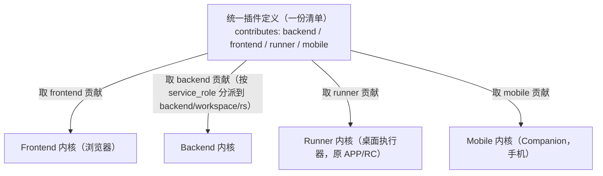
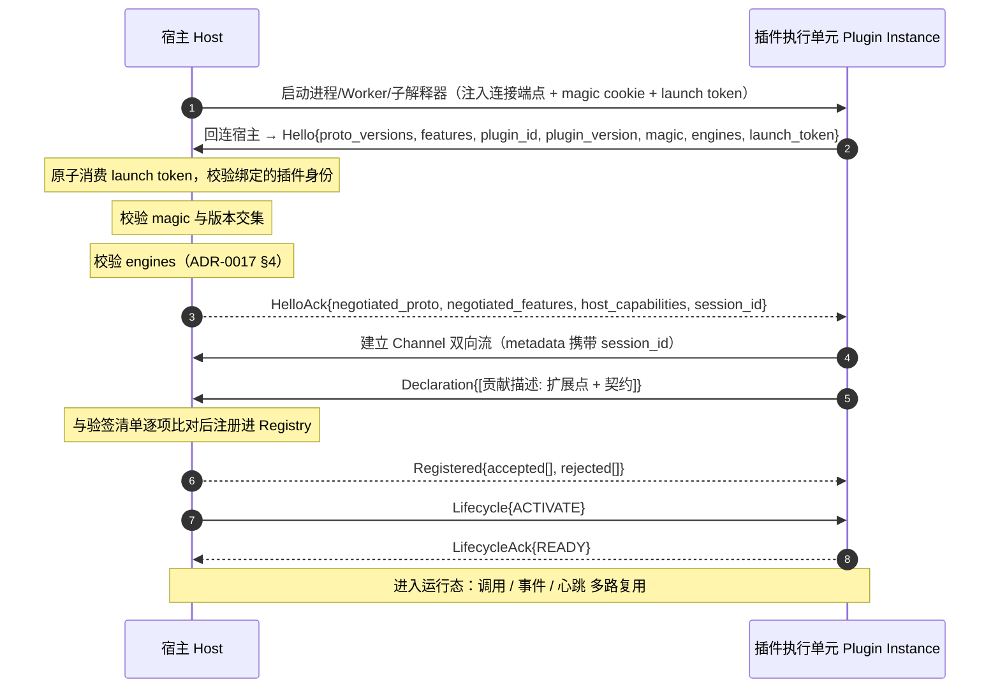
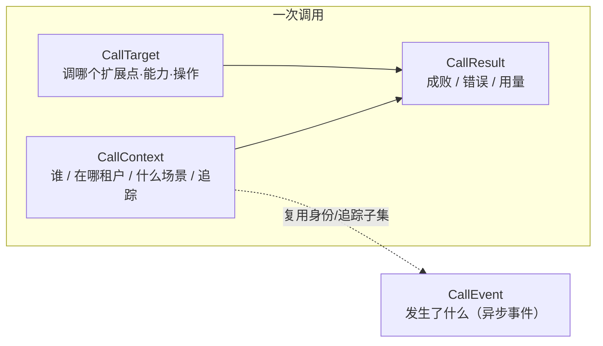

# 插件契约与协议

> 状态：实施设计 v0.4｜最后更新：2026-07-18
> 本文是**插件如何被定义、如何通信、携带什么数据、各扩展点收什么贡献**的单一真相源，整合了统一插件定义（清单）、插件-宿主协议、不可变契约字段、扩展点契约。系统整体架构见《[系统架构](系统架构.md)》；决策依据见《[ADR](../decisions/README.md)》。字段/消息为语义定义，栈无关（[0005](../decisions/ADR-0005-骨架与技术栈解耦.md)）；候选传输 gRPC/Protobuf（[0008](../decisions/ADR-0008-骨架技术选型对比.md)/[0009](../decisions/ADR-0009-内核技术栈选型.md)）。

**三者如何咬合**：清单**声明**贡献 → 协议在握手时把贡献**注册**进扩展点 → 契约是调用/事件流转时携带的**数据**。四处同名闭环：清单贡献 `id` = 协议注册名 = 契约 `CallTarget.capability` = 跨内核寻址逻辑名。

---

## 第一章 统一插件定义（Manifest & 贡献点）

清单是插件的**唯一声明入口**：四套内核只读清单就能知道"这个插件是谁、需要哪些内核能力/资源、在前端/后端/Runner/移动各面各贡献什么、何时激活、依赖谁"。声明与实现分离；一份清单贯通各面（[0006](../decisions/ADR-0006-内核分区与后端组合.md)/[0014](../decisions/ADR-0014-四内核结构.md)）。



### 1.1 设计原则

1. **声明式单一真相源**：能力静态声明，宿主不启动插件代码即可掌握全貌。
2. **一份清单贯通四面**：未声明的面即不占用。
3. **贡献点对齐扩展点**：每类贡献对应骨架一个 Registry，经协议 `RegisterContributions` 注册（第二章）。
4. **capabilities 是装配元数据，不是安全边界**：声明需要什么内核能力/资源，供装配与排依赖；第一方可信无运行时安全强制。
5. **后端贡献带服务角色**：供 Resolver 检查该贡献能否装进目标 backend/workspace/rs 服务；应用配置不能借此选择基础插件。
6. **分类不自报**：Manifest 不包含可提升权限的 `tier`；首方固有分类从已验证命名空间推导，组合来源由 Platform Profile/Application Composition 的解析锁记录（ADR-0057）。

### 1.2 清单文件与顶层字段

文件名 `vastplan.plugin.json`（插件包根目录）。配套 Schema 的唯一来源为
`contracts/schemas/plugin/v1/vastplan.plugin.schema.json`（Draft 2020-12）；制品入库和运行态
descriptor 注册均使用同一套 Schema 校验（[ADR-0023](../decisions/ADR-0023-插件Schema与可验证制品仓库.md)）。

| 字段 | 必填 | 说明 |
|---|---|---|
| `id` | ✓ | 全局唯一，反向域名式；新首方生产插件使用 `cn.vastplan.<layer>.<category...>.<component>`（ADR-0050） |
| `name` / `description` | ✓ | 展示名 / 一句话描述 |
| `version` | ✓ | 语义化版本 |
| `publisher` | ✓ | 发布者标识 |
| `engines` | ✓ | 各内核兼容版本范围，如 `{ backend: "^1.0", frontend: "^1.0", runner: "^1.0", mobile: "^1.0" }` |
| `capabilities` | | 装配元数据（内核能力/资源/凭证句柄），见 §1.6 |
| `contextAccess` | | Backend 对 CallContext 语义字段的必需/可选申请与 baggage 前缀白名单；不是自行授权，见 §1.5.3 |
| `runtime` | | 运行实例策略、状态模型和 capability 可见性/路由，见 §1.5 |
| `execution` | | 各运行面的驱动、参数、运行时要求、平台、协议特性与最低隔离等级；旧清单和旧安装实际态均在运行边界归一化为 `native + trusted-process` |
| `activation` | ✓ | 惰性激活事件，见 §1.7 |
| `dependencies` | | 依赖的其他插件 `{id: versionRange}` |
| `entry` | ✓ | 各面运行时入口 `{ backend, frontend, runner, mobile }` |
| `contributes` | ✓ | 四面贡献集合，见 §1.3 |

首方 `layer` 为 `foundation/platform/product/integration/example`；`category` 至少一级，可用 `data.relational` 这样的多级路径表示功能子域；最后一段是具体组件。`cn.vastplan.*` 与 `publisher=vastplan` 强制绑定；命名空间可用于分类，但不能替代签名和授权。历史 demo ID 只作兼容，不再作为新插件命名样例。

### 1.3 四面贡献 `contributes`

四个可选键 `backend / frontend / runner / mobile`，任意组合（对应四内核，规范 ID 见 [0015](../decisions/ADR-0015-内核与贡献面命名规范.md)）。每条贡献有稳定逻辑 `id`（对应契约 `CallTarget.capability`）。

**后端 `contributes.backend`**（每条贡献必填 `service_role`：backend/workspace/rs；`runnerCapabilities` 固定为 rs）

| 贡献点 | 扩展点(Registry) | 说明 |
|---|---|---|
| `tools` | `tool.package` | Agent 工具包（package + 子命令） |
| `agents` | `agent` | 预置 Agent 定义 |
| `apiRoutes` | `api.route` | 经边缘入口代理的 HTTP 端点 |
| `permissionCheckers` | `permission.checker` | 基于 `(caller,scene,target)` 的权限校验器 |
| `eventSinks` | `event.sink` | 事件汇（审计/可观测消费 CallEvent） |
| `hooks` | `hook` | 关键节点前后钩子 |
| `runnerCapabilities` | `runner.capability` | RS 侧调度能力/执行模式（service_role=rs） |

**前端 `contributes.frontend`**

| 贡献点 | 扩展点 | 说明 |
|---|---|---|
| `views` | `view.slot` | 向侧边栏/面板挂载视图 |
| `editors` | `editor.provider` | 自定义编辑器（含打开/保存/dirty 生命周期） |
| `commands` | `command` | 命令面板/菜单/快捷键命令 |
| `menus` | `menu` | 把命令挂到菜单位 |
| `settings` | `settings` | 插件配置项 |
| `runtimeEngines` | `ui.runtime.engine` | Portal 唯一前端框架运行引擎：生命周期、CSR、Generation 与可选 SSR |
| `renderAdapters` | `ui.render.adapter` | Portal 唯一设计系统：同一 Engine family 下的主题与语义 UI 实现 |
| `structureCompositions` | `ui.structure.composition` | Portal 唯一组合层：页面、导航语义区、标准 Slot、排序与冲突规则 |
| `structureLayouts` | `ui.structure.layout` | Portal 唯一视觉布局：LOGO、菜单方向、页头、正文和侧栏样式 |

**Runner `contributes.runner`**（Runner 内核面，规范 ID 统一 `rc`→`runner`，见 [ADR-0015](../decisions/ADR-0015-内核与贡献面命名规范.md)。编译型客户端插件预编译进二进制、进程内运行，`scripts/workflows` 为运行时下载的内容，见 [ADR-0012](../decisions/ADR-0012-APP内核运行模型.md)）

| 贡献点 | 扩展点 | 说明 |
|---|---|---|
| `scripts` | `runner.script` | 可下发执行的脚本 |
| `workflows` | `runner.workflow` | 多步骤工作流 |
| `interactions` | `runner.interaction` | Runner 可发起的确认、表单与审批交互，以及允许投递的体验面 |
| `runtimeRequirements` | — | 客户端需具备的运行时（如 `python>=3.10`） |

**移动 `contributes.mobile`**（Mobile 内核 Companion，手机；无后台常驻/本地执行，见 [ADR-0014](../decisions/ADR-0014-四内核结构.md)/[0013](../decisions/ADR-0013-APP多档能力与手机Companion.md)）

| 贡献点 | 扩展点 | 说明 |
|---|---|---|
| `views` | `mobile.view` | 移动端呈现视图（监控/查看） |
| `approvals` | `mobile.approval` | 人在环审批项 |
| `triggers` | `mobile.trigger` | 触发工作流/动作 |
| `uiAdapters` | `mobile.ui-adapter` | 原生 UI 框架对框架无关 `ui.contract` 的适配器 |

### 1.4 贡献点如何接入系统（三者对齐）

1. **清单声明**：`contributes.<面>.<贡献点>` 一条 `{ id, ...descriptor }`。
2. **协议注册**：激活握手后经 `RegisterContributions` 注册进对应扩展点 Registry（§2.5）。
3. **契约寻址**：调用时 `CallTarget{ extension_point, capability=id, operation }` 定位（§3.2）；跨服务也用同一 `capability` 逻辑名。

> 清单 `id` = 协议注册名 = 契约 `CallTarget.capability` = 跨内核寻址逻辑名，**四处同名**，是"组合→装配→调用"闭环的锚点。

### 1.5 运行面策略 `runtime`

`runtime` 声明插件运行时能否重复启动、状态由谁负责，以及贡献能力是否允许离开当前内核。它是签名清单的一部分，部署期望态只能在清单允许的策略范围内选择副本数和放置方式。

```json
  "runtime": {
    "instancePolicy": "active-active",
    "stateModel": "external-shared",
    "visibility": "cluster",
    "routing": "queue",
    "routingDomain": "platform",
    "provides": [
    {
      "extensionPoint": "tool.package",
      "capability": "acme.orders",
      "visibility": "cluster",
      "routing": "queue"
    }
  ],
  "requires": [
    {
      "capability": "platform.database",
      "version": "^1.0.0",
      "scope": "remote",
      "kind": "strong",
      "ready": "readiness",
      "failurePolicy": "retry",
      "logicalService": "platform.database",
      "routingDomain": "platform"
    }
  ]
}
```

四种 `instancePolicy`：

- `per-kernel`：每个内核独立实例，只能发布 `local/direct` 能力；
- `active-active`：允许多副本，使用 `service/cluster + queue`；
- `leader`：候选多实例、同一作用域单活，使用 `leader + fencing`；
- `partitioned`：按稳定分片键分配 owner，使用 `shard + lease`。

`stateModel` 必须与实例策略匹配：`local-ephemeral`、`external-shared`、`leader-owned`、`partition-owned`。`visibility` 可取 `local/service/cluster/global`；`routing` 可取 `direct/queue/leader/shard`。

`provides` 可为单个贡献覆盖顶层默认策略；未列出的 backend 贡献继承顶层策略。`routingDomain` 用于隔离同名 capability 的服务副本组；partitioned 调用还必须在 `CallTarget.partition_key` 中提供稳定分片键。`local` 能力只进入本地 Registry，不进入全局 capability 目录。

`requires` 是运行时依赖，不替代制品 `dependencies`。`scope` 可取 `same-node`、`same-kernel`、`remote`；`kind` 可取 `strong`、`soft`、`lazy`、`data`；`ready` 当前支持 `readiness` 和 `health`；`failurePolicy` 可取 `fail`、`degrade`、`retry`。Node Agent 在候选激活前检查强依赖，并在运行中持续监视 readiness lease。

为兼容已有 v1 插件，缺少 `runtime` 的旧清单按历史行为解释为 `active-active + external-shared + cluster + queue`。新插件必须显式声明 `runtime`；平台基础插件不得依赖兼容默认，必须显式使用 `per-kernel + local + direct`。

#### 1.5.1 执行隔离与发布者策略

`execution.backend.minimumIsolation` 是已签名制品提出的不可降低下限。Node Agent 再应用由内核使用者配置的发布者运行策略：未命中专属规则时使用全局 `require-isolation / allow-trusted / deny`，命中时以发布者规则优先。`allow-trusted` 只表示宿主不额外提高隔离等级；最终仍须满足清单下限。生产默认对未知发布者使用 `require-isolation`，驱动能力不足时拒绝启动，完整优先级与迁移语义见 [ADR-0048](../decisions/ADR-0048-发布者级插件运行策略.md)。

#### 1.5.2 可选 dynamic-go 制品

首方 Go 插件可在 `execution.backend.dynamicGo` 中声明 `{entry, abi, fingerprint, required}`，当前唯一 ABI 是
`vastplan.dynamic-go.v1`。`entry` 指向同一签名包内的 `.so`；独立进程的 `entry.backend`
继续保留；`fingerprint` 由共同打包流程写入签名 Manifest，并在 `plugin.Open` 前验证。
`required=true` 禁止进程回退，且必须由部署方的 `require-dynamic-go` 匹配；它不能提升
插件权限。该字段不是权限声明：只有代码硬编码的
首方身份、部署 PlacementPolicy、共同构建指纹、平台/工具链/共享依赖与 LaunchPolicy
全部通过时才加载。第三方声明会被忽略或拒绝，不能借 Manifest 进入内核进程（ADR-0051）。

`dynamic-go` 仅用于经过共同构建和签名的首方插件。模块不能在同一 Go 进程内卸载，因此升级创建新的 Go Runtime Host generation，切换后排空旧 generation；Backend 不加载模块，也无需随插件升级重启。

#### 1.5.3 托管语言执行单元

Backend 使用统一 `PluginExecutionDriver` 启动进程、托管语言运行单元和受控内嵌实例。驱动直接返回统一 `PluginInstance`，主生命周期不再按语言生成或分派 `LaunchSpec`。

Node Worker 插件使用 `driver=node-worker`，并必须显式声明：

```json
"node": { "workerSafe": true, "moduleFormat": "esm" }
```

Python 子解释器插件使用 `driver=python-subinterpreter`，并必须显式声明：

```json
"python": { "subinterpreterSafe": true }
```

`subinterpreterSafe` 覆盖插件及其全部依赖；只要存在不支持多解释器的原生扩展就必须为 false，并改用独立进程 `driver=python`。缺少声明不等价于兼容，驱动必须 fail-closed。Node Worker 和 Python 子解释器都属于 `trusted-runtime`，能整体释放执行环境但不是第三方安全沙箱。

Node Runtime Host 默认按服务、运行要求和发布者信任域池化：一个物理 Host 承载多个受管 Worker，Worker 才是可替换执行单元。Node SDK 从 Runtime Host 注入的契约目录加载同一份 Protobuf，插件不能自带修改版协议。每个 Worker 保持独立 `PluginInstance`、一次性启动票据和逐插件生命周期；部署方可将精确插件或发布者显式设为 `dedicated`。

Python Runtime Host 同样按兼容边界池化，但把协议面和业务面分开：一个主解释器可持有多个独立 gRPC 会话，每个插件业务入口位于自己的子解释器，只加载纯 Python 插件桥接与业务依赖。这样原生 gRPC 扩展不进入子解释器；插件自身的原生依赖仍必须满足 `subinterpreterSafe` 承诺。桥接只宣告实际支持的协议 feature，当前静态贡献与 Invoke 之外的能力不得伪装可用。

第三方隔离 Host 由部署方在 Backend 启动环境注册，清单只能引用稳定驱动名，不能声明 Host 路径或隔离等级实现。内核只注册显式配置的 `process-sandbox/container/wasm-component` Host，并固定其能力等级；未配置、不可执行、入口逃逸安装根或能力低于发布者策略时全部 fail-closed。具体 Host 是安全产品边界，必须按部署基线实现文件、网络、进程、系统调用、资源和凭证限制，不能由通用子进程包装器替代。

#### 1.5.4 上下文访问申请与发布者上限

Backend 插件用签名清单声明最小上下文使用面：

```json
"contextAccess": {
  "required": ["scope.tenant", "caller", "trace"],
  "optional": ["subject.id", "authorization.roles", "baggage"],
  "baggage": ["com.acme.orders.*"]
}
```

字段路径的稳定集合为 `scope.tenant/scope.project/caller/scene/subject.id/subject.profile/authorization.roles/authorization.admin/trace/request.deadline/request.idempotency/grant.credentials/baggage/propagation.callPath`。同一字段不得同时放入 required 和 optional；声明 baggage 前缀前必须申请 `baggage`，且不能申请 `vastplan.internal.*` 或 `vastplan.transport.*`。

清单只表达需求。宿主计算 `扩展点上限 ∩ 清单申请 ∩ 发布者上限 ∩ 运行边界上限 ∩ 上游委托` 后再序列化；required 未进入交集时拒绝调用，optional 被静默裁剪。Node Agent 的 `ContextPolicy` 使用精确发布者覆盖优先于全局默认，默认只给未知发布者 tenant/project、caller、scene、subject id、trace 与请求控制字段；`vastplan` 首方上限更宽，但仍受清单和扩展点约束。完整决策见 [ADR-0061](../decisions/ADR-0061-统一调用信封与受众投影.md)。

### 1.6 装配元数据 `capabilities`

声明插件**需要什么**，供装配注入与排依赖——不是安全强制。

| 键 | 语义 |
|---|---|
| `kernelServices` | 需要的内核服务（`llm.orchestration` / `event.bus` / `storage`） |
| `credentials` | 需申领的凭证名（值由宿主按**句柄**注入，明文不过插件——见 §3.9） |
| `resources` | 资源约束（GPU、特定运行时），供节点选择/放置 |

### 1.7 激活事件 `activation`

插件默认**惰性**，仅在声明事件发生时被唤醒；各面可独立激活。事件如 `onStartup` / `onView:<id>` / `onCommand:<id>` / `onAgentTool:<package>` / `onRunnerScript:<id>`。

### 1.8 依赖 `dependencies`

`{ "com.acme.crm-core": "^2.0.0" }`。生命周期管理器解析依赖树、定序激活、检测环状依赖。

### 1.9 Backend 私有状态与迁移

需要持久业务状态的 Backend 插件使用 `state.backend` 声明状态身份；状态结构仍是插件私有实现，内核只比较身份并编排迁移事务：

```json
"state": {
  "backend": {
    "format": "com.acme.sales.state",
    "formatVersion": 2,
    "migration": {
      "protocol": "lifecycle.v1",
      "from": [{ "format": "com.acme.sales.state", "formatVersion": 1 }]
    }
  }
}
```

首次引入状态可省略 `migration`；已有状态身份变化时，新版本必须精确声明旧身份。迁移采用
copy-on-write 的 `PREPARE → COMMIT`，候选取得路由所有权前任一失败都执行 `ROLLBACK`；
插件必须按确定性 transaction ID 幂等。候选能力先以 `starting` 租约整组预注册，调用门闩只在全部准备成功后打开，禁止半发布候选接流量。内核不读取或复制私有状态，完整顺序见 [ADR-0033](../decisions/ADR-0033-Backend插件状态迁移事务.md)。

### 1.10 与插件服务/期望态的衔接

制品随 gzip tar 插件包发布到插件服务制品仓库：包根必须有且仅有一份 `vastplan.plugin.json`，
仓库索引记录并复核 `pluginId/version/channel/sha256/size/object/manifest`；同一三元组禁止改写，
读取时 SHA-256 或清单绑定不一致即拒绝。Platform Profile 声明本地基础附件和共享平台服务，Application Composition 只引用应用插件；Resolver 读取已验证清单并按 `service_role`、service class、runtime policy 和 capability requirement 生成完整 Deployment。完整分级和来源锁见《[插件分级与组合解析](插件分级与组合解析.md)》；应用不能直接提交完整期望态绕过该过程。

制品来源与信任判定严格分离（ADR-0049）：内置或插件化 `ArtifactSource` 只能返回未信任
Envelope；Manifest、摘要、完整包、文件数/展开大小资源上限和发布者证明经内核
`ArtifactVerifier` 统一验证后才生成 `VerifiedArtifact`，安装器不接受来源直接返回的普通
Artifact。来源获取接受取消上下文；仓库基础插件由签名种子仓库预置，不能依赖自己下载自己。

清单可成对声明 `license`（SPDX 表达式）与 `licenseFile`（包内相对路径），并可用
`noticeFile` 声明归属告示。为兼容既有 v1 制品，三字段仍可省略；一旦声明，打包和读取都会
确认相应文件存在、唯一、非空且大小受限。当前第一方插件统一使用 `Apache-2.0`，并在制品根
携带 `LICENSE` 与 `NOTICE`，详见 [ADR-0046](../decisions/ADR-0046-Apache开源许可与插件制品声明.md)。

### 1.11 完整示例

```jsonc
{
  "id": "com.acme.sales-copilot",
  "name": "销售助手",
  "version": "1.0.0",
  "publisher": "acme",
  "license": "Apache-2.0",
  "licenseFile": "LICENSE",
  "noticeFile": "NOTICE",
  "description": "为销售流程提供 Agent 工具、工作台面板与客户端采集脚本",
  "engines": { "backend": "^1.0", "frontend": "^1.0", "runner": "^1.0" },
  "runtime": {
    "instancePolicy": "active-active",
    "stateModel": "external-shared",
    "visibility": "cluster",
    "routing": "queue",
    "routingDomain": "platform"
  },
  "capabilities": {
    "kernelServices": ["llm.orchestration", "event.bus"],
    "credentials": ["acme-crm"],
    "resources": []
  },
  "state": {
    "backend": { "format": "com.acme.sales.state", "formatVersion": 1 }
  },
  "activation": ["onAgentTool:acme.crm", "onView:acme.salesPanel"],
  "dependencies": { "com.acme.crm-core": "^2.0.0" },
  "entry": { "backend": "dist/backend/main", "frontend": "dist/frontend.js", "runner": "runner/" },
  "contributes": {
    "backend": {
      "tools": [
        { "id": "acme.crm", "service_role": "backend", "title": "CRM 操作",
          "subcommands": [
            { "name": "query",  "description": "查询客户", "paramsSchema": { } },
            { "name": "update", "description": "更新客户", "paramsSchema": { } }
          ] }
      ],
      "eventSinks": [ { "id": "acme.audit", "service_role": "workspace" } ]
    },
    "frontend": {
      "views": [ { "id": "acme.salesPanel", "title": "销售看板", "slot": "sidebar" } ],
      "commands": [ { "id": "acme.syncCrm", "title": "同步 CRM" } ]
    },
    "runner": {
      "scripts": [ { "id": "acme.collectLogs", "runtime": "python", "entry": "runner/collect_logs.py", "paramsSchema": { } } ],
      "runtimeRequirements": ["python>=3.10"]
    }
  }
}
```

---

## 第二章 插件-宿主协议（Plugin-Host Protocol）

**范围是内核内**：一套内核宿主与它在本节点管辖的插件实例。Backend 的进程、Node Worker、Python 子解释器和受控 dynamic-go 实例复用相同的调用、授权与生命周期语义（[0088](../decisions/ADR-0088-Backend统一执行驱动与托管语言运行时.md)）。跨服务/跨机器不归本协议（走《[系统架构 · 第二章](系统架构.md)》的 mesh）。承载物是第三章的不可变契约。

### 2.1 设计原则

1. **双向对等**：宿主调插件（扩展点被触发），插件也回调宿主（取内核服务、发事件、经寻址层调别的能力）。
2. **声明式握手**：插件连上先认领宿主签发的一次性启动令牌，再声明贡献；生产装配把运行时声明与已验签清单逐项比对后接入扩展点。
3. **多路复用单连接**：宿主与单个插件一条主连接，其上多路复用调用/事件/生命周期/心跳。
4. **版本协商 + 兼容**：握手协商协议版本，不兼容即拒绝（fail-closed）。
5. **故障可感知**：心跳 + 断连检测；插件崩溃即摘除其贡献。
6. **流式一等**：结果/日志等大流量用流式。

### 2.2 连接模型与握手



- **方向**：**宿主是 gRPC 服务端，插件回连**。故插件→宿主的回调天然可行；宿主→插件的调用经 Channel 双向流下发，用 `request_id` 关联请求与响应。
- **magic cookie**：防止误把普通进程当插件。
- **会话票据**：宿主**在校验 magic/版本/engines 之后**签发的插件实例身份，用于审计与回调鉴权；插件在 Channel 的 gRPC metadata 中回带它。
- **launch token**：宿主拉起插件时注入的一次性认证令牌。握手必须原子消费仍在等待的令牌，并核对绑定的插件 ID、版本和签名清单授权；空、未知、复用或过期令牌一律拒绝（ADR-0043）。
- **执行环境**：默认只注入连接端点、magic 和 launch token；Backend 环境变量不继承，需要额外变量时由部署方显式列入非敏感允许列表。Runtime Host 只能把本次票据投递给目标 Worker/子解释器。
- **协议版本协商**：`Hello` 带插件支持的版本集，宿主取交集回 `HelloAck`；无交集拒绝并终止。
- **能力协商**：新增可选能力不抬高 v1 wire 主版本。当前登记 `channel.cancel.v1`、`contribution.dynamic.v1`、`event.publish.v1`；宿主只返回交集，清单 `execution.backend.features` 中的必需能力未协商成功则拒绝启动。旧客户端不发送 features，继续按原 v1 行为运行。
- **单流认领**：一个 `session_id` 只能认领一条 Channel；并发或重复建流一律拒绝，防止两个连接争用同一插件身份。

### 2.3 运行态消息总览

dynamic-go 由 generation-scoped Go Runtime Host 从 Manifest `execution.backend.dynamicGo` 指向的已签名 `.so` 读取 `vastplan.dynamic-go.v1` 模块。Runtime Host 在 `plugin.Open` 前验证签名清单中的共同构建指纹，再复核首方命名空间、Go 工具链/平台/关键参数和共享依赖；随后为每个模块建立独立 gRPC session，使其与其他 `PluginInstance` 共享 Registry、`Host.Invoke`、宿主回调身份重签、资源限制、Drain 和迁移语义。放置策略仍是节点运维策略；`dynamicGo.required` 可禁止进程回退，但不能请求进入 Backend 进程。

Node/Python/Go Runtime Host 属于内核发布物和信任计算基，默认采用共享宿主。Pool key 包含内核服务、Provider、隔离等级、发布者信任域、平台、执行要求摘要和必要的不可卸载 generation；不同硬边界不得合池。每个 Worker、子解释器或 Go 模块必须拥有独立 session、死亡信号、允许环境和停止能力；一个执行单元退出不能伪造或关闭其他插件的会话。热替换始终创建候选执行单元并原子切换，不依赖 ESM/importlib 缓存失效或 Go 模块卸载。详见 [ADR-0089](../decisions/ADR-0089-Runtime-Provider与共享Host池.md)。

| 类别 | 方向 | 用途 |
|---|---|---|
| **调用 Invoke** | 宿主→插件 / 插件→宿主 | 扩展点被触发时宿主调插件；插件回调宿主内核服务或经寻址层调别的能力 |
| **事件 Event** | 双向 | 内核事件下发给订阅插件；插件发布事件 |
| **生命周期 Lifecycle** | 宿主→插件 | activate / deactivate / drain / shutdown / migration prepare / commit / rollback |
| **心跳 Health** | 双向 | 保活与探活，断连即故障处置 |
| **贡献更新 ContributionUpdate** | 插件→宿主 | 在签名清单授权集合内动态启用/停用贡献 |
| **取消 Cancel** | 双向 | 按 `request_id` 取消尚未完成的 Invoke/HostCall；重复或迟到取消幂等忽略 |

### 2.4 调用协议（Invoke）

- **一元**：`InvokeRequest{ target: CallTarget, context: CallContext, payload }` → `InvokeResponse{ result: CallResult, payload }`。
- **流式**：服务端流（日志/进度/大结果回流）、客户端流/双向流（大输入或交互）。
- **插件回调宿主**（`HostCall`）：用同样的 `target + context` 回调宿主；本地命中即内核服务，否则转交寻址层到别的服务。凭证类回调由宿主注入、明文不过插件。
- **超时/取消**：`context` 带 deadline；协商 `channel.cancel.v1` 后，Host 与 SDK 在调用方取消时发送 `Cancel{request_id}`，接收方取消对应执行上下文。旧客户端仍以 deadline 为兜底。

#### 2.4.1 Backend 1.0 资源边界

Host、第一方 SDK 与 addressing 共用 `core/shared/go/protocollimit.Limits`，并在每一跳执行同一份限制。默认一元 payload 4 MiB、流帧 1 MiB、`CallContext`/传输 metadata 16 KiB、并发 256、pending 512、能力调用深度 16、调用 deadline 30 秒、drain 30 秒；零值表示采用安全默认而不是禁用限制。完整决策与拒绝语义见 [ADR-0034](../decisions/ADR-0034-Backend协议资源边界.md)。

deadline 取调用方 context、`CallContext.deadline_unix_ms` 与默认值中的最早者，并写入克隆后的 `CallContext` 向插件或远端服务传播。大于一元上限的数据必须使用对象存储引用或分片流；流的 HTTP/2 背压不能替代单帧硬上限。

Host 在公开调用入口维护 `CallContext.call_path`：目标已在路径中时返回 `call.cycle_detected`，路径达到最大深度时返回 `call.depth_exceeded`。第一方 SDK 自动继承路径，addressing 原样透传；deadline 仍是非协作实现的最终兜底。详见 [ADR-0039](../decisions/ADR-0039-Backend能力调用环保护.md)。

### 2.5 贡献注册协议

- `RegisterContributions{ contributions:[{ extension_point, id, descriptor }] }`：`extension_point`=目标 Registry 名；`id`=贡献稳定逻辑名（跨内核寻址也用它）；`descriptor`=该扩展点要求的贡献契约。
- 宿主校验后注册进 Registry，返回 `Registered{ accepted, rejected(带原因) }`。
- **动态性**：协商 `contribution.dynamic.v1` 后，初始 Declaration 可为签名清单授权集合的子集，后续 `RegisterContributions` / `UnregisterContributions` 按 `request_id` 更新。新增贡献必须与签名清单的扩展点、id、priority、descriptor 完全一致；卸载只能操作当前插件拥有的贡献。未协商时仍要求初始集合精确一致。
- **寻址边界**：动态启停只改变本宿主 Registry；跨节点能力目录仍以已验签清单和 service unit 生命周期为发布边界，避免单进程波动引发控制面抖动。本地停用期间远端调用会按能力不可用 fail-closed。

### 2.6 事件、生命周期、心跳

- **事件**：协商 `event.publish.v1` 后，插件可发送 `EventEnvelope{event}`；宿主验证必填字段和 payload 上限，强制把 `source` 改为会话插件 ID、清除插件自报的 `principal_ref`，再经有界异步队列扇出到事件汇，避免 Channel 读循环重入死锁。宿主下发事件由 SDK 的事件处理器接收；跨服务投递语义仍随 NATS/JetStream 平面而定。
- **生命周期**：`Lifecycle{ op }` 的常规操作为 `{ACTIVATE, DEACTIVATE, DRAIN, SHUTDOWN}`。DRAIN=停收新调用、完成在途（升级/缩容前）。有状态升级另有 `{MIGRATION_PREPARE, MIGRATION_COMMIT, MIGRATION_ROLLBACK}`，携带确定性事务 ID 与前后状态身份；切换前失败逆序回滚（ADR-0033）。
- **心跳/崩溃**：进程和 Runtime Host 执行单元双向心跳，失联即从所有 Registry 摘除贡献。Worker/子解释器/Go 模块可被 Runtime Host 整体释放，但原生 Addon/扩展、全局 OOM 或 Runtime Host 崩溃仍会影响同宿主实例，因此只属于 `trusted-runtime`。dynamic-go 不能在原进程卸载，升级通过新旧 Host generation 替换（[0089](../decisions/ADR-0089-Runtime-Provider与共享Host池.md)）。

### 2.7 版本、错误、传输

- **版本**：协议版本整数递增，握手取交集 fail-closed；贡献 `id` 可带版本（`acme.crm@1`）支持灰度并存。
- **错误**：传输层错误（连接断/超时）视作失联；应用层错误走 `CallResult.error`（错误码 + 是否可重试），二者严格区分。
- **传输**：候选 gRPC over HTTP/2 + Protobuf（契合 Go 宿主 + go-plugin 范式）；契约不绑定于此，wire 版本另行 ADR。

### 2.8 proto（真源：`contracts/proto/pluginhost/v1/pluginhost.proto`）

服务由**宿主**实现，插件是客户端：

```proto
service PluginHost {
  rpc Handshake(Hello) returns (HelloAck);                  // 插件→宿主
  rpc Channel(stream FromPlugin) returns (stream FromHost); // 运行态多路复用
}
message FromHost {  // 宿主→插件
  oneof msg {
    Registered registered = 1;
    InvokeRequest invoke = 2;            // 触发扩展点
    InvokeResponse host_call_result = 3; // 回应插件 HostCall
    EventEnvelope event = 4;
    Lifecycle lifecycle = 5;
    Ping ping = 6;
  }
}
message FromPlugin { // 插件→宿主
  oneof msg {
    Declaration declare = 1;          // 流上首条消息
    InvokeResponse invoke_result = 2;
    InvokeRequest host_call = 3;      // 回调宿主/经寻址层调别的能力
    EventEnvelope event = 4;
    LifecycleAck lifecycle_ack = 5;
    Pong pong = 6;
  }
}
// 带 request_id 的消息（Invoke/Lifecycle/Ping 及其响应）据此在流上关联请求与响应。
```

> **实现注记（踩过的坑）**：宿主必须**先启动读循环再发激活指令**——`Lifecycle{ACTIVATE}` 要等 `LifecycleAck`，而 Ack 只能由读循环收到，同步等待会**自我死锁**。凡"发出去再等回来"的交互都受此约束。

---

## 第三章 契约字段（Immutable Contracts）

四个**不可变契约** `CallContext / CallTarget / CallResult / CallEvent`——**一次定义、所有方共用**，既走插件-宿主协议（内核内），也走内核间通信（跨服务），是全链路上下文、权限、计量、可观测一致的基础。



### 3.1 设计原则

单一定义处处共用；跨平面同构（内核内/内核间不转译）；场景化三元组 `(caller,scene,target)`；凭证不入契约明文（只带句柄）；可扩展但不破坏。Wire 信封统一不等于所有字段无差别透传：宿主在每个受众边界执行最小权限投影，详见 [ADR-0061](../decisions/ADR-0061-统一调用信封与受众投影.md)。

### 3.2 CallContext —— 调用上下文

| 字段 | 类型 | 说明 |
|---|---|---|
| `principal` | Principal | 发起者身份，见 §3.6 |
| `caller` | Caller | 调用方种类 + id（三元组之 caller） |
| `scene` | string | 场景名（三元组之 scene），如 `agent.tool_call` / `frontend.api` / `runner.exec` |
| `tenant_id` | string | 企业租户（多租户隔离锚点） |
| `project_id` | string? | 当前项目/工作区 |
| `trace` | Trace | `{ trace_id, span_id, parent_span_id }` |
| `deadline` | timestamp? | 调用截止；超时即取消 |
| `credentials` | CredentialRef[] | 凭证**句柄**列表（非明文），见 §3.7 |
| `idempotency_key` | string? | 幂等键，供重试去重 |
| `metadata` | map<string,string> | 非敏感、命名空间化 baggage；宿主保留前缀禁止外部写入 |
| `call_path` | string[] | 宿主维护的能力目标路径；SDK 只继承，用于调用环与深度保护 |

### 3.3 CallTarget —— 调用目标

| 字段 | 类型 | 说明 |
|---|---|---|
| `extension_point` | string | 目标 Registry/扩展点名 |
| `capability` | string | 贡献稳定逻辑名（=清单 id）；跨内核寻址也用它 |
| `version` | string? | 能力版本，支持灰度并存 |
| `operation` | string? | 具体操作/子命令 |
| `payload_schema` | string? | 入参 schema 引用（值在 payload） |
| `logical_service` | string? | 目标服务副本组；为空时保持旧 capability-only 路由 |
| `routing_domain` | string? | 同名 capability 的 queue/leader/shard 隔离域 |
| `partition_key` | string? | `partitioned` 能力的稳定分片键 |
| `instance_id` | string? | 契约定义的短期有状态会话所需精确健康实例；普通业务配置不得长期固化 |

`instance_id` 不改变服务的默认实例策略。为空时仍按 queue/leader/shard 规则选择；非空时 Router 必须先在同一 logical service、routing domain 和 partition 范围内确认该实例的健康租约，再使用实例独立 subject 直达，实例不存在或 draining 时 fail-closed。它适用于数据库事务等短期状态亲和，不可替代 partition ownership，也不得用来绕过 readiness 或 fencing。

### 3.4 CallResult —— 调用结果

| 字段 | 类型 | 说明 |
|---|---|---|
| `status` | enum | `OK / ERROR / PARTIAL` |
| `error` | Error? | `{ code, message, retryable, details }`；`code` 稳定命名空间化（`permission.denied` 等）。**应用层错误与传输层错误严格区分** |
| `usage` | Usage? | 计量：`{ duration_ms, tokens?, cost?, custom{} }` |
| `warnings` | string[] | 非致命提示 |
| `metadata` | map<string,string> | 可扩展结果元数据 |

> 业务数据在协议信封 `payload`；`CallResult` 是成败与元信息。

Backend Kernel 1.0 的稳定错误码由 `core/shared/go/errorcode` 单一登记：

| 层级 | 稳定错误码 |
|---|---|
| 应用层 `CallResult.Error` | `call.cycle_detected`、`call.depth_exceeded`、`capability.not_found`、`hook.aborted`、`hostcall.failed`、`kernel.service_error`、`permission.denied`、`plugin.handler_error`、`plugin.inactive` |
| 传输层 `TransportError` | `remote.invalid_response`、`remote.invoke_failed`、`remote.stream_failed`、`wire.invalid_request`、`wire.target_mismatch` |
| 资源边界（按信封是否已建立进入应用层或传输层） | `resource.concurrency_limited`、`resource.metadata_too_large`、`resource.payload_too_large`、`resource.queue_full` |

插件可以定义自己的应用错误码，但必须使用至少两段的小写点分命名空间（如 `sales.order_rejected`）；不得占用内核已登记 code。`message` 可改进诊断文案，调用方不得依赖它做分支。

### 3.5 Caller 与三元组

**Caller** `{ kind, id }`，`kind` ∈ `{ user, agent, plugin, system, runner }`（CallerKind 登记）。**三元组 `(caller, scene, target)`** 是权限/计量/统计的统一判定依据（校验器/事件汇为扩展点）。

### 3.6 Principal —— 统一身份

| 字段 | 类型 | 说明 |
|---|---|---|
| `user_id` / `username` | string | 用户 id / 展示名 |
| `is_admin` | bool | 系统管理员 |
| `tenant_id` | string | 所属租户 |
| `system_roles` | string[] | 系统级角色（数据驱动） |
| `project_roles` | map<string,string[]> | `{project_id:[role_id...]}` |
| `session_id` | string? | 会话/审计标识 |

> 由认证边界（Frontend 边缘入口 / Runner 接入 / 服务内网信任）构造并校验后注入可信上下文。`CallContext.tenant_id` 是规范租户值；兼容保留的 `Principal.tenant_id` 必须与其一致。对下游只发放受众投影快照，不把原始可变指针交给插件。

### 3.7 凭证句柄 CredentialRef

`{ name, scope }`——只带名字与范围，不带值；运行时由宿主凭证系统按句柄注入执行侧，**明文永不进契约、不过插件、日志脱敏**。Backend 宿主通过 `kernelspi.CredentialBroker.WithCredential` 把 material 限制在可信回调生命周期内，不提供“读取明文”协议；配置、持久化与事务的 scope 和替换边界见 [ADR-0036](../decisions/ADR-0036-Backend核心SPI边界.md)。

### 3.8 CallEvent —— 事件

| 字段 | 类型 | 说明 |
|---|---|---|
| `id` | string | 事件唯一 id（去重） |
| `type` | string | 命名空间化事件类型（`task.completed` 等） |
| `source` | string | 发出方（服务/插件 id） |
| `subject` | string? | 事件主体（资源引用或 CallTarget 摘要） |
| `occurred_at` | timestamp | 发生时间 |
| `tenant_id` | string | 租户 |
| `trace` | Trace? | 与触发调用关联 |
| `principal_ref` | string? | 触发者引用（审计用） |
| `payload` | bytes | 事件数据（按 type 约定 schema） |

> 可对齐 CloudEvents 信封；投递语义由事件平面（NATS/JetStream）定。审计/可观测插件在 `event.sink` 消费。

### 3.9 透传与版本

- **传播**：跨服务与内核内共用同一 Wire 定义但不无差别透传。宿主持有可信快照，每跳派生新 `span_id`、`trace_id` 不变，并向 `call_path` 追加当前目标；发给具体插件、钩子、策略或远端服务前按扩展点、清单、发布者、运行边界与上游委托的交集投影。CallEvent 承接 `trace_id` 挂回调用链。
- **控制信息隔离**：delegation token 属于 Plugin-Host 调用信封，transport identity 属于宿主 provenance；二者不得写入 `metadata`。`vastplan.internal.*` 与 `vastplan.transport.*` 为保留前缀。
- **窄视图**：内核业务代码优先读取 `ScopeView / CallerView / SubjectView / AuthorizationView / TraceView / RequestControlView / GrantView / BaggageView`，避免字段依赖扩散。视图本身不是第三方安全边界，真正的强制点仍是序列化前投影。
- **版本**：契约只增不改，新增字段可选、老方忽略未知字段；破坏性变更走版本跃升，可多版本并存一段时间。
- **可执行兼容矩阵**：`engineering/arch/compatibility_test.go` 固定协议版本、Schema URL、公开扩展点、稳定错误码、proto package、已发布字段编号/wire kind、enum 数值及 gRPC 流式形态。允许新增字段，删除、改名、改号或改 wire kind 会在 CI 失败。

### 3.10 schema 草案（示意）

```proto
message CallContext {
  Principal principal = 1; Caller caller = 2; string scene = 3;
  string tenant_id = 4; optional string project_id = 5; Trace trace = 6;
  optional int64 deadline_unix_ms = 7; repeated CredentialRef credentials = 8;
  optional string idempotency_key = 9; map<string,string> metadata = 10;
  repeated string call_path = 11;
}
message CallTarget { string extension_point = 1; string capability = 2;
  optional string version = 3; optional string operation = 4; optional string payload_schema = 5;
  optional string logical_service = 6; optional string routing_domain = 7; optional string partition_key = 8;
  optional string instance_id = 9; }
message CallResult { enum Status { OK=0; ERROR=1; PARTIAL=2; } Status status = 1;
  optional Error error = 2; optional Usage usage = 3; repeated string warnings = 4; map<string,string> metadata = 5; }
message CallEvent { string id=1; string type=2; string source=3; optional string subject=4;
  int64 occurred_at_unix_ms=5; string tenant_id=6; optional Trace trace=7; optional string principal_ref=8; bytes payload=9; }
```

---

## 第四章 扩展点契约（Extension Point Catalog）

第一章 §1.3 给出了"贡献点 → 扩展点"的速览；本章逐一定稿**每个扩展点（Registry）收什么贡献（descriptor）**与**分发语义**。这是 `RegisterContributions`（§2.5）里 `descriptor` 的字段来源，也是 `CallTarget`（§3.3）寻址的目标。

### 4.1 扩展点三要素

每个扩展点由三部分定义：

1. **Registry 名 / 扩展点 ID**：如 `tool.package`（= `CallTarget.extension_point`）。
2. **贡献 descriptor**：插件注册时提交的声明字段（下各表）。每条贡献带稳定 `id`（= `CallTarget.capability`，四处同名）。
3. **分发语义**：一次触发如何路由到贡献（§4.2）。

### 4.2 分发语义（四类）

| 语义 | 含义 | 典型扩展点 |
|---|---|---|
| **single**（单一提供者） | 一个 `id` 由唯一贡献提供，调用直接路由 | `tool.package` / `agent` / `api.route` / `editor.provider` |
| **select**（择一） | 多提供者按 `priority` + 匹配择一，返回决定性结果即止 | `permission.checker` |
| **fanout**（扇出） | 所有匹配贡献都收到，按 `priority` 排序执行 | `event.sink` / `hook` |
| **mount**（登记挂载） | 注册即呈现/挂载，非请求响应式（命令可再被 invoke） | `view.slot` / `command` / `menu` / `settings` / `mobile.*` |

> 所有 Backend manifest contribution 通用字段：`id`（稳定逻辑名，可带 `@version`）、`service_role`、`title?`、`priority?`；运行态 descriptor 不重复携带 `id`/`priority`，二者位于协议 `Contribution` 信封。Backend 1.0 不接受尚无求值语义的 `when` 字段，见 ADR-0031。

### 4.3 Backend 面扩展点

| 扩展点 | 分发 | descriptor 特有字段 |
|---|---|---|
| `tool.package` | single | `service_role`；`subcommands: [{ name, description, paramsSchema, resultSchema? }]` |
| `agent` | single | `systemPrompt`（必填）、`role?`、`tools: [capabilityRef]`、`model?`、`defaultScene?` |
| `api.route` | single | `method`、`path`（挂到边缘入口命名空间）、`auth: session|service|public`、`service_role` |
| `permission.checker` | select | `applies: { caller?, scene?, target? }`（匹配范围）、`priority`；输入 `(caller,scene,target)` → `allow/deny/abstain` |
| `event.sink` | fanout | `subscribe: [eventTypeGlob]`、`priority?`；消费 `CallEvent` |
| `hook` | fanout | `point`（钩子位名）、`phase: before|after`、`priority` |
| `runner.capability` | single | `service_role: rs`、`kind`（执行模式/调度能力）、`params?` |

> `permission.checker` 组合规则：按 `priority` 高→低，遇到第一个非 `abstain` 即定论；全 `abstain` 则 fail-closed（deny）。
> **强制点**：`Host.Invoke` 在分发前强制判定（含插件回调宿主）；**零校验器 = 拒绝所有调用**——
> 没装权限插件就没有授权依据，放行会让"忘装"变成静默全开放（[ADR-0021](../decisions/ADR-0021-权限判定强制点.md)）。
> 校验器 descriptor 非法 → 跳过并留痕；不可达/报错/回答无法解析 → 一律判拒。
> `event.sink` 的 `subscribe` **留空 = 不订阅任何事件**（而非订阅全部），同为 fail-closed。
> 扇出**失败隔离**：某个汇失败不影响其余——审计插件挂了不该连带可观测插件哑火。
> `hook` 的当前钩子位为 `invoke`：每次 `Host.Invoke` 固定按 **before Hook → 权限判定 →
> 目标分发 → after Hook** 执行。before Hook 按 priority 高→低顺序调用，任一 `abort: true`
> 返回 `hook.aborted` 并终止后续阶段；after Hook 只收到已完成调用的 `HookResult`，其回答不改变
> 主调用结论。Hook 内部调用走非公开分发路径，避免递归触发 Hook 或权限判定。
>
> `capabilityRef` 与 `CallTarget` 同构：`{ extensionPoint, capability, version?, operation? }`。
> `kernel.service` 仅是宿主内部能力命名空间，不属于插件可贡献目录；插件通过
> `capabilities.kernelServices` 声明依赖并经 HostCall 调用，注册同名 contribution 会 fail-closed。

### 4.4 Frontend 面扩展点

| 扩展点 | 分发 | descriptor 特有字段 |
|---|---|---|
| `view.slot` | mount | `slot: sidebar|panel|statusbar|…`、`icon?`、`order?` |
| `editor.provider` | single | `resourceMatch`（glob/类型）、`capabilities: [open,save,dirty]`、`priority?`（多匹配时） |
| `command` | mount | `icon?`、`category?`；被菜单/快捷键/命令面板 invoke |
| `menu` | mount | `menu`（菜单位 id）、`command`（command id）、`group?`、`order?` |
| `settings` | mount | `key`、`type: string|number|bool|enum`、`default`、`options?`、`scope: user|tenant` |
| `ui.runtime.engine` | single | `family`、`engineContract`、`browserEntry`、`serverEntry?`、`capabilities`（至少 csr/generation）；每个 Portal 只能选择一个 |
| `ui.render.adapter` | single | `uiContract`（SemVer 范围）、`engineFamily`、`capabilities`（layout/menu/overlay/form/data/feedback/theme）；每个 Portal 只能选择一个 |

`ui.runtime.engine` 与 `ui.render.adapter` 由 `foundation` 层的已签名第一方前端插件提供，Shell 与 Workbench 也必须声明相同 `engineFamily`。普通前端插件只依赖 `@vastplan/workbench-sdk`，不得要求 React、Vue、Arco 或 MUI；框架选择属于 Portal Platform Profile，普通应用组合不能直接选择或替换。当前只发布 React Engine，其他 family 必须有真实实现和契约测试后才能进入 Catalog。完整的加载、切换与故障恢复语义见《[前端门户内核](前端门户内核.md)》。

### 4.5 Runner 面扩展点

| 扩展点 | 分发 | descriptor 特有字段 |
|---|---|---|
| `runner.script` | single | `runtime`（如 `python>=3.10`）、`entry`、`paramsSchema`、`resultSchema?` |
| `runner.workflow` | single | `definition`（步骤 DAG 引用）、`paramsSchema` |
| `runner.interaction` | mount | `interactionContract`、`kinds`（confirm/form/approval/notification/progress）、`allowedSurfaces`（frontend/mobile/runner.local） |

> Runner 面贡献为**内容型**（脚本/工作流定义），运行时下载执行（ADR-0012）；编译型 Runner 插件的能力经 `backend` 面 `runner.capability`（service_role=rs）或预编译进 Runner 二进制暴露。

### 4.6 Mobile 面扩展点（Companion）

| 扩展点 | 分发 | descriptor 特有字段 |
|---|---|---|
| `mobile.view` | mount | `kind: monitor|detail`、`dataSource`（后端能力 ref）、`icon?` |
| `mobile.approval` | mount | `appliesTo`（事件/任务类型）、`actions: [approve,reject,…]`、`escalation?` |
| `mobile.trigger` | mount | `target`（workflow/command capability ref）、`confirm?` |
| `mobile.ui-adapter` | single | `uiContract`（SemVer 范围）、`framework`、`capabilities`；每个编译期 App Profile 只能选择一个 |

> Mobile 面**无执行类扩展点**（无后台常驻/本地执行，ADR-0013/0014）；只呈现、审批、触发，重活经内核间通信落到后端/Runner。`mobile.ui-adapter` 仅适配语义 UI 契约，不让插件绑定具体原生框架；跨端交互的完整边界见《[跨端体验与交互契约](跨端体验与交互契约.md)》。

### 4.7 与协议 / 契约的衔接

- **注册**：插件激活后 `RegisterContributions{ [{ extension_point, id, descriptor }] }`（§2.5），`descriptor` 即上表字段。
- **寻址**：调用 `CallTarget{ extension_point, capability=id, operation }`（§3.3）；`operation` 对应如 `tool.package` 的 `subcommand`。
- **四处同名**：清单贡献 `id` = 注册名 = `CallTarget.capability` = 跨内核寻址逻辑名（§1.4）。
- **descriptor 校验**：宿主按扩展点的 descriptor schema 校验注册请求，非法即 `Registered.rejected`（§2.5）。

### 4.8 待决

- [x] backend 7 个公开插件扩展点均有封闭的运行态 descriptor Schema；未知点与内部 `kernel.service` fail-closed（ADR-0031）
- [x] `permission.checker` 的 `applies` 使用 glob 匹配，非法模式不匹配；首个非 `abstain` 定论，全弃权拒绝
- [x] `hook` v0.1 钩子位与触发时机：`invoke`（before → 权限 → 分发 → after）
- [x] `capabilityRef` 使用 `{extensionPoint, capability, version?, operation?}` 对象
- [x] Backend 1.0 不接收 `when`；待语法、求值上下文与安全边界另立 ADR 后再进入后续 MINOR

---

## 待决问题（全篇汇总）

**清单/贡献点**
- [x] 清单 / backend 公开 descriptor / 制品元数据的 JSON Schema 与 Go 校验工具链（v1）
- [x] Frontend v1 已使用签名包内单文件 ESM bundle；可信多文件模块图与 Node Portal Kernel 迁移按 ADR-0103/0105 实施
- [ ] Runner 目录与 Mobile 原生外壳的运行时入口打包格式
- [x] 扩展点(Registry)完整清单与各贡献 descriptor 契约 → 第四章（v0.1）
- [ ] `service_role` 取值集与期望态组合的精确衔接
- [ ] `apiRoutes` 边缘入口鉴权与路径命名空间

**协议**
- [x] 插件宿主协议使用单条 gRPC Channel 双向流按 `request_id` 多路复用
- [x] 跨服务流式调用使用 gRPC/HTTP2 原生背压与取消；解绑贡献的在途调用由 Drain 收敛（ADR-0028/0029）
- [x] 握手签发随机会话票据，Channel metadata 强制携带并用于插件回调关联
- [x] 可选特性协商、单 Channel 认领、双向取消、插件事件上行与签名范围内动态贡献
- [ ] Go/Python/Node SDK 共享同一 proto 真源，并由进程、Worker、子解释器真实跨语言 E2E 守护
- [x] 协议/Schema/扩展点/错误码/proto v1 兼容矩阵已有架构守护；弃用节奏在首次 v2 提案时随对应 ADR 给出
- [x] wire 层固定 gRPC/Protobuf；一元 NATS 与流式 gRPC 的边界由 ADR-0025/0029 锁定
- [x] Frontend 使用签名模块、`ui.runtime.engine`、`ui.render.adapter` 与 Portal Runtime 组件装配；不复用 Backend 插件进程模型（ADR-0052/0104、《[前端门户内核](前端门户内核.md)》）

**契约**
- [ ] 稳定命名空间登记机制（贡献 id / 扩展点名 / 场景名 / 错误码 / 事件类型）
- [ ] `Usage` 计量维度定稿（token/cost/时长/自定义）
- [x] `CallContext` 跨信任边界字段裁剪、清单申请与发布者上限 → ADR-0061
- [ ] `payload` schema 引用与校验（衔接 paramsSchema）
- [ ] 时间戳/时区/单调时钟约定；与 CloudEvents 的对齐程度
