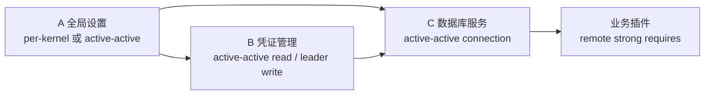

# 插件服务集群化设计

> 状态：设计中 v0.1｜最后更新：2026-07-17
> 本文是插件服务副本、能力可见性和故障恢复的设计说明；决策依据见 [ADR-0045](../decisions/ADR-0045-插件实例化策略与服务集群化边界.md)。

## 1. 目标和边界

插件服务集群化要解决四类问题：

1. 一个插件能否在多个 Backend 内核中独立运行；
2. 多个实例是否属于同一个逻辑服务副本组；
3. 请求应在本地直调、queue group、leader 还是分片 owner 间如何路由；
4. 实例崩溃、节点离线、控制面中断和版本升级时如何保持服务边界。

本文不把“启动多个进程”定义为数据集群，也不为所有插件自动提供 Raft、复制或跨服务事务。

## 2. 基本对象

```text
Plugin Artifact       plugin_id + version + signed manifest
Kernel Instance       kernel_id
Service Unit          unit_id + service_role + desired placement
Logical Service       同一集群副本组的稳定身份
Capability            可调用的逻辑能力
Instance              logical service 的一次真实运行实例
Lease                 capability/leader/shard 的短租约
```

`plugin_id` 是制品身份，不是集群身份。集群关系由以下组合决定：

```text
(logical_service, capability, visibility, routing_domain)
```

`instance_id`、`node_id` 和 `generation` 用于区分和隔离真实实例。

## 3. 四种服务模式

| 模式 | 适用对象 | 允许副本 | 能力可见性 | 路由 | 状态要求 |
|---|---|---:|---|---|---|
| `per-kernel` | 本地设置、缓存、内核适配器 | 每内核一个 | `local` | `direct` | 本地临时状态 |
| `active-active` | 无状态 API、查询、连接代理 | 1..N | `service/cluster` | `queue` | 无状态或外部共享状态 |
| `leader` | 迁移、轮换、唯一调度 | N 候选/1 活跃 | `service/cluster` | `leader` | leader-owned |
| `partitioned` | 分片任务、租户分区 | 每分片一个 owner | `cluster` | `shard` | partition-owned |

`singleton` 是 `leader` 模式在某个作用域内的副本基线为 1，不另设运行时协议。

### 3.1 per-kernel 基础服务

```text
Backend kernel A ── local.settings ──> 本地插件调用
Backend kernel B ── local.settings ──> 本地插件调用
```

两个实例不自动组成集群，不登记全局 capability，不接受其他内核的远程请求。它们可以各自读取同一配置源，但不能假设本地内存状态自动同步。

### 3.2 active-active 服务

```text
Node A ──┐
Node B ──┼── platform.database / queue group
Node C ──┘
```

多个实例发布相同 `logical_service + capability`，加入同一 queue group。请求可能被发送到任意健康实例，因此调用方必须具备超时、重试、幂等和重复调用处理能力。

### 3.3 leader 服务

多个候选可以启动，但只有持有最新 fencing token 的实例可以执行写入、迁移或唯一任务。旧 leader 即使进程尚未退出，只要租约或 token 失效，也必须拒绝执行。

### 3.4 partitioned 服务

控制面或分片协调器按稳定 key 选择 owner；请求携带分片键，路由层将请求送到对应 owner。owner 迁移必须先撤销旧租约，再发布新 owner，避免双写。

## 4. 能力可见性和路由

### 4.1 可见性

```text
local   → 本内核 Registry
service → 同一 Backend 服务组合
cluster → 同一逻辑服务跨节点实例
global  → 跨服务/跨内核调用
```

`local` capability 不写入全局目录。`service/cluster/global` capability 必须有能力租约、logical service、实例身份和版本。

### 4.2 路由选择

```text
direct  → 本地 Registry 直调
queue   → NATS queue group，active-active
leader  → leader lease + fencing token
shard   → shard key + owner lease
```

queue group 只解决请求分发，不解决选主、数据复制、迁移互斥或 exactly-once。

## 5. 契约分层

插件签名清单声明能力边界和实例策略；部署期望态声明本次副本数、作用域和放置位置。部署配置不能突破清单的实例策略。

概念性清单字段：

```json
{
  "runtime": {
    "instancePolicy": "active-active",
    "stateModel": "external-shared",
    "provides": [
      {
        "capability": "platform.database",
        "visibility": "cluster",
        "routing": "queue"
      }
    ],
    "requires": [
      {
        "capability": "platform.credentials",
        "scope": "remote",
        "kind": "strong"
      }
    ]
  }
}
```

概念性部署字段：

```json
{
  "logical_service": "platform.database",
  "instance_policy": "active-active",
  "replicas": 2,
  "placement": {
    "nodeSelector": {"tier": "platform"}
  }
}
```

## 6. A/B/C 平台服务示例



- A 的本地缓存可以按内核重复启动；全局设置写入能力应单独定义为 active-active 共享状态或 leader 能力。
- B 的凭证读取可多副本；轮换、撤销和迁移使用 leader 能力。
- C 的连接代理可多副本；数据库 schema migration 使用 leader，数据库本身的复制由数据库系统负责。
- D 只依赖 C 的逻辑 capability，不依赖 C 的具体节点或进程。

## 7. 生命周期和故障

### 7.1 激活

```text
验证清单/策略
  → 控制面生成 assignment
  → Node Agent 启动候选实例
  → 健康检查、配置、凭证、迁移就绪
  → 发布 starting lease
  → 通过策略校验后变为 ready
  → 加入 direct/queue/leader/shard 路由
```

### 7.2 故障矩阵

| 故障 | `per-kernel` | `active-active` | `leader` | `partitioned` |
|---|---|---|---|---|
| 插件进程退出 | 本地重启 | 租约摘流、其他副本接流 | 触发重新选主 | 触发 owner 转移 |
| 节点失联 | 本地服务失效 | 控制面补足副本 | 旧 token 失效后换主 | 迁移受影响分片 |
| 控制面短暂中断 | 已有实例继续运行 | 已有实例继续接流 | 依赖租约期限，禁止无 fencing 写入 | 依赖 owner lease |
| 版本升级 | 本地原子替换 | 分批 Drain/替换 | 先切换 leader 再迁移 | 分片逐步迁移 |

### 7.3 升级原则

- 新旧版本必须满足清单声明的兼容窗口；
- active-active 先保证至少一个健康副本；
- leader 升级必须有明确的 leader epoch 和 fencing；
- partitioned 升级必须逐分片确认 owner；
- 候选失败保留旧实例，不覆盖稳定实际态。

## 8. 当前实现和缺口

当前已经实现：

- `deployment/v2` 副本数和节点放置；
- 节点租约和故障漂移；
- capability 实例租约；
- NATS queue group 请求分发；
- 插件进程崩溃后的 reconcile 恢复；
- Controller 选主。

尚未实现：

- `instancePolicy`、`stateModel`、`visibility`、`routing` 正式 Schema；
- local capability 不进入全局目录的强制检查；
- leader/partitioned 的统一运行时协议；
- 跨服务 readiness 和依赖状态传播；
- 有状态插件的数据复制或共识协议。

## 9. 落地顺序

1. 将本设计固化到插件 runtime 和 Deployment v2 Schema；
2. 扩展能力目录 Announcement 和 Router 的 visibility/routing domain；
3. Node Agent 在激活前校验实例策略、状态模型和副本数；
4. 先实现 `per-kernel` 与 `active-active`，再实现 leader；
5. 以数据库 migration 和凭证轮换作为 leader 代表场景；
6. 最后设计 partitioned，并补充网络分区、租约过期、重复调用和滚动升级 E2E；
7. 代表性插件完成后再执行 soak 和级联恢复测试。
