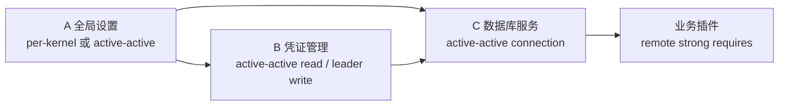

# 插件服务集群化设计

> 状态：Backend 1.0 已实现｜最后更新：2026-07-23
> 本文是插件服务副本、能力可见性和故障恢复的设计说明；决策依据见 [ADR-0045](../decisions/ADR-0045-插件实例化策略与服务集群化边界.md)。

## 1. 目标和边界

插件服务集群化要解决四类问题：

1. 一个插件能否在多个 Backend 内核中独立运行；
2. 多个实例是否属于同一个逻辑服务副本组；
3. 请求应在本地直调、queue group、leader 还是分片 owner 间如何路由；
4. 实例崩溃、节点离线、控制面中断和版本升级时如何保持服务边界。

本文不把“启动多个进程”定义为数据集群，也不为所有插件自动提供 Raft、复制或跨服务事务。

## 2. 基本对象

```text
Plugin Artifact       plugin_id + version + signed manifest
Kernel Instance       kernel_id
Service Unit          unit_id + service_role + desired placement
Logical Service       同一集群副本组的稳定身份
Capability            可调用的逻辑能力
Instance              logical service 的一次真实运行实例
Lease                 capability/leader/shard 的短租约
```

`plugin_id` 是制品身份，不是集群身份。集群关系由以下组合决定：

```text
(logical_service, capability, visibility, routing_domain)
```

`instance_id`、`node_id` 和 `generation` 用于区分和隔离真实实例。

## 3. 四种服务模式

| 模式 | 适用对象 | 允许副本 | 能力可见性 | 路由 | 状态要求 |
|---|---|---:|---|---|---|
| `per-kernel` | 本地设置、缓存、内核适配器 | 每内核一个 | `local` | `direct` | 本地临时状态 |
| `active-active` | 无状态 API、查询、连接代理 | 1..N | `service/cluster` | `queue` | 无状态或外部共享状态 |
| `leader` | 迁移、轮换、唯一调度 | 1 活动 owner（1.0） | `service/cluster` | `leader` | leader-owned 或 external-shared |
| `partitioned` | 分片任务、租户分区 | 每分片一个 owner | `cluster` | `shard` | partition-owned |

`singleton` 是 `leader` 模式在某个作用域内的副本基线为 1，不另设运行时协议。

### 3.1 per-kernel 基础服务

```text
Backend kernel A ── local.settings ──> 本地插件调用
Backend kernel B ── local.settings ──> 本地插件调用
```

两个实例不自动组成集群，不登记全局 capability，不接受其他内核的远程请求。它们可以各自读取同一配置源，但不能假设本地内存状态自动同步。

### 3.2 active-active 服务

```text
Node A ──┐
Node B ──┼── platform.database / queue group
Node C ──┘
```

多个实例发布相同 `logical_service + capability`，加入同一 queue group。请求可能被发送到任意健康实例，因此调用方必须具备超时、重试、幂等和重复调用处理能力。

### 3.3 leader 服务

Backend 1.0 由控制器只分配一个活动 owner；owner 节点失联后重新调度到存活节点。运行时升级先完成候选启动、健康检查和迁移，再释放旧租约并取得严格递增 epoch 的新 fencing token；交接失败会恢复旧 owner。预热但不接流的多候选 standby 不在 1.0 范围内，部署因此要求 `leader replicas=1`。

Unit Leadership 也是 mutating kernel callback 的唯一 execution fence。Runtime Host 只在 `Leadership.Current()` 成立时注入 host-only evidence；token 不进入插件上下文。领导权丢失会同步撤销 evidence、停止宿主并取消在途 HostCall。需要越过内核访问外部系统的 Provider 还必须使用 operation ID、业务 CAS 或远端 epoch 拒绝延迟旧请求，见 [ADR-0128](../decisions/ADR-0128-统一Leader-Epoch与外部副作用Fencing.md)。

实例策略与状态位置正交：`leader-owned` 表示状态随 owner 管理，`external-shared` 表示备用实例可从可信共享 Store 接管同一账本。后者不会自动把服务变成 active-active，也不会替外部 SSH、云 API 或数据库迁移提供副作用 fencing；这些执行端仍必须校验 leader epoch/operation token。

### 3.4 partitioned 服务

Resolver 生成的 Deployment v2 显式锁定 `partition_keys`。控制器用稳定 rendezvous 规则把每个 key 唯一分给 owner，并把节点自己的 key 子集写入 Assignment；节点失联时，剩余 owner 接管全部受影响分片。请求携带分片键，路由层只送往持有对应 lease/fencing token 的 owner。

## 4. 能力可见性和路由

### 4.1 可见性

```text
local   → 本内核 Registry
service → 同一 Backend 服务组合
cluster → 同一逻辑服务跨节点实例
global  → 跨服务/跨内核调用
```

`local` capability 不写入全局目录。`service/cluster/global` capability 必须有能力租约、logical service、实例身份和版本。

### 4.2 路由选择

```text
direct  → 本地 Registry 直调
queue   → NATS queue group，active-active
leader  → leader lease + fencing token
shard   → shard key + owner lease
```

queue group 只解决请求分发，不解决选主、数据复制、迁移互斥或 exactly-once。

## 5. 契约分层

插件签名清单声明能力边界和实例策略；Platform Profile 与 Application Composition 分别声明平台服务和应用服务本次的副本数、作用域和放置位置，Resolver 将二者锁定为 Deployment v2。任何组合输入都不能突破清单的实例策略；应用输入还不能选择或覆盖平台管理插件。

概念性清单字段：

```json
{
  "runtime": {
    "instancePolicy": "active-active",
    "stateModel": "external-shared",
    "provides": [
      {
        "capability": "platform.database",
        "visibility": "cluster",
        "routing": "queue"
      }
    ],
    "requires": [
      {
        "capability": "platform.credentials",
        "scope": "remote",
        "kind": "strong"
      }
    ]
  }
}
```

概念性服务规格字段（位于 Platform Profile 的共享服务或 Application Composition 的应用 unit 中）：

```json
{
  "logical_service": "platform.database",
  "instance_policy": "active-active",
  "replicas": 2,
  "placement": {
    "nodeSelector": {"tier": "platform"}
  }
}
```

## 6. A/B/C 平台服务示例



- A 的本地缓存可以按内核重复启动；全局设置写入能力应单独定义为 active-active 共享状态或 leader 能力。
- B 的凭证读取可多副本；轮换、撤销和迁移使用 leader 能力。
- C 的连接代理可多副本；数据库 schema migration 使用 leader，数据库本身的复制由数据库系统负责。
- D 只依赖 C 的逻辑 capability，不依赖 C 的具体节点或进程。

## 7. 生命周期和故障

### 7.1 激活

```text
验证清单/策略
  → 控制面生成 assignment
  → Node Agent 启动候选实例
  → 健康检查、配置、凭证、迁移就绪
  → 发布 starting lease
  → 通过策略校验后变为 ready
  → 加入 direct/queue/leader/shard 路由
```

### 7.2 故障矩阵

| 故障 | `per-kernel` | `active-active` | `leader` | `partitioned` |
|---|---|---|---|---|
| 插件进程退出 | 本地重启 | 租约摘流、其他副本接流 | 触发重新选主 | 触发 owner 转移 |
| 节点失联 | 本地服务失效 | 控制面补足副本 | 旧 token 失效后换主 | 迁移受影响分片 |
| 控制面短暂中断 | 已有实例继续运行 | 已有实例继续接流 | 依赖租约期限，禁止无 fencing 写入 | 依赖 owner lease |
| 版本升级 | 本地原子替换 | 分批 Drain/替换 | 候选健康检查与迁移完成后原子交接 leader | 分片逐步迁移 |

### 7.3 升级原则

- 新旧版本必须满足清单声明的兼容窗口；
- active-active 先保证至少一个健康副本；
- leader 升级必须有明确的 leader epoch 和 fencing；
- partitioned 升级必须逐分片确认 owner；
- 候选失败保留旧实例，不覆盖稳定实际态。

## 8. 当前实现和缺口

Backend 1.0 已实现：

- Platform Profile 与 Application Composition 的双输入分级，以及 Resolver 生成的 `deployment/v2` 副本数和节点放置；
- 节点租约和故障漂移；
- capability 实例租约；
- NATS queue group 请求分发；
- 插件进程崩溃后的 reconcile 恢复；
- Controller 选主；
- 插件 manifest 的 `runtime` 策略，以及 deployment v1/v2 的策略字段和语义校验；
- `per-kernel` 本地能力不进入全局目录，`active-active` 能力通过共享目录发布；
- Announcement/Registration 对可见性、路由和实例策略的元数据保留与基本校验；
- `leader` 通过 JetStream KV fencing lease 发布单活实例，正常交接与超时接管的 epoch 都严格递增；候选失败恢复旧 owner；
- `partitioned` 由 Deployment v2 `partition_keys` 驱动，控制器唯一分配并在节点故障后自动再平衡，Runtime 按分片取得独立 lease 并用 shard subject 路由；
- runtime `requires` 的候选 gate、远端 readiness 观察和失效后的数据面停止。
- Node Agent 实际态使用本地原子文件作为恢复真源，并通过 `ReplicatedStateStore` 同步到按 `tenant/deployment/node` 隔离的控制面 KV；这只复制运行事实，不复制插件私有业务数据。本地检查点的纯 `updated_at` 变化不复制为 KV 写入，节点存活仍由 Node Lease 表达。
- Controller 从不可变制品仓库解析完整 manifest，校验包依赖、runtime capability 版本、作用域和策略，并把远端 strong/data 依赖加入全局 DAG；跨节点依赖不会污染节点本地 DAG。
- 组合状态按 tenant/deployment 隔离写入 `VASTPLAN_COMPOSITIONS_V1`，包含 deployment revision、assignment generation、期望/实际/ready 副本和 `Ready/Degraded/Blocked/DependencyLost/Failed` 状态；同作用域 ActualState 的运行事实变化会立即触发重算，其他部署事件不会唤醒本控制器。
- 安全 Router 按传输身份的 capability allowlist、service role、logical service 和 global 授权同时过滤发现结果与一元/流式调用；依赖声明本身不授予调用权。
- 三台 Backend Node 的 active-active 漂移恢复、leader epoch/fencing、分片 owner 路由、组合状态恢复和候选失败保旧已有真实插件进程测试；Shared State 底层另由 [ADR-0131](../decisions/ADR-0131-Shared-State与Vault有界故障矩阵.md) 的真实三 `nats-server` 矩阵验证仲裁、重连和 CAS fencing。两者不可混称为同一层集群证明。

明确不由内核补齐的边界：

- 有状态插件的业务数据复制、Raft/共识、跨服务事务由插件或外部数据库负责；内核只管理运行计划、owner 与 fencing。
- leader 多候选热 standby 暂不提供；1.0 采用单活动 owner + 节点故障重调度，避免阻塞 Node Agent reconcile。
- soak 和级联恢复长稳测试按既定决定推迟到代表性数据库/设置/凭证插件完成后执行。

## 9. 落地顺序

下一阶段转入基础插件实施：全局设置、凭证和数据库服务分别按清单声明其状态模型与 capability；插件形成真实负载后，再执行 soak、级联恢复和容量基线。
