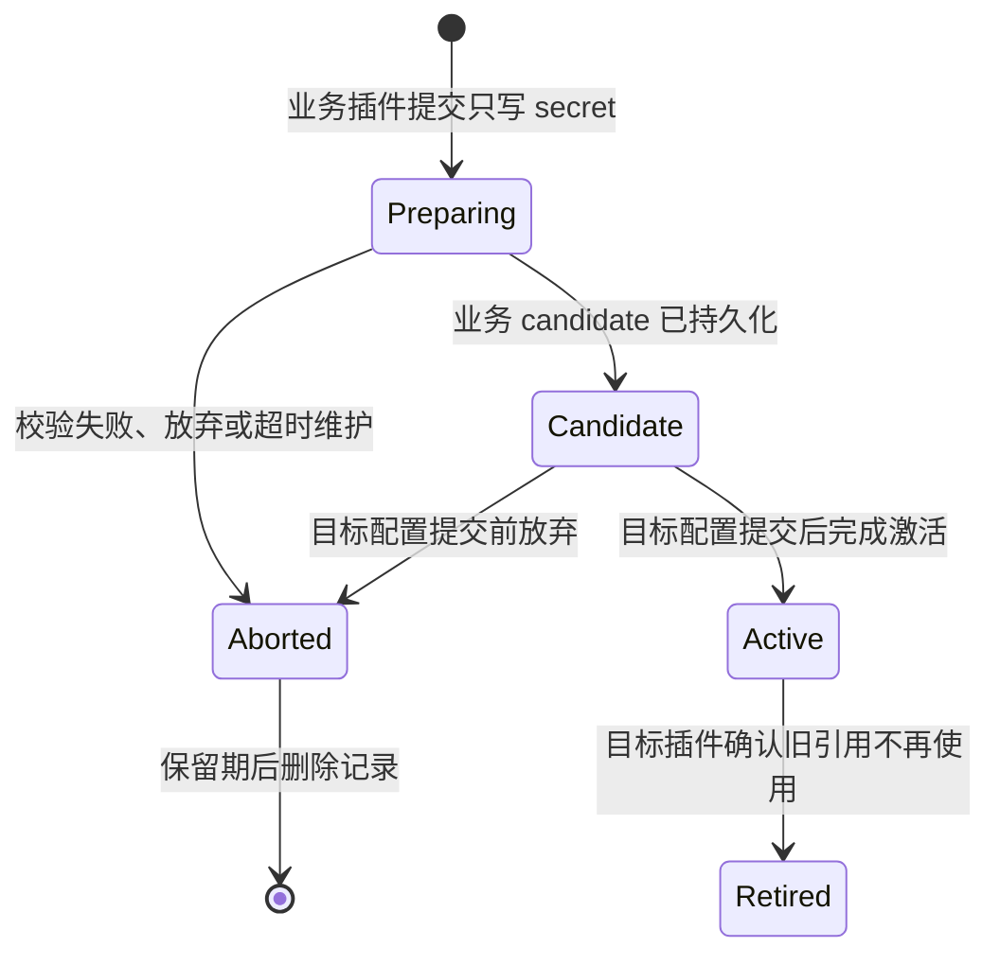

# 插件配置与托管凭证

本文是 VastPlan 插件配置、敏感输入和运行时配置投影的单一真相源。通用闭环取舍见 [ADR-0090](../decisions/ADR-0090-插件配置与托管凭证闭环.md)，通用配置目录与分路径生效见 [ADR-0113](../decisions/ADR-0113-可信插件配置目录与分路径生效.md)，公共基线、在线服务与种子配置的所有权分域见 [ADR-0148](../decisions/ADR-0148-公共服务基线与种子配置分域.md)，一次性配置授权见 [ADR-0114](../decisions/ADR-0114-一次性ConfigurationAuthority与委托凭证暂存.md)，Application 激活与候选凭证窗口见 [ADR-0115](../decisions/ADR-0115-Application配置激活Saga与候选凭证窗口.md)，Platform Profile 激活见 [ADR-0116](../decisions/ADR-0116-Backend-Platform-Profile候选Catalog与配置激活.md)，Service Hot 控制器见 [ADR-0117](../decisions/ADR-0117-语言中立Service-Hot配置控制器.md)，Service Hot 托管凭证见 [ADR-0120](../decisions/ADR-0120-Service-Hot托管凭证提交与退役.md)，托管凭证维护与审计见 [ADR-0121](../decisions/ADR-0121-托管凭证过期回收与脱敏审计.md)，动态 Profile 独立资源见 [ADR-0118](../decisions/ADR-0118-独立配置资源与动态Profile.md)，业务插件内管理凭证见 [ADR-0092](../decisions/ADR-0092-业务插件拥有托管凭证生命周期.md)，可信宿主解密边界见 [ADR-0093](../decisions/ADR-0093-可信宿主加密Material-Lease.md)，数据库可信数据面扩展见 [ADR-0095](../decisions/ADR-0095-Database-Runtime多Provider连接池与集群事务.md)。

## 1. 职责边界

| 层 | 负责 | 不负责 |
|---|---|---|
| 插件签名清单 | 声明非敏感 JSON Schema、配置作用域、生效方式和凭证用途 | 保存明文、决定真实凭证句柄 |
| 插件前端页 / Workbench | 渲染插件自己的配置体验，把 `values` 与 `secrets` 分开提交 | 预创建独立凭证、缓存秘密、生成可信 owner |
| Node Portal Kernel / 业务插件协调器 | OIDC/BFF 鉴权、校验输入、CAS、驱动 candidate Saga、审计 | 解密凭证、把秘密写入日志或 URL |
| 凭证托管插件 | stage/activate/abort/rotate/revoke、信封加密、元数据 | 返回明文或密文 |
| Backend Kernel | 按认证 caller 投影当前插件配置，受控使用 CredentialRef | 保存业务配置、替插件解释参数 |
| Provider 插件 | 实现 S3/OCI/file 等重型能力及 probe/migrate | 改写仓库的制品信任与验签规则 |

## 2. 清单契约

```json
{
  "configuration": {
    "scope": "service",
    "applyMode": "restart",
    "schema": {
      "type": "object",
      "additionalProperties": false,
      "properties": {
        "listen": { "type": "string" },
        "storageProvider": { "type": "string" }
      }
    },
    "managedCredentials": [
      {
        "id": "publish-token",
        "title": "发布令牌",
        "purpose": "artifact.publish-token",
        "required": true
      }
    ]
  }
}
```

`schema` 不包含秘密字段。`managedCredentials` 是同一插件配置页上的只写字段目录，渲染层应使用密码/文件秘密控件；读取配置时只返回“已配置、版本、更新时间、状态”等元数据。

0—N 个 OIDC、Webhook 等动态 Profile 不再放进根 `schema` 的 `profiles.*`。插件通过 `resourceController + resourceCollections[]` 声明独立资源集合；每个集合固定自己的非敏感 Schema、托管凭证槽和数量边界。可信目录派生 `cfgc_*`，实例使用 `cfgp_*`，根启动配置与 Profile 热生命周期互不冒充。

`restart` 表示新 Active revision 通过 Deployment 发布并事务式替换运行单元。`hot` 只有插件显式实现配置变更协议后才可声明；声明本身不能让一个插件自动支持热更新。

在线配置不直接读取工作区 Manifest，也不接受浏览器提供 Schema。Backend Resolver 从本次解析已经验证的精确制品生成 `ConfigurationCatalog v1`，把 deployment/unit/plugin、来源、制品摘要、Schema 摘要和当前非敏感值锁成一个目录 revision。Portal 只使用不包含插件 ID 的 `cfg_` 资源 ID 发起操作；服务端在每次候选写入时重新复核目录身份。

目录同时携带平台来源插件的 `serviceBaselineId`。有该标记的 `service + restart` 定义按 `baseline + plugin` 去重后进入独立“公共基线配置”入口，并使用 Platform Profile Activation；无该标记的 Application 定义进入“服务配置”入口。公共基线 Hot 当前拒绝，避免绕过 Profile 并把全局基线错误提交给单一服务控制器。Platform Profile `services` 中的 Seed Service 插件没有公共基线标记，目录生成器会直接排除，确保本地自举配置不能被普通在线工作流接管。公共基线与服务配置最终仍物化进同一 ServiceUnit 信封，Runtime 不增加配置分支。

## 3. 部署信封与运行时投影

服务单元配置只允许 `plugins`、`environment_allowlist` 和调度器使用的 `partition_keys`。控制面在发布前验证配置/环境 key 属于已安装插件；Node Agent 再验证一次。

Backend Runtime 使用无 fallback 的 `NewPluginMapConfig` 冻结快照。`kernel.config.get` 忽略 payload 中任何身份暗示，只使用握手认证后写入 `CallContext.caller.id` 的插件 ID。未安装、未配置、跨插件 key 都返回 not found。

插件调用本 unit 未注册的业务 capability 时，Backend Host 将调用交给全局 capability Router；源 unit 先执行本地权限策略，目标 unit 再执行自己的权限策略。转发时当前 target 只在目标 Host 写入调用链一次，避免跨服务正常调用被循环检测误拒绝。调用方应按签名依赖声明填写 `logical_service` 与 `routing_domain`，多路由域歧义继续 fail-closed。

环境变量授权按插件 ID 读取后放入各自 `LaunchPolicy`。同一 unit 的访问策略插件不再继承制品仓库 token，这是本次边界修复的直接收益。

## 4. 托管凭证状态机



普通稳定运行只消费 `Active`；受配置候选身份约束的 readiness、probe 和 Service Hot 提交窗口也允许消费 `Candidate`。CredentialRef 的 `owner` 必须等于调用业务插件 ID，`purpose` 必须来自受信任业务契约；owner 由宿主认证的 caller 决定，浏览器和 payload 都不能指定。托管器返回不匹配引用时协调器立即 fail-closed。

删除插件配置不应默认立即销毁外部身份。默认先撤销本插件的引用授权并进入保留期，再由明确的安全策略决定是否删除密文版本或调用目标系统吊销 API。

### 4.1 过期回收与脱敏审计

凭证 leader 在自身可信进程内维护状态：过期 `Preparing` 自动转 `Aborted` 并立即清空密文；超过保留期的 `Aborted` 删除记录。`Candidate`、`Active` 和 `Retired` 永不按通用时间阈值删除，避免破坏配置恢复、稳定运行和取证。

生命周期审计使用原始 handle 的不可逆短指纹关联事件，不返回 handle、stage ID、ConfigurationAuthority、密文或 material。查询按 tenant 隔离并同时受 Portal operation grant 与 `platform.credentials.audit` 权限控制；详细时限、批量、保留和失败回滚规则见 ADR-0121。

### 4.2 可信宿主 Material Lease

业务插件不能调用 decrypt，也不能取得 material。可信内核适配器调用 `CredentialBroker.WithCredential` 时，必须以当前插件的宿主 `Scope` 校验 `owner`，为本次请求生成一次性 X25519 公钥，再调用独立的 `platform.credentials.material-lease/issue` 能力。凭证插件只向该公钥签发默认 15 秒的 AES-GCM 加密信封；tenant、宿主 audience、完整引用与时间窗都进入 AAD。

宿主解封后只在同步回调内把 material 交给数据库、HTTP、SSH 等可信执行适配器，回调结束立即尽力擦除。加密信封不能传给插件继续解封；浏览器、普通 capability 和配置快照也不得出现它。生产跨节点 transport trust 必须显式授权该 capability 与 `platform.credentials` logical service。

Backend Kernel `SYSTEM` audience 和 dedicated Database Runtime audience 均已实现。Database Runtime 不持有可重放的宿主签名令牌：Host 从已验签 LaunchPolicy 与当前会话生成 host-only identity，绑定插件 ID、发布者、版本、制品摘要、节点、unit 和随机启动实例，只向进程注入非秘密 audience 摘要。Runtime 的一次性接收公钥经 `kernel.credential.material-lease` 中继，Kernel 不持有私钥、不解封 material；访问策略只授权精确的第一方 Database Runtime 和 connection-manager 拥有的 `database.connection` CredentialRef。

## 5. 用户体验

数据库连接页应直接出现“密码/访问令牌”字段，保存时同时更新连接定义与托管凭证；用户不再填写 `CredentialRef` 名称。编辑已存在连接时秘密字段为空代表“保持当前版本”，填写新值代表“创建新版本”。页面只显示托管状态和版本，浏览器拿不到不透明 handle。

独立凭证页面向安全管理员，提供跨插件审计、轮换和应急撤销。它不是创建数据库连接、制品仓库或其他插件配置的必经页面。

## 6. Provider 选择

制品仓库的普通配置包括监听、容量限制和 `storageProvider`。Provider 自身配置由其清单 Schema 管理，凭证同样通过托管字段提交。在线切换顺序固定为：

1. 安装并授权新 Provider；
2. 校验非敏感配置并 stage 凭证；
3. `probe` 连接、权限和容量；
4. 复制并校验不可变对象与证明；
5. 发布候选仓库配置；
6. 切换 Active 后保留旧 Provider 只读观察窗口；
7. 明确确认后回收旧数据与凭证。

前端 Shell Library、Renderer 与主题不走 Provider 迁移流程。它们是 RuntimeSpec 锁定的签名前端模块和用户偏好：Shell Library 可通过候选 Portal Generation 切换，Renderer family 通过 Host Epoch 切换。

## 7. 当前实现状态

已实现：

- 插件清单 `configuration` Schema 与语义校验；
- `ServiceUnit.config` 插件隔离信封；
- 控制面和 Node Agent 双重校验；
- `kernel.config.get` 按认证 caller 投影；
- 逐插件环境变量白名单；
- 独立进程/共享 Runtime Host 的 64KiB 非敏感启动快照注入（dynamic-go 继续走宿主配置调用）；
- 托管凭证引用模型和 candidate Saga 领域协调器；
- 凭证插件持久 `stageManaged/activateManaged/abortManaged/retireManaged` 状态机及 owner 校验；
- 凭证插件 `platform.credentials.material-lease` 的 Vault decrypt、Active 二次确认和短时加密签发；
- Backend Kernel 一次性 X25519 解封 broker、named/managed 引用分流与 Node Agent 依赖注入；
- 数据库插件内联只写凭证输入、pending 持久化和重启后继续收敛；
- Database Runtime v1 JSON wire 契约、稳定错误码、第一方 Provider SPI/Registry 与安全的 `providers` 发现；
- Database Runtime 统一 Pool Manager：三级资源预算、调用方并发/队列上限、generation 原子轮换、有界 drain 和脱敏指标；
- Database Runtime PostgreSQL/MySQL Provider：结构化非敏感配置、逐物理连接 MaterialSource、默认 TLS 校验、共享 SQL 执行/值转换/错误分类；
- connection-manager publication outbox、Runtime `activate/retire/probe`、active-active 副本惰性收敛与带连接 grant 的 `query/execute`；
- 本地平台配置迁移到新信封。
- 通用配置目录的安全边界和 application/platform/hot 三条生效路径已由 ADR-0113 固化。
- Backend Resolver 已从本次解析的验签制品生成 `ConfigurationCatalog v1`；初始发布与 Deployment Manager 在线发布都会把目录作为同代 Deployment sidecar 写入可信控制面，内核只返回与当前 revision/digest 匹配的目录；plugin-settings 0.12.0 已提供目录读取、动态表单、Draft CAS、审计、重启恢复、两条 restart、Service Hot、Scoped Hot 和独立资源路径，并明确不把 Draft 宣称为 Active。
- Backend Kernel 已实现默认 45 秒、单字段、一次性的 `ConfigurationAuthority`：根配置授权绑定 `cfg_* + field`，资源授权进一步绑定 `cfgc_* + cfgp_* + field`；控制面只保存 bearer 摘要并以 NATS KV CAS 原子消费。凭证 0.10.0 提供 delegated stage/prepare/activate/abort，plugin-settings 0.12.0 已接入 Workbench 只写秘密、`Preparing` 检查点和放弃回滚，公开候选不包含 handle、stage ID、authority、密文或明文。
- Application Deployment 激活路径已由 plugin-settings 0.12.0、deployment-manager 0.18.0 和 credentials 0.12.0 闭环：候选提交生成独立审批修订，普通发布入口不能绕过专用 Saga；候选凭证在 Candidate 窗口支持启动 readiness，成功后转 Active，失败后随单调 Deployment rollback 终止。ServiceUnit 以独立 `managed_credentials` 信封保存引用，宿主按认证插件通过 `kernel.config.credential-ref` 精确投影。Deployment Manager 的 Saga 与 Credentials 的内容寻址快照均已迁入 Shared State；外部副作用和 Credentials fenced mutation 由单 Leader 执行并受同一 Unit epoch 约束。
- Backend Platform Profile restart 激活已经闭环：`platformcatalog.Store` 负责受限历史、create-only Seed、候选 CAS、目标 binding 锁和单调 Catalog 回滚；可信内核从活动目录重建目标公共 Service Baseline 的候选修订，只向 Deployment Manager 返回引用与摘要。deployment-manager 0.18.0 在共享账本中持久化 `Prepare → PendingApproval → CatalogActivated → Publishing → Ready/RolledBack` Saga，新 Leader 按精确 candidate/request digest 继续；所有 mutating 内核回调还要求 host-only 当前 leader evidence。readiness 失败时先回滚 Catalog，再发布更高 Deployment revision。plugin-settings 0.13.0 通过独立 `platform.plugin-configuration.profile.publish` 权限驱动提交、异人审批、激活和放弃，并将“公共基线配置”与“服务配置”分成两个 Workbench 页面；Seed Service 必要配置只由本地 Seed 文件管理。Workbench/BFF 不接触 Profile/Catalog 全文、NATS key 或凭证 handle。
- Service Hot 激活已经闭环：语言中立 `configuration.v1` 固定 prepare/commit/abort/status，签名清单派生不透明 `configuration.controller` 目标；plugin-settings 0.12.0 支持固定托管字段的留空保留和 replacement。目标控制器私有合并完整 Active 引用集、计算摘要并保存旧引用退役 outbox；异人审批后先原子 commit，再以 `FinalizingCredentials` 检查点把 Candidate 凭证推进为 Active，激活故障从 Committed status 恢复。首个 OTP 0.2.0 Go 控制器继续验证无秘密路径；Go/Node helper 和纵向测试锁定托管凭证语义。浏览器只看到控制器可用性、状态和版本，不获得路由目标、请求摘要或 handle。
- 凭证 0.10.0 已实现可配置的过期维护与脱敏审计：Preparing 自动终止时同步清除密文，Aborted 保留期后删除，Candidate/Active/Retired 不参与 TTL；固定 BFF、独立审计权限和 Workbench 页面只投影短指纹与非秘密生命周期事实。
- 动态 Profile 的首个纵向闭环已经完成：签名清单、可信 Catalog、`configuration.resource.v1`、精确资源 ConfigurationAuthority、plugin-settings 0.10.0 可恢复 Saga、Node SDK、固定 BFF、Workbench MasterDetail 和 Webhook Delivery 0.2.0 共同实现 `cfgc_* / cfgp_*`、固定秘密槽、create/update/delete CAS、无 handle 查询、异人审批、Material Lease 探测和旧引用退休。File State Webhook 当前只允许 leader；外部共享状态 Provider 未实现前不声明 active-active。
- Tenant/User Scoped Hot 已由 [ADR-0119](../decisions/ADR-0119-Tenant与User-Scoped-Hot配置真源.md) 闭环：`configuration.scoped.v1` 请求不带配置、tenant 或 subject 身份，resolver 按认证 caller 与上下文查找唯一签名定义；plugin-settings 保存 Seed revision 0、Active CAS、异人审批和 value-free watch，hello-world 0.2.0 是首个 tenant consumer。
- CredentialRef 与 Scoped consumer 已由 [ADR-0122](../decisions/ADR-0122-CredentialRef与Scoped配置多语言SDK.md) 在 Go、Node、Python 闭环：闭合不可变引用、身份无关请求、严格响应与跨语言规范摘要共用同一 golden；Python 共享子解释器可通过不暴露委托令牌的可信主解释器桥发起 HostCall。

待实现：

- S3/OCI Provider（供给协议、File Provider 与 File Volume A/B 在线迁移控制器已实现，S3/OCI 不在当前阶段）；
- 制品、HTTP 等其他具体可信领域 Broker 对 `CredentialBroker` 的接入。
