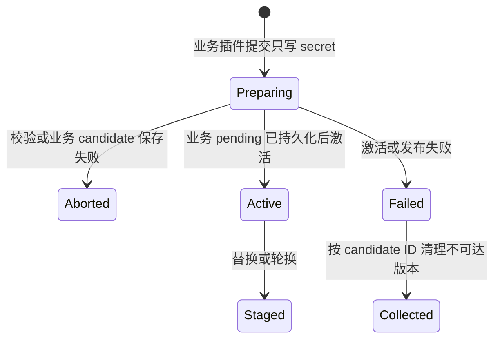

# 插件配置与托管凭证

本文是 VastPlan 插件配置、敏感输入和运行时配置投影的单一真相源。通用闭环取舍见 [ADR-0090](../decisions/ADR-0090-插件配置与托管凭证闭环.md)，业务插件内管理凭证见 [ADR-0092](../decisions/ADR-0092-业务插件拥有托管凭证生命周期.md)，可信宿主解密边界见 [ADR-0093](../decisions/ADR-0093-可信宿主加密Material-Lease.md)，数据库可信数据面扩展见 [ADR-0095](../decisions/ADR-0095-Database-Runtime多Provider连接池与集群事务.md)。

## 1. 职责边界

| 层 | 负责 | 不负责 |
|---|---|---|
| 插件签名清单 | 声明非敏感 JSON Schema、配置作用域、生效方式和凭证用途 | 保存明文、决定真实凭证句柄 |
| 插件前端页 / Workbench | 渲染插件自己的配置体验，把 `values` 与 `secrets` 分开提交 | 预创建独立凭证、缓存秘密、生成可信 owner |
| Portal Edge / 业务插件协调器 | 鉴权、校验清单、CAS、驱动 candidate Saga、审计 | 解密凭证、把秘密写入日志或 URL |
| 凭证托管插件 | stage/activate/abort/rotate/revoke、信封加密、元数据 | 返回明文或密文 |
| Backend Kernel | 按认证 caller 投影当前插件配置，受控使用 CredentialRef | 保存业务配置、替插件解释参数 |
| Provider 插件 | 实现 S3/OCI/file 等重型能力及 probe/migrate | 改写仓库的制品信任与验签规则 |

## 2. 清单契约

```json
{
  "configuration": {
    "scope": "service",
    "applyMode": "restart",
    "schema": {
      "type": "object",
      "additionalProperties": false,
      "properties": {
        "listen": { "type": "string" },
        "storageProvider": { "type": "string" }
      }
    },
    "managedCredentials": [
      {
        "id": "publish-token",
        "title": "发布令牌",
        "purpose": "artifact.publish-token",
        "required": true
      }
    ]
  }
}
```

`schema` 不包含秘密字段。`managedCredentials` 是同一插件配置页上的只写字段目录，渲染层应使用密码/文件秘密控件；读取配置时只返回“已配置、版本、更新时间、状态”等元数据。

`restart` 表示新 Active revision 通过 Deployment 发布并事务式替换运行单元。`hot` 只有插件显式实现配置变更协议后才可声明；声明本身不能让一个插件自动支持热更新。

## 3. 部署信封与运行时投影

服务单元配置只允许 `plugins`、`environment_allowlist` 和调度器使用的 `partition_keys`。控制面在发布前验证配置/环境 key 属于已安装插件；Node Agent 再验证一次。

Backend Runtime 使用无 fallback 的 `NewPluginMapConfig` 冻结快照。`kernel.config.get` 忽略 payload 中任何身份暗示，只使用握手认证后写入 `CallContext.caller.id` 的插件 ID。未安装、未配置、跨插件 key 都返回 not found。

插件调用本 unit 未注册的业务 capability 时，Backend Host 将调用交给全局 capability Router；源 unit 先执行本地权限策略，目标 unit 再执行自己的权限策略。转发时当前 target 只在目标 Host 写入调用链一次，避免跨服务正常调用被循环检测误拒绝。调用方应按签名依赖声明填写 `logical_service` 与 `routing_domain`，多路由域歧义继续 fail-closed。

环境变量授权按插件 ID 读取后放入各自 `LaunchPolicy`。同一 unit 的访问策略插件不再继承制品仓库 token，这是本次边界修复的直接收益。

## 4. 托管凭证状态机



当前运行时只消费 `Active`。CredentialRef 的 `owner` 必须等于调用业务插件 ID，`purpose` 必须来自受信任业务契约；owner 由宿主认证的 caller 决定，浏览器和 payload 都不能指定。托管器返回不匹配引用时协调器立即 fail-closed。

删除插件配置不应默认立即销毁外部身份。默认先撤销本插件的引用授权并进入保留期，再由明确的安全策略决定是否删除密文版本或调用目标系统吊销 API。

### 4.1 可信宿主 Material Lease

业务插件不能调用 decrypt，也不能取得 material。可信内核适配器调用 `CredentialBroker.WithCredential` 时，必须以当前插件的宿主 `Scope` 校验 `owner`，为本次请求生成一次性 X25519 公钥，再调用独立的 `platform.credentials.material-lease/issue` 能力。凭证插件只向该公钥签发默认 15 秒的 AES-GCM 加密信封；tenant、宿主 audience、完整引用与时间窗都进入 AAD。

宿主解封后只在同步回调内把 material 交给数据库、HTTP、SSH 等可信执行适配器，回调结束立即尽力擦除。加密信封不能传给插件继续解封；浏览器、普通 capability 和配置快照也不得出现它。生产跨节点 transport trust 必须显式授权该 capability 与 `platform.credentials` logical service。

当前已实现的 audience 是 Backend Kernel `SYSTEM` 身份。未来 dedicated Database Runtime 不得伪装成 Kernel 或退回环境变量明文；它必须使用 Kernel 启动时签发、绑定插件 ID/发布者/制品摘要/节点/目的的可信运行实例身份，并把一次性接收公钥绑定到该身份。访问策略只授权精确的第一方 Database Runtime 和当前 CredentialRef。该扩展完成前，独立数据面解密必须 fail-closed。

## 5. 用户体验

数据库连接页应直接出现“密码/访问令牌”字段，保存时同时更新连接定义与托管凭证；用户不再填写 `CredentialRef` 名称。编辑已存在连接时秘密字段为空代表“保持当前版本”，填写新值代表“创建新版本”。页面只显示托管状态和版本，浏览器拿不到不透明 handle。

独立凭证页面向安全管理员，提供跨插件审计、轮换和应急撤销。它不是创建数据库连接、制品仓库或其他插件配置的必经页面。

## 6. Provider 选择

制品仓库的普通配置包括监听、容量限制和 `storageProvider`。Provider 自身配置由其清单 Schema 管理，凭证同样通过托管字段提交。在线切换顺序固定为：

1. 安装并授权新 Provider；
2. 校验非敏感配置并 stage 凭证；
3. `probe` 连接、权限和容量；
4. 复制并校验不可变对象与证明；
5. 发布候选仓库配置；
6. 切换 Active 后保留旧 Provider 只读观察窗口；
7. 明确确认后回收旧数据与凭证。

前端 Shell/Renderer/主题不走这条重型流程，它们是插件内部签名目录的用户偏好。

## 7. 当前实现状态

已实现：

- 插件清单 `configuration` Schema 与语义校验；
- `ServiceUnit.config` 插件隔离信封；
- 控制面和 Node Agent 双重校验；
- `kernel.config.get` 按认证 caller 投影；
- 逐插件环境变量白名单；
- 独立进程/共享 Runtime Host 的 64KiB 非敏感启动快照注入（dynamic-go 继续走宿主配置调用）；
- 托管凭证引用模型和 candidate Saga 领域协调器；
- 凭证插件持久 `stageManaged/activateManaged/abortManaged/retireManaged` 状态机及 owner 校验；
- 凭证插件 `platform.credentials.material-lease` 的 Vault decrypt、Active 二次确认和短时加密签发；
- Backend Kernel 一次性 X25519 解封 broker、named/managed 引用分流与 Node Agent 依赖注入；
- 数据库插件内联只写凭证输入、pending 持久化和重启后继续收敛；
- Database Runtime v1 JSON wire 契约、稳定错误码、第一方 Provider SPI/Registry 与安全的 `providers` 发现；
- 本地平台配置迁移到新信封。

待实现：

- Portal/BFF 通用配置读写 API 与 Workbench 配置表单；
- 凭证插件的过期 Preparing/Aborted GC 与审计查询；
- 制品仓库在线迁移控制器与 S3/OCI Provider（供给协议和 file Provider 已实现）；
- CredentialRef 多语言 SDK 生成物；
- Database Runtime 可信实例 audience、连接池/generation/资源预算、PostgreSQL/MySQL Provider 和集群事务亲和；
- 制品、HTTP 等其他具体可信领域 Broker 对 `CredentialBroker` 的接入。
