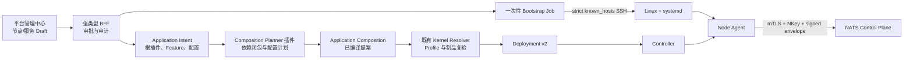

# 服务部署控制台

> 状态：节点引导与发布 v1 已实施；Application Intent/Composition Planner 已采纳、待实施｜最后更新：2026-07-24
>
> 本文是平台管理中心中“主机纳管、服务组合与集群副本”的单一真相源。首次引导决策见 [ADR-0069](../decisions/ADR-0069-SSH首次引导与Node-Agent接管.md)，用户意图与插件化组合规划见《[插件分级与组合解析](插件分级与组合解析.md)》和 [ADR-0143](../decisions/ADR-0143-插件化应用意图规划与派生依赖.md)。

## 1. 目标模型

用户配置的是内核服务中的应用意图，而不是远端命令或服务依赖图：

```text
Deployment
├── Backend Service A
│   ├── rootPlugins: P1
│   ├── features: F1
│   ├── pluginConfig: ...
│   ├── replicas: 2
│   └── placement: region=cn
└── Backend Service B
    ├── rootPlugins: P3
    ├── pluginConfig: ...
    └── replicas: 3
```

包依赖、runtime capability 依赖、实例策略、状态模型、路由和有效 `depends_on` 都来自签名 Manifest、Platform Profile 与 Planner/Controller 推导。用户可以配置自动引入的应用级依赖插件，但不能增加、删除或重定向依赖边。

现有 Deployment v2 `ServiceUnit` 继续作为内核执行锁；Controller 使用活动 Node Lease 调度副本，每个节点的 Node Agent 下载并验证插件、启动候选、原子切换并上报 ActualState。在线控制台不得建立第二套服务/集群数据模型，也不得把完整 ServiceUnit 继续当作用户表单模型。

## 2. 两段式控制链



SSH 作业成功只表示 systemd 已激活。Node Agent 随后发布使用自身 addressing NKey 签名的 v3 Node Lease；可信内核观察器校验 tenant、Deployment、cluster-global `node_id`、传输公钥、签名、KV key 与新鲜度完全一致后，才能把 Bootstrap Job 从 `SystemdActive` 推进到 `Ready`。超时或身份拒绝进入 `Failed`，观察器暂时不可用则保持 `SystemdActive`，不得自动降级为匿名或不安全节点。

## 3. 当前已实现的引导契约

生产入口为：

```text
backend-kernel node-bootstrap -request ... -identity ... -known-hosts ...
```

`nodebootstrap.Request` 固定：SSH 目标、不可变内核版本/HTTPS URL/SHA-256、节点 ID/标签/容量、Deployment 身份、NATS 与制品仓库地址，以及本地秘密文件到远端固定秘密目录的映射。它拒绝明文 NATS、HTTP 下载、URL 内嵌凭证、未知 JSON 字段、非规范路径、宽松权限文件和未登记主机密钥。

远端只执行固定的 root stdin 脚本：创建专用用户、写入 root-owned/group-read-only 身份文件、下载并校验内核、原子切换 `current`、安装加固 systemd unit、启用并检查服务。不存在浏览器可传入的 command、arguments 或 shell 字段。

## 4. 在线编排实施状态

1. **已实现**：平台基础插件 `cn.vastplan.platform.infrastructure.deployment-manager` 持有节点登记和 Bootstrap Job，只保存 Credential 名称；0.17.0 起按租户保存到 Shared State 单文档 CAS 聚合，0.18.0 起复用 Unit Leadership 保护 mutating callback，并在 SSH 远端记录单调 epoch。新 Leader 取得同一账本后把未确认执行落为失败而不盲目重放；当前仍是单 Leader active-passive。
2. **已实现**：Node Portal Kernel 与 TypeScript SDK 提供白名单强类型节点/作业 API；`platform.deployment.read/write/bootstrap/approve` 分离，插件领域层再强制申请人与审批人不同。
3. **已实现执行桥**：`kernel.node.bootstrap` 只接受精确插件身份；Linux Broker 通过 CredentialBroker 回调使用 material。Broker 未注入时能力不注册并 fail-closed。
4. **已实现 Ready 闭环**：`kernel.node.readiness` 只向精确 Deployment Manager 插件暴露封闭的 `Waiting/Ready/Rejected` 结果；插件不接触 NATS、KV 或信任文档。引导完成及作业查询都会执行拉式收敛。完整安全边界见 [ADR-0071](../decisions/ADR-0071-签名Node-Lease与可信就绪判定.md)。
5. **部分实现凭证提供方**：Node Agent 可用 `-credential-root` 注入企业 secret mount 目录 Broker；集中式 Vault/KMS provider 仍待实现。
6. **已实现可信服务发布**：平台运维发布 `BackendPlatformCatalog`，以精确 `(tenantId, deploymentName)` 固定 Platform Profile。既有内核会重新解析、同源验签、锁定预览摘要并以单调 revision/CAS 发布 Deployment v2；该最终强制点不因新增 Planner 改变。完整边界见 [ADR-0077](../decisions/ADR-0077-Backend在线组合与可信发布边界.md)。
7. **当前 UI 存在待清理边界**：Deployment Manager 已有预授权目标、应用插件、service unit、replicas、节点标签、配置、预览、异人审批、发布、审计和回滚，但仍允许编辑 `depends_on`、实例策略、状态模型和路由。ADR-0143 后应改为 Application Intent 表单，由 Planner 自动解析并只读展示依赖、运行策略和 Provider 绑定。
8. **已实现多目标 Controller fleet**：`controlplane -backend-platform-catalog ... -controller` 为 Catalog 中每个部署目标运行独立选主/watch；一个目标可调度多副本。一个 Node Agent 仍绑定一个 tenant/deployment，同机承载多个目标时运行多个 systemd 实例，避免混合故障域。

在线发布的故障语义是“已发布服务不依赖管理面存活”。Portal、Deployment Manager 或可信发布服务故障时，只影响新变更；Controller 与 Node Agent 继续运行最后一份 Deployment。`Publishing` 中断后可用同 revision/同摘要幂等重试；内容变化必须重新提交审批。Shared State 使备用实例能接管同一租户账本；0.18.0 起 Runtime Host 只向当前 Unit leader 注入 mutating callback evidence，Deployment/Catalog 继续执行 revision CAS，SSH 远端用 root-owned `flock` 与单调 epoch 拒绝旧请求。该边界是稳定 active-passive，不把同一写工作流开放为 active-active。

## 5. Application Intent 在线工作流

```text
Draft
  → Resolve（Planner，无发布副作用）
  → NeedsConfiguration / Resolved / Invalid
  → Submit（重新解析并锁摘要）
  → PendingApproval
  → Approved
  → Publish（既有 kernel.deployment.publish）
  → Published
```

用户编辑根应用插件、Feature 和配置；Planner 返回自动包依赖、精确 Artifact Lock、共享 capability Provider、配置缺口、派生服务 DAG 和确定性 `planDigest`。任何 Intent、Platform Profile、Catalog revision、配置或 Provider Binding 变化都会使解析快照 stale，必须重新解析和审批。

Planner 只生成提案，不持有 Deployment CAS、NATS KV、仓库私钥、SSH 或 Credential material。Planner、Portal 或 Deployment Manager 故障时，已发布服务继续运行；普通内核启动也不会调用 Planner 或自动发布。

## 6. 插件化边界

组合与部署分别插件化，不能混成一个巨型管理插件：

- Composition Planner 负责应用意图编译，不执行主机操作；
- Artifact Repository 负责版本求解和 Artifact Lock，不写 Deployment；
- Configuration Provider 负责 Schema/CredentialRef，不读取依赖图来提权；
- Deployment Manager 负责编排草稿、审批和审计，不复制求解算法；
- bootstrap/runtime adapter 负责把标准计划映射到 SSH/systemd、Docker、Kubernetes 或云 API，不修改 Controller Assignment；
- 可信内核只保留凭证回调、目标授权、制品复验、计划 Schema/CAS 和执行强制点。

集中式 Vault/KMS Credential Provider、滚动进度聚合和真实多节点故障演练仍属于后续基础设施验收，不改变当前声明式契约。
