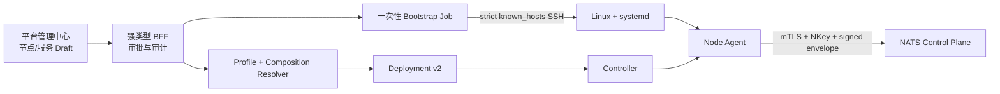

# 服务部署控制台

> 状态：节点引导纵切已实施，在线编排待接入｜最后更新：2026-07-18
>
> 本文是平台管理中心中“主机纳管、服务组合与集群副本”的单一真相源。首次引导决策见 [ADR-0069](../decisions/ADR-0069-SSH首次引导与Node-Agent接管.md)。

## 1. 目标模型

用户配置的是服务期望状态，而不是远端命令：

```text
Deployment
├── Backend Service A
│   ├── plugins: P1, P2
│   ├── replicas: 2
│   └── placement: region=cn
└── Backend Service B
    ├── plugins: P3
    ├── replicas: 3
    └── dependsOn: Service A
```

现有 Deployment v2 `ServiceUnit` 已包含 `plugins/config/replicas/placement/depends_on`；Controller 使用活动 Node Lease 调度副本，每个节点的 Node Agent 下载并验证插件、启动候选、原子切换并上报 ActualState。因此在线控制台不得建立第二套服务或集群数据模型。

## 2. 两段式控制链



SSH 作业成功只表示 systemd 已激活。平台必须观察到相同 `node_id`、预期传输身份和有效 Node Lease 后，才能把节点状态从 `Bootstrapping` 改为 `Ready`。超时进入 `Failed`，不得自动降级为匿名或不安全节点。

## 3. 当前已实现的引导契约

生产入口为：

```text
backend-kernel node-bootstrap -request ... -identity ... -known-hosts ...
```

`nodebootstrap.Request` 固定：SSH 目标、不可变内核版本/HTTPS URL/SHA-256、节点 ID/标签/容量、Deployment 身份、NATS 与制品仓库地址，以及本地秘密文件到远端固定秘密目录的映射。它拒绝明文 NATS、HTTP 下载、URL 内嵌凭证、未知 JSON 字段、非规范路径、宽松权限文件和未登记主机密钥。

远端只执行固定的 root stdin 脚本：创建专用用户、写入 root-owned/group-read-only 身份文件、下载并校验内核、原子切换 `current`、安装加固 systemd unit、启用并检查服务。不存在浏览器可传入的 command、arguments 或 shell 字段。

## 4. 在线编排后续纵切

1. 新增平台基础插件 `platform.infrastructure.deployment-manager`，持有节点登记、Bootstrap Job 和服务 Draft，不持有 SSH/制品/NATS 明文凭证。
2. Portal Edge 增加白名单强类型节点、服务、发布和状态 API；新增 `platform.deployment.read/write/bootstrap/approve/publish` 角色并保持职责分离。
3. 引导执行器通过可信内核 CredentialBroker 短时使用 SSH CredentialRef；插件只能提交请求，不能读取密钥。
4. 服务 Draft 解析为 Backend Platform Profile 与 Application Composition，经现有 Resolver 产生 Deployment v2，并以单调 revision/CAS 发布。
5. UI 提供节点、服务、插件、replicas、放置约束、依赖图、预检差异、审批、发布、滚动进度和回滚入口。
6. Bootstrap Job 状态至少包含 `Pending/Approved/Connecting/Installing/SystemdActive/Ready/Failed/Expired`，错误只返回稳定码与脱敏诊断。

## 5. 插件化边界

未来部署适配器按 `bootstrap provider + runtime provider` 分类。适配器负责把标准计划映射到 SSH/systemd、Docker、Kubernetes 或云 API；可信内核负责凭证回调、目标授权、制品验签、计划 Schema 校验和执行审计。适配器不能提供任意 Shell，也不能修改 Controller 生成的 Assignment。
