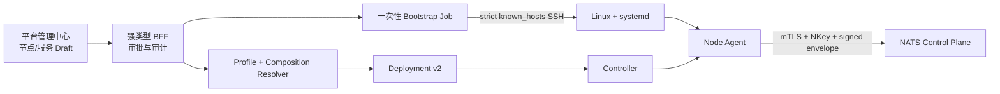

# 服务部署控制台

> 状态：节点定义、引导审批、可信执行桥与 Node Ready 判定已实施，服务发布与 UI 待接入｜最后更新：2026-07-18
>
> 本文是平台管理中心中“主机纳管、服务组合与集群副本”的单一真相源。首次引导决策见 [ADR-0069](../decisions/ADR-0069-SSH首次引导与Node-Agent接管.md)。

## 1. 目标模型

用户配置的是服务期望状态，而不是远端命令：

```text
Deployment
├── Backend Service A
│   ├── plugins: P1, P2
│   ├── replicas: 2
│   └── placement: region=cn
└── Backend Service B
    ├── plugins: P3
    ├── replicas: 3
    └── dependsOn: Service A
```

现有 Deployment v2 `ServiceUnit` 已包含 `plugins/config/replicas/placement/depends_on`；Controller 使用活动 Node Lease 调度副本，每个节点的 Node Agent 下载并验证插件、启动候选、原子切换并上报 ActualState。因此在线控制台不得建立第二套服务或集群数据模型。

## 2. 两段式控制链



SSH 作业成功只表示 systemd 已激活。Node Agent 随后发布使用自身 addressing NKey 签名的 v3 Node Lease；可信内核观察器校验 tenant、Deployment、cluster-global `node_id`、传输公钥、签名、KV key 与新鲜度完全一致后，才能把 Bootstrap Job 从 `SystemdActive` 推进到 `Ready`。超时或身份拒绝进入 `Failed`，观察器暂时不可用则保持 `SystemdActive`，不得自动降级为匿名或不安全节点。

## 3. 当前已实现的引导契约

生产入口为：

```text
backend-kernel node-bootstrap -request ... -identity ... -known-hosts ...
```

`nodebootstrap.Request` 固定：SSH 目标、不可变内核版本/HTTPS URL/SHA-256、节点 ID/标签/容量、Deployment 身份、NATS 与制品仓库地址，以及本地秘密文件到远端固定秘密目录的映射。它拒绝明文 NATS、HTTP 下载、URL 内嵌凭证、未知 JSON 字段、非规范路径、宽松权限文件和未登记主机密钥。

远端只执行固定的 root stdin 脚本：创建专用用户、写入 root-owned/group-read-only 身份文件、下载并校验内核、原子切换 `current`、安装加固 systemd unit、启用并检查服务。不存在浏览器可传入的 command、arguments 或 shell 字段。

## 4. 在线编排实施状态

1. **已实现**：平台基础插件 `com.vastplan.platform.infrastructure.deployment-manager` 持有节点登记和 Bootstrap Job，只保存 Credential 名称；进程中断时把未确认执行落为失败而不自动重放。
2. **已实现**：Portal Edge 与 TypeScript SDK 增加白名单强类型节点/作业 API；`platform.deployment.read/write/bootstrap/approve` 分离，插件领域层再强制申请人与审批人不同。
3. **已实现执行桥**：`kernel.node.bootstrap` 只接受精确插件身份；Linux Broker 通过 CredentialBroker 回调使用 material。Broker 未注入时能力不注册并 fail-closed。
4. **已实现 Ready 闭环**：`kernel.node.readiness` 只向精确 Deployment Manager 插件暴露封闭的 `Waiting/Ready/Rejected` 结果；插件不接触 NATS、KV 或信任文档。引导完成及作业查询都会执行拉式收敛。完整安全边界见 [ADR-0071](../decisions/ADR-0071-签名Node-Lease与可信就绪判定.md)。
5. **部分实现凭证提供方**：Node Agent 可用 `-credential-root` 注入企业 secret mount 目录 Broker；集中式 Vault/KMS provider 仍待实现。
6. **待实现**：服务 Draft 解析为 Backend Platform Profile 与 Application Composition，经现有 Resolver 产生 Deployment v2，并以单调 revision/CAS 发布。
7. **待实现**：UI 提供节点、服务、插件、replicas、放置约束、依赖图、预检差异、审批、发布、滚动进度和回滚入口。

## 5. 插件化边界

未来部署适配器按 `bootstrap provider + runtime provider` 分类。适配器负责把标准计划映射到 SSH/systemd、Docker、Kubernetes 或云 API；可信内核负责凭证回调、目标授权、制品验签、计划 Schema 校验和执行审计。适配器不能提供任意 Shell，也不能修改 Controller 生成的 Assignment。
