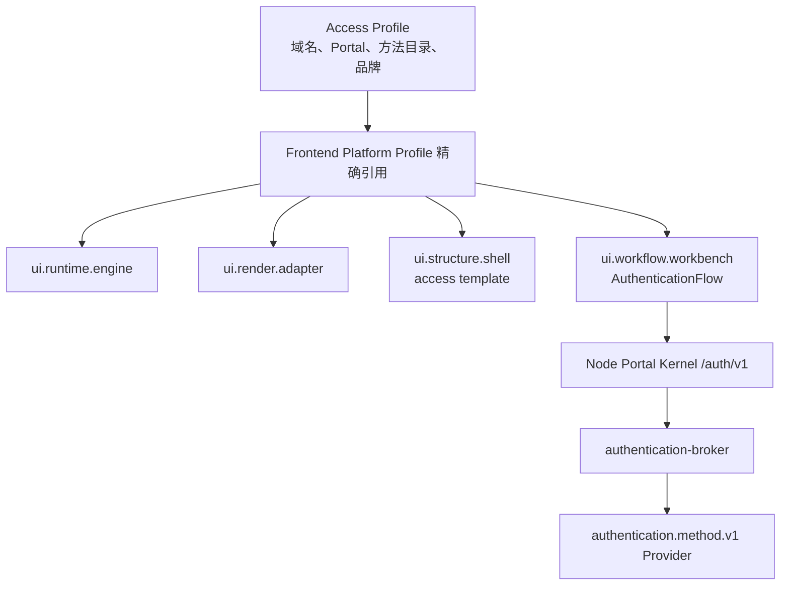

# 登录与认证协议

> 状态：方案 C 已采纳，L1 会话前目录与 bootstrap 已实施｜最后更新：2026-07-23
>
> 本文是会话前登录页面、Access Profile、认证交互协议和浏览器 Session 签发的单一真相源。企业身份 Provider、Seed Access、Provider 选择与交接见《[企业身份与种子访问](企业身份与种子访问.md)》；架构决策见 [ADR-0108](../decisions/ADR-0108-会话前Access-Profile与认证方法协议.md) 和 [ADR-0109](../decisions/ADR-0109-种子访问与企业身份Provider分离.md)。登录后的角色和权限见《[在线角色与权限治理](在线角色与权限治理.md)》。

## 1. 结论与现状

VastPlan 采用“独立会话前 Access Generation + 统一 AuthenticationFlow + 协议化 Method Provider + Node Session 签发”的方案。VastPlan 本身不拥有普通用户系统；密码、临时验证码、OIDC、Passkey 等均由企业选择的 Provider 插件实现，且不能自行提供任意前端页面或直接创建浏览器 Cookie。

当前 Node Portal Kernel 已实现 OIDC Authorization Code + PKCE、开发文件会话，以及不依赖 Principal 的 Access Profile Catalog 与公共 bootstrap。正常 Portal Generation 依赖已验证 Principal/tenant，不能反向用来加载登录页；会话前目录以域名/IP 和最长路径选择最小可信前端基线，未知 Host 不回退。Shell `access` 模板与可交互登录页仍在 L2，因此现阶段未登录访问继续使用既有 OIDC 跳转。

认证与授权必须分开：认证只证明“主体是谁、使用了什么方法、达到什么认证等级”；角色、permission code、撤权和资源授权继续由 Authorization Policy/Enforcer 决定。密码或验证码成功不能隐式获得管理员权限。

## 2. 会话前前端层级

Access Generation 复用现有四个基础层，不建立第二套前端内核：

Access Profile 的机器契约位于 `contracts/schemas/authentication/v1`，包含：

- `tenantId/portalId/route/domains`：Node 根据请求 hostname 与最长 route 选择，未知域名不回退；
- `platformProfile`：精确锁定既有 Frontend Platform Profile revision/digest；
- `accessTemplate`：必须由被引用 Shell Catalog 提供，初始为 `access`；
- `localization.defaultLocale/supportedLocales`：只定义会话前可选语言，不复制登录后 Platform Profile 的完整本地化资源；
- `authentication.allowedMethods/defaultMethod/reuseIdentifier`：只控制方法可见性和顺序，不绑定 Provider 进程地址；
- `branding`：只允许本地化产品名、内容寻址 Logo ID/digest 和同源帮助/隐私路径，不接受 HTML、CSS 或外部 URL。

Access Profile Catalog 是服务端控制面输入，不直接下发内部 tenant、Portal 或 Platform Profile 引用。Node 把所选 Profile 规范化并生成不可变 `generationId`，浏览器 bootstrap 只取得访问模板、品牌、语言和允许的方法策略；Logo 摘要也只留在可信宿主，浏览器得到不含摘要的资产 ID。方法的本地化描述与当前事务步骤由后续 Broker 流程补充。会话前使用 Platform Profile 默认 Renderer/Theme；用户级偏好只有建立 Session 后才能读取。

登录页面固定结构为 `AccessCanvas → AccessHeader → AuthPanel → AuthenticationFlow → AccessFooter`。桌面默认使用 420px 左右的单任务面板；宽屏品牌区只能由受治理模板提供，移动端折叠为单列。不得出现主菜单、Page Header、营销式 Hero、装饰渐变或功能插件 Slot。

## 3. Authentication Method v1

公共协议 `authentication.method.v1` 包含六个操作：

| 操作 | 作用 | 边界 |
|---|---|---|
| `describe` | 返回方法 kind、交互类型、AMR/ACR 和本地化名称 | 不返回组件或脚本 |
| `begin` | 为 Broker 创建的 transaction 生成第一步 | 不接受浏览器自报 tenant/Portal |
| `continue` | 提交当前 step 的固定字段响应 | Broker 必须按已发 step 再校验字段 |
| `resend` | 请求重新发送可重发挑战 | 新挑战必须使旧码失效 |
| `cancel` | 终止 transaction 和敏感状态 | 必须幂等 |
| `health` | 报告 Provider 是否可用 | 不暴露账号、队列或供应商秘密 |

Provider 只能返回固定 Step：`identifier/password/one-time-code/redirect/context-selection`。字段只允许 `identifier/password/one-time-code/select`，并固定 autocomplete、长度和 choice 语义；未知字段、任意 JSON Schema、React、HTML、CSS、URL 脚本和框架对象都被公共 Schema 拒绝。

`continue` 对表单 Step 只接受已声明的 `responses`；对 redirect Step 只接受互斥的 `redirect={code,state}` 或 `redirect={error,state,errorDescription}`。回调对象不允许 Token、任意 query 参数或 URL，Provider 必须校验 state、PKCE、redirect URI、issuer、audience 和 nonce 后才可返回 Evidence。

状态固定为 `challenge/authenticated/rejected/locked/expired/cancelled`。失败只允许一组通用 reason code，防止 Provider 用 `user_not_found` 等错误码形成账号枚举。认证成功返回最长 60 秒的 `AuthenticationEvidence`，包含 Subject/Issuer、AMR、ACR、transaction 和 nonce，不包含 tenant 授权、角色、Cookie 或 Token。

Authentication Broker 校验 Evidence、事务、Access Profile、限流和主体目录后，签发最长 30 秒、Ed25519、audience/tenant/portal/nonce 绑定的一次性 `AuthenticationAssertion`。Node Portal Kernel 验签、核对事务且原子消费 assertion 后，才能重新生成 HttpOnly Session。公共解析函数只校验 wire shape 与时间窗；真实验签、key rotation 和一次性消费属于 Broker/Node 实现，不能因 Schema 通过而省略。

## 4. 可选企业登录方式

### 4.1 数据库用户密码 Provider

- 页面使用 `username/email/tel` identifier 和 `current-password`，不能误用注册/重置场景的 `new-password`；
- 只有部署选择数据库用户 Provider 时才创建对应用户数据；它不是平台内核的内置用户表。Provider 使用 Argon2id、独立 salt，并通过 Credential Material Lease 取得部署级 pepper；数据库不保存明文、可逆密文或 pepper；
- 校验使用常量时间路径和统一 `authentication.invalid_credentials`，账号不存在与密码错误的外部状态、文案和近似耗时一致；
- 密码只存在于当前 HTTPS 请求、Node BFF 有界缓冲和目标 Provider 的同步校验路径，不进入 URL、日志、CallContext、审计详情、前端热替换状态胶囊或重试队列；
- 密码注册、重置、找回和强制轮换属于独立 Recovery/Management 流程，不塞入登录协议。

### 4.2 企业目录临时验证码 Provider

- 首期支持用户标识 → 发送挑战 → 输入一次性验证码；具体邮件、短信或企业消息渠道由独立 Delivery Provider 选择；
- 服务端只保存验证码 HMAC/摘要、transaction、过期时间和尝试计数；默认有效期五分钟，重发冷却一分钟，最多五次校验，重新发送使旧码立即失效；
- 请求发送无论账号是否存在都返回同形结果；真实发送、抑制或黑名单状态不得泄露到浏览器；
- `autocomplete=one-time-code`，长度限制 4–32；Workbench 切换方法时只能复用非敏感 identifier，必须清空密码和验证码；
- 短信/邮件 OTP 作为密码的替代登录仍是单因素认证，不能自动标记为 MFA/AAL2。未来只有一个已验证 Session 内连续满足两个独立因素，才能提升认证等级。

## 5. Broker、Node 与插件边界

- `cn.vastplan.platform.security.authentication-broker`：平台状态插件，拥有 transaction、限流、Evidence 校验、Access Profile 绑定、审计和 Assertion 签发；
- 可选数据库用户插件：密码校验 Provider，未配置数据库时保持 Blocked；
- `cn.vastplan.platform.security.authentication.method.otp`：验证码生成、摘要校验与 Delivery 端口协调；
- Node Portal Kernel：唯一公网 BFF 与浏览器 Session 签发者，只通过窄 `AuthenticationPort` 调 Broker；
- Shell/Workbench：首方 Foundation 插件分别增加 `access` 模板和 `AuthenticationFlow`，Method Provider 不携带 frontend entry。

未认证请求没有人的 permission，不能直接调用普通 Backend capability。只有经 transport trust 精确授权的 Node BFF 系统身份可以调用 Broker 公共认证入口；登录方式配置、密码策略、验证码策略和审计查询属于已登录管理面，后续声明 `platform.authentication.*` 精确权限并进入在线角色治理。

Broker 推荐 Go：低延迟、确定状态机和现有 Backend 契约复用更合适。OIDC/OAuth 优先考虑 Node 生态；数据库密码、SAML/LDAP 和 Delivery Provider 按驱动与供应商 SDK 成熟度选择 Go、Node、Java、Python 或其他语言。运行方式与语言分开：首方 Broker 可进入可信共享 Go Runtime；第三方身份 Provider 默认独立隔离。

## 6. HTTP、集群和失败语义

Node 同源 BFF 路径为：

- `GET /auth/v1/bootstrap?returnTo=<同源路径>`（已实施；只允许 GET/HEAD，`no-store`，未知 Host/route 返回 404）
- `POST /auth/v1/transactions`
- `POST /auth/v1/transactions/{id}/continue`
- `POST /auth/v1/transactions/{id}/resend`
- `DELETE /auth/v1/transactions/{id}`
- 既有 `/auth/callback` 作为 redirect Method 回调边界保留

会话前写请求仍需 pre-auth CSRF、Origin/Fetch-Metadata、SameSite Cookie 和请求大小限制。transaction Cookie 与 Session Cookie 分离；成功后销毁 transaction 并创建全新 Session，防止 session fixation。`returnTo` 只允许同源规范路径。

Broker transaction 必须进入集群共享 Store 或使用带所有者路由的实例亲和句柄，不能依赖 Node 单机内存。Broker/Provider 故障时不得换 Provider 重放密码或验证码；只返回通用可重试状态。Assertion 一次性消费和 Session 签发必须具备 CAS/nonce 防重放。Access Profile 或 Provider revision 变化只影响新 transaction，已开始事务使用创建时锁定版本直到短时过期。

## 7. 实施阶段

| 阶段 | 内容 | 状态 |
|---|---|---|
| L0 | ADR、Method/Assertion/Access Profile DTO、JSON Schema、严格解析与安全测试 | 已实施 |
| L1 | Access Profile Catalog 窄端口、本地可信文件适配器、会话前 Generation、公共 bootstrap 裁剪 | 已实施 |
| L1b | 在线控制面目录适配器、品牌内容寻址资产读取与目录热推进 | 待实施 |
| L2 | Shell `access` 模板、Workbench `AuthenticationFlow`、Arco/MUI 一致渲染 | 待实施 |
| L3 | Authentication Broker、transaction Store、Assertion 签发与 Node 验签/Session | 待实施 |
| L4 | Password Provider、Argon2id/pepper、账号枚举与限流测试 | 待实施 |
| L5 | OTP Provider、Delivery Port、重发/过期/单次消费和集群测试 | 待实施 |
| L6 | OIDC redirect Method（public PKCE 已实施），confidential Material Lease 与在线策略管理 | 部分实施 |

正式开放登录前必须覆盖：多 Node 并发、事务重放、时钟偏差、重复验证码、Provider 崩溃、账号枚举计时、CSRF、Session fixation、CSP、键盘/读屏、200% 缩放、RTL、中英文和 Arco/MUI 对照验收。
