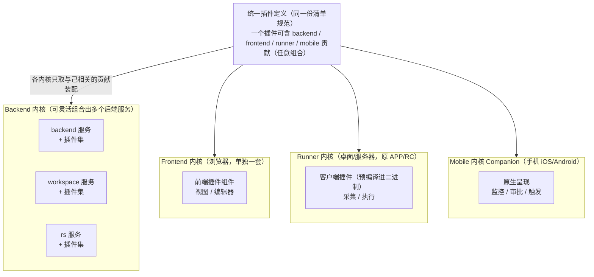
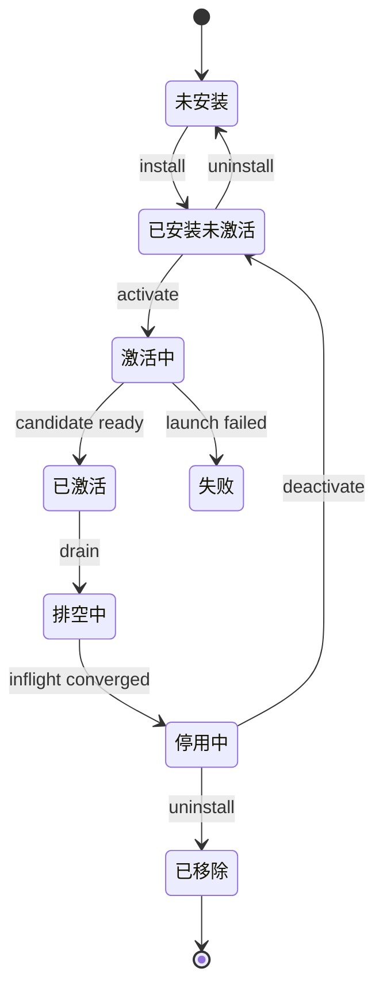
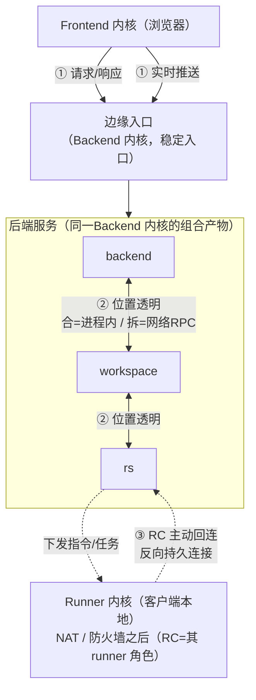
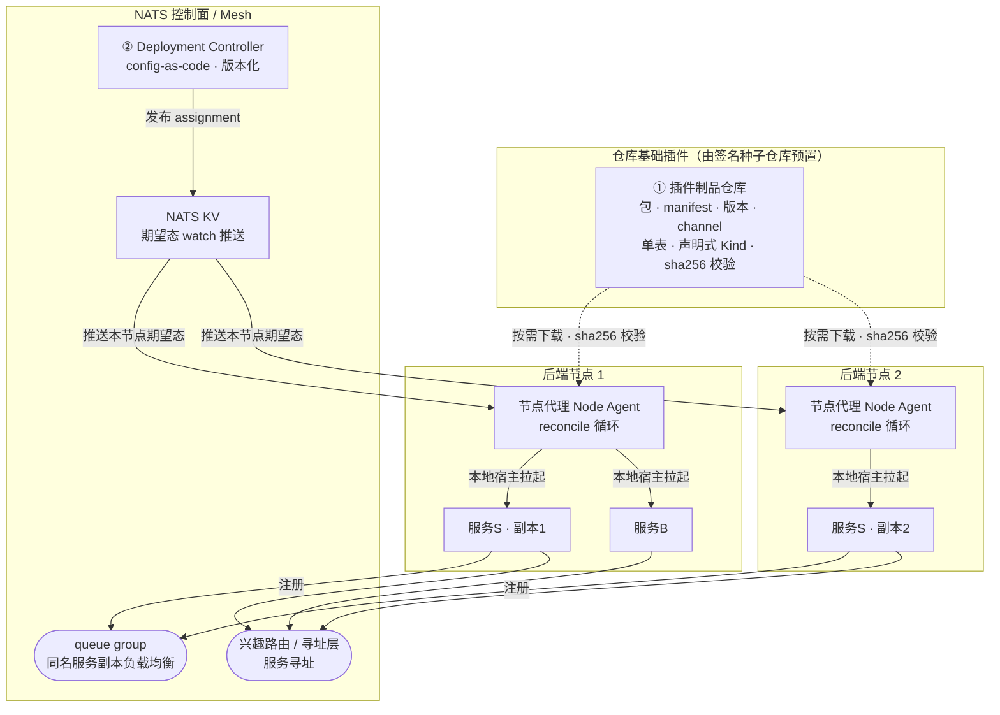
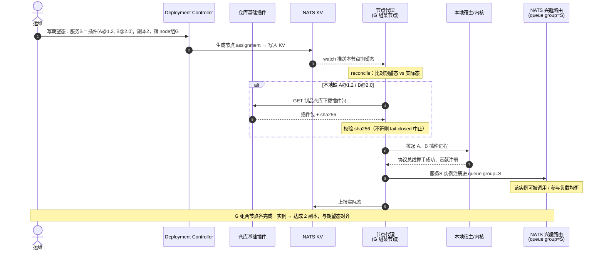

# 系统架构（VastPlan）

> 状态：设计草案 v0.2｜最后更新：2026-07-17
> 本文是 VastPlan **系统架构**的单一真相源，整合了顶层概览、系统骨架、内核间通信、插件服务与部署编排。插件的**声明、协议与契约**见姊妹篇《[插件契约与协议](插件契约与协议.md)》；**为什么这么设计**见《[决策记录 ADR](../decisions/README.md)》。全文保持在架构模式/契约层，凡涉具体技术栈处以已定选型说明并标注来源 ADR。

---

## 引言：定位与决策速览

VastPlan 是一套**基于 LLM 的通用 Agent 系统**，面向企业级客户：在线 Agent 开发 + 远程连接任务客户端在本地运行脚本/工作流。核心是 **微内核 + 全层扩展点**——内核最小，绝大多数功能（审计、可观测、用户系统扩展、Studio 可开发模块等）都是骨架之上的**第一方插件**。

> 插件当前全部由本方开发（第一方、可信），暂不开放第三方；插件市场用于分发本方插件。第三方清单与运行驱动扩展位已预留；生产默认要求未知发布者至少 `process-sandbox`，内核使用者可按发布者收紧、放宽或拒绝运行（ADR-0048）。

### 方向性决策速览

| 决策            | 选择                                                                          | ADR                                                  |
| ------------- | --------------------------------------------------------------------------- | ---------------------------------------------------- |
| 插件化架构模型       | 微内核 + 全层扩展点（一切功能皆第一方插件）                                                     | [0001](../decisions/ADR-0001-插件运行模型.md)              |
| 技术栈           | 全新选型，不受 testa 约束                                                            | [0002](../decisions/ADR-0002-技术栈选型.md)               |
| 插件装载模型        | 运行时热装（在线安装/启停/卸载，内核不重部署）                                                    | [0003](../decisions/ADR-0003-插件装载模型.md)              |
| 插件运行形态        | 独立进程 + 协议总线（故障隔离、栈自由）                                                       | [0004](../decisions/ADR-0004-插件运行形态.md)              |
| 多语言与隔离边界     | native/python 运行驱动；全局三态策略与发布者级优先覆盖，签名清单下限不可降低                                | [0047](../decisions/ADR-0047-多语言运行驱动与第三方隔离边界.md) / [0048](../decisions/ADR-0048-发布者级插件运行策略.md) |
| 骨架与栈关系        | 骨架先与技术栈无关地设计                                                                | [0005](../decisions/ADR-0005-骨架与技术栈解耦.md)            |
| 内核分区与后端组合     | 内核分区（见 0014 扩为四套）+ 后端灵活组合出 backend/workspace/rs                             | [0006](../decisions/ADR-0006-内核分区与后端组合.md)           |
| 内核间通信         | 统一契约 + 位置透明 + 三类连接拓扑                                                        | [0007](../decisions/ADR-0007-内核间通信模型.md)             |
| 控制面选型         | NATS 主选（事件+服务RR+RC连接）；Dapr 否决；go-plugin 作插件宿主范式                             | [0008](../decisions/ADR-0008-骨架技术选型对比.md)            |
| 内核技术栈         | 后端 Go / APP(客户端) Go / 前端 React；LLM 逻辑走 Python 插件（gRPC）                      | [0009](../decisions/ADR-0009-内核技术栈选型.md)             |
| 制品服务与编排       | 内核信任/种子基座 + 仓库基础插件 + 节点代理 reconcile；集群化用 NATS queue group                        | [0010](../decisions/ADR-0010-插件服务与部署编排.md) / [0049](../decisions/ADR-0049-制品信任基座与仓库基础插件.md) |
| 启动依赖与故障恢复   | 全局依赖编排 + 内核本地自治启动；跨服务用 capability readiness lease，不做全局同步事务             | [0044](../decisions/ADR-0044-全局依赖编排与本地自治启动管理.md) |
| 插件服务集群化       | 实例策略 + 能力可见性 + 路由域；区分 per-kernel、active-active、leader、partitioned                | [0045](../decisions/ADR-0045-插件实例化策略与服务集群化边界.md) |
| 组合是通用能力       | 四套内核都可组合：后端→服务、前端→门户、Runner→客户端App、移动→Companion App                         | [0011](../decisions/ADR-0011-组合是通用内核能力.md)           |
| Runner 内核运行模型 | 客户端编译型插件**预编译**进单一签名二进制（进程内）+ 整体原子热升级；内容型脚本仍运行时下载                           | [0012](../decisions/ADR-0012-APP内核运行模型.md)           |
| APP 多档能力      | 桌面/服务器=完整 runner；手机(iOS/Android)=**Companion 伴侣端**（监控/通知/审批/触发，商店/MDM 分发）   | [0013](../decisions/ADR-0013-APP多档能力与手机Companion.md) |
| 四内核结构         | 客户端拆为 **Runner 内核**（桌面执行器）+ **Mobile 内核 Companion**；共 4 内核（后端/前端/Runner/移动） | [0014](../decisions/ADR-0014-四内核结构.md)               |

### 顶层分层

```
┌─────────────────────────────────────────────────────────┐
│  插件市场 (Marketplace)   分发本方插件 / 版本 / 在线安装   │
├─────────────────────────────────────────────────────────┤
│  内核 Kernel（四套）  生命周期 · 扩展点注册表 · 协议总线    │
│                      · 横切服务（身份/权限/可观测/事件）    │
│  Frontend 内核 │ Backend 内核（backend/workspace/rs）│ Runner │ 移动 │
│  ── 各内核经协议总线承载独立进程/组件的第一方插件 ──        │
└─────────────────────────────────────────────────────────┘
```

四套内核共用同一套统一插件定义；一个特性可横跨多面，逻辑上是一个插件（详见第一章 §3）。

---

## 第一章 系统骨架（微内核 + 扩展点）

### 1.1 目标与约束（均已定为 ADR）

- **微内核 + 一切功能皆插件**：内核最小化，审计/可观测/用户扩展/Studio 模块等都是第一方插件。
- **内核四分区**（0006/0014）：**Backend / Frontend / Runner / Mobile** 内核（规范 ID `backend/frontend/runner/mobile`，见 [0015](../decisions/ADR-0015-内核与贡献面命名规范.md)），各自独立、贴合运行环境，但吃同一套统一插件定义、共享客户端核心库。
- **组合是通用内核能力**（0011）：四套内核都可"内核 + 选定插件集 + 配置"组合出多个单元——后端→**服务**（backend/workspace/rs）、前端→**门户 Portal**、Runner→**客户端 App/Profile**、移动→**Companion App**。
- **运行时热装**（0003）：插件在线安装/启用/停用/卸载/升级，内核不重部署。
- **独立进程 + 协议总线**（0004）：插件独立进程运行，经稳定协议与宿主通信；故障隔离、栈自由。
- **第一方可信、第三方预留**：第一方 native/python 采用独立进程故障隔离与协议/资源边界；生产默认要求未知发布者使用至少 `process-sandbox` 的驱动。部署方可配置 `require-isolation / allow-trusted / deny`，发布者级规则优先，签名清单隔离下限不可降低。

### 1.2 核心概念（术语单一真相源）

| 概念 | 定义 |
|---|---|
| **内核 Kernel** | 最小骨架：插件宿主、扩展点注册表、生命周期、协议总线、核心横切服务。分**四套**：后端/前端/Runner（桌面执行器）/移动（Companion）。不含业务。 |
| **后端服务 Backend Service** | Backend 内核 + 选定后端插件集 + 部署编排的一次**组合**产物（backend/workspace/rs）。同源、可合可拆。 |
| **宿主 Host** | 某套内核对插件的承载与调度运行时。一个后端服务是Backend 内核的一个宿主实例。 |
| **插件 Plugin** | 逻辑上一个功能特性，声明其贡献；可为纯 frontend、纯 backend、或同时含 frontend+backend+runner+mobile 任意组合。 |
| **扩展点 Extension Point** | 内核开放的"可被插件填充的位置"，以**注册表 Registry** 实现（借鉴 testa 的 PermissionChecker/EventSink/Hook 等）。 |
| **贡献 Contribution** | 插件对某扩展点的具体填充（一个工具包、一个 UI 视图、一个权限校验器…）。 |
| **统一插件定义 Manifest** | 四套内核共用的一份清单规范。详见《[插件契约与协议](插件契约与协议.md)》。 |
| **协议总线 Protocol Bus** | 插件进程与宿主之间的稳定通信协议。详见《[插件契约与协议](插件契约与协议.md)》。 |
| **契约 Contract** | 跨组件不可变数据结构（CallContext/CallResult/Event），一次定义、所有方共用。详见《[插件契约与协议](插件契约与协议.md)》。 |

### 1.3 总体结构：四套内核，一套插件定义



- **四套内核彼此独立**，各自贴合运行环境、实现栈可异构（0005/0009）。
- **组合是通用能力**（0011）：四套内核都按"内核 + 选定插件集 + 配置"组合出多个单元——后端→服务（可合可拆、同源不分叉）、前端→门户 Portal、Runner→客户端 App/Profile、移动→Companion App。
- **一套插件定义贯通四面**：每套内核装配时只取与自己相关的贡献；横跨多面的特性逻辑上是一个插件。
- **装配方式按内核而异**：服务端运行时热装 + 独立进程（0003/0004）；**Runner 内核**（客户端执行器）编译型插件**预编译进单一签名二进制、进程内、整体原子热升级**（0012），内容型脚本/工作流仍运行时下载；**Mobile 内核** gomobile bind 进原生外壳、商店/MDM 分发（0013/0014）。

### 1.4 微内核职责（四套内核的共性最小集）

每套内核都提供以下最小集（实现可各异，语义一致）；其余下沉为插件：

1. **插件生命周期管理器**：装载/激活/停用/卸载/升级的状态机（§1.7）。
2. **扩展点注册表**：登记扩展点与其上贡献，提供注册/解绑/查询（§1.5）。
3. **协议总线**：插件接入、贡献声明、调用路由、事件分发、生命周期指令。
4. **核心横切服务**（尽量以"内核内置扩展点 + 可被插件替换的默认实现"提供）：身份（统一 Principal）、权限（`(caller,scene,target)` 三元组，校验器为扩展点）、事务/持久化契约、可观测（埋点 + EventSink 出口，审计/可观测实现为插件）、事件总线、配置。

> 判据：凡"换一种实现是合理需求"的能力（审计策略、权限规则、用户校验、可观测后端），内核只定扩展点与契约，默认实现以插件提供。四套内核横切侧重不同：后端最完整，前端偏 UI 装配与会话身份，Runner 偏本地执行与连接管理，移动偏呈现与审批交互。

### 1.5 扩展点模型（注册制驱动）

- **扩展点 = 一个具名 Registry + 一份贡献契约**。例如 `permission.checker` / `event.sink` / `hook` / `tool.package`（后端）、`view.slot` / `editor.provider`（前端）、`runner.script` / `runner.capability`（Runner/rs）、`mobile.view` / `mobile.approval` / `mobile.trigger`（移动）。完整清单与各贡献 descriptor 见《[插件契约与协议](插件契约与协议.md)》**第四章 扩展点契约**。
- **场景化三元组**：权限/计量/统计统一基于 `(caller, scene, target)`。
- **动态性**：注册表支持运行时注册/解绑以支撑热装；解绑需可回收（引用清理、在途调用收敛）。
- **不可变契约**：`CallContext/CallTarget/CallResult/CallEvent` 一次定义、跨面共用。

### 1.6 插件与宿主的连接

插件以独立进程运行，经**协议总线**与所属内核宿主握手、注册贡献、被接入扩展点；宿主↔插件双向（宿主调插件、插件回调宿主/寻址层）。消息集、握手、故障隔离详见《[插件契约与协议 · 插件-宿主协议](插件契约与协议.md)》。**跨面插件**各部分（前端↔后端↔RC）的协作走第二章的内核间通信平面，不占用宿主-插件协议总线。

### 1.7 生命周期（运行时热装）



- **install**：拉取插件包 → 校验清单与依赖 → 登记，不启动。
- **activate**：按需（惰性激活事件）拉起插件 → 握手 → 贡献注册进扩展点 → 可用。
- **deactivate**：优雅关闭 → 解绑贡献 → 释放资源。
- **uninstall**：deactivate + 删包与登记。
- **upgrade**：旧实例保持 `active`，候选依次经历 install/activate；候选验证成功后原子切换并排空旧实例，失败则保留旧实例。需要持久状态的插件必须先完成显式迁移事务，不能由内核猜测私有状态。
- 全程**不重部署内核**；四套内核对各自管辖的插件面独立执行。

Backend Node Agent 的实际态采用“当前稳定实例 + candidate”双视图，并在长操作前后持久化检查点；精确状态、v1 读取迁移和失败语义见 [ADR-0032](../decisions/ADR-0032-Backend插件生命周期实际态v2.md)。

### 1.8 装配元数据（原"权限"的再定位）

第一方可信语境下，清单里的 `capabilities` 不是安全边界，而是**装配元数据**：声明插件需要哪些内核能力/资源/凭证句柄，供宿主激活时装配注入与排依赖；声明对其他插件的依赖，供定序激活与检测环状依赖；后端贡献可标注**面向哪个后端服务角色**（backend/workspace/rs），供组合装配。字段详见《[插件契约与协议](插件契约与协议.md)》。

### 1.9 四内核 / 扩展面速览

| 内核 | 运行环境 | 组合/形态 | 典型扩展点 | 典型第一方插件 |
|---|---|---|---|---|
| Backend 内核 | 服务端 | 组合出 backend/workspace/rs | 工具包 / Agent / 权限校验器 / 事件汇 / Hook / Runner 调度 | 审计、可观测、用户校验、信息扩充、执行后端 |
| Frontend 内核 | 浏览器 | **组合出多个门户 Portal**（admin/Studio/门户，0011） | 视图 slot / 编辑器 / 命令 / 设置项 | Studio 可开发模块、各业务面板 |
| Runner 内核（桌面执行器，原 APP/RC） | 桌面/服务器 mac/win/linux | **完整 runner**：组合出多个客户端 App/Profile（预编译，0011/0012） | 本地执行能力 / 采集器 / 运行时适配 | 平台特定采集、脚本运行时 |
| Mobile 内核 Companion | 手机 iOS/Android | **伴侣端**（0013/0014）：组合出多个 Companion App；商店·MDM 分发 | 监控视图 / 审批 / 触发（无后台常驻/本地执行） | 移动审批与监控 |

### 1.10 与技术栈的边界

骨架定义（内核职责、扩展点=Registry、协议三类消息、生命周期状态机、不可变契约）均为架构模式与契约，不绑定语言（0005）。已定选型（0009）：后端 Go、Runner（客户端）Go、前端 React + Module Federation、移动经 gomobile bind 进原生外壳；LLM 逻辑走 Python 插件经 gRPC。四套内核实现栈可异构。

---

## 第二章 内核间与服务间通信

> 注意与第一章"宿主↔插件协议总线"区分：那是内核**内**通信；本章是内核/服务**间**通信（跨服务、跨内核）。两者共用不可变契约，范围不同。

### 2.1 通信轴总览



| 编号 | 链路 | 发起方 | 连接形态 | 传输特性 | 鉴权 |
|---|---|---|---|---|---|
| ① | Frontend ↔ 后端 | 浏览器 | 客户端→边缘入口 | 请求/响应 + 实时推送 | 用户会话令牌 |
| ② | 后端服务 ↔ 后端服务 | 对等 | 位置透明（进程内/网络RPC） | 请求/响应 + 跨服务事件 | 服务内网信任 + 上下文透传 |
| ③ | RS ↔ RC | **RC 回连** | 反向持久连接（RC 在 NAT 后） | 下发指令 + 上行结果/日志流 | 签名客户端 + 接入令牌 |

### 2.2 设计原则

1. **统一消息契约**：三条平面共用 `CallContext/CallResult/CallEvent`，语义一致；差异只在传输与拓扑。
2. **位置透明**：后端服务间调用不硬编码"本地还是远程"，由内部服务寻址层运行时解析。合/拆是部署决策，不改代码。
3. **拓扑按网络位置分类**：谁能主动连谁由网络现实决定（RC 在 NAT 后只能回连）。
4. **上下文透传**：身份/租户/追踪/场景随调用在所有平面透传。
5. **故障隔离与背压**：超时、重试、熔断、背压是通信层一等公民。

### 2.3 后端服务 ↔ 后端服务（位置透明）

"灵活组合"的核心支撑。

- **内部服务寻址层**（对标 testa 跨服务调用统一层）：调用方按**服务角色 + 能力名**发起，不关心目标在本进程还是另一台机器。合并部署→进程内直调（零序列化）；拆分部署→网络 RPC（同一调用签名）。
- **两种交互**：请求/响应；跨服务事件（pub/sub）。
- **去中心**：寻址层是**每个内核内嵌的分布式能力**（不是中心 hub），配轻量控制面三设施——服务发现/注册、事件 broker、RC 连接路由表（数据面不穿中心，避免 SPOF 与瓶颈）。
- **进程内路径与网络路径必须行为等价**（除性能外），契约与错误语义一次定义两路径共用。

> 服务发现按**能力名寻址**：每个插件贡献有稳定逻辑名（=清单 id=`CallTarget.capability`）；本地 Registry 命中即直调，未命中查全局能力目录（本地缓存 + watch）解析到远端。合时解析到本地、拆时解析到远端。

### 2.4 Frontend ↔ 后端（边缘入口 + 双子通道）

- **稳定边缘入口**：Frontend 只认一个入口（Backend 内核的边缘/网关角色），由它路由到当前组合出的后端服务；前端不感知后端拓扑，合/拆无感。
- **两个子通道**：请求/响应（业务 API）；实时推送（日志流、任务进度，长连接）。
- **流式直连的取舍**：高吞吐流式可选择前端直连特定流式端点（对标 testa 前端直连 RS 日志流）；这是显式优化，默认走边缘入口。
- 鉴权：用户会话令牌；边缘入口校验后把 Principal 透传到内部调用。

### 2.5 RS ↔ RC（反向持久连接）

RC 在客户端本地、常处 NAT/防火墙之后，服务端无法主动连它：

- **RC 主动回连 RS** 建反向持久连接；下行 RS 推指令/任务，上行 RC 回流结果/日志/心跳。
- **接入信任链**：签名客户端 + 接入令牌/API Key。
- **连接生命周期**：心跳保活、断线自动重连、重连恢复；离线期 RS 侧缓冲与超时。
- **多副本 RS**：连接亲和或经共享路由把指令投递到持有该 RC 连接的副本（NATS 兴趣路由天然支持，0008）。
- 下发/上行消息仍复用 `CallContext/CallResult/CallEvent`，承载在反向连接上。

### 2.6 与"插件-宿主协议总线"的关系

| | 协议总线（第一章） | 内核间/服务间通信（本章） |
|---|---|---|
| 范围 | 内核**内**：宿主 ↔ 本内核插件 | 内核/服务**间**：跨内核、跨后端服务 |
| 对象 | 一个宿主与它管辖的插件进程 | backend/workspace/rs、Frontend、Runner、Mobile 之间 |
| 契约 | 共用 `CallContext/CallResult/CallEvent` | 同上（刻意统一） |

一次端到端调用可能先经内核间通信抵达某后端服务，再经该服务内的协议总线派发给某插件。契约统一使全链路上下文与可观测无缝衔接。

### 2.7 跨面插件各部分的协作

同一插件的 frontend/backend/runner/mobile 部分之间的通信走本章的内核间平面：前端部分→后端部分走 ①；后端部分→Runner 部分走 ② 到 rs 再走 ③。插件不获得私有跨面通道，一律复用统一通信平面，保证鉴权、计量、可观测一致。

> 控制面主选方向 **NATS**（事件 + 服务 RR + RC 反向连接），强类型/大流式 RPC 保留 gRPC，见 [ADR-0008](../decisions/ADR-0008-骨架技术选型对比.md)。

### 2.8 内部服务寻址层接口

寻址层是**每个内核内嵌的分布式能力**（非中心 hub，ADR-0007/0008）：调用方按能力名发起，由它解析到本地直调或远端 RPC，两路径行为等价（位置透明）。

#### 2.8.1 接口原语（示意，栈无关）

```
Addressing:
  Invoke(ctx CallContext, target CallTarget, payload) -> (CallResult, payload)   // 请求/响应
  InvokeStream(ctx, target, payload) -> Stream                                    // 流式
  Publish(ctx CallContext, event CallEvent) -> err                               // 发事件
  Subscribe(pattern, handler) -> Subscription                                     // 订阅事件
  Announce(capability, endpoint, meta)   // 把本地能力登记到全局目录
  Withdraw(capability)                    // 解绑（热装/下线）
```

#### 2.8.2 解析算法（Invoke 的位置透明）

```
resolve(target.capability):
  1) 查【本地 Registry】命中 → 进程内直调（零序列化）                 # 合
  2) 未命中 → 查【全局能力目录】(本地缓存 + watch，非每次都打)
       得到 {service, instances[], version}
  3) 选实例(负载均衡/亲和) → 走远端传输(§2.9)                        # 拆
  4) 两路径同一 (CallTarget, CallContext) 签名、同一错误语义
```

#### 2.8.3 全局能力目录记录

当前记录粒度是一实例一租约：`{ capability, extensionPoint, serviceRole, instanceId, nodeId, unitId, subject, version, health, updatedAt }`。Runtime 激活后登记，10 秒心跳续租，KV TTL 30 秒；下线主动删除，异常退出由 TTL 最终摘除。Router 以 watch + 周期全量刷新维护本地缓存，目录不在每次调用的数据热路径。

#### 2.8.4 位置透明契约

进程内路径与网络路径**除性能外行为必须等价**：同一契约、同一错误码、同一上下文透传、同一取消/超时语义。差异只在延迟与序列化开销。

### 2.9 Wire 层（传输与序列化）

各通信面的落地传输如下；后端 request-reply 与非持久事件按 [ADR-0025](../decisions/ADR-0025-NATS控制面寻址与多节点调度.md) 实现，跨服务双向流与持久事件按 [ADR-0029](../decisions/ADR-0029-跨服务双向流与持久事件.md) 实现：

| 面 | 传输 | 序列化 | 说明 |
|---|---|---|---|
| 宿主 ↔ 插件（协议总线，内核内） | gRPC over HTTP/2（本机 loopback/UDS） | Protobuf | 双向流 `Channel` 多路复用；本机低延迟 |
| 后端服务 ↔ 服务（合，同进程） | 进程内直调 | 无 | 零序列化 |
| 后端服务 ↔ 服务（拆，请求/响应） | **NATS request-reply**（默认，自带发现+LB）；**gRPC**（强类型/大流式/大 payload） | Protobuf | 寻址层按能力元数据择一，调用方无感 |
| 跨服务事件（pub/sub） | **NATS core / JetStream**（需持久化用 JetStream） | Protobuf/CloudEvents | 至少一次/顺序/持久化随平面定 |
| RS ↔ RC（反向连接） | **NATS**（RC dial-out + subject 兴趣路由 + leaf node） | Protobuf | 穿 NAT、跨集群路由到持有连接的节点（ADR-0008） |
| Frontend ↔ 后端（边缘入口） | HTTPS/JSON（REST/gRPC-web）+ WebSocket（实时推送） | JSON | 浏览器约束：边缘入口做 Protobuf↔JSON 翻译 |
| Mobile ↔ 后端 | HTTPS + APNs/FCM（离线推送） | JSON | 前台在线走边缘入口，离线走系统推送（ADR-0013） |

**要点：**
- **内部一律 Protobuf**（CallContext/Result/Event 即 Protobuf 消息）；**浏览器/移动边缘用 JSON**，由**边缘入口翻译**，内网仍是 Protobuf。
- **远端传输择一策略**：默认 **NATS request-reply**（免每服务 LB、天然发现与位置透明）；标注为流式/大 payload 的能力走 **gRPC** 直连。寻址层封装该选择。
- **wire 版本**：远端调用使用 `proto/addressing/v1`。一元调用 subject 为 `vp.rpc.v1.<capability-token>`，取消为 `vp.rpc.cancel.v1`；双向流通过能力目录中的 `stream_endpoint` 连接 `CapabilityStream.Open`。非持久事件为 `vp.event.v1.<event-token>`，持久事件为 `vp.event.persist.v1.<event-token>`。
- **生产信任边界**：NATS 客户端使用 TLS 1.3 双向证书 + 每实例 NKey；gRPC 流式端点使用 TLS 1.3 双向证书。bootstrap/controller/node/runtime 按具体 KV Stream、JetStream consumer API 与 RPC/Event Subject 分权，明文连接只允许显式本地开发，见 ADR-0027/0029。

---

## 第三章 插件服务与部署编排

回答四个诉求：制品服务、配置共享、集群化、"指定服务器放配置→自动下载插件→启动服务"。取向（0010/0049）：**内核信任基座 + 仓库基础插件 + 控制面 + 节点代理 reconcile**，可裸机可 k8s，不走纯 k8s 镜像重部署。

### 3.1 三个核心角色



- **内核制品信任/自举基座**：只保留不可信 Envelope 获取顺序、Schema/摘要/清单/证明验证、可信缓存和安装事务；只有内核能生成 `VerifiedArtifact`。本地种子源不依赖普通插件运行时。
- **仓库基础插件**：由签名种子仓库预置，承载远端 HTTP、对象存储/OCI、索引、channel、复制、GC、审批和市场 API。当前本地文件/HTTPS 服务是首批兼容实现，`artifact-server` 子命令在插件入口具备完整承载能力前暂保留。
- **期望状态控制面**：config-as-code、版本化、集中真源，声明"哪些插件→哪个组合单元"。它不与仓库存储重新捆绑；Deployment Controller 继续生成 Assignment，Node Agent 是部署执行者。
- **节点代理 Node Agent**（每后端节点一份，随内核）：以节点租约加入控制面，watch 本节点 assignment → 比对差异 → 下载并复核 SHA-256 → 候选宿主真实拉起 → 发布 capability 租约 → 上报本地与 NATS 实际态；进程退出立即触发 reconcile，失败按指数退避重试。
- **部署控制器**：读取全局 Deployment v2 与节点租约，用标签过滤 + rendezvous hashing 生成每节点 DesiredState v1 assignment。副本不足时不发布半份计划，Node Agent 不自行仲裁全局副本。
- **集群化**：同 capability 的 N 个实例加入同一 NATS queue group；静态 `replicas` 或外部指标自动伸缩改变目标副本 → 控制器推进 assignment generation → 各节点 reconcile 增减。

### 3.2 自动装配流程（"指定配置→自动下载→启动"）



要点：**运维只声明期望，装配由代理自动完成**；节点无需预装，按需下载。

当前有两条共享同一 reconcile 事务语义的可执行路径：本地开发用 `deploy/local.desired-state.json`；集群用 `deploy/cluster.deployment.json` → Deployment v2 KV → 控制器 → 节点 assignment v1 KV → Node Agent。两条路径都从不可变制品仓库读取、按 SHA-256 内容寻址安装，并以真实插件进程与能力租约上报运行事实。

### 3.3 配置共享与寻址

沿用 testa"寻址与身份/配置分离"的教训：

- **期望态配置**由 Deployment Controller 版本化处理，经 **NATS KV（watch 推送）** 下发——在线、版本化、推送式、可回滚。所有节点看同一份版本化真源。
- **服务寻址**走 mesh（NATS 兴趣路由 + 寻址层），**不让节点轮询集中存储要地址**——避免寻址中心，契合合/拆位置透明。

### 3.4 插件自升级

backend service unit 是多个插件组成的事务边界：制品按 SHA-256 内容寻址并允许新旧版本并存；Node Agent 先用候选宿主完成全部插件的握手、注册、激活和 capability 发布，成功后原子切换。旧实例先撤销目录租约，再拒绝新调用并等待在途调用完成（DRAIN），最后回收进程；候选失败则关闭候选并保留旧实例（ADR-0024/0025）。

### 3.5 与既有决策的衔接

| 诉求/机制 | 承接决策 |
|---|---|
| 运行时下载启停不重部署 | 0003 运行时热装 |
| 插件独立进程拉起 | 0004 独立进程 + 协议总线 |
| 组合成不同后端服务 | 0006 后端灵活组合（本章是落地载体） |
| 集群化负载均衡、配置 KV、寻址 mesh | 0008 NATS（queue group / KV / 兴趣路由） |
| 制品分发、Edition/Train/Bundle | 借鉴 testa release-service |

> **Edition/Train/Bundle 预留**（对公对私 + 气隙）：edition 是数据非代码分叉；train 钉一组插件版本为可复现系统版本；bundle 内容寻址（sha256）做离线导入。本轮预留不展开。

### 3.6 期望态配置 schema

控制面接收的**期望状态（desired-state/deployment）**是一份 config-as-code、版本化文档，声明"由哪些插件组合出哪些单元、跑多少、落哪里"。经 NATS KV 推送给节点代理 reconcile（§3.2），不依赖仓库基础插件存储该文档。

正式机器契约分两层：`schemas/deployment/v2/vastplan.deployment.schema.json` 是全局多节点调度输入，支持 `service`、整数基线副本、自动伸缩区间、节点标签亲和/反亲和与 CPU/内存/GPU 资源请求；`schemas/deployment/v1/vastplan.desired-state.schema.json` 是每节点执行快照，仍固定 `replicas: 1` 并携带已占用资源请求。控制器负责 v2→v1，Node Agent 只执行 v1。`portal/app` 仍须后续 Schema 扩展。

#### 3.6.1 结构总览

```
DesiredState:
  version: <schema 版本>
  revision: <本份配置修订号，单调递增，回滚即回退 revision>
  metadata: { name, tenant? }
  units: [Unit]           # 组合单元列表（0011：service / portal / app）
```

- **revision 是 reconcile 与回滚的锚**：节点代理对齐到目标 revision；回滚 = 重新应用上一 revision。
- 单元之间**不显式连线**：服务按能力名经 mesh 互通（第二章），期望态只管"组合 + 放置 + 副本"。

#### 3.6.2 Unit 通用字段

| 字段 | 说明 |
|---|---|
| `id` | 单元唯一 id（如 `sales-backend` / `admin-portal` / `collector-app`） |
| `kind` | `service`（后端）/ `portal`（前端）/ `app`（客户端：runner 或 mobile） |
| `plugins` | 选定插件集 `[{ id, version }]`（版本参与制品下载与装配） |
| `config` | 单元级配置（品牌、开关、参数等，注入内核） |
| `enabled` | 是否启用（停用即下线该单元） |
| `logical_service` | 参与同一服务副本组的逻辑身份；本地基础单元可省略 |
| `depends_on` | 同一节点 assignment 内的本地硬依赖；Node Agent 按拓扑序启动并拒绝环/缺失节点 |
| `instance_policy` | `per-kernel` / `active-active` / `leader` / `partitioned`，必须与插件签名清单兼容 |
| `state_model` | `local-ephemeral` / `external-shared` / `leader-owned` / `partition-owned` |
| `visibility` / `routing` | capability 的可见范围与路由方式：`local/service/cluster/global` + `direct/queue/leader/shard` |

#### 3.6.3 各 kind 特有字段

| kind | 内核 | 特有字段 |
|---|---|---|
| `service` | backend | `service_role: backend|workspace|rs`；`replicas` 为静态/初始正整数；可选 `autoscaling`、`resources.requests`、`placement`（见 3.6.4） |
| `portal` | frontend | `route`/`domain`；`audience`（面向哪些租户/角色）；`branding`；前端插件走 Module Federation 运行时装配 |
| `app` | runner / mobile | `runtime: runner|mobile`；`targets`（runner: os/arch 列表；mobile: `[ios,android]`）；`distribution: self-update|store|mdm`；`assignedTo`（哪些 RC/客户/分组领取此 profile） |

> `app` 单元是**预构建产物的声明**：插件服务据此 per-profile 预编译签名二进制（ADR-0012），Runner 经自更新、Mobile 经商店/MDM 分发（ADR-0013）。

#### 3.6.4 放置与集群化（service）

`placement`：
- `nodeSelector`：按节点标签选落点（如 `{ region: cn, tier: exec }`）。
- `affinity.required`：候选节点必须匹配每个 `match_labels`；`antiAffinity.required`：匹配任一排斥项即淘汰。
- `affinity.preferred` / `antiAffinity.preferred`：1–100 权重分别加/减软偏好分；偏好同分后再用 rendezvous hashing 稳定放置。
- `resources.requests`：规范化整数 `cpu_millis` / `memory_bytes` / `gpu`。节点租约上报容量，控制器扣除其他已提交 assignment 和本次计划内占用后做硬过滤。
- **集群化**：无 `autoscaling` 时 `replicas` 决定副本数；配置自动伸缩时按 `ceil(metric / target_value_per_replica)` 计算，并限制在 min/max。多副本加入同一 NATS queue group。
- **失败语义**：匹配节点/资源不足、自动伸缩指标缺失或损坏均在写 assignment 前 fail-closed，保留最近健康计划。

#### 3.6.5 版本化与 reconcile / 回滚

- 每次改期望态 = 新 `revision` 提交（版本化真源）。
- 节点代理 watch 到新 revision → 算差异 → 下载/启停/升级 → 对齐（§3.2）。
- **回滚** = 重新应用旧 revision；`app` 单元回滚触发 Runner 二进制原子回退（ADR-0012）。
- **冲突解决**：单一真源 + 单调 revision，避免并发写冲突；租户维度可拆分独立 DesiredState。
- **当前执行语义**：允许显式回退到较小 revision；相同 revision 若内容摘要不同则拒绝。只有所有 unit 收敛才推进 `AppliedRevision`；unit 内容指纹不含 revision，回滚到仍在运行的相同组合不会重启。

#### 3.6.6 综合概念示例（YAML；service 字段当前可执行）

```yaml
version: future
revision: 42
metadata: { name: acme-prod, tenant: acme }
units:
  - id: sales-backend
    kind: service
    plugins: [{ id: com.acme.sales-copilot, version: 1.0.0 },
              { id: com.acme.crm-core, version: 2.1.0 }]
    service_role: backend
    replicas: 2
    autoscaling: { min_replicas: 2, max_replicas: 6, metric: queue.depth, target_value_per_replica: 20 }
    resources: { requests: { cpu_millis: 1000, memory_bytes: 2147483648 } }
    placement:
      nodeSelector: { region: cn }
      affinity: { preferred: [{ match_labels: { disk: ssd }, weight: 80 }] }
      antiAffinity: { required: [{ match_labels: { maintenance: "true" } }] }
    config: { region: cn }

  - id: admin-portal
    kind: portal
    plugins: [{ id: com.acme.sales-copilot, version: 1.0.0 }]
    route: /admin
    audience: { roles: [admin, ops] }
    branding: { title: "Acme 控制台" }

  - id: collector-app
    kind: app
    runtime: runner
    targets: [linux/amd64, windows/amd64, darwin/arm64]
    distribution: self-update
    plugins: [{ id: com.acme.sales-copilot, version: 1.0.0 }]
    assignedTo: { group: field-collectors }

  - id: approver-companion
    kind: app
    runtime: mobile
    targets: [ios, android]
    distribution: store
    plugins: [{ id: com.acme.sales-copilot, version: 1.0.0 }]
    assignedTo: { roles: [manager] }
```

#### 3.6.7 当前可执行示例

单节点 v1 示例见 [`deploy/local.desired-state.json`](../../../deploy/local.desired-state.json)；多节点 v2 示例见 [`deploy/cluster.deployment.json`](../../../deploy/cluster.deployment.json)。上面的 YAML 同时展示当前可执行的 service 高级调度字段和仍属长期概念的 `portal/app`；后两种 unit 不能交给当前控制器执行。

#### 3.6.8 待决

- [x] v1 节点执行快照 + v2 全局多副本正式 JSON Schema 与校验
- [x] `placement.nodeSelector` 精确匹配与确定性副本放置
- [x] 节点标签 `affinity` / `antiAffinity` 与 CPU/内存/GPU 资源请求、容量计分
- [x] 外部指标自动伸缩入口（队列深度/CPU 需求/定时适配器统一发布短租约指标）
- [ ] 租户维度的 DesiredState 拆分与合并策略
- [ ] `app` 的 `assignedTo` 与 Runner/Mobile 领取 profile 的鉴权

### 3.7 全局依赖编排与本地自治启动管理

服务启动不能只按进程是否存在判断。全局控制面负责计算和校验跨服务依赖计划，Backend 内核/Node Agent 负责本地依赖 DAG、插件进程恢复和能力发布。两者的边界由 [ADR-0044](../decisions/ADR-0044-全局依赖编排与本地自治启动管理.md) 固定。


#### 3.7.1 两级执行边界

- 同一内核/同一 unit 内的依赖是本地硬 DAG。候选宿主必须等待本地依赖就绪后，才允许整组能力原子激活。
- 不同 Backend 服务或不同内核之间不建立全局进程启动顺序，而是依赖远端 capability readiness lease。
- 控制面保存全局期望态和组合状态；短暂失去控制面时，已有健康数据面继续运行，本地 Node Agent 仍可执行恢复。
- 跨服务不做全局两阶段提交。全局提供计划和观测一致性，本地提供进程及能力激活原子性。

#### 3.7.2 依赖声明

制品 `dependencies` 只负责包解析和兼容性；运行时依赖单独声明 `provides/requires`，并包含版本、作用域、依赖类型、就绪条件和故障策略。依赖类型为 `strong`、`soft`、`lazy`、`data`；作用域至少为 `same-node`、`same-kernel`、`remote`。

服务 A/B/C 的推荐关系是：A 提供 `platform.settings`；B 强依赖 A 并提供 `platform.credentials`；C 强依赖 A，并在需要动态凭证时强依赖 B，待数据库连接池和迁移就绪后提供 `platform.database`；业务插件只声明自己直接使用的能力。

`com.vastplan.foundation.security.bootstrap-policy` 无运行时依赖，每个内核本地启动，为 A 启动前的 `platform.settings` 访问提供静态、默认拒绝的权限基线。它是本地安全前置条件，不是跨服务 capability 依赖；完整边界见 ADR-0050。

#### 3.7.3 就绪与故障

能力发布的门槛是健康检查、配置加载、凭证访问、必要迁移和连接池均完成，而不是插件进程已经拉起。能力目录使用带 TTL 的 readiness lease 和 generation/fencing token；租约失效时撤销旧能力，禁止新调用进入失效实例。

目标状态集合为 `Pending`、`Starting`、`Ready`、`Degraded`、`DependencyLost`、`Failed`、`Draining`、`Stopped`。A、B、C 或依赖它们的插件崩溃时，应按依赖类型进入降级、排空、熔断或重试，不进行无条件级联重启。控制面恢复后由全局计划重新观察组合状态，本地执行仍以真实进程和租约为准。

#### 3.7.4 落地边界

插件 runtime 策略、`runtime.requires`、`deployment` v1/v2 实例策略字段，以及 `logical_service`/路由域/分片键已进入当前 schema，并由 Node Agent 在激活前校验。`per-kernel`、`active-active`、`leader` 和按配置分片的 `partitioned` 已具备运行时 fencing/lease 路径；全量部署组合的依赖图校验、组合状态汇总、多内核滚动升级 E2E 和业务数据复制仍按 ADR-0044、ADR-0045 及《[插件服务集群化设计](插件服务集群化设计.md)》继续落地。代表性平台插件完成后，再进行长时间 soak 与级联恢复测试。

---

## 待决问题（全篇汇总）

**骨架/扩展点**
- [x] 各扩展点(Registry)清单与贡献 descriptor 契约 → 见《[插件契约与协议](../architecture/插件契约与协议.md)》第四章
- [ ] 内核默认实现（审计/可观测/权限默认策略）如何以"可被替换的内置插件"提供
- [x] 生命周期"解绑贡献时在途调用收敛" → ADR-0028（升级时业务状态迁移仍按插件类型另行设计）
- [ ] 前端插件作为"组件"的加载与宿主通信形态（与后端进程模型差异）

**通信**
- [x] 内部服务寻址层接口形态与两路径等价 → §2.8（v0.1；熔断/路由细则待落地）
- [x] 各平面传输与序列化选型 → §2.9（v0.1；wire 版本随实现 ADR 锁定）
- [x] NATS 生产链路 mTLS、NKey 身份与角色 Subject ACL → ADR-0027
- [x] 跨服务事件投递语义：Core NATS 非持久通知 + JetStream 至少一次、durable 续消费与单消费者严格顺序（ADR-0029）
- [ ] 边缘入口路由/鉴权/限流职责边界，哪些流式端点允许前端直连
- [ ] 反向连接的多副本 RS 亲和与会话迁移
- [ ] 上下文透传字段集与跨进程传播格式（对齐不可变契约）

**制品服务/编排**
- [x] 期望态配置 schema 与版本化/冲突解决 → §3.6（v0.1）
- [x] 节点代理 reconcile 基础失败语义（幂等、候选失败保留旧实例、显式回滚）与在途 Drain → ADR-0024/0028
- [x] 不可信 ArtifactSource、内核 ArtifactVerifier、VerifiedArtifact 安装令牌与签名种子源 → ADR-0049
- [ ] 将迁移期 `artifact-server` 子命令迁入预置仓库基础插件（依赖 API Route 承载与基础插件种子发行）
- [ ] 制品仓库 Kind 注册表维度（HTTPS 读写鉴权与发布者签名已由 ADR-0026 落地）
- [ ] NATS KV 作配置面的容量、一致性边界与大配置切分
- [x] service 节点选择/放置策略（标签、亲和/反亲和、资源请求与容量）
- [ ] Edition/Train/Bundle 在插件语境的展开
- [ ] 有状态依赖（DB/对象存储/消息）的纳管边界（本轮排除）
