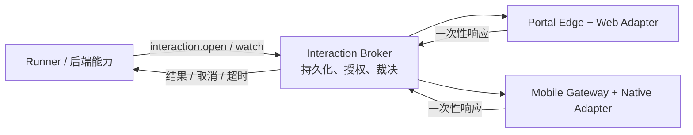

# 跨端体验与交互契约

> 状态：实施设计 v1｜最后更新：2026-07-18
>
> 本文是 Frontend Portal、Mobile Companion 与 Runner 如何共享体验语义并完成受控人机交互的单一真相源。架构取舍见 [ADR-0054](../decisions/ADR-0054-跨端体验契约与交互协调.md)。Portal Web 运行时细节见《[前端门户内核](前端门户内核.md)》，统一四面插件清单见《[插件契约与协议](插件契约与协议.md)》。

## 1. 边界

四内核共享业务能力和契约，但不共享渲染运行时：

| 内核 | 负责 | 不负责 |
|---|---|---|
| Frontend / Portal | Web Shell、可信远程模块、浏览器表单与菜单 | 本地执行、移动原生渲染 |
| Mobile | 原生监控、审批、触发、通知 | 下载执行代码、后台 Runner |
| Runner | 本地执行、脚本、工作流、等待交互结果 | React/Portal Runtime、直接访问浏览器 |
| Backend / Broker | 交互任务持久化、授权、路由、审计和终态裁决 | 控件和页面渲染 |

因此 Runner 不“调用 Portal UI”；它向 Broker 提交一个声明式交互请求。Portal、Mobile 或授权的本地 Renderer 竞争呈现该请求，Broker 只接受第一个合法终态响应。



## 2. `ui.contract`：跨渲染器语义

`ui.contract` 是 JSON/Protobuf 可表达的纯数据契约，按 SemVer 版本化。它定义：

- `FormSchema`、字段类型、校验、条件可见性、只读和 `secretRef`；
- `Action`、危险等级、确认需求、可见性与禁用原因；
- `DataView`、加载/空/错误/成功状态；
- `Feedback`、通知、进度与错误摘要；
- `UICapability` 与 composition 所需的最低能力集。

它禁止出现 React `ComponentType`、`ReactNode`、DOM、CSS、SwiftUI/Compose 控件名、函数回调、身份令牌或秘密值。`secretRef` 的值永远是引用；Renderer 不能通过回显取得明文。

Web Adapter 可以把契约映射为 Arco/MUI，Mobile Adapter 可以映射为 SwiftUI/Compose。二者可以拥有完全不同的布局和导航，只要声明实现相同的语义能力。Portal 的现有 `ui.design-system` 仍要求完整 Web 能力集；Mobile 应声明独立的 `mobile.ui-adapter`，并按 App Profile 在编译期选定。

## 3. `interaction.contract`：跨内核人机交互

交互请求包含稳定 `interactionId`、契约版本、来源调用、租户、合格响应主体、允许呈现面、表单或确认语义、过期时间和关联追踪信息。请求和响应均不允许携带由客户端提供的 Principal、tenant 或授权结论。

状态机：

```text
created → delivered → presented → answered
                              ↘ rejected
created / delivered / presented → expired | cancelled
```

规则：

1. `answered`、`rejected`、`expired`、`cancelled` 为不可逆终态。
2. Broker 以条件写入保证一个 `interactionId` 只接受一次终态响应；Portal 与 Mobile 并发操作时只会有一个成功。
3. 交互创建、派送、呈现、响应、取消和超时全部记审计事件，并沿用 `CallContext` 的租户、调用链和 trace。
4. Runner 通过 watch/stream 等待终态；不以无限期同步 HTTP 请求占用执行槽。
5. 无可用呈现端、响应者失权、任务撤销或超时均 fail-closed。只有请求声明且策略放行时，Runner 才能回退到受管本地 Renderer。

## 4. Broker、身份与凭证边界

`com.vastplan.platform.interaction.broker` 是平台级基础服务，负责创建、读取、响应、取消和观察交互任务。`watch` 是以 `Record.updatedAt` 为游标的可恢复长轮询：Runner 或后端来源在重连后带回最后游标，任务已变化则立即返回，否则等待状态改变、过期或调用截止；它不建立到 Portal/Mobile 的连接。它依据经验证的 `CallContext` 校验：来源 capability、租户、任务归属、目标用户/角色、请求状态和截止时间。

Portal 访问 Broker 经 Edge/BFF，延续 Cookie、CSRF 和 `portalapi.Principal` 投影；Mobile 访问 Broker 经独立移动认证网关，使用移动端令牌和设备绑定。两端均不得把原始浏览器 cookie、移动令牌或 Runner 长期凭证传给插件。Edge/Mobile Gateway 的粗粒度入口授权由独立的 `interaction-access-policy` 执行，Broker 是任务归属、合格响应主体和终态裁决的唯一对象级授权点（ADR-0055）。

需要秘密输入时，Renderer 只创建 `CredentialRef`。Runner 使用与本次 interaction 绑定、短期且最小范围的授权向凭证服务请求使用权；Broker、Portal、Mobile 的审计与持久化记录均不保存秘密明文。

## 5. 插件与 App Profile

插件继续使用一个四面清单，不增加第五种插件面。后续 descriptor 采用如下语义：

- `frontend.views`：声明 Web 体验逻辑名、`uiContract` 版本及所需能力；
- `mobile.views` / `mobile.approvals`：声明对应原生体验逻辑名、`uiContract` 版本及所需能力；
- `runner.workflows`：可声明其会发起的 `interactionContract` 版本与允许交互类型；
- `mobile.ui-adapter`：声明 Native UI Adapter 所实现的能力；它只进入预编译 Mobile App Profile；
- 体验逻辑名相同表示业务意图相同，不表示不同内核共享 UI 二进制或页面代码。

Runner App Profile 使用独立的 `contracts/schemas/app/v1` 完整锁定契约，由 Runner Platform Profile 与 Application Composition 在构建期解析生成；普通应用配置只能选择应用插件，不能删除 Launcher、身份、自更新或执行运行时等平台基线。`deployment/v2.app_profiles` 只通过 `id + revision + SHA-256 digest` 固定引用其不可变制品，不把它放入后端 `units` 服务调度。Mobile Profile 与 UI Adapter 的具体契约仍待后续版本扩展；Portal 采用相同双输入原则在运行期装配 Web 模块。

## 6. 实施顺序与验收

1. 建立 `contracts/schemas/ui/v1`、TypeScript/Go 生成模型，并从 Web SDK 中抽出无框架的表单和交互类型。
2. 收紧 Plugin Manifest 的 frontend/mobile/runner descriptor；加入版本、体验逻辑名和能力协商。
3. 实现 Broker 的持久状态、权限端口和审计，先用 Portal 作为唯一 Renderer 完成闭环。
4. 接入 Runner 的创建、观察、取消和超时；通过真实跨进程/跨服务测试验证不会直接依赖 Portal Runtime。
5. 实现 Mobile Native Adapter 与移动认证边界；验证离线提示、重复响应竞争和 Profile 编译约束。

验收至少包括：同一交互被 Portal/Mobile 并发响应时只有一个成功；无效/过期/跨租户响应被拒绝；Runner 断线重连后能恢复观察；秘密字段不会出现在 Broker 状态、审计或日志中；不兼容 Renderer 不能被装配进 Profile。

### 当前实现状态（2026-07-18）

- 已完成第 1 步：`contracts/schemas/ui/v1` 与 `@vastplan/ui-contract` 提供无框架 UI/交互模型，`@vastplan/portal-ui` 只作为 Web Adapter 消费它。
- 已完成第 2 步的基础声明：清单已支持 `runner.interactions` 与 `mobile.uiAdapters`，并对交互类型、体验面、契约范围和 Native Adapter 的语义能力做封闭校验。
- 已开始第 3 步：`com.vastplan.platform.interaction.broker` 已实现持久化 `open/list/get/watch/present/respond/cancel`，来源绑定、租户隔离、响应主体筛选、过期 fail-closed、条件式单一终态、断线后按游标恢复观察和 `secretRef` 明文拒绝；其 API 不依赖 Portal 或 Mobile Runtime。
- 已完成 Portal Edge 的浏览器传输适配、独立交互入口策略和 `@vastplan/portal-ui` 的 `PortalInteractionClient`；`core/kernels/runner/interaction` 已提供 UI 无关的最小 Runner 协调器与 `ProtocolBroker`，后者可适配本地 Protocol Host 或远程 Addressing Router，并强制 Runner 来源/租户/场景绑定。
- 已建立 `contracts/schemas/app/v1` Runner Profile 契约、受信任 Catalog 校验和认证身份领取边界；`deployment/v2` 通过不可变引用纳入 Profile 期望态，但服务调度仍只处理 `units`。Profile 制品构建/签名/发布和实际 Runner 装配，以及 Mobile Gateway/Native Adapter 仍待实现。这些必须在 Broker 现有授权与状态机之上实现，不能绕过它直接互调。
