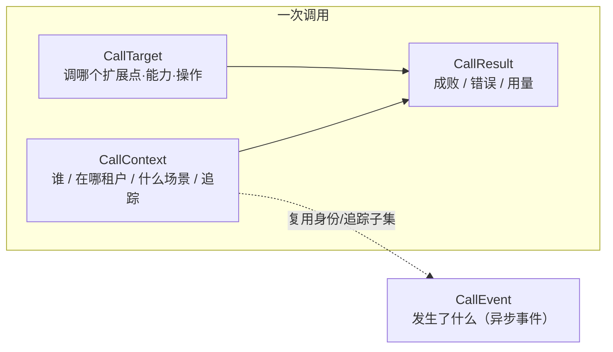

# 契约字段（Immutable Contracts）

> 状态：设计草案 v0.1｜最后更新：2026-07-14
> 关联：[插件-宿主协议](插件宿主协议.md)、[内核间与服务间通信](../architecture/02-内核间与服务间通信.md)、[系统骨架架构](../architecture/01-系统骨架架构.md)、[ADR-0005 栈解耦](../decisions/ADR-0005-骨架与技术栈解耦.md)
> 本文是四个**不可变契约**的单一真相源：`CallContext / CallTarget / CallResult / CallEvent`。它们**一次定义、所有方共用**——既走插件-宿主协议（内核内），也走内核间通信（跨服务），是全链路上下文、权限、计量、可观测一致的基础。字段为语义定义，栈无关（ADR-0005）。

## 1. 定位与范围

- **是什么**：一次"调用"和一个"事件"在系统里流转时携带的稳定数据结构。协议是信封，契约是信件。
- **为什么不可变**：任何扩展点、任何服务、任何插件都依赖这几个结构协作；它们一旦变动波及全局，故一次定义、只增不改、破坏性变更走版本跃升（§8）。
- **范围**：四个核心契约 + 其子结构（Principal、Error、Usage、凭证句柄）。具体业务 payload 不在此定义（由各扩展点契约自定，见清单规范）。

## 2. 设计原则

1. **单一定义、处处共用**：不允许某服务/插件私拷一份变体。
2. **跨平面同构**：内核内（协议）与内核间（mesh）用同一套，端到端不转译。
3. **上下文全程透传**：`CallContext` 随调用穿过所有层，权限/计量/追踪据此闭环。
4. **场景化三元组**：权限、计量、统计统一基于 `(caller, scene, target)`（借鉴 testa）。
5. **凭证不入契约明文**：只带句柄，值由宿主注入运行时（对齐装配元数据）。
6. **可扩展但不破坏**：预留 `metadata` 扩展位；新增字段可选、老方忽略即可。

## 3. 四契约总览



- `CallContext` + `CallTarget` 描述"这次调用是谁、调什么"，`CallResult` 是结果。
- `CallEvent` 是异步事件，复用 `CallContext` 的身份/追踪子集，但独立成契约。

## 4. CallContext —— 调用上下文（who / where / why）

随每次调用透传。

| 字段 | 类型 | 说明 |
|---|---|---|
| `principal` | Principal | 发起者身份，见 §8 |
| `caller` | Caller | 调用方种类 + id，见 §7（三元组之 caller） |
| `scene` | string | 场景名（三元组之 scene），如 `agent.tool_call` / `webui.api` / `rc.exec`；由 SceneRegistry 登记 |
| `tenant_id` | string | 企业租户（多租户隔离锚点） |
| `project_id` | string? | 当前项目/工作区（可空） |
| `trace` | Trace | `{ trace_id, span_id, parent_span_id }` 链路追踪 |
| `deadline` | timestamp? | 调用截止时间；超时即取消 |
| `credentials` | CredentialRef[] | 凭证**句柄**列表（非明文），见 §9 |
| `idempotency_key` | string? | 幂等键，供重试去重 |
| `metadata` | map<string,string> | 可扩展透传位（不含敏感值） |

> `(caller, scene, target)` 三元组：`caller` 与 `scene` 在此，`target` 即 `CallTarget`。权限校验器/计量/统计据此三元组判定（骨架 §5）。

## 5. CallTarget —— 调用目标（调什么）

| 字段 | 类型 | 说明 |
|---|---|---|
| `extension_point` | string | 目标 Registry / 扩展点名（如 `tool.package` / `permission.checker` / `event.sink`） |
| `capability` | string | 贡献的稳定逻辑名（如 `acme.crm`）；跨内核间寻址也用它（02） |
| `version` | string? | 能力版本（如 `1` / `^2.0`），支持灰度并存 |
| `operation` | string? | 具体操作/子命令（工具包的 `subcommand`，如 `query`） |
| `payload_schema` | string? | 该操作入参 schema 的引用（校验用，值在 payload） |

> 业务入参不放这里——放协议信封的 `payload`（bytes），按 `payload_schema` 校验。`CallTarget` 只回答"调哪儿"。

## 6. CallResult —— 调用结果

| 字段 | 类型 | 说明 |
|---|---|---|
| `status` | enum | `OK / ERROR / PARTIAL` |
| `error` | Error? | 失败时填，见下 |
| `usage` | Usage? | 计量：`{ duration_ms, tokens?, cost?, custom{} }`（LLM 调用等） |
| `warnings` | string[] | 非致命提示 |
| `metadata` | map<string,string> | 可扩展结果元数据 |

**Error 子结构**：`{ code: string, message: string, retryable: bool, details: map }`。
- `code`：稳定错误码（命名空间化，如 `permission.denied` / `capability.not_found` / `plugin.timeout`）。
- **应用层错误走这里，与传输层错误（连接断/超时）严格区分**（协议 §11）。

> 结果业务数据同样在协议信封的 `payload`，`CallResult` 是"成败与元信息"。

## 7. Caller 与三元组

- **Caller**：`{ kind, id }`。`kind` ∈ `{ user, agent, plugin, system, rc }`（由 CallerKind 登记，借鉴 testa）；`id` 是该种类下的标识（用户 id / agent id / 插件 id / rc id）。
- **三元组 `(caller, scene, target)`**：
  - `caller`：谁发起（种类 + id）。
  - `scene`：在什么场景（登记的场景名）。
  - `target`：调什么（`CallTarget`）。
- 权限/计量/统计一律基于此三元组，使规则集中、可插拔（PermissionChecker/EventSink 是扩展点）。

## 8. Principal —— 统一身份

替代散落的 user_id/current_user（借鉴 testa Principal）。

| 字段 | 类型 | 说明 |
|---|---|---|
| `user_id` | string | 用户唯一 id |
| `username` | string | 展示名 |
| `is_admin` | bool | 系统管理员标识 |
| `tenant_id` | string | 所属租户 |
| `system_roles` | string[] | 系统级角色（数据驱动，非枚举） |
| `project_roles` | map<string,string[]> | `{project_id: [role_id...]}` 项目内多角色 |
| `session_id` | string? | 会话/审计标识 |

> Principal 由认证边界（WebUI 边缘入口 / RC 接入 / 服务内网信任）构造后注入 `CallContext`，此后只读透传。

## 9. 凭证句柄（CredentialRef）

- `CredentialRef`：`{ name, scope }`——只带**名字与范围**，不带值。
- 运行时由宿主凭证系统按句柄注入到执行侧，**明文永不进契约、不过插件、日志脱敏**（对齐装配元数据与骨架横切服务）。

## 10. CallEvent —— 事件

异步事件契约，复用身份/追踪子集，独立结构（可对齐 CloudEvents 信封）。

| 字段 | 类型 | 说明 |
|---|---|---|
| `id` | string | 事件唯一 id（去重用） |
| `type` | string | 事件类型（命名空间化，如 `task.completed` / `plugin.activated`） |
| `source` | string | 发出方（服务/插件 id） |
| `subject` | string? | 事件主体（资源引用或 `CallTarget` 摘要） |
| `occurred_at` | timestamp | 发生时间 |
| `tenant_id` | string | 租户（隔离与路由） |
| `trace` | Trace? | 链路追踪（与触发调用关联） |
| `principal_ref` | string? | 触发者引用（非完整 Principal，审计用） |
| `payload` | bytes | 事件数据（按 type 约定 schema） |

> 投递语义（至少一次/顺序/持久化）由事件平面（NATS/JetStream，ADR-0008）定，本契约只定"事件长什么样"。审计/可观测插件在 `event.sink` 扩展点消费 `CallEvent`。

## 11. 透传与传播规则

- **调用链传播**：`CallContext` 沿调用向下游透传；跨服务（02）与内核内（协议）用同一份，不转译。
- **派生 span**：每跳可派生新 `trace.span_id`，`trace_id` 保持不变，实现端到端链路。
- **事件关联**：`CallEvent.trace` 承接触发调用的 `trace_id`，把事件挂回调用链。
- **最小暴露**：跨信任边界（如下发 RC）时，凭证句柄与敏感 metadata 按需裁剪。

## 12. 版本与演进

- 契约**只增不改**：新增字段一律可选、有默认；老方忽略未知字段。
- 破坏性变更（改语义/删字段）→ 契约版本跃升，宿主/服务可同时支持多版本一段时间（对齐协议 §10 与 02 的能力版本）。
- 字段命名与错误码、场景名、扩展点名同属"稳定命名空间"，集中登记避免撞名。

## 13. schema 草案（示意，非定稿）

```proto
message CallContext {
  Principal principal = 1;
  Caller caller = 2;
  string scene = 3;
  string tenant_id = 4;
  optional string project_id = 5;
  Trace trace = 6;
  optional int64 deadline_unix_ms = 7;
  repeated CredentialRef credentials = 8;
  optional string idempotency_key = 9;
  map<string,string> metadata = 10;
}
message CallTarget {
  string extension_point = 1;
  string capability = 2;
  optional string version = 3;
  optional string operation = 4;
  optional string payload_schema = 5;
}
message CallResult {
  enum Status { OK = 0; ERROR = 1; PARTIAL = 2; }
  Status status = 1;
  optional Error error = 2;
  optional Usage usage = 3;
  repeated string warnings = 4;
  map<string,string> metadata = 5;
}
message CallEvent {
  string id = 1; string type = 2; string source = 3;
  optional string subject = 4; int64 occurred_at_unix_ms = 5;
  string tenant_id = 6; optional Trace trace = 7;
  optional string principal_ref = 8; bytes payload = 9;
}
// Principal / Caller / Trace / CredentialRef / Error / Usage 见上文字段表
```

## 14. 待决问题

- [ ] 各字段的稳定命名空间与登记机制（扩展点名 / 场景名 / 错误码 / 事件类型）
- [ ] `Usage` 的计量维度定稿（LLM token/cost、时长、自定义计量项）
- [ ] 跨信任边界的字段裁剪策略（下发 RC 时哪些 metadata/凭证句柄可见）
- [ ] `payload` 的 schema 引用与校验机制（与清单 paramsSchema 衔接）
- [ ] 时间戳/时区/单调时钟约定
- [ ] 与 CloudEvents 的对齐程度（直接采用其信封字段还是仅借鉴）
- [ ] wire 版本（Protobuf 具体约定）随协议 §12 一并 ADR
