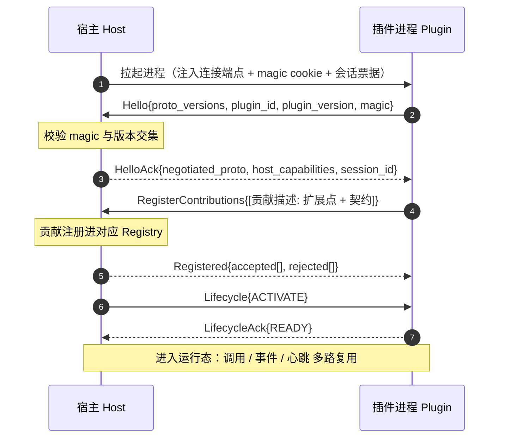

# 插件-宿主协议（Plugin-Host Protocol）

> 状态：设计草案 v0.1｜最后更新：2026-07-14
> 关联：[ADR-0004 独立进程+协议总线](../decisions/ADR-0004-插件运行形态.md)、[ADR-0008 选型对比](../decisions/ADR-0008-骨架技术选型对比.md)、[ADR-0009 技术栈](../decisions/ADR-0009-内核技术栈选型.md)、[系统骨架架构](../architecture/01-系统骨架架构.md)、[内核间与服务间通信](../architecture/02-内核间与服务间通信.md)
> 本文是**内核宿主 ↔ 本内核插件**通信协议的单一真相源。**范围是内核内**（宿主与它管辖的插件进程），区别于[内核间/服务间通信](../architecture/02-内核间与服务间通信.md)（那是跨服务/跨内核）。两者共用不可变契约，范围不同。

## 1. 定位与范围

- **谁和谁**：一套内核宿主（Backend/WebUI/RC Host）与它在本节点管辖的**独立进程插件**（ADR-0004）。
- **不管什么**：跨服务/跨机器/跨内核通信不归本协议（走 02 的 mesh）。插件若要跨机器访问别的能力，是"调用另一个服务"，经宿主转交寻址层。
- **候选传输**：gRPC over HTTP/2（ADR-0008/0009：后端/RC 为 Go，go-plugin 范式即 gRPC）。**本文定义消息契约，wire 细节以候选 gRPC 表达但可替换**（ADR-0005）。
- **承载物**：协议传输的业务数据是[不可变契约](契约字段.md)（`CallContext / CallTarget / CallResult / CallEvent`，另篇定稿）。

## 2. 设计原则

1. **双向对等**：不仅宿主调插件（扩展点被触发），插件也要能回调宿主（取内核服务、发事件、经寻址层调别的能力）。连接是双向的。
2. **声明式握手**：插件连上先上报清单、声明贡献；宿主据此接入扩展点。运行时代码不参与"我有什么"的声明。
3. **多路复用单连接**：宿主与单个插件间一条主连接，其上多路复用调用/事件/生命周期/心跳（借鉴 go-plugin 单连接 + 多路复用）。
4. **版本协商 + 兼容**：握手协商协议版本；不兼容即拒绝接入（fail-closed）。
5. **故障可感知**：心跳 + 连接断开检测；插件崩溃即从扩展点摘除其贡献（ADR-0004 故障隔离）。
6. **流式一等**：结果/日志等大流量用流式，不强塞进一次性响应。

## 3. 连接模型与握手

插件进程由宿主（或节点代理）拉起后，与宿主建立连接并握手：



- **magic cookie**：防止误把普通进程当插件（go-plugin 同款）。
- **会话票据**：宿主给该插件实例的身份，用于审计与回调鉴权。
- **协议版本协商**：`Hello` 带插件支持的版本集，宿主取交集回 `HelloAck`；无交集则拒绝并终止进程。
- **贡献注册**：插件把它对各扩展点的贡献一次性声明（对齐[插件清单](插件清单规范.md)的 `contributes`），宿主逐条 accept/reject。

## 4. 运行态消息总览

主连接上多路复用四类消息（前两类双向）：

| 类别 | 方向 | 用途 |
|---|---|---|
| **调用 Invoke** | 宿主→插件 / 插件→宿主 | 扩展点被触发时宿主调插件；插件回调宿主内核服务或经寻址层调别的能力 |
| **事件 Event** | 双向 | 内核事件下发给订阅插件；插件发布事件 |
| **生命周期 Lifecycle** | 宿主→插件 | activate / deactivate / drain / shutdown |
| **心跳 Health** | 双向 | 保活与探活，断连即故障处置 |

## 5. 贡献注册协议

- `RegisterContributions{ contributions: [Contribution] }`，每个 `Contribution` = `{ extension_point, id, descriptor }`：
  - `extension_point`：目标 Registry 名（如 `tool.package` / `permission.checker` / `event.sink` / `view.slot`）。
  - `id`：贡献的稳定逻辑名（如 `acme.crm`），跨内核间寻址也用它。
  - `descriptor`：该扩展点要求的贡献契约（如工具包的子命令 + paramsSchema；权限校验器的适用范围）。
- 宿主校验后注册进 Registry（骨架 §5）；返回 `Registered{ accepted, rejected(带原因) }`。
- **动态性**：运行时可追加 `RegisterContributions` / `UnregisterContributions` 以支撑热装（解绑需收敛在途调用）。

## 6. 调用协议（Invoke）

- **一元**：`InvokeRequest{ target, context: CallContext, payload }` → `InvokeResponse{ result: CallResult, payload }`。
  - `target`：`CallTarget`（扩展点 + 贡献 id + 子命令）。
  - `context`：`CallContext`（Principal / tenant / trace / scene 三元组），全程透传。
- **流式**：
  - 服务端流（插件→宿主多包）：日志/进度/大结果回流。
  - 客户端流 / 双向流：大输入或交互式场景。
- **插件回调宿主**（`HostCall`，方向反转）：插件用同样的 `target + context` 回调宿主；宿主本地命中即内核服务，否则**转交寻址层**（02）到别的服务。凭证类回调由宿主注入、明文不过插件（对齐装配元数据）。
- **超时/取消**：`context` 带 deadline；取消经流控制信号传播。

## 7. 事件协议（Event）

- `EventPublish{ event: CallEvent }`：双向。
- 宿主→插件：按插件在 `event.sink` / `hook` 的订阅下发（扇出）。
- 插件→宿主：插件发布领域事件，宿主转内核事件总线（可再经 02 跨服务分发）。
- 投递语义（至少一次/顺序/持久化）随事件平面（NATS/JetStream，ADR-0008）确定，本协议只定消息形。

## 8. 生命周期指令（Lifecycle）

`Lifecycle{ op }`，op ∈ `{ ACTIVATE, DEACTIVATE, DRAIN, SHUTDOWN }`，插件回 `LifecycleAck`：

- **ACTIVATE**：贡献生效，开始接收调用。
- **DRAIN**：停止接新调用，完成在途（升级/缩容前）。
- **DEACTIVATE**：解绑贡献，释放资源，进程可留存（便于快速再激活）。
- **SHUTDOWN**：优雅退出进程。
- 对齐骨架 §7 状态机与 ADR-0010 的 reconcile/升级（drain→切换）。

## 9. 心跳、健康与崩溃

- 双向心跳（`Ping/Pong` 或定期 heartbeat）；宿主据连接断开/心跳超时判定插件失联。
- 失联处置（ADR-0004 故障隔离）：从所有 Registry 摘除该插件贡献 → 按策略重启（退避）→ 恢复后重新握手注册。
- 插件侧亦可探测宿主存活，宿主异常时自保/退出。

## 10. 版本协商与兼容

- **协议版本**：整数递增；握手取交集，无交集拒绝（fail-closed）。
- **贡献契约版本**：贡献 `id` 可带版本（如 `acme.crm@1`），新旧并存支持灰度（对齐 02 的寻址与 ADR-0010 升级）。
- 破坏性变更走版本号跃升，宿主可同时支持多协议版本一段时间。

## 11. 错误模型

- 传输层错误（连接断/超时）→ 视作失联，走 §9。
- 应用层错误 → `CallResult` 内的错误字段（错误码 + 消息 + 是否可重试），不与传输错误混淆。
- 握手/注册失败 → 明确拒绝原因（版本不符 / magic 错 / 贡献非法），fail-closed。

## 12. 传输与序列化（候选）

- **候选传输**：gRPC over HTTP/2（多路复用、双向流、成熟代码生成），契合 Go 宿主 + go-plugin 范式（ADR-0008/0009）。
- **候选序列化**：Protobuf。
- 本文契约不绑定于此：换传输/序列化只需保持消息语义（ADR-0005）。具体 wire 版本另行 ADR 锁定。

## 13. 与不可变契约的衔接

本协议是**信封**，`CallContext / CallTarget / CallResult / CallEvent` 是**信件**——字段定义在[契约字段](契约字段.md)。同一套契约既走本协议（内核内），也走 02（内核间），保证端到端上下文与可观测一致。

## 14. proto 草案（示意，非定稿）

```proto
service PluginHost {
  // 握手
  rpc Handshake(Hello) returns (HelloAck);
  rpc Register(RegisterContributions) returns (Registered);
  // 运行态（双向流承载多路复用消息）
  rpc Channel(stream FromPlugin) returns (stream FromHost);
}

message FromHost {  // 宿主→插件
  oneof msg {
    InvokeRequest invoke = 1;      // 触发扩展点
    EventEnvelope event = 2;       // 下发事件
    Lifecycle lifecycle = 3;       // 生命周期指令
    Ping ping = 4;
    InvokeResponse host_call_result = 5; // 回应插件的 HostCall
  }
}
message FromPlugin { // 插件→宿主
  oneof msg {
    InvokeResponse invoke_result = 1; // 回应宿主 Invoke
    InvokeRequest host_call = 2;      // 回调宿主/寻址层
    EventEnvelope event = 3;          // 发布事件
    LifecycleAck lifecycle_ack = 4;
    Pong pong = 5;
  }
}
// InvokeRequest{ CallTarget target; CallContext context; bytes payload; }
// InvokeResponse{ CallResult result; bytes payload; }
// 详见《契约字段》
```

## 15. 待决问题

- [x] `CallContext/CallTarget/CallResult/CallEvent` 字段定稿 → [契约字段](契约字段.md)（v0.1）
- [ ] 多路复用的具体承载（单双向流 vs 多 stream + MuxBroker 式副通道）
- [ ] 流式调用的背压与取消传播细节
- [ ] 贡献解绑时在途调用的收敛协议（drain 语义细化）
- [ ] 会话票据的签发与插件回调鉴权
- [ ] 协议版本与贡献契约版本的兼容矩阵与弃用节奏
- [ ] wire 版本（gRPC/Protobuf 具体约定）另行 ADR
- [ ] 前端内核（浏览器）下"插件即组件"的本协议适配（与后端进程模型的差异，见骨架 §待决）
