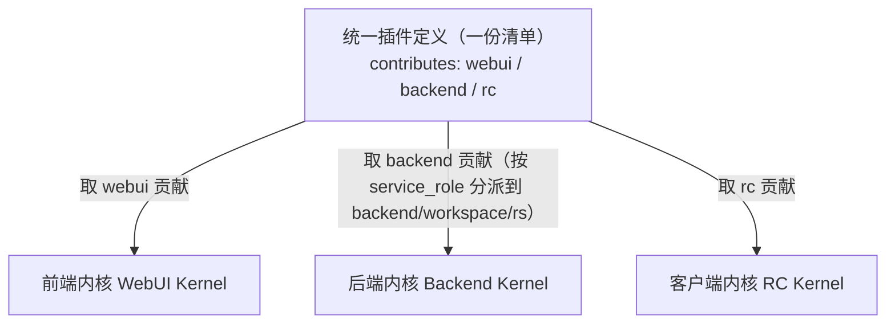

# 统一插件定义（Manifest & Contribution Points）

> 状态：设计草案 v0.2（重构）｜最后更新：2026-07-14
> 关联：[ADR-0001 微内核+全层扩展点](../decisions/ADR-0001-插件运行模型.md)、[ADR-0006 内核三分区与后端组合](../decisions/ADR-0006-内核分区与后端组合.md)、[ADR-0010 插件服务与部署编排](../decisions/ADR-0010-插件服务与部署编排.md)、[系统骨架架构](../architecture/01-系统骨架架构.md)、[插件-宿主协议](插件宿主协议.md)、[契约字段](契约字段.md)
> 本文是**统一插件定义（清单 Manifest 与贡献点模型）**的单一真相源。
>
> v0.2 重构说明：v0.1 写于早期误解（第三方不可信市场代码）之下。现已明确插件为**第一方可信系统级模块**，三套内核（后端/前端/客户端）共用**同一份清单**；`capabilities` 由"安全强制"降级为**装配元数据**；贡献点与骨架的**扩展点（Registry）**、协议的 `RegisterContributions`、契约的 `CallTarget` 对齐。

## 1. 定位

清单是插件的**唯一声明入口**：三套内核只读清单就能知道"这个插件是谁、需要哪些内核能力/资源、在前端/后端/客户端三面各贡献什么、何时激活、依赖谁"。运行时代码不参与"我有什么"的声明——**声明与实现分离**。

一份清单**贯通三面**（ADR-0006）：一个插件可为纯 WebUI、纯 backend、或同时含 WebUI+backend+RC；每套内核装配时只取与自己相关的贡献部分。



## 2. 设计原则

1. **声明式单一真相源**：能力静态声明，宿主不启动插件代码即可掌握全貌（建目录、排依赖、装配）。
2. **一份清单贯通三面**：三内核共用，未声明的面即不占用。
3. **贡献点对齐扩展点**：`contributes` 的每一类贡献对应骨架的一个 Registry（扩展点），并经协议 `RegisterContributions` 注册（§5）。
4. **capabilities 是装配元数据，不是安全边界**：声明需要哪些内核能力/资源，供装配注入与排依赖；第一方可信，无"安装授权+运行时拒绝"的安全强制（第三方开放后再议）。
5. **后端贡献带服务角色**：供 ADR-0010 的期望态组合决定装进 backend/workspace/rs 哪个服务。

## 3. 清单文件与顶层字段

- 文件名：`vastplan.plugin.json`（插件包根目录），配套 JSON Schema 校验。

| 字段 | 必填 | 说明 |
|---|---|---|
| `id` | ✓ | 全局唯一，反向域名式：`com.acme.sales-copilot` |
| `name` / `description` | ✓ | 展示名 / 一句话描述 |
| `version` | ✓ | 语义化版本 |
| `publisher` | ✓ | 发布者标识 |
| `engines` | ✓ | 各内核兼容版本范围，如 `{ backend: "^1.0", webui: "^1.0", rc: "^1.0" }`；只声明所贡献面的引擎 |
| `capabilities` | | **装配元数据**（需要的内核能力/资源/凭证句柄/其他插件），见 §6 |
| `activation` | ✓ | 惰性激活事件，见 §7 |
| `dependencies` | | 依赖的其他插件 `{id: versionRange}`，见 §8 |
| `entry` | ✓ | 各面运行时入口：`{ backend, webui, rc }`（按贡献面填） |
| `contributes` | ✓ | 三面贡献集合，见 §4 |

## 4. 三面贡献 `contributes`

`contributes` 下三个可选键 `webui / backend / rc`，任意组合。每类贡献都有稳定逻辑 `id`（对应契约 `CallTarget.capability`）。

### 4.1 后端贡献 `contributes.backend`

运行在后端内核，经[插件-宿主协议](插件宿主协议.md)接入。**每条贡献可带 `service_role`**（`backend`/`workspace`/`rs`/…），供期望态组合分派（ADR-0010）。

| 贡献点 | 扩展点(Registry) | 说明 |
|---|---|---|
| `tools` | `tool.package` | Agent 工具包（`package` + 子命令，借鉴 testa 包+子命令模型） |
| `agents` | `agent` | 预置 Agent 定义（角色、系统提示、可用工具集） |
| `apiRoutes` | `api.route` | 经边缘入口代理的 HTTP 端点 |
| `permissionCheckers` | `permission.checker` | 基于 `(caller,scene,target)` 的权限校验器 |
| `eventSinks` | `event.sink` | 事件汇（审计/可观测插件在此消费 `CallEvent`） |
| `hooks` | `hook` | 关键节点前后的钩子 |
| `runnerCapabilities` | `runner.capability` | RS 侧调度能力/执行模式（service_role=rs） |

### 4.2 前端贡献 `contributes.webui`

运行在前端内核（浏览器）。

| 贡献点 | 扩展点(Registry) | 说明 |
|---|---|---|
| `views` | `view.slot` | 向侧边栏/面板挂载视图 |
| `editors` | `editor.provider` | 为某类资源提供自定义编辑器（含打开/保存/dirty 生命周期） |
| `commands` | `command` | 命令面板/菜单/快捷键可触发的命令 |
| `menus` | `menu` | 把命令挂到菜单位 |
| `settings` | `settings` | 插件配置项（渲染到设置页，值存宿主） |

### 4.3 客户端贡献 `contributes.rc`

下发到客户端内核（RC，本地）执行。

| 贡献点 | 扩展点(Registry) | 说明 |
|---|---|---|
| `scripts` | `rc.script` | 可下发执行的脚本（运行时、入口、参数 schema） |
| `workflows` | `rc.workflow` | 多步骤工作流定义 |
| `runtimeRequirements` | — | 客户端需具备的运行时（如 `python>=3.10`），宿主据此校验目标机 |

## 5. 贡献点如何接入系统（三者对齐）

一条贡献从声明到可调用，贯穿清单→协议→契约：

1. **清单声明**：`contributes.<面>.<贡献点>` 里一条 `{ id, ...descriptor }`。
2. **协议注册**：插件激活握手后经 `RegisterContributions` 把该贡献注册进对应**扩展点 Registry**（[协议 §5](插件宿主协议.md)）。
3. **契约寻址**：调用时 `CallTarget{ extension_point, capability=id, operation }` 定位到它（[契约 §5](契约字段.md)）；跨服务也用同一 `capability` 逻辑名（[通信 02](../architecture/02-内核间与服务间通信.md)）。

> 即：清单里的 `id` = 协议注册的贡献名 = 契约 `CallTarget.capability` = 跨内核寻址逻辑名，**四处同名**，是"组合→装配→调用"闭环的锚点。

## 6. 装配元数据 `capabilities`

第一方可信语境下，`capabilities` 声明插件**需要什么**，供宿主装配注入与排依赖——**不是安全强制**。

| 键 | 语义 |
|---|---|
| `kernelServices` | 需要的内核服务（如 `llm.orchestration` / `event.bus` / `storage`） |
| `credentials` | 需申领的凭证名（值由宿主按**句柄**注入，明文不过插件——见契约 §9） |
| `resources` | 需要的资源约束（如 GPU、特定运行时），供节点选择/放置 |

> 与安全无关；未来若开放第三方，再叠加"安装授权 + 运行时强制"另议。

## 7. 激活事件 `activation`

插件默认**惰性**，仅在声明事件发生时被宿主唤醒（省资源）。三面**可独立激活**。

| 事件 | 触发 |
|---|---|
| `onStartup` | 宿主启动即激活（慎用） |
| `onView:<viewId>` | 视图被打开（webui） |
| `onCommand:<commandId>` | 命令被调用 |
| `onAgentTool:<package>` | Agent 首次调用该工具包（backend） |
| `onRcScript:<scriptId>` | 该客户端脚本被调度（rc） |

## 8. 依赖 `dependencies`

`{ "com.acme.crm-core": "^2.0.0" }`。生命周期管理器解析依赖树、定序激活、检测环状依赖，缺失阻止激活。

## 9. 与插件服务/期望态的衔接（ADR-0010）

- **制品**：清单随插件包发布到**插件服务**制品仓库（sha256、版本、channel）。
- **组合**：期望态配置引用插件的 `backend` 贡献 + `service_role`，声明"服务S = 插件[A,B]，副本2，落节点组G"→ 节点代理据此装配（[03 编排](../architecture/03-插件服务与部署编排.md)）。
- **清单是组合的输入**：`service_role` 标注驱动"某贡献装进哪个后端服务"。

## 10. 完整示例

```jsonc
{
  "id": "com.acme.sales-copilot",
  "name": "销售助手",
  "version": "1.0.0",
  "publisher": "acme",
  "description": "为销售流程提供 Agent 工具、工作台面板与客户端采集脚本",
  "engines": { "backend": "^1.0", "webui": "^1.0", "rc": "^1.0" },

  "capabilities": {
    "kernelServices": ["llm.orchestration", "event.bus"],
    "credentials": ["acme-crm"],
    "resources": []
  },

  "activation": ["onAgentTool:acme.crm", "onView:acme.salesPanel"],
  "dependencies": { "com.acme.crm-core": "^2.0.0" },

  "entry": { "backend": "dist/backend/main", "webui": "dist/webui.js", "rc": "rc/" },

  "contributes": {
    "backend": {
      "tools": [
        { "id": "acme.crm", "service_role": "backend", "title": "CRM 操作",
          "subcommands": [
            { "name": "query",  "description": "查询客户", "paramsSchema": { } },
            { "name": "update", "description": "更新客户", "paramsSchema": { } }
          ] }
      ],
      "eventSinks": [ { "id": "acme.audit", "service_role": "workspace" } ]
    },
    "webui": {
      "views": [ { "id": "acme.salesPanel", "title": "销售看板", "slot": "sidebar" } ],
      "commands": [ { "id": "acme.syncCrm", "title": "同步 CRM" } ]
    },
    "rc": {
      "scripts": [ { "id": "acme.collectLogs", "runtime": "python", "entry": "rc/collect_logs.py", "paramsSchema": { } } ],
      "runtimeRequirements": ["python>=3.10"]
    }
  }
}
```

## 11. 待决问题

- [ ] JSON Schema 正式定稿与校验工具链
- [ ] 各面运行时入口打包格式（backend 可执行/模块、webui bundle 规范、rc 目录约定）
- [ ] `apiRoutes` 的边缘入口鉴权与路径命名空间
- [ ] 扩展点(Registry)完整清单与各自贡献 descriptor 契约（分面专篇）
- [ ] `service_role` 取值集与期望态组合的精确衔接
- [ ] 版本升级时清单变更的兼容规则（贡献增删如何影响已装配实例）
- [ ] 稳定命名空间登记（贡献 id / 扩展点名 / 场景名，与契约 §14 对齐）
